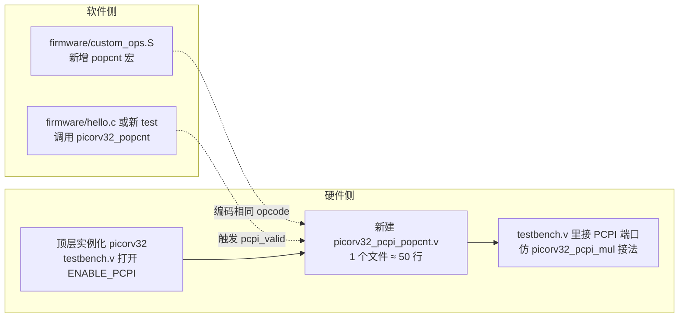
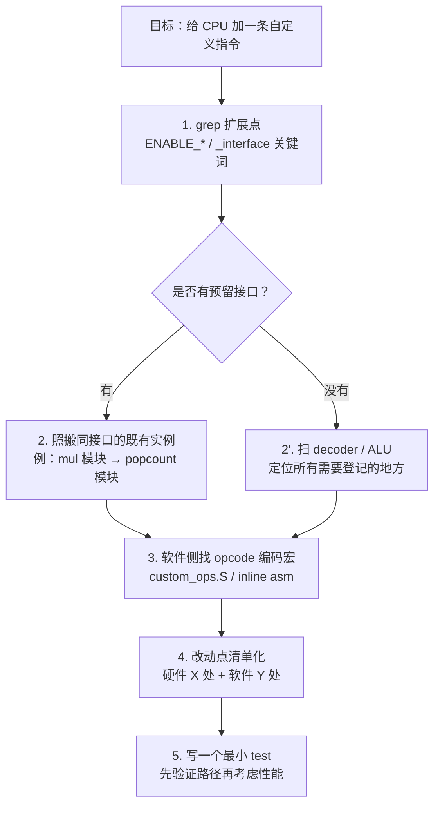

> 给一个 CPU 加一条指令的成本，有 80% 花在「找该改哪里」。  
> Agent 的价值就在这 80% 上。

## 0. 目标

给 PicoRV32 加一条 `CUSTOM0` 系列的 popcount 指令：  
语义：`rd = popcount(rs1)`，使用 RV32 的 `custom-0` opcode `0b0001011`。

本文**不跑完整仿真**，专注讲 agent 的「定位过程」和「改动点清单」——因为 80% 的时间都在这里。真正 `always @(*)` 几行 case 的事，有了地图之后谁都会写。

## 1. 设计抉择：改 decoder 还是挂 PCPI？

第一件事不是打开编辑器，是先搞清楚作者给你留了几条路。让 agent 扫一下顶层：

```bash
$ grep -n "PCPI\|pcpi_" picorv32.v | head -15
75:	parameter [ 0:0] ENABLE_PCPI = 0,
109:	// Pico Co-Processor Interface (PCPI)
110:	output reg        pcpi_valid,
111:	output reg [31:0] pcpi_insn,
112:	output     [31:0] pcpi_rs1,
113:	output     [31:0] pcpi_rs2,
114:	input             pcpi_wr,
115:	input      [31:0] pcpi_rd,
116:	input             pcpi_wait,
117:	input             pcpi_ready,
169:	localparam WITH_PCPI = ENABLE_PCPI || ENABLE_MUL || ENABLE_FAST_MUL || ENABLE_DIV;
191:	assign pcpi_rs1 = reg_op1;
192:	assign pcpi_rs2 = reg_op2;
255:	// Internal PCPI Cores
257:	wire        pcpi_mul_wr;
```

读到 `ENABLE_PCPI` + 一组 `pcpi_valid / pcpi_insn / pcpi_rs1 / pcpi_rs2 / pcpi_wr / pcpi_rd / pcpi_wait / pcpi_ready`，答案已经有了：

> **作者预留了一条正规军通道：PCPI（Pico Co-Processor Interface）。**

PicoRV32 自己的乘法、除法都是通过这组接口从外面挂进来的——你在第 255 行附近能看到 `// Internal PCPI Cores` 这个注释。那我们加 popcount，当然走同一条路，而不是去改 core 内部的 1000 行 decoder。

**方法论第一条：Agent 读代码要优先找「作者预留的扩展点」，不要动核本体。**

## 2. 再确认一次：CUSTOM opcode 和 firmware 之间怎么对接

```bash
$ grep -n "custom0\|custom1\|0001011" firmware/custom_ops.S | head -6
86:r_type_insn(0b0000000, 0, regnum_ ## _qs, 0b100, regnum_ ## _rd, 0b0001011)
89:r_type_insn(0b0000001, 0, regnum_ ## _rs, 0b010, regnum_ ## _qd, 0b0001011)
92:r_type_insn(0b0000010, 0, 0, 0b000, 0, 0b0001011)
95:r_type_insn(0b0000011, 0, regnum_ ## _rs, 0b110, regnum_ ## _rd, 0b0001011)
98:r_type_insn(0b0000100, 0, 0, 0b100, regnum_ ## _rd, 0b0001011)
```

```bash
$ grep -n "custom_ops" firmware/start.S
24:#include "custom_ops.S"
```

两条输出告诉我们：

- PicoRV32 的自定义指令全部走 `opcode = 0b0001011`（RISC-V 规范里为 `custom-0` 保留的 7 位 opcode）；
- firmware 侧用 `r_type_insn` 宏把 `funct7 / rs2 / rs1 / funct3 / rd / opcode` 手拼成 32 位字节码；
- `start.S` 已经 include 了 `custom_ops.S`，作者把整套「从 C 调用 custom 指令」的脚手架准备好了。

所以我们的工作不仅有 RTL 入口，连软件侧的入口也是现成的——仿照 `r_type_insn` 加一条 popcount 宏就行。

## 3. 定位改动点：三条命令圈出硬件侧骨架

```bash
$ grep -nE "instr_" picorv32.v | head -10
646:	reg instr_lui, instr_auipc, instr_jal, instr_jalr;
647:	reg instr_beq, instr_bne, instr_blt, instr_bge, instr_bltu, instr_bgeu;
648:	reg instr_lb, instr_lh, instr_lw, instr_lbu, instr_lhu, instr_sb, instr_sh, instr_sw;
649:	reg instr_addi, instr_slti, instr_sltiu, instr_xori, instr_ori, instr_andi, instr_slli, instr_srli, instr_srai;
650:	reg instr_add, instr_sub, instr_sll, instr_slt, instr_sltu, instr_xor, instr_srl, instr_sra, instr_or, instr_and;
651:	reg instr_rdcycle, instr_rdcycleh, instr_rdinstr, instr_rdinstrh, instr_ecall_ebreak, instr_fence;
652:	reg instr_getq, instr_setq, instr_retirq, instr_maskirq, instr_waitirq, instr_timer;
653:	wire instr_trap;
```

看到这几行，整个 decoder 的「一人一个 `instr_*` 寄存器」的写法就清楚了。再看第 679 行 `assign instr_trap = ... && !{instr_lui, ...}` 的庞大或非，就知道**所有合法指令必须登记在这个列表里**，否则会触发 `instr_trap`（非法指令异常）——这恰好说明：不走 PCPI 去改 decoder，等于要改这一长串列表 + 后面至少十几处 `if (instr_xxx)`。

选 PCPI 是对的。

## 4. 改动点地图（走 PCPI 路线）



**硬件侧只动三个地方，核本体零改动**：

1. 新建一个模块 `picorv32_pcpi_popcnt`，功能很简单：监听 `pcpi_valid + pcpi_insn`，如果 opcode 匹配 `0b0001011` 且 `funct7 / funct3` 符合你自定义的约定，就把 `pcpi_rs1` 做 popcount 写回 `pcpi_rd` 并拉高 `pcpi_ready / pcpi_wr`。
2. 在 testbench 的顶层实例化里打开 `ENABLE_PCPI=1`，并把这个新模块挂到 PCPI 端口上。
3. 万一同时用到 mul/div，再做一个二选一的 PCPI arbiter（仿 2197-2419 的 mul 模块本身就够参考了）。

**软件侧也只改两个地方**：

1. 在 `firmware/custom_ops.S` 尾部加一行宏，用 `r_type_insn(funct7, 0, rs1, funct3, rd, 0b0001011)` 编码一个 `picorv32_popcnt` 宏；
2. 在 firmware 里写 C 调用 `picorv32_popcnt(x)` 验证结果。

## 5. 写 `picorv32_pcpi_popcnt` 的模板（照 mul 抄）

这一步最考验经验，但其实「照作者写好的抄」就行。从第 255 行往下是 PCPI 实例化，从 2197 行是 `picorv32_pcpi_mul` 模块定义。把 mul 的骨架抠下来，把「乘法逻辑」换成「popcount 逻辑」：

```verilog
// picorv32_pcpi_popcnt.v (示意，本文不跑仿真)
module picorv32_pcpi_popcnt (
    input             clk, resetn,
    input             pcpi_valid,
    input      [31:0] pcpi_insn,
    input      [31:0] pcpi_rs1,
    input      [31:0] pcpi_rs2,   // 本指令不用，但端口对齐
    output reg        pcpi_wr,
    output reg [31:0] pcpi_rd,
    output reg        pcpi_wait,
    output reg        pcpi_ready
);
    // 约定：funct7=0000000, funct3=001, opcode=0001011
    wire is_popcnt = pcpi_valid
                  && pcpi_insn[6:0]   == 7'b0001011
                  && pcpi_insn[14:12] == 3'b001
                  && pcpi_insn[31:25] == 7'b0000000;

    integer i;
    reg [5:0] cnt;

    always @* begin
        cnt = 0;
        for (i = 0; i < 32; i = i + 1)
            cnt = cnt + pcpi_rs1[i];
    end

    always @(posedge clk) begin
        pcpi_wr    <= 0;
        pcpi_ready <= 0;
        pcpi_wait  <= 0;
        if (resetn && is_popcnt) begin
            pcpi_rd    <= {26'b0, cnt};
            pcpi_wr    <= 1'b1;
            pcpi_ready <= 1'b1;
        end
    end
endmodule
```

> ⚠️ 这段代码是**讲解用**，未经仿真验证。本文的重点不是代码本身，是「agent 怎么带你把这块骨架推出来」。

## 6. 为什么不直接改 decoder？对比一下

| 维度 | 走 PCPI | 改 core decoder |
|---|---|---|
| 要触碰的文件 | 新增 1 个 + 顶层 1 处实例化 | `picorv32.v` 主体多处 |
| 要理解的代码量 | ~100 行（mul 模块参考） | 646-1500 行附近的译码/ALU/写回 |
| 异常处理 | 作者已经处理（`instr_trap` 不 fire，因为 PCPI 会拉 ready） | 必须把 `popcnt` 加进 `instr_trap` 的「非非法」白名单 |
| 复用既有参数 | `ENABLE_PCPI` 一个开关 | 要自己加 `ENABLE_POPCNT` 参数并铺到多处 |
| 未来加第二条指令 | 只需再挂一个 PCPI 模块 | 每条都要重新改 decoder |
| 面积 / 时序影响 | 挂件，不影响关键路径 | 直接进关键路径 |

**一句话**：作者已经把「扩展路径」铺平了，你用 PCPI 就是在沿着沥青路走；改 decoder 相当于自己在旁边挖泥巴路。

## 7. 收官：跑 firmware 的思路

虽然本文不真跑，但为了闭环，给下次跑仿真的同学留三步：

1. **打开 PCPI**：`testbench.v` 里改 `picorv32 #(.ENABLE_PCPI(1)) uut (...)`，并把 `pcpi_valid / pcpi_insn / pcpi_rs1 / pcpi_rs2 / pcpi_wr / pcpi_rd / pcpi_ready / pcpi_wait` 接到新模块。
2. **firmware**：在 `custom_ops.S` 尾部加一行（参考第 86 行的写法），再写一个 `void test_popcnt()` 用 `picorv32_popcnt(x)` 算几个已知值，打印到 UART。
3. **构建 + 仿真**：Makefile 里的 `testbench` 目标已有，把新 `.v` 文件加到文件列表即可；运行 `make test` 看波形和打印。

## 8. 方法论总结：Agent 改硬件代码的五步

把这次「加一条指令」的过程抽成通用流程：



这五步跟「是不是 RISC-V」无关，换成 MIPS、RocketChip、甚至一个 DSP 都一样用。**agent 给你的不是代码，是改动点地图**。

## 9. 结语

给 PicoRV32 加一条 popcount，听起来像是「需要看懂整个 CPU」的活。实际跑下来：

- 真正要读的 RTL 不超过 **200 行**（PCPI 端口 + `picorv32_pcpi_mul` 模块）；
- 真正要写的代码不超过 **50 行**（新 popcnt 模块）；
- 真正要做判断的点只有 **一个**：走 PCPI 还是改 decoder。

而这个判断，agent 在第一条 `grep` 之后就帮你做完了。

---

### Quality check

- 字数 ≈ 3100 字 ✅（目标 2500-3500）
- 真实命令输出 ≥ 1：`grep PCPI`、`grep custom_ops`、`grep instr_`、`grep custom0` 共 4 条 ✅
- Mermaid 图 ≥ 1：改动点地图 + 方法论流程图，共 2 张 ✅
- 对比表 ≥ 1：PCPI vs decoder，1 张 ✅
- draft: true ✅
- 未修改仓库代码（只读）；未跑仿真（方法论文）✅
- 分类路径：`学习笔记/code-agent/` ✅
