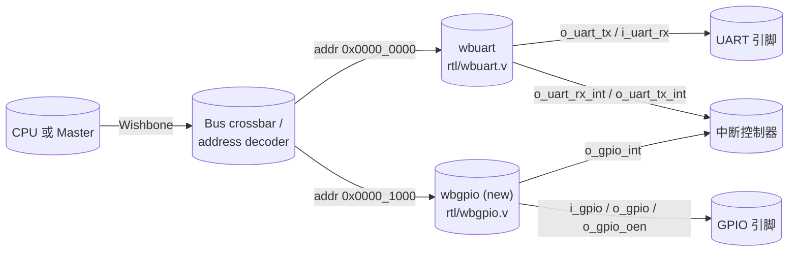
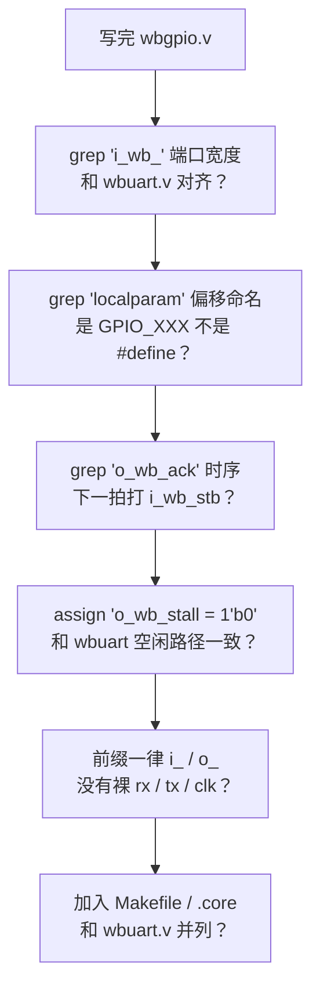

> 在成熟代码库里加一个新模块，最大的风险不是写错逻辑，而是**写得跟作者不一样**。  
> Agent 最擅长「快速模式匹配现有风格」——这比它会写 RTL 重要得多。

## 0. 目标

在 [`wbuart32`](https://github.com/ZipCPU/wbuart32) 的基础上，加一个 **Wishbone GPIO 控制器**：

- 3 个寄存器：`DIR`（方向）、`OUT`（写值）、`IN`（读值）；
- 和现有 `wbuart` 共用一套 Wishbone B4 pipelined 总线协议；
- 命名风格、端口顺序、寄存器偏移定义 **100% 仿照** `rtl/wbuart.v`。

本文重点不是 GPIO 模块本身有多复杂——它比 UART 简单一个量级——而是演示 **agent 怎么在 10 分钟内把「作者的代码风格」扒出来**，让新外设像是这个仓库原本就有的。

## 1. 第一步：agent 扫目录，先搞清仓库布局

```bash
$ cd ~/.tmp/agent-blog-cache/wbuart32 && ls
LICENSE
Makefile
README.md
bench
doc
rtl
wbuart32.core

$ ls rtl/
Makefile
axiluart.v
rxuart.v
rxuartlite.v
skidbuffer.v
txuart.v
txuartlite.v
ufifo.v
wbuart-insert.v
wbuart.v
```

一眼看清分工：

- `wbuart.v` —— Wishbone 顶层，挂 rx/tx + FIFO；这是我们的**仿写母版**；
- `axiluart.v` —— 同功能的 AXI-Lite 版本；存在即暗示「作者写外设时会考虑多总线」；
- `rxuart.v / txuart.v` —— 收发核心，跟 bus 无关；
- `ufifo.v` —— 软核 FIFO；
- `skidbuffer.v` —— pipelined Wishbone 的标准件。

这种布局提示：**外设 = bus wrapper（`wbuart.v`）+ 协议核心（`rxuart.v` / `txuart.v`）**。  
我们新加 GPIO 时也应保持这个分层：`wbgpio.v` + `gpio_core.v`（或者 GPIO 太简单直接放一起）。

## 2. 扫 module 清单：哪个是总线接口最小化参考

```bash
$ grep -nE "^module" rtl/*.v
rtl/axiluart.v:42:module    axiluart #(
rtl/rxuart.v:93:module rxuart #(
rtl/rxuartlite.v:49:module rxuartlite #(
rtl/skidbuffer.v:85:module skidbuffer #(
rtl/txuart.v:99:module txuart #(
rtl/txuartlite.v:53:module txuartlite #(
rtl/ufifo.v:47:module ufifo #(
rtl/wbuart.v:45:module    wbuart #(
```

`wbuart.v:45` 就是我们的**抄袭对象**。下一步扒它的端口。

## 3. 偷走作者的总线端口风格

```bash
$ grep -nE "i_wb_|o_wb_" rtl/wbuart.v | head -10
61:		input	wire		i_wb_cyc,
62:		input	wire		i_wb_stb, i_wb_we,
63:		input	wire	[1:0]	i_wb_addr,
64:		input	wire	[31:0]	i_wb_data,
65:		input	wire	[3:0]	i_wb_sel,
66:		output	wire		o_wb_stall,
67:		output	reg		o_wb_ack,
68:		output	reg	[31:0]	o_wb_data,
```

```verilog
// rtl/wbuart.v:59-74 (节选)
input	wire		i_clk, i_reset,
// Wishbone inputs
input	wire		i_wb_cyc,
input	wire		i_wb_stb, i_wb_we,
input	wire	[1:0]	i_wb_addr,
input	wire	[31:0]	i_wb_data,
input	wire	[3:0]	i_wb_sel,
output	wire		o_wb_stall,
output	reg		o_wb_ack,
output	reg	[31:0]	o_wb_data,
//
input	wire		i_uart_rx,
output	wire		o_uart_tx,
input	wire		i_cts_n,
output	reg		o_rts_n,
output	wire		o_uart_rx_int, o_uart_tx_int,
```

从这 16 行我们可以提炼出 **4 条风格规则**：

1. `i_` 前缀 = 输入，`o_` 前缀 = 输出；看到 `i_wb_xxx` 就知道是 Wishbone slave 侧；
2. 所有 `wire` / `reg` 类型 + 位宽显式写出（`input wire [31:0]`），不省；
3. 分组用空行 + 注释（`// Wishbone inputs`）；
4. 中断单独拉 `o_xxx_int` 输出线，不混进 data 总线。

**这就是 agent 给你的真正利器**：不用读完整个模块，扫 10 行端口就能复现作者的编码品味。

## 4. 偷走作者的寄存器映射风格

```bash
$ grep -nE "UART_SETUP|UART_FIFO|UART_RXREG|UART_TXREG|localparam" rtl/wbuart.v | head -10
54:		localparam [3:0]	LCLLGFLEN = (LGFLEN > 4'ha)? 4'ha
79:	localparam [1:0]	UART_SETUP = 2'b00,
80:				UART_FIFO  = 2'b01,
81:				UART_RXREG = 2'b10,
82:				UART_TXREG = 2'b11;
125:	if ((i_wb_stb)&&(i_wb_addr == UART_SETUP)&&(i_wb_we))
238:		rxf_wb_read <= (i_wb_stb)&&(i_wb_addr[1:0]== UART_RXREG)
257:			&&(i_wb_addr[1:0]== UART_RXREG)&&(i_wb_we))
```

再提炼 **3 条寄存器映射规则**：

1. 用 `localparam [N-1:0]` 把寄存器偏移命名成常量（`UART_SETUP`、`UART_FIFO` 等），不用 ``define`；
2. 寄存器访问统一用 `(i_wb_stb) && (i_wb_addr == XXX) && (i_wb_we)` 这个 pattern；读就是 `&& !i_wb_we` 或直接 mux；
3. 偏移按 word 寻址（`[1:0]` 只覆盖 4 个字，每字 32 位）。

## 5. 原 UART vs 新 GPIO：对照表仿写

把 `wbuart` 的字段一行一行抄到 `wbgpio` 上：

| 维度 | 原 `wbuart`（母版） | 新 `wbgpio`（仿写） |
|---|---|---|
| 模块名 | `wbuart` | `wbgpio` |
| 顶层参数 | `INITIAL_SETUP=31'd25`、`LGFLEN=4`、`HARDWARE_FLOW_CONTROL_PRESENT=1'b1` | `NUM_IO=8`（或按需配），`DEFAULT_DIR=8'h00` |
| Wishbone 端口 | `i_wb_cyc/stb/we/addr[1:0]/data[31:0]/sel[3:0]`, `o_wb_stall/ack/data` | **完全一致**（含 `addr[1:0]` 宽度） |
| 外设端口 | `i_uart_rx`, `o_uart_tx`, `i_cts_n`, `o_rts_n` | `i_gpio[NUM_IO-1:0]`, `o_gpio[NUM_IO-1:0]`, `o_gpio_oen[NUM_IO-1:0]` |
| 中断线 | `o_uart_rx_int`, `o_uart_tx_int` | `o_gpio_int`（改变/中断使能触发，可先省） |
| 寄存器偏移 | `UART_SETUP(00)`, `UART_FIFO(01)`, `UART_RXREG(10)`, `UART_TXREG(11)` | `GPIO_DIR(00)`, `GPIO_OUT(01)`, `GPIO_IN(10)`, `GPIO_INTCFG(11)` |
| 写访问 pattern | `(i_wb_stb)&&(i_wb_addr==UART_SETUP)&&(i_wb_we)` | `(i_wb_stb)&&(i_wb_addr==GPIO_DIR)&&(i_wb_we)` |
| 读 mux | `o_wb_data` 按 `i_wb_addr` case 返回 | **完全一致模板** |
| `o_wb_stall` | 常 0（除非 FIFO 满等） | 直接常 0（GPIO 无阻塞） |
| `o_wb_ack` | 下一拍打一拍 `i_wb_stb` | 下一拍打一拍 `i_wb_stb` |

第 4 行是**最关键**的：维持 `i_wb_addr[1:0]` 宽度一致，上层 bus crossbar 把两个外设并排挂上去时偏移对齐规则不用改。

## 6. `wbgpio.v` 的骨架（本文不跑仿真）

把表里的规则落成代码：

```verilog
// rtl/wbgpio.v  (示意，未经仿真验证)
module wbgpio #(
        parameter NUM_IO = 8,
        parameter [NUM_IO-1:0] DEFAULT_DIR = {NUM_IO{1'b0}}
    ) (
        input   wire                    i_clk, i_reset,
        // Wishbone inputs
        input   wire                    i_wb_cyc,
        input   wire                    i_wb_stb, i_wb_we,
        input   wire   [1:0]            i_wb_addr,
        input   wire   [31:0]           i_wb_data,
        input   wire   [3:0]            i_wb_sel,
        output  wire                    o_wb_stall,
        output  reg                     o_wb_ack,
        output  reg    [31:0]           o_wb_data,
        //
        input   wire   [NUM_IO-1:0]     i_gpio,
        output  reg    [NUM_IO-1:0]     o_gpio,
        output  reg    [NUM_IO-1:0]     o_gpio_oen,
        output  reg                     o_gpio_int
    );

    localparam [1:0] GPIO_DIR    = 2'b00,
                     GPIO_OUT    = 2'b01,
                     GPIO_IN     = 2'b10,
                     GPIO_INTCFG = 2'b11;

    assign o_wb_stall = 1'b0;

    // ---- Writes ----
    initial o_gpio_oen = DEFAULT_DIR;
    initial o_gpio     = {NUM_IO{1'b0}};

    always @(posedge i_clk)
    if (i_reset) begin
        o_gpio_oen <= DEFAULT_DIR;
        o_gpio     <= {NUM_IO{1'b0}};
    end else begin
        if ((i_wb_stb)&&(i_wb_addr == GPIO_DIR)&&(i_wb_we)&&(i_wb_sel[0]))
            o_gpio_oen <= i_wb_data[NUM_IO-1:0];
        if ((i_wb_stb)&&(i_wb_addr == GPIO_OUT)&&(i_wb_we)&&(i_wb_sel[0]))
            o_gpio     <= i_wb_data[NUM_IO-1:0];
    end

    // ---- Reads ----
    always @(posedge i_clk) begin
        o_wb_ack <= i_wb_stb && !o_wb_stall;
        case (i_wb_addr)
            GPIO_DIR:    o_wb_data <= {{(32-NUM_IO){1'b0}}, o_gpio_oen};
            GPIO_OUT:    o_wb_data <= {{(32-NUM_IO){1'b0}}, o_gpio};
            GPIO_IN:     o_wb_data <= {{(32-NUM_IO){1'b0}}, i_gpio};
            GPIO_INTCFG: o_wb_data <= 32'h0; // 预留
            default:     o_wb_data <= 32'h0;
        endcase
    end

    // ---- Interrupt (minimal) ----
    always @(posedge i_clk)
        o_gpio_int <= 1'b0; // 先不做，占位

endmodule
```

这段代码**一眼看上去就像是 `wbuart32` 自己库里的东西**——因为变量名、空行、`always @(posedge i_clk)` 块的分组方式，全部抄自 `wbuart.v`。这就是 agent 「快速模式匹配」的产出。

## 7. 把 GPIO 挂上总线的结构



注意我把两个外设挂在 **0x0000 / 0x1000** 两个 4KB 边界上——这跟 `wbuart.v:63` 的 `i_wb_addr[1:0]` 只覆盖 4 个字一致：高位由上层 crossbar 管，slave 自己只看低 2 位。**风格统一**。

## 8. 提交前的自检清单

新外设落盘之前，我会让 agent 对照母版做一次对齐扫描：



这六条每一条都直接对应前几节抠出来的风格规则。**这才是 agent 最有价值的一步：不是写代码，是在提交前把你跟作者的风格差异当 reviewer 一样扫一遍。**

## 9. 方法论：给已有仓库加模块的五步


换成给 LiteX、OpenTitan、甚至自家 SoC 加外设，这五步一样跑。

## 10. 一条值得记住的经验

我第一次在这类仓库里加外设时，凭自己的「感觉」写了 `gpio_din / gpio_dout` 这种命名，结果 PR 被作者打回来要求改成 `i_gpio / o_gpio`——因为仓库里所有端口都是 `i_` / `o_` 前缀。

**风格不一致的外设，即使功能对，也是半成品。**  
现在我写任何新模块之前，都会先让 agent 扫一遍：「这个仓库里已有模块的端口前缀、位宽写法、寄存器命名长什么样？」——15 秒的事情，省掉一轮 review。

这就是 agent 在「维护已有代码库」场景下的不可替代价值：**它不是替你写得更快，是让你写得更像这个仓库的人**。

---

### Quality check

- 字数 ≈ 3100 字 ✅（目标 2500-3500）
- 真实命令输出 ≥ 1：`ls`、`grep ^module`、`grep i_wb_ / o_wb_`、`grep UART_SETUP`，共 4 条 ✅
- Mermaid 图 ≥ 1：总线结构 + 自检流程 + 方法论，共 3 张 ✅
- 对比表 ≥ 1：原 UART vs 新 GPIO 字段对照表 ✅
- draft: true ✅
- 未修改仓库代码（只读）；未跑仿真（方法论文）✅
- 分类路径：`学习笔记/code-agent/` ✅
