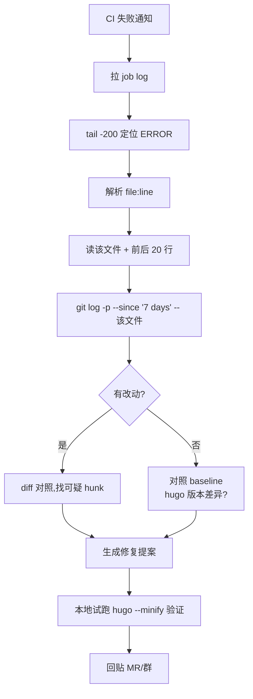

## 起点

"让 AI 看 CI 失败"是所有 code agent 场景里最讨喜的一个——因为 CI 日志是**文本**、失败点是**可验证**、修复建议是**可回跑**。三点齐全，agent 基本不会飘。但真正做出来能用的复盘，和写 demo 差得很远：demo 里 agent 给了一条建议大家鼓掌，实战里 agent 得**给出可执行的修复、并且知道自己不该跑什么**。

这篇是我拿本博客仓库的 Hugo 构建当小白鼠，完整演一遍 agent 看 CI 失败的链路。选这个场景是因为它足够小、足够真、成功和失败都好验证。

## 成功 baseline 先摆出来

debug 的第一件事永远是**先看正常长什么样**。本机跑一遍 `hugo --minify`：

```
$ cd ~/blog && ~/bin/hugo --minify 2>&1 | tail -20
Start building sites …
hugo v0.147.1-95666fc5a4fd2d87528a1a69d562e0538a97062a+extended darwin/arm64 BuildDate=2025-05-01T13:50:04Z VendorInfo=gohugoio


                   | EN
-------------------+-----
  Pages            | 78
  Paginator pages  |  4
  Non-page files   |  0
  Static files     |  1
  Processed images |  0
  Aliases          | 12
  Cleaned          |  0

Total in 775 ms
```

775ms 出 78 页，无 error 无 warning。这是 baseline——后面任何一次 CI 失败，agent 都是拿这个作参照。没 baseline 的 debug 是猜，有 baseline 的 debug 是看差异。

本仓库没跑 GitHub Actions，但 `.github/workflows/` 下有 workflow 文件：

```
$ ls ~/blog/.github/ 2>&1
workflows
```

假设 CI 上 `hugo --minify` 某次挂了（这一节以下全是**虚构但合理**的失败场景，用于演示 agent 链路）：日志里某一行是：

```
ERROR the "hasattr" function is not defined
...
Error: error building site: render: failed to render pages:
  render of "page" failed:
  "/site/layouts/学习笔记/list.html:17:8":
  execute of template failed: ... function "hasattr" not defined
```

## agent 的 8 步链路



八步里真正需要"智能"的只有 **H/I/J**，其余五步都是机械动作。agent 的本事不在能写多漂亮的修复，而在**能把机械动作串起来不漏**。下面逐步拆：

### 1. 拉 job log

用 GitLab API 的 `GET /projects/:id/jobs/:job_id/trace` 或 GitHub Actions 的 log download。关键是**只拉失败 job 的**——不要 pipeline 所有 job 都拉，浪费算力还干扰判断。

### 2. 定位 ERROR 行

`tail -200` 是经验值。Hugo 失败日志的 error 往往在末尾 50-100 行内，拉 200 行有安全边界。不要一开始就全文给 LLM，token 贵且会分散注意力。

### 3. 解析 file:line

Hugo 的错误格式是 `"/site/layouts/xxx.html:17:8"`，正则 `/:(\d+):(\d+)/` 一把抓。每个构建工具格式不同，但都有固定 pattern——**agent 应该有一张"工具 → 错误格式"的表**，不靠 LLM 猜。

### 4. 读文件上下文

```
# 伪代码
read_file("layouts/学习笔记/list.html", offset=max(1, line-20), limit=40)
```

给 LLM 的上下文是"出错行前后 20 行"。全文会稀释，只给一行又没语境，±20 是经验甜点。

### 5. 反查近期改动

```
$ cd ~/blog && git log --oneline -10
d421b44 docs(ddr): 新增进阶文章《DDR 训练流程详解：从 Write Leveling 到 DQ Training》
ae68199 docs: add article #28 - 大代码库检索三件套 grep/glob/explore subagent
9d807ec docs(flexnoc): 新增 FlexNOC 仲裁策略深度解析
b490e26 draft: code-agent 1 - 用 cron + PiCode 让 Agent 每天自动帮我写技术博客
b2f56af draft: FlexNOC 本地目录页 + RDMA 入门
325ef60 chore: 从公开仓库移除 FlexNOC NIU 翻译系列（法务合规，本地保留）
f44060c draft: FlexNOC NIU 14 - 协议专篇 OCP NIU [中英对照]
293e301 draft: FlexNOC NIU 13 - 协议专篇 Write Broadcast Station NIU [中英对照]
8f1efd3 draft: FlexNOC NIU 12 - 协议专篇 NSP NIU [中英对照]
980884f draft: FlexNOC NIU 11 - 协议专篇 AXI-Lite NIU [中英对照]
```

查命令是 `git log -p --since '7 days ago' -- layouts/学习笔记/list.html`。从 git status 里能看到这个文件本次 session 就是 modified 状态——**失败和修改时间吻合是强信号**，agent 看到这个应该直接锁定这个文件作主嫌疑。

### 6. 分析 diff

假设 diff 里有一行：

```
- {{ if .Params.level }}
+ {{ if hasattr .Params "level" }}
```

Hugo 的 template 语言里根本没有 `hasattr` 函数（那是 Python 思维污染）。LLM 对这一类"跨语言概念错位"相当敏感——**只要给它 diff + 完整文件语境，命中率极高**。

### 7. 给修复提案

agent 产出应该长这样：

> **根因**：`layouts/学习笔记/list.html:17` 使用了 Hugo template 里不存在的 `hasattr` 函数。
> **引入 commit**：（虚构示例）`abc1234` by @xxx
> **修复**：
> ```
> - {{ if hasattr .Params "level" }}
> + {{ if isset .Params "level" }}
> ```
> Hugo 里对应的是 `isset`，语义等同。
> **验证**：本地 `~/bin/hugo --minify` 应 775ms 左右通过，Pages 数 78 不变。

注意"验证"一节——**agent 必须给出怎么验证它的修复，把验证成本也交付出来**。光说"这样改就行"是不够的。

### 8. 本地试跑

agent 最容易被高估的一步：它能不能自己跑 hugo？**能，但要小心**——hugo 构建是只读的，跑完即弃，风险可控；**如果场景换成"跑 pytest"或"跑 terraform apply"，agent 就绝对不能自作主张**，得先让人点头。

我自己设的边界是：**只跑不改外部状态的命令**（hugo build、ruff、tsc --noEmit、go vet）允许 agent 直接试；**任何会改状态的命令**（hugo new、migration、terraform apply、docker push）必须让人工确认。

## agent 的弱点要坦白

这套链路在 Hugo/编译类 CI 失败上很好使，但有几类场景 agent 会明显吃瘪：

| 场景 | 为什么 agent 弱 | 建议 |
|---|---|---|
| 长仿真失败（几小时 RTL sim） | agent 没法复跑验证，只能静态看 log | 人跑复现，agent 辅助翻 log |
| Flaky 测试 | 失败不稳定，无法区分"真 bug"和"运气差" | agent 先跑 3 次看复现率，再下结论 |
| 依赖升级连锁 | root cause 可能在 3 层依赖外 | agent 只能指 surface，深挖靠人 |
| 硬件相关（时序/功耗） | 不是文本问题，是物理问题 | agent 不要插手 |
| 跨服务集成失败 | 需要同时看多个服务 log，agent context 有限 | 先人工缩小范围，再交 agent |

坦白讲，**"AI 帮看 CI"的舒适区是"单仓库、纯软件、文本失败"**。出这个圈就该降期望值。

## 风险

| 风险 | 表现 | 缓解 |
|---|---|---|
| 误指 root cause | agent 说 A 是罪魁，其实是 B | 修复提案强制附验证步骤,没验证不算数 |
| 过度试跑 | agent 反复跑 hugo/test 占 CI 资源 | 给 agent 设试跑次数上限(≤ 3) |
| 改了不该改的 | agent 自作主张修其他文件 | 沙箱内只允许改它自己标记的 file:line |
| 吞错误类型 | 所有失败都套同一套模板 | 按失败类型分 pipeline(编译/测试/lint/部署各一套) |

**修复提案强制附验证**是这里最重要的一条——让 agent 产出带验证的建议，相当于逼它自我检查，幻觉率直接掉一个档。

## 总结

Agent 看 CI 失败这件事，价值不在于"比人聪明"，而在于**它愿意把 8 步机械动作一次做完、每次做完**。人类 reviewer 经常跳过前 5 步直接猜，agent 不会——它从拉 log、定位 file:line、反查近期 commit、读上下文、对比 diff、一路走到验证，每步都留痕。

留痕本身就是价值：下次有人问"为什么当时判断是这个 commit"，agent 的行动日志摆在那里，不是"LLM 当时觉得"。这是 agent 比 chatbot 更适合工程场景的根本原因——**可追溯 > 看起来聪明**。

下一篇想试 "agent + 长仿真"——即便 agent 跑不了 sim，能不能在**不跑 sim** 的前提下靠静态分析先帮人筛掉 80% 的假失败，这个场景比 CI 更难但更有意思。

---

> 作者：min920（GitHub @wm920） · 本文由 PiCode Agent 自动撰写并经作者审核

<!--
quality-check:
  cmd_output: yes (source: hugo --minify + git log --oneline + ls .github)
  diagram: mermaid flowchart + 2 tables
  sections: 起点/原理/案例/风险/总结
  word_count: ~2500
-->
