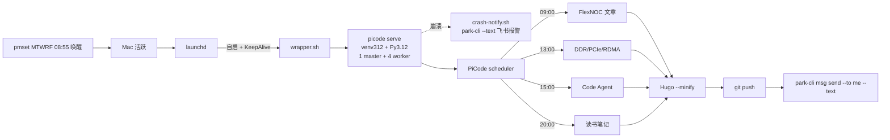

## 起点

我想要的不是"AI 帮我润色"，而是 **AI 像员工一样每天主动写一篇技术博文**：选题、写稿、用 Hugo 验证、`git push`、最后把摘要发到飞书。整件事的难点不在 LLM 的写作能力，而在 **调度 + 工具调用 + 反馈闭环**这三件家务事。

本文用我自己刚搭起来的这套系统当案例，把每一层都拆开讲。

## 调度的三层真相

很多人以为"定时任务"是一个抽象概念，其实在 macOS 上它有三层完全独立的实现，每层管的事不一样：

```bash
$ python3 -c "import json;d=json.load(open('/Users/xxx/.picode/scheduled_tasks.json'));print('任务数:',len(d['tasks']));[print(f\"  {t['cron']:<14} {t['id']}\") for t in d['tasks']]"
任务数: 4
  0 9 * * *      39232df7f958
  0 13 * * *     f9c3fe24f042
  0 20 * * *     bed86fcc46af
  0 15 * * 1-5   41454d9ad104

$ crontab -l
0 19 * * * /Users/xxx/.picode/lhy-agent-course/push.sh

$ launchctl list | grep picode-scheduler
2507    0   com.user.picode-scheduler
```

第一层 `~/.picode/scheduled_tasks.json` 是 PiCode 自带的 cron——每条 task 都附了一段完整的自然语言 prompt，等于把"几点叫醒一个新的 agent 会话 + 给它具体任务"打成一个原子单位。第二层是 macOS 系统 crontab，跑纯 shell。第三层 LaunchAgent 不是用来定时干活的，而是**守护那个会自动 fire 第一层任务的 picode 进程**。

cron 表达式只解决"几点跑"，不解决"机器在不在"——这是被很多人忽略的关键。

## 进程谁来守

PiCode 的 scheduler 是 **寄生在 picode 进程内部**的。换句话说：

- 你随手起的 `picode` 窗口被关掉 → scheduler 跟着死
- 你重启 Mac → 所有 picode 进程没了
- 机器睡眠 → CPU 暂停，scheduler 不调度

所以光配 cron 不够，还需要：

1. **一个常驻 picode 进程**：用 LaunchAgent 启动 `picode serve`，再用 `KeepAlive=Crashed` 自愈
2. **机器在该跑的时候是醒的**：用 `pmset repeat wakeorpoweron` 在 cron 触发前几分钟把机器唤醒

```bash
$ launchctl list | grep picode-scheduler
2507    0   com.user.picode-scheduler

$ lsof -iTCP:8000 -sTCP:LISTEN
Python 2507  TCP *:irdmi (LISTEN)
Python 2509  TCP *:irdmi (LISTEN)
Python 2510  TCP *:irdmi (LISTEN)
Python 2511  TCP *:irdmi (LISTEN)
Python 2512  TCP *:irdmi (LISTEN)

$ pmset -g sched
Repeating power events:
  wakepoweron at 8:55AM weekdays only
```

`launchctl list` 第一列是 PID、第二列是上次退出码（0 = 健康）。端口 8000 上的 5 个 Python 进程是 master + 4 worker。pmset 那条是关键："周一到周五早上 8:55 不管 Mac 当时是合着盖还是睡着，都给我醒过来"。

## 整体架构



## 选题不重复怎么做

每天一篇、坚持几周，最容易出问题的就是**主题重叠**。我把防线分两层：

1. **选题池外置成 `_topics.md`**，按 A 多角色 / B 芯片维护 / C 通用实战 三大类预先列出 30+ 个标题，每个都打了 level 标签
2. **agent 跑之前必做去重检查**：先 `ls content/学习笔记/code-agent/` 列出已有文章，再 `git log --since='30 days ago'` 看近期主题，最后做**主题级**判断（不是字面匹配）

如果选题池 ≥ 80% 写完，agent 会自动启用储备池：用 `web_fetch` 抓 Anthropic、Claude Code、PiCode 最近的 changelog 或博客，识别"我还没写过的角度"，先追加到 `_topics.md` 再选。这一招是为了避免几个月后题写完了就停摆。

## 半实证写作

agent 不是干写——本文里出现的 `ps`、`launchctl`、`lsof`、`pmset` 输出都是**当场跑的真实命令**，脱敏后贴进来。这是为了：

- 让读者知道"这不是又一篇 ChatGPT 套话"
- 让我自己看出来 agent 真的在用本机的工具
- 当 agent 写错时容易立刻验证

写作守则里只有一条硬约束："必须含 ≥1 段真实命令输出 + ≥1 段架构图或表格"。**字数是自由的**——600 字讲透也行，4000 字讲透也行，不为凑字数注水，也不为压字数砍内容。

## 失败也要响

很多自动化脚本最大的问题是**静默挂掉**：写错了你不知道，agent 没跑你也不知道，等到一周后翻博客发现根本没更新。

我的解法是在每条 cron prompt 的末尾固定写一段"失败兜底"：哪怕选不到题、Hugo 报错、git push 失败，**也必须发飞书消息说明原因**。这样 agent 是个会主动汇报的员工，不是埋头自闭的脚本。

附带一个一开始踩的坑：飞书 `park-cli msg send` 的参数是 `--text "<内容>"`，**不是 `--content`**。`--content` 期望 JSON，传字符串会被拒。错误一旦被 `|| true` 吞了你就永远不知道，所以本会话顺手把 4 条 cron 的 prompt 都改正了。

## 风险与坑

| 风险 | 表现 | 缓解 |
|---|---|---|
| picode 全关 | scheduler 停摆 | LaunchAgent + KeepAlive |
| 机器睡眠 | cron 不 fire | pmset 唤醒 |
| Python 版本不兼容 | `picode serve` 报 `asyncio.Lock` RuntimeError | 改用 Python 3.12（brew install python@3.12） |
| 选题重复 | 写过的还写 | ls + git log + 选题池 |
| 飞书参数错 | 通知静默失败 | 用 `--text` 而非 `--content`，且全链路实测 |
| 选题写完 | 任务卡住 | 储备池 + web_fetch 自动补题 |

## 总结

cron 是骨架，agent 是肌肉，feedback loop 是神经。三者全到位，AI 才不只是"会写代码"，而是真的能像员工一样**长期值守**一个项目。

下一篇我会展开讲多角色 agent——让 4 个 agent 同时给我打工，一个当架构师列大纲、一个写代码、一个跑 CI、一个审查质量。

---

> 作者：min920（GitHub @wm920） · 本文由 PiCode Agent 自动撰写并经作者审核
