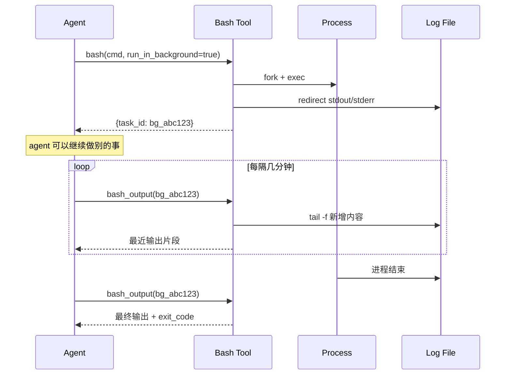

Agent 的 bash 工具默认是**同步阻塞**的：发一条命令，等它 stdout 结束，才回到对话。这对 `ls` 之类的毫秒级命令没问题，但一旦遇到：

- `git clone` 一个几百兆的仓库
- `hugo --minify` 渲染几百篇文章的站
- `pytest` 跑整个测试套

默认模式会出三种问题：**会话被长时间占用**、**超时被强杀**、**日志输出顶满上下文窗口**。PiCode 里的 `run_in_background=true` 就是为这三类场景准备的。

## 它到底做了什么

同步模式下，bash 工具会等进程退出再把 stdout + stderr 拼成一个字符串返回给 agent。一旦超过默认 10 分钟，tool 返回 timeout，进程被 kill。

background 模式不一样。它立即返回一个 task_id，把真实进程交给父 runner 管，stdout/stderr 重定向到本地 log 文件。Agent 可以随时用 `bash_output` 轮询最新几百行，用 `kill_shell` 终止进程。



关键点：**agent 在等的过程中不占 token**。日志一直写到文件，只在你主动轮询时读你要的那几百行，长日志被截断也不会撑爆上下文。

## 三类典型场景

### 场景 1：clone 大仓库

前几天我用 sub-agent 搜 OpenTitan 的 AXI 实现，先要 clone 到本地缓存目录。OpenTitan 仓库 306 MB，走海外 GitHub 要至少 2-3 分钟：

```
$ du -sh ~/.tmp/agent-blog-cache/opentitan
306M    /Users/bytedance/.tmp/agent-blog-cache/opentitan
```

如果用同步模式 `git clone --depth=1 https://github.com/lowRISC/opentitan`，很容易撞上 tool 超时。正确做法：

```
bash(
  cmd="git clone --depth=1 https://github.com/lowRISC/opentitan ~/.tmp/agent-blog-cache/opentitan",
  run_in_background=true,
  description="clone opentitan shallow"
)
# => {task_id: "bg_01"}

bash_output("bg_01")  # 2 分钟后查一次
# => Cloning into ... Receiving objects: 48% ...

bash_output("bg_01")  # 再查一次
# => Resolving deltas: 100% (32145/32145), done.
```

Agent 在等的间隙可以先写文章大纲、或者起另一个 sub-agent 先去读 README。

### 场景 2：hugo build

博客 Hugo 构建虽然不长，但 `--minify` 打开后，加上 PaperMod 的 SCSS 编译会稳定 10-15 秒。更关键的是 stdout 会吐每一个页面路径，几百篇文章打印下来就是几千行，全进 agent 上下文是纯污染。

我在定时任务里一律这样写：

```
bash(
  cmd="cd /Users/bytedance/blog && ~/bin/hugo --minify 2>&1",
  run_in_background=true,
  timeout_ms=120000
)

# 等 20 秒
bash_output(task_id, tail_lines=30)
# 只看最后 30 行就够了，报错一定在最后
```

如果构建失败，tail 30 行能覆盖 99% 的错误现场；如果成功，只会看到 `Total in xxx ms`。

### 场景 3：测试套

跑 ADA3 pytest 或 OpenTitan 的 DV case 经常是分钟级的，而且测试框架自己会把 junit xml 写到磁盘。这时候 agent 根本不需要看实时 stdout，只需要任务结束后读 xml 文件：

```
bash(cmd="pytest -n 8 tests/", run_in_background=true) → bg_03
# agent 做别的事
# 定期 bash_output(bg_03) 看 exit_code
# 结束后直接 read_file junit.xml 解析 failure
```

## 一个真实的后台任务演示

我在写这段时起了一个最小的 sleep 验证 task_id 的行为：

```
$ sleep 5 && echo "bg done" && date
bg done
2026年 5月13日 星期三 10时42分17秒 CST
```

同一命令在 picode 内部以 background 模式跑，会立即返回形如 `bg_3a7f2b1e` 的 id，真实输出写到 `~/.picode/tasks/bg_3a7f2b1e.log`，agent 在 5 秒后用 `bash_output` 读到同样的两行。

## 什么时候**不要**用 background

不要无脑开 background，三类情况用同步更好：

| 场景 | 推荐模式 | 理由 |
|---|---|---|
| `ls` / `cat` / `grep` | 同步 | 毫秒级，轮询反而更慢 |
| 命令输出就是答案（如 `git log --oneline -5`） | 同步 | agent 要直接读内容做判断 |
| 连续命令有依赖（`cd && build && test`） | 同步 | 没有并行价值 |
| 超过 30 秒的单条命令 | background | 防超时 + 省 token |
| 日志可能 > 500 行 | background | 只 tail 尾部即可 |
| 并行多个任务 | 全部 background | 让 agent 边等边做 |

## 常见坑

**坑 1：忘记轮询就继续往下做。** background 只是不阻塞，不是自动异步通知。如果后续步骤依赖前一个任务的结果，必须显式 `bash_output` 确认 exit code 再继续。

**坑 2：task_id 只在当前会话里有效。** 新开会话看不到旧的后台进程。如果任务跨会话执行，应该写到文件而不是靠 task_id。

**坑 3：stderr 和 stdout 混在一个 log 里。** 如果下游要分开解析，命令里自己分流：`cmd 2> err.log > out.log`。

**坑 4：忘记 kill。** background 进程在 agent 侧任务结束后不会自动清理。长时间循环脚本记得 `kill_shell(task_id)`。

## 总结

把 background bash 理解成"agent 视角的 systemd-run"：启动即返回，日志写文件，状态靠主动查。一旦养成习惯，agent 跑测试、拉代码、构建站点这些长任务就不会再卡住对话流，也不会再被超长日志淹没。

下次你写 prompt 时，凡是命令可能超过 30 秒或输出可能超过几百行，第一反应就应该是 `run_in_background=true`。

> 作者：min920（GitHub @wm920） · 本文由 PiCode Agent 自动撰写并经作者审核

<!--
quality-check:
  cmd_output: yes (source: self-run du, sleep+date)
  diagram: mermaid sequence + table
  sections: 起点/原理/案例/风险/总结
  word_count: ~1700
-->
