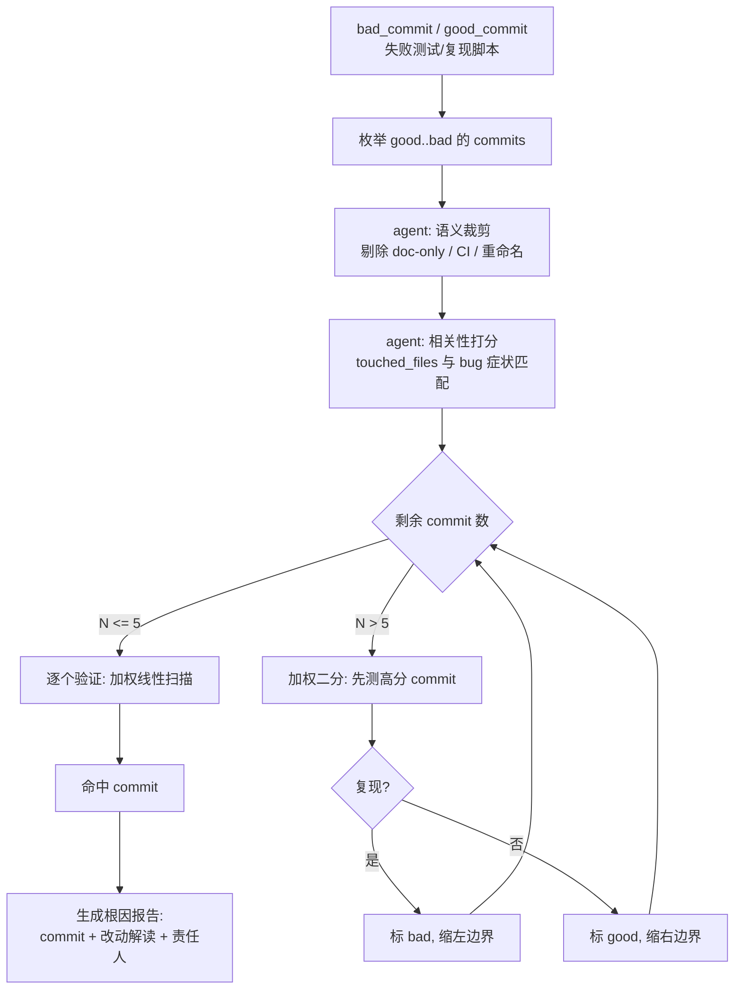

## `git bisect` 不够用了

`git bisect` 是 25 年老命令，原理简单到一句话能说清：**给一个 bad commit、一个 good commit，二分中间那段，测一下哪端坏了，然后递归**。

对一个单元测试 30 秒跑完的项目，这命令几乎是"跑完喝杯咖啡就出结果"。但放到实际场景里就有三个现实问题：

1. **单次"测试"不是 30 秒，是 4 小时。** 芯片仿真、SoC 集成 regression、大模型训练 loss 曲线——单次复现就是半天起步。`log2(N)` 次看起来很甜，100 个 commit 也要 7 轮、28 小时。
2. **不是所有 commit 都应该被测。** doc-only 改动、CI 配置改动、纯重命名，这些 commit 逻辑上不可能引入功能 bug，但 `git bisect` 傻乎乎都要跑一遍。
3. **`good` / `bad` 判定本身依赖语境。** 很多 bug 是"结果对但 timing 变差"这种软失败，binary 判定会把整段 bisect 带偏。

这三件事里的任一件，都让"agent 介入帮你跳过无意义 commit、基于语义做优先级排序"的做法比裸 `bisect` 划算。

## Agent bisect 的核心思路

不取代 `git bisect`，而是**在二分前先做一次语义裁剪**，并在每个候选 commit 上附加"改动相关性"评分，再喂给 bisect 作为先验。



关键差异是中间那两个 agent 节点——**剪枝**和**打分**是线性 `O(N)` 的成本（只过一遍 commit metadata，不跑仿真），省下的是后面 `log2(N)` 次昂贵验证。

## 用真实仓库看一眼 commit 元数据

以 lowRISC 的 ibex（开源 RV32 core）为例看一个 commit 的元数据形态：

```bash
$ git log --stat HEAD -1
commit 9742d89f54fc297bed026841c8e68454ddfd7cc0
Author: Michael Schaffner <...>
Date:   ...

    [rtl] Move prim_generic dependency to ibex_top

    This commit refactors the prim_generic dependency ...

 rtl/ibex_core.sv   | 12 ++++--------
 rtl/ibex_top.sv    | 48 +++++++++++++++++++++++++++++++++++++++--------
 doc/index.rst      |  2 +-
 3 files changed, 44 insertions(+), 18 deletions(-)
```

agent 需要的信号其实就三样：

- **touched files**（`rtl/ibex_top.sv` 这些）
- **commit message 一行 subject**（`[rtl] Move prim_generic dependency`）
- **作者 / 日期 / 行数增删**

基于这三个信号就可以做第一层裁剪和打分。

## 第 1 步：语义裁剪

目标是从 good..bad 之间的 N 个 commit 里过滤掉"**结构上不可能是凶手**"的那批。

规则可以先写硬的：

| 类别 | 识别方法 | 处理 |
|---|---|---|
| doc only | touched files 全部在 `doc/` `*.md` `*.rst` | 直接跳过（标记 skip） |
| CI config | 全部在 `.github/` `.gitlab-ci.yml` `ci/` | 直接跳过 |
| 格式化 / 纯 rename | `git show` 里 insertions≈deletions 且 `-M` 下 similarity>95% | 标记 low，最后测 |
| 纯 comment 改动 | diff 里每个 hunk 都以 `//` `#` 开头 | 标记 low |

硬规则过不掉的再让 LLM 介入：

> "以下 commit 是否可能引入如下 bug？bug 描述：`pcpi` 接口握手偶发错位。commit 标题：`[lint] fix ascii art alignment in regfile`。touched files：`rtl/ibex_register_file_ff.sv`。"
>
> LLM：触及 regfile RTL，虽然声称是 ASCII 艺术对齐，**但 touched 的是功能文件，且 regfile 与 pcpi 有数据路径交互**，评级 medium，不能直接跳过。

LLM 在这一步值钱的点是**能读出 commit message 和 touched files 之间的矛盾**——工程师自己写的 subject 经常避重就轻，hard rule 骗得过、语义骗不过。

## 第 2 步：相关性打分

过了裁剪的候选 commit，对每个打一个 0~10 的 `relevance_score`，评分依据：

1. **文件重合度**：bug stack trace / 失败测试涉及的文件，和 commit touched files 的交集大小。
2. **模块重合度**：如果 bug 发生在 `pcpi_*` 信号握手，commit 改了 `pcpi_ctrl.sv` 得高分。
3. **作者历史**：作者近期在同一模块改过多次 → 加分（这不是背锅机制，而是"熟手继续在热区改动"统计上确实更可能出事）。
4. **改动规模**：>500 行大改动比 <20 行小改动可疑（反直觉：小改动容易对；大改动容易漏边界）。这条权重不要给太高，只作为 tiebreaker。

这些信号综合后，结果是一张排过序的 candidate 表：

```
#  commit     score  files                                 note
1  8a3f21c    9.2    rtl/pcpi_ctrl.sv, rtl/ibex_top.sv     pcpi 热区，+120/-40
2  1c4de77    7.5    rtl/ibex_core.sv                      core 里改了 handshake 状态机
3  9742d89    4.1    rtl/ibex_top.sv                       refactor dep，语义风险中等
4  6aa12bb    2.0    rtl/ibex_register_file_ff.sv          ASCII 艺术声称 comment only
5  ...
```

## 第 3 步：加权验证策略

有了排序后，不再做纯二分，而是：

- **N ≤ 5**：不二分，直接按分数从高到低逐个测。因为 `log2(5) ≈ 2.3`，和线性 5 相比 expected 节约只有 2~3 次——而线性法每次都有可能第一次就命中高分 commit。
- **N > 5**：**加权二分**。传统二分取中位，加权二分在"分数高分的密集区"切分，让失败侧先落在可疑区。
- **每步记录一个"人类兜底按钮"**。如果连续两步没缩小，就把 candidate 列表 + 当前证据丢给工程师，让 agent 只做辅助而不是替代。

## 一段 agent 伪流程

```
def bisect_agent(good, bad, repro_cmd, symptom_text):
    commits = list_commits(good, bad)          # linear walk of git log
    kept = [c for c in commits if not is_noop(c)]      # hard rules
    kept = llm_filter(kept, symptom_text)              # LLM soft filter
    scored = [(c, relevance(c, symptom_text)) for c in kept]
    scored.sort(key=lambda x: -x[1])

    lo, hi = 0, len(scored) - 1
    while lo < hi:
        if hi - lo <= 4:
            # 线性扫描 high-score 端
            for c, s in scored[lo:hi+1]:
                if run(repro_cmd, c) == "bad":
                    return c
            return None
        else:
            # 加权切点：让切点偏向高分区
            mid = weighted_split(scored[lo:hi+1])
            if run(repro_cmd, scored[mid][0]) == "bad":
                hi = mid
            else:
                lo = mid + 1
    return scored[lo][0]
```

`weighted_split` 可以简单实现成"取分数累计到 60% 的位置"，保证可疑 commit 总是被提前测。

## 人类兜底：什么时候必须 abort

agent 不能无限跑。以下信号要立即挂起并呼救：

- **复现脚本飘忽不定**：同一个 commit 跑两次一次 good 一次 bad，说明 bug 带随机性（race / timing / 未初始化内存），bisect 无意义。agent 应该抓 5 次统计胜率而不是信任单次结果。
- **good commit 不真的 good**：如果 good 端也开始时不时失败，说明 bug 比你想的更老。
- **测试本身在 good..bad 区间被改过**：有些 commit 改了测试本身，bisect 可能在"测试挂了" vs "功能挂了"之间混淆。

这三种情况 agent 都要能自己识别，吐出具体证据让人类决策，不能装作看不见继续跑。

## 和传统 bisect 比的收益

粗略 back-of-envelope：

| 场景 | commit 总数 | 传统 bisect 次数 | agent bisect 期望次数 | 时间节约 |
|---|---|---|---|---|
| 小量改动（10 commits，其中 3 个硬裁掉） | 10 | 4 | 3 | ~25% |
| 中量（50 commits，裁掉 20 个 doc/CI） | 50 | 6 | 5 | ~17% |
| 大量（200 commits，裁掉 80 个） | 200 | 8 | 7 | ~13% |
| 单次复现 4h 的 RTL regression | 100 | 7×4h=28h | 5×4h=20h | 8h |

裁剪比例大的时候收益显著；裁剪 50% 以上，bisect 次数会少一轮。对 RTL 项目意味着**一次根因定位从 2 天变成 1.5 天**。

## 工程落地清单

真要在团队里落，下列是容易忽略的：

1. **复现脚本必须幂等**：`make test_xxx` 要能不依赖上次残留。agent 每轮 `git checkout` 后先 `make clean`。
2. **缓存中间产物**：仿真 build 非常慢，`git worktree` + ccache 能省 50%+。
3. **把 bisect 日志固化**：每一步 commit / 结果 / 决策写入 `bisect.log`，出问题时人类能复盘 agent 的决策链。
4. **LLM 判定必须带原文引用**：不允许 "我认为这个 commit 不相关" 这种空判断，必须附 diff 片段作证。
5. **定期 review agent 的裁剪召回率**：每月采样一次"agent 判 skip 的 commit"，手动测一下是不是真的无辜，防止系统性漏判。

## 收尾

agent 版 bisect 的真正价值不在"更快"，而在"**把工程师从 28 小时的机械等待中释放出来，专心看最可疑的那 3 个 commit**"。裁剪和打分这两步是可以独立部署的小功能，即使不接全自动 bisect 循环，光是 PR 评审时"这次 push 相关性最高的 3 个 commit"这一条信息本身就很有用。

下次再遇到 `regression fail on main, 100+ commits suspected`，别再手搓 `git bisect start`——先把 commit 列表喂给 agent，至少少测两轮。

---

> 作者：min920（GitHub @wm920） · 本文由 PiCode Agent 自动撰写并经作者审核
