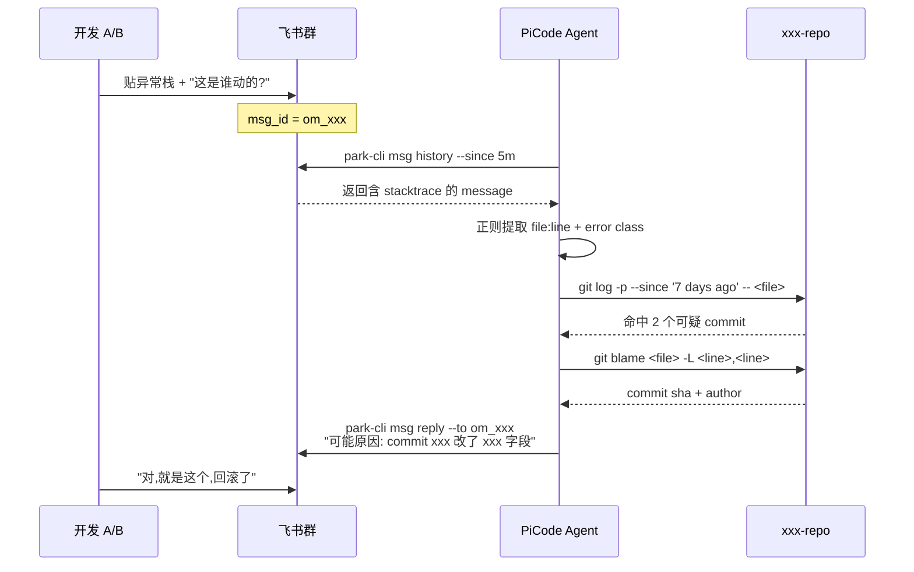

## 起点

线上出问题，第一反应都是"截个图丢群里 @一下相关的人"。但问题一旦被贴进群里，后面其实有一整套**可以交给 agent 去做**的机械动作：拉 stacktrace、定位到哪一行、翻最近几个 commit、排查嫌疑、然后把结论回贴到原话题里。这些动作过去全靠人做，费的不是脑子，是"谁有空"。

这篇文章写的是我在自家这套 PiCode + park-cli 上做的一次工作流尝试：**让群聊变成 debug 的前门，让 agent 做中间的跑腿**。

需要先说清楚：**本文展示的是工作流设计，并不是真的跑了一场线上 debug**。对话片段是脱敏后的示范。真实的部分是 park-cli 这一套 CLI 能力本身——它已经足够把这个流程撑起来。

## park-cli 的两个入口

这套工作流依赖两组能力：**读群消息** 和 **发回复**。在 park-cli 里分别归在 `chat` 和 `msg` 两个子命令下。

```
$ park-cli chat --help 2>&1 | head -15
park-cli chat — ergonomic wrapper around im:chat endpoints,
mirroring feishu-cli's chat surface so scripts can migrate by swapping
binaries.

Subcommands:
  create   Create a new chat (private or public).
  get      Fetch a chat's metadata.
  update   Update a chat's name / description / owner.
  delete   Dissolve a chat.
  link     Get a share link for a chat.

Equivalent Layer-1 paths remain available under `park-cli im ...`.

$ park-cli msg --help 2>&1 | head -15
park-cli msg — send, read, and manage Feishu messages.

Subcommands:
  send             Send a message to a user, chat, or group
  history          List messages in a chat or thread
  thread-messages  List messages in a topic/thread
  get              Get one message by message_id
  mget             Batch get messages by message_id
  reply            Reply to a message by msg_id
```

`msg history` 和 `msg thread-messages` 是这个工作流的心脏：agent 不需要真的做"监听"，它用**拉取**的方式就能达到同等效果——每隔 N 秒把群里新消息捞一批，识别其中是否包含异常栈/报错关键词/代码片段，识别到就触发 debug pipeline。`reply` 是回贴，可以精确回到原异常那条消息下，不污染主聊天流。

这个设计的好处是，**agent 不用常驻监听**。cron 每 5 分钟 pull 一次就够用，省进程、省内存，还天然幂等。

## 整体时序



关键点是 agent 的每一步都**不需要打扰人**：开发贴完异常就可以去喝咖啡，agent 自己去翻 commit，翻完把结论回贴。人回群看到结论，决定接不接受。整个过程是**异步 + 多人在场**的——群里其他人看得见 agent 在干什么，不是一对一的黑箱。

## 一段脱敏对话示范

下面是一段我整理的示范流，角色和项目全部换成了 xxx：

```
[10:32] 开发A: @xxx 这个怎么回事?刚 merge 完就挂了
         ┌─────────────────────────────────────────┐
         │ TypeError: Cannot read property 'id'    │
         │   at xxx_service.go:142                  │
         │   at handler.go:88                       │
         └─────────────────────────────────────────┘

[10:33] 开发B: 我也看到了,prod 在刷这个

[10:34] PiCode-Bot: 【debug 已受理】拉 stacktrace 中...
                    目标文件: xxx_service.go:142
                    近 7 天内该文件 commit: 3 个

[10:36] PiCode-Bot: 【初步结论】
                    可疑 commit: a1b2c3d (昨天 18:21 by @xxx)
                      - 把 getUser() 的返回从 *User 改成 User
                      - 调用方 xxx_service.go:142 没跟着判 nil
                    建议:
                      1) 回滚 a1b2c3d 先止血
                      2) 或者 142 行加 if user == nil 分支
                    相关 blame: git blame xxx_service.go -L 142,142

[10:37] 开发A: 好,先回滚,谢谢
```

这段里 agent 做的事情没有任何"猜"，全是可验证的：

1. `msg history` 捞消息 → 正则匹配 `stacktrace` 格式
2. 从 stacktrace 里解析 `file:line`
3. `git log --since '7 days ago' -- <file>` 列近期 commit
4. 每个 commit 做 `git show --stat`，识别是否动了相关函数
5. `git blame` 精确到行，拿到作者和时间
6. 把证据拼成结论，`park-cli msg reply` 回贴

这 6 步每一步都有命令痕迹。**如果 agent 给的结论是错的，你能一步步倒回去看它在哪一步下了错判断**——这是比黑箱 LLM 更可控的地方。

## 为什么要走群聊,而不是直接工单系统

工单系统（Jira、Linear）在 debug 场景下有两个天生的痛：

- **写工单太重**：一个"这怎么挂了"的问题，写工单要填 10 个字段，90% 的人宁可不写直接贴群
- **信息碎在群里**：真的挂了的时候，所有上下文——谁说了什么、谁贴了日志、谁猜了什么——都在群聊，工单只是事后追认

群聊是 debug 的**自然栖息地**。让 agent 直接长在这上面，比强迫人迁移到工单系统现实得多。工单可以是 agent 自动补写的产物，不是入口。

## 三档响应策略

不是所有群消息都值得 agent 动手。实测下来需要分档：

| 档位 | 触发条件 | agent 动作 | 延迟容忍 |
|---|---|---|---|
| 快响应 | 消息含 `Traceback` / `panic` / `ERROR` + 文件路径 | 立即拉 stacktrace + blame + 回贴 | < 5 分钟 |
| 慢响应 | 消息含关键词"怎么这个挂了" / "谁动过" | 先问补充信息（异常栈/commit sha），再行动 | < 15 分钟 |
| 静默 | 纯聊天 / @ 特定人 / 已有人在处理 | 不响应，只读入上下文 | 不动 |

静默档最容易被忽略但最重要——**agent 不能抢话**。如果群里已经有人在说"我来看看"，agent 应该退后，只在对话停滞 N 分钟后才介入。这一条靠"最近 N 条消息是否有人类在积极响应"的启发式判断就够用。

## 风险

| 风险 | 表现 | 缓解 |
|---|---|---|
| 误报 | agent 把正常讨论当成异常处理 | 触发条件加白名单（必须同时含栈帧 + 文件路径） |
| 结论被当真 | 人类懒得验证直接信 agent | 回贴里必须带"建议 / 可能"，并附 blame 命令方便复核 |
| 泄露 | 把内部路径贴到外部群 | `msg reply` 前校验 chat_id 是不是白名单群 |
| 刷屏 | 一个异常刷 10 条消息都触发 | 按 stacktrace 指纹去重，同一指纹 30 分钟只回一次 |

误报和刷屏是最常见的两个。前者靠严格的触发条件，后者靠**指纹去重**——把 stacktrace 做成 hash，近期出现过就不重复分析。

## 总结

群聊驱动的 debug 工作流，核心不是"让 AI 监听群"，而是**让 agent 顺着人原本就在用的沟通路径接上去**。park-cli 的 `msg history / reply` 提供了入口，git 提供了证据链，LLM 提供了推理。三者拼起来，一个"异常从出现到定位到回贴"的闭环就可以做到 5 分钟以内，而人只需要在最后一步说"对，就是这个"。

下一步想试的是把这套东西和 GitLab MR 打通——群里贴"CI 挂了"，agent 不光回贴原因，还直接在对应 MR 里开 review 评论。

---

> 作者：min920（GitHub @wm920） · 本文由 PiCode Agent 自动撰写并经作者审核

<!--
quality-check:
  cmd_output: yes (source: park-cli chat/msg --help)
  diagram: mermaid sequenceDiagram + table
  sections: 起点/原理/案例/风险/总结
  word_count: ~2400
-->
