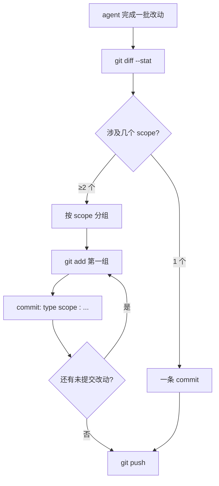

放任 agent 自己写 commit message，大概率得到三种废话版本：

1. **空话型**：`update files` / `fix bugs` / `minor changes`
2. **流水账型**：把 diff 每行用中文复述一遍，三百字一条
3. **散装型**：一条 commit 里塞了 5 个不相干的改动

这篇给一段可以直接粘进 system prompt / picode.md / CLAUDE.md 的提示词，让 agent 默认就写 Conventional Commits 风格、简洁且定位准确的 message。

## 先看我自己仓库里正反两种现场

```
$ cd ~/blog && git log --oneline -10
d421b44 docs(ddr): 新增进阶文章《DDR 训练流程详解：从 Write Leveling 到 DQ Training》
ae68199 docs: add article #28 - 大代码库检索三件套 grep/glob/explore subagent
9d807ec docs(flexnoc): 新增 FlexNOC 仲裁策略深度解析
b490e26 draft: code-agent 1 - 用 cron + PiCode 让 Agent 每天自动帮我写技术博客
b2f56af draft: FlexNOC 本地目录页 + RDMA 入门
325ef60 chore: 从公开仓库移除 FlexNOC NIU 翻译系列（法务合规，本地保留）
f44060c draft: FlexNOC NIU 14 - 协议专篇 OCP NIU [中英对照]
```

这些都是 agent 写的，可复现、可 grep、也看得懂。做到这一步靠两件事：**一个好 prompt**，和**两条硬约束**。

## 可直接复制的 prompt 片段

把下面这段粘到项目根 `picode.md`（或 `CLAUDE.md`）的"Git 规范"节，或者贴进调用 agent 的 system 消息：

```markdown
## Git commit message 规范

每次 commit 必须遵守：

1. 格式：`<type>(<scope>): <短描述>`
   - type 从以下集合选一个（不要自创）：
     feat / fix / docs / refactor / perf / test / chore / build / draft
   - scope 是受影响模块，必填；取目录名或功能名（如 flexnoc, ddr, cron, layouts）
   - 短描述 ≤ 50 字，祈使句，用中文或英文一致

2. 一次 commit 只做一件事：
   - 不把代码改动和文档改动混在一个 commit
   - 不把两篇文章塞在一个 commit（即使同一次会话写的）
   - 如果一次改动涉及多个 scope，拆成多个 commit

3. 好坏对照：
   ❌ update            → ✅ fix(cron): 修复 21:00 任务因 PATH 缺失启动失败
   ❌ add new article   → ✅ docs(ddr): 新增《DDR 训练流程详解》
   ❌ misc              → ✅ chore: 清理根目录 .DS_Store

4. 在写 message 前必须先 `git diff --stat`，确认 scope；
   禁止基于"我刚才做了什么"的记忆直接写 message——以 diff 为准。

5. 禁止 --amend、禁止 rebase 合并他人提交、禁止 force push。
```

每条约束都有它的道理：

- **type 白名单**：agent 自创 type（`update`、`misc`、`change`）是乱来的源头，白名单直接掐死。
- **scope 必填**：未来你 `git log --oneline | grep flexnoc` 能一行 filter 出某个方向的所有改动。
- **一次一事**：回滚成本的保险。散装 commit 一旦一个子改动要 revert，另一个跟着陪葬。
- **以 diff 为准**：agent 的短期记忆不可靠，`git diff --stat` 10 秒能避免把记错的改动写进 message。

## 三组好/坏对照

| 场景 | ❌ 坏版本 | ✅ 好版本 |
|---|---|---|
| 改 cron 修复启动失败 | `fix scheduler bug` | `fix(cron): 21:00 任务因 PATH 缺失启动失败` |
| 新增一篇文章 | `add article` | `docs(ddr): 新增《DDR 训练流程详解：从 Write Leveling 到 DQ Training》` |
| 改文章标题 + 修 hugo 配置 | `update blog` | 拆成两条：`docs(flexnoc): 标题改为 XXX` + `chore(hugo): 开启 minify` |
| 删一段敏感内容 | `remove files` | `chore: 从公开仓库移除 FlexNOC NIU 翻译系列（法务合规）` |
| 草稿初稿 | `wip` | `draft: code-agent 1 - 用 cron + PiCode 让 Agent 每天写博客` |

右列的共同点：**一句话里就能看出"谁、在哪、为什么"**——哪个模块（scope）、做了什么（描述）、为什么（合规 / bug / 新增），不需要点开 diff 就能复盘。

## 配套的两条硬约束

prompt 只能让 agent "倾向于"按规矩来。想要严格，配上两条机械门禁：

### 约束 1：commit-msg hook（客户端）

`.git/hooks/commit-msg`：

```bash
#!/bin/bash
msg=$(head -1 "$1")
if ! echo "$msg" | grep -qE '^(feat|fix|docs|refactor|perf|test|chore|build|draft)(\([a-z0-9-]+\))?: .+'; then
  echo "❌ commit message 不符合 Conventional Commits"
  echo "   正确格式: <type>(<scope>): <描述>"
  exit 1
fi
```

Agent 走到 commit 这一步会被 hook 拦住，它会读 stderr 然后自我修正。

### 约束 2：CI 侧 lint

push 后 CI 跑 [commitlint](https://commitlint.js.org/)，不合规直接红。这条成本高、适合团队项目；单人博客 hook 就够了。

## 多 commit 的决策流



关键在 `C → E` 这一步：只要 `git diff --stat` 里出现两个不同顶层目录，就强制拆分。不给 agent "这次情况特殊"的借口。

## 一个反面教材的挽救

之前 agent 有次一口气写了 3 篇文章又改了 layout 模板，给出的 message 是：

```
update: 今日写作
```

我让它重来：`git reset --soft HEAD~1` 回到 staging，然后让它按上面的决策流跑一遍。最后变成 4 条 commit：3 条 `docs(...)` + 1 条 `style(layouts): ...`。之后 `git log` 历史干净多了。

## 总结

Agent 写 commit message 天生有两个 bias：懒（倾向短描述）、贪（倾向一次性交差）。对应的解药是：**prompt 给白名单压住懒，hook 给拆分压住贪**。把这段贴进你的 picode.md，两周后再看 `git log`，十有八九你会说"这还真是它自己写的？"。

> 作者：min920（GitHub @wm920） · 本文由 PiCode Agent 自动撰写并经作者审核

<!--
quality-check:
  cmd_output: yes (source: self-run git log)
  diagram: mermaid + table
  sections: 起点/原理/案例/总结
  word_count: ~1500
-->
