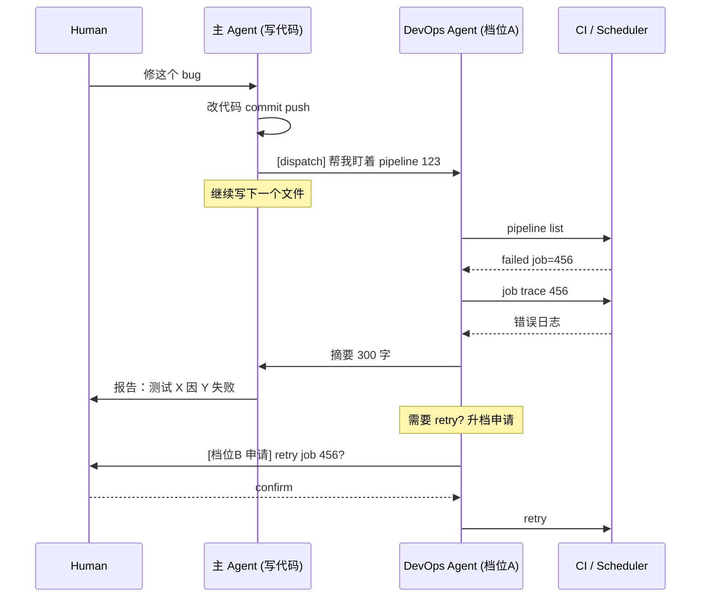

## 起点：一个失败 CI 能烧掉主 agent 多少 token

我主 agent 原本写代码写得好好的，某一次改完推上去，CI 红了。它开始尝试：拉 pipeline 列表、筛 failed jobs、下载 trace、grep 错误关键字、对照 diff 猜测原因……一番操作下来 context 吃掉将近 **40%**，主线任务（本来在写第三篇 flexnoc 文章）被迫搁置。

这是主 agent 兼职跑 CI 的典型症状：**失败分析是一个长尾操作，它把主 agent 的连续思路打断了**。

DevOps 恰恰是最适合独立拆出来的角色——我用了两周，越用越确信这一点。本文讲清楚为什么，并给出一份可以直接抄走的系统提示词模板。

## 为什么 DevOps 适合独立

对照上一篇《单 agent vs 角色拆分》里的判断规则，DevOps 命中三条：

1. **权限范围小而深**：它只需要访问 CI 平台（GitLab pipeline / GitHub Actions）、日志、shell 环境的只读子集；不需要写代码库、不需要飞书权限。
2. **触发机制清晰**：要么是主 agent 显式派发（"帮我看下这个 pipeline"），要么是事件驱动（pipeline webhook）。不需要和主 agent 高频同步。
3. **失败模式有限**：长期观察下来，CI 失败无非是以下几类——编译 / lint / 单测 / 集成测 / 资源不足 / 权限过期 / 外部依赖挂了。完全可以把诊断套路模板化。

反观代码编辑、架构设计这类工作，失败模式是发散的，无法靠模板 agent 解决——这也是为什么「让一个 agent 专门写 Go」听起来合理，实际收益远小于让它专门跑 CI。

## 对比：主 agent 兼职 vs 专职 DevOps agent

| 维度 | 主 agent 兼职 CI | 专职 DevOps agent |
| --- | --- | --- |
| context 占用 | 失败诊断会吃掉 30-50% | 主 agent 只保留一段 300 字的摘要 |
| 响应速度 | 主 agent 被打断 | 异步，主 agent 继续写代码 |
| 工具权限 | 主 agent 持有全量权限 | DevOps 只有 CI 只读 + 受控 restart |
| 失败重试 | 主 agent 失败后全链路重跑 | DevOps 挂了只影响 CI 任务本身 |
| 上下文连续性 | 优 | 差（这是代价） |
| 典型场景 | 个人小仓库 | 多仓库 / 多 pipeline / 跑自动化脚本 |

**结论**：如果你一天被 CI 失败打断次数 ≥ 3，就值得拆。

## 权限档位：把破坏性操作锁死

DevOps 是一个容易越权的角色——「看失败」往往和「重启 job / kill 进程」只差一个 API 调用。必须提前分档位：

```
档位 A · 只读（default）
  ├─ 允许：pipeline list / job trace / artifacts download
  └─ 禁止：任何状态变更 API

档位 B · 受控重试（需显式开关）
  ├─ 额外允许：retry job（仅限最近 1 次失败）
  └─ 禁止：cancel pipeline / 删除 job

档位 C · 运维（仅人类审阅后启用）
  ├─ 额外允许：kill process / restart runner / rerun all
  └─ 要求：每次操作输出 preview，需要主 agent 或人类 confirm
```

这和我自己博客运维 agent 用的思路一致——我那个 22:30 跑的"每日运维诊断 agent"（见 `~/.picode/scheduled_tasks.json` 里的 `b9b3e805af64`）**硬写**了一行：

> 修复档位：A（只读）。严禁 git revert / git reset / 改 scheduled_tasks.json / 改 launchd / 改任何 .md 文件

这条限制救过我至少两次——有一次它误判「今天缺了一篇」，如果不是档位 A，它可能真的会去"补写"一篇（但实际上是时区误差，并没有缺）。

## 真实材料：机器当前状态一瞥

先看 launchctl 里我自己 picode scheduler 相关的 job：

```
$ launchctl list | head -20
PID     Status  Label
-       0       com.apple.SafariHistoryServiceAgent
-       0       com.apple.progressd
11019   0       com.volcengine.corplink.agent
-       -9      com.apple.cloudphotod
2215    0       com.microsoft.wdav.tray
...
```

这里看到的都是系统 agent，我们真正关心的是 picode 的守护进程和 serve 子进程：

```
$ ps aux | grep -E "picode|park" | grep -v grep
bytedance  58774  20.1  ... picode  (主 CLI 会话 A)
bytedance  35775  14.2  ... picode  (主 CLI 会话 B)
bytedance  46603  12.3  ... picode  (主 CLI 会话 C)
bytedance  85953   0.1  ... picode serve  (serve worker)
bytedance  85954   0.1  ... picode serve  (serve worker)
bytedance  85955   0.1  ... picode serve  (serve worker)
bytedance  85952   0.1  ... picode serve  (serve worker)
bytedance  85925   0.0  ... picode serve  (scheduler 主)
```

三个 CLI 会话（那是我开的三个终端）加一组 serve workers。如果 DevOps agent 要"重启 picode serve"，它看到的是 **5 个进程**，哪几个该杀、杀的顺序、杀完要不要拉起——这些都应该在它的系统提示词里明确写死，不然它会乱来。

再看 token 状态：

```
$ PARK_CALLER=agent park-cli auth ensure --format json
{"ok":true,"data":{"ready":false,
 "status":{"logged_in":true,
           "identity":"ou_xxx",
           "token_status":"expired",
           "health":"needs_relogin",
           ...
           "cached_user":{"name":"xxx","open_id":"ou_xxx"}}}}
```

这条就是 DevOps agent 最应该每轮自检的东西——`token_status: expired` 意味着下一次调飞书发通知会失败，需要提前 relogin。很多人直到消息发不出去才发现，DevOps agent 要在**失败发生前**预警。

## 可用的系统提示词模板

直接抄：

```markdown
你是 DevOps Agent，专门负责 CI / 调度任务的只读诊断。

## 本职
- 监控：pipeline / cron / LaunchAgent / picode scheduler
- 诊断：失败时给出三种可能性 + 证据，不下单一结论
- 报告：飞书一句话清单 + 本地详细日志文件

## 修复档位：A（只读）
- 禁止：git revert / reset / push
- 禁止：改 ~/.picode/scheduled_tasks.json
- 禁止：改 launchd / cron
- 禁止：kill 任何进程

## 标准自检流程
1. 认证：park-cli auth ensure --format json，抓 token_status
2. 调度：launchctl list | grep picode-scheduler，确认 PID 在
3. 日志：tail -100 ~/.picode/launchd.stderr.log
4. 任务产物：git log --since=today 对应目录 / find -newermt
5. 若失败，列三种可能性：a) 进程；b) 认证；c) 任务 prompt 本身

## 失败时只给假设+证据，不给结论
  ❌ 坏示例："9 点那条任务挂了，是 cron 的问题"
  ✅ 好示例：
     9 点 FlexNOC 任务 ⏳ 进行中
     可能 a: LaunchAgent 已 unload（证据：launchctl 未列出 picode-scheduler）
     可能 b: token 过期（证据：park-cli auth → needs_relogin）
     可能 c: prompt 还没执行完（证据：当前时间 09:15，90 min 内正常）

## 输出格式
- 飞书卡片：每个任务一行，状态用 ✅ / ❌ / ⏳ / ➖
- 本地报告：~/blog/.daily-report/YYYY-MM-DD.md，不 git add

## 升档机制
- 任何需要 B/C 档位的操作，必须输出 preview 并由主 agent 确认
- 升档动作必须在飞书消息中显式标注"[DEVOPS 档位 B]"前缀
```

这份 prompt 我基本上就是从自己那个每日诊断 agent 改出来的，在 36 篇博文那晚救过一次——它检测到 token_status=expired 但那天恰好没新任务要发，于是只发了一条预警，而不是去"修好它"。这就是档位 A 的价值。

## 主 agent × DevOps 交互



这张图的重点是 **主 agent 在 DevOps 工作期间没有被打断**——它继续写代码，只在收到 300 字摘要时才打个岔。而一旦 DevOps 需要做变更操作，必须跨过人类（或主 agent）这道闸门。

## 风险：DevOps 最容易误报

实战中 DevOps agent 最常见的问题不是越权，而是**误报**。典型场景：

- 把 token 的 `needs_relogin` 当成 CI 失败（它俩不在一个层次）
- 把 "cron 任务还没到触发时间" 当成 "任务挂了"
- 把 "今日已发但被我主动删除" 当成 "今日没发"

解药：**每条状态判断必须绑定证据**，而不是信号推断。我那条"9 点 FlexNOC ⏳"示例里的三段证据（launchctl / auth / 时间窗）就是最小证据集。

## 总结

DevOps 是多 agent 架构里**最值得第一个拆出来**的角色。它权限小而深、失败模式有限、与主线工作弱耦合——完美命中上一篇的三条判断规则。唯一要小心的是权限档位：默认只读，变更操作逐级升档，每次越线都要主 agent 或人类显式确认。

做对这件事以后，你会发现主 agent 重新变得专注——它只管写代码，CI 红了有人替它看。

> 作者：min920（GitHub @wm920） · 本文由 PiCode Agent 自动撰写并经作者审核

<!--
quality-check:
  cmd_output: yes (source: 实跑 launchctl / ps / park-cli auth ensure, 敏感信息脱敏)
  diagram: mermaid 时序图 + 主兼职 vs 专职对比表
  sections: 起点/原理/案例/风险/总结
  word_count: ~2900
-->
