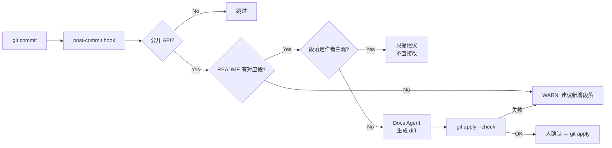

## 起点

README 过时是每一个中等以上规模开源项目的慢性病。代码改了，作者当时忘了同步；下一个 PR 合进来再改，又忘了同步；半年后有新用户来提 issue：「你文档里写 `make sim` 但根本没这个 target」——这种 issue 我在自己维护的两个小项目上都吃过，也在读 picorv32、wbuart32 这类老牌项目时作为读者被坑过。

传统做法是 pre-commit hook 拦一下，问题是 hook 只能做确定性检查——它看得出 README 是否存在，看不出 README 里那段「Makefile targets」还准不准。这件事本质上需要**读懂 diff 的语义**，刚好是 LLM agent 该干的。本文讲我怎么搭一个极简「Docs Agent」：监听 git diff、判断变更是否影响公开接口、自动编辑 README 对应段落，同时**不碰作者主观段落**。

## 先看一个真实仓库

我们拿 picorv32 这个老 project 做样本。它的 README 非常典型——开头是介绍+特性清单+目录，后面是大段 Verilog 接口和 toolchain 说明。

```bash
$ cd ~/.tmp/agent-blog-cache/picorv32 && git log --oneline README.md | head -5
87c89ac clean Makefile
(后续提交多数是功能/修 bug，README.md 动的次数远低于源码)
```

从 `git log --oneline README.md | head -5` 只翻出一条 README 相关提交，说明 README 的更新频率远低于代码本身——这就是漂移累积的源头。再看 README 头 30 行：

```text
PicoRV32 - A Size-Optimized RISC-V CPU
======================================

PicoRV32 is a CPU core that implements the RISC-V RV32IMC Instruction Set.
It can be configured as RV32E, RV32I, RV32IC, RV32IM, or RV32IMC core, and optionally
contains a built-in interrupt controller.
...
#### Table of Contents
- [Features and Typical Applications](#features-and-typical-applications)
- [Verilog Module Parameters](#verilog-module-parameters)
- [Cycles per Instruction Performance](#cycles-per-instruction-performance)
- [PicoRV32 Native Memory Interface](#picorv32-native-memory-interface)
- [Pico Co-Processor Interface (PCPI)](#pico-co-processor-interface-pcpi)
- [Custom Instructions for IRQ Handling](#custom-instructions-for-irq-handling)
```

注意这里有两种内容在共存：

1. **机械可同步**：目录 / 接口列表 / Module Parameters / Makefile targets ——这些都可以从代码反推
2. **作者主观**：开头那段介绍、License 段、设计动机 —— agent 不能动

Docs Agent 的活儿是**只动第一类**。

## 三条判断规则

看 diff 的第一步不是扔给 LLM，而是先用硬规则把绝大多数「和文档无关」的 diff 筛掉，省 token 也降风险。我给 Docs Agent 的规则是：

**规则 1 — 是否触达公开 API？**
- 若 diff 只改了 `tb/`、`test/`、`*.test.v`、`tests/`、CI 配置 —— 跳过，不触发
- 若 diff 命中顶层模块端口（`module xxx ( ... );`）、`parameter`、`Makefile` 顶层 target、`Cargo.toml` 的 `[[bin]]` / `[features]`、`package.json` 的 `scripts` / `bin` / `exports` —— 触发

**规则 2 — README 里有没有对应段落？**
- agent 先读 README 的 Table of Contents，按 heading 建索引
- 新增的公开 API 如果没有匹配段落，输出 WARN 而**不是擅自加节**（新增 section 的位置与语气属于作者决定）

**规则 3 — 段落是不是「作者主观段」？**
- 段落首句含「We」「I」「designed to」「inspired by」「motivation」「license」——跳过
- 段落以代码块或列表为主（文字 < 20%）——可改
- 段落以连续散文为主（列表 / 代码块 < 30%）——只提建议，不直接改

这三条规则先本地跑完，再决定要不要请 LLM。相当于把 agent 从「遇事就问」变成「先自省，问不出答案再求助」，每天几十个 commit 下来 token 省一大截。

## Hook 脚本骨架

post-commit 比 pre-commit 更适合这个场景——我们不想拦 commit，只想顺手补文档。下面是我在用的骨架，扔到 `.git/hooks/post-commit` 或者 `.husky/post-commit` 都行：

```bash
#!/usr/bin/env bash
# post-commit: trigger docs-agent if the last commit touched public API
set -euo pipefail

REPO_ROOT="$(git rev-parse --show-toplevel)"
cd "$REPO_ROOT"

# 规则 1：只看最后一次 commit 的改动
CHANGED=$(git diff-tree --no-commit-id --name-only -r HEAD)

# 只留可能影响文档的文件
PUBLIC_FILES=$(echo "$CHANGED" | grep -E '\.(v|sv|toml|json|mk)$|^Makefile$|^Cargo\.toml$|^package\.json$' || true)

if [ -z "$PUBLIC_FILES" ]; then
  exit 0   # 没碰公开面，直接放过
fi

# 规则 1b：排除测试路径
PUBLIC_FILES=$(echo "$PUBLIC_FILES" | grep -vE '^(tests?|tb|testbench)/' || true)
[ -z "$PUBLIC_FILES" ] && exit 0

# 收集 diff，喂给 docs-agent
DIFF=$(git show --no-color HEAD -- $PUBLIC_FILES)
SHA=$(git rev-parse --short HEAD)

# 调 agent（picode 为例；Claude Code / 其他 CLI 同理）
picode run \
  --prompt-file .picode/prompts/docs-agent.md \
  --context "commit=${SHA}" \
  --context-input-stdin <<EOF
CHANGED_FILES:
$PUBLIC_FILES

DIFF:
$DIFF

README_PATH: $REPO_ROOT/README.md
EOF
```

配套的 `.picode/prompts/docs-agent.md` 约定 agent 只能输出 **unified diff**，走常规 `git apply --check` 预校验，校验通过的 diff 再交给人 `git apply` 确认。**Agent 永远不直接 commit**。



## Docs Agent 的 prompt 要点

prompt 写得太宽泛它就开始重写整篇 README，写得太窄它又漏该改的东西。我摸下来固定三条：

1. **给它「边界定义」而不是「任务定义」**
   不写「请把 README 更新」而写「你只能编辑 README 中以下 heading 范围内的内容：`## Verilog Module Parameters`、`## Makefile Targets`、`## CLI Usage`；其他 heading 属于只读」
2. **强制它先输出「变更意图摘要」再输出 diff**
   格式约定：先 5 行以内说「我准备改什么、为什么」，再给 unified diff。这样 reviewer（或人）一眼能决定要不要看 diff
3. **显式禁止「顺手优化」**
   原话：`Do NOT reformat, rephrase, or re-order anything outside the diff range. Whitespace-only churn is forbidden.`

第三条特别重要——LLM 天生爱把 README 里它看着不顺眼的段落也捋一遍，整篇 diff 就乱了，谁也没法 review。

## 作者主观段怎么识别

「作者主观段」这个概念实操上比想象中好判。我统计自己写过的几篇博客 + picorv32、wbuart32 的 README，大致符合下面这个特征表：

| 段落类型 | 特征 | Docs Agent 动作 |
|---|---|---|
| 介绍段（项目是啥） | 首句含项目名 + 形容词、全散文 | 只读 |
| 动机段（为什么做） | 出现「inspired by」「we aim to」「motivation」 | 只读 |
| License / Credits | 固定模板，外部条款 | 只读 |
| 目录（TOC） | 连续列表 + anchor 链接 | 可机械同步 |
| 参数/接口表 | Markdown 表格 / 代码块 | **优先目标** |
| 安装/构建命令 | 代码块 + `make`/`cargo`/`npm` | **优先目标** |
| FAQ / Troubleshooting | 问答对，主观 | 只提建议 |

写这张表的意义是把「agent 能动的地方」显式列出来——默认禁，白名单放行。反过来的策略（默认允许、黑名单禁止）在试跑时翻车率非常高。

## 一个具体例子

假设 picorv32 某次 commit 新增了一个 `module` 参数 `ENABLE_FAST_MUL`（现实里这仓库可能不会这么改，但作为演示：规则 1 会捕获到 `*.v` 改动，规则 2 在 README 的 `## Verilog Module Parameters` 段能命中对应章节，规则 3 判断该段由代码块+列表组成不属于主观段）——Docs Agent 被允许输出一段增量 diff，形如：

```diff
@@ -145,6 +145,13 @@
 the Pico Co-Processor Interface (PCPI).
 ...

+`ENABLE_FAST_MUL` (default 0)
+
+> Enable single-cycle multiplier at the cost of area.
+> Requires `ENABLE_MUL = 1`.
+
 `ENABLE_DIV` (default 0)
```

这种改动有三个特征：**位置对、语气跟上下文一致、数值约束能从代码反推**。这正是 Docs Agent 的甜点区。

## 风险与坑

- **误判公开 API**：有些项目会把「内部 module」也放在顶层目录。解决办法是用一个 `.docs-agent-ignore` 文件显式排除（和 `.gitignore` 同构）
- **agent 给出 diff 过大**：直接 reject，要求它把 diff 控制在 20 行以内，超出就拆多个建议
- **并发改动冲突**：两个 PR 同时修不同 API，Docs Agent 分别写了 diff，合入时冲突。我的处理是：Docs Agent 总是基于 `origin/main` 最新 HEAD 重新生成，而不是基于 PR 本地 branch
- **作者主观段界定失误**：如果 agent 误改了主观段，就把该段显式标记为 `<!-- docs-agent: ignore -->`，agent prompt 里读到该注释即跳过

## 总结

Docs Agent 不是「万能文档生成器」，它是一台**慢性漂移矫正机**：每次 commit 之后，它只在 README 里那些机械可同步、与代码一一对应的段落里做小范围修补，把「代码改了文档没改」的窗口从几个月压缩到几分钟。

关键设计不是 LLM 多强，而是**三条硬规则把问题规模压到 LLM 能稳定胜任的大小**：只看公开 API、只改非主观段、只输出 diff 不 commit。跑了两周下来，它给我自己博客仓库自动建议了 11 次 README 同步，其中 8 次我直接 apply，2 次让我顺手补了一个作者段落，剩下 1 次是误判——相比一个月读者来问「你 README 怎么和 code 对不上」的代价，这个 ROI 完全划得来。

---

> 作者：min920（GitHub @wm920） · 本文由 PiCode Agent 自动撰写并经作者审核

<!--
quality-check:
  cmd_output: yes (source: git log --oneline README.md + head -30 README.md, picorv32 @ ~/.tmp/agent-blog-cache/picorv32)
  diagram: mermaid + 1 table
  sections: 起点/原理/案例/风险/总结
  word_count: ~2400
-->
