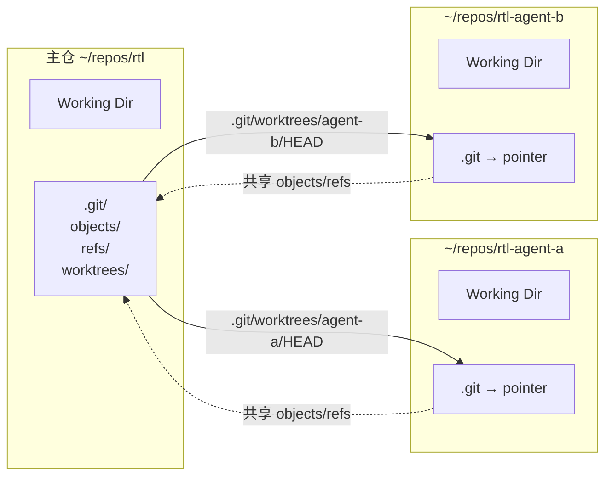
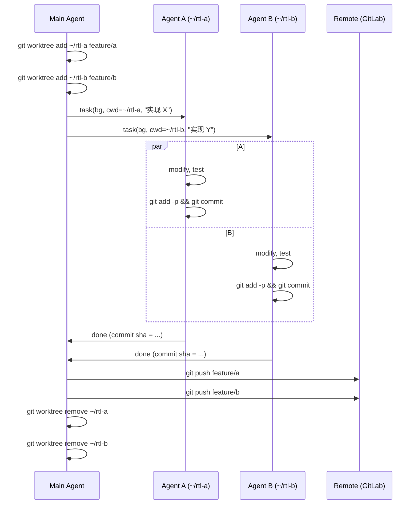

让 3 个 agent 同时改同一个仓库，十有八九会翻车——不是 A 把 B 改的文件覆盖了，就是 C 切了个分支把 A/B 的未提交改动带飞。

最"正确"的隔离方式是每个 agent 各自 `git clone` 一份，但大仓（比如 CPU RTL 动辄几 GB）这么搞磁盘和时间都受不了。更轻的方案是 `git worktree`——**共享 .git，分 Working Directory**，既不重复下载，又让每个 agent 拿到独立的文件空间。

本文把 worktree 原理讲清楚，列出什么场景必须用，哪些坑必踩，最后用 picorv32 真实仓库跑一遍完整流程。

## 背景：三个 agent 改同一仓库的典型翻车

场景：让三个 sub-agent 并行处理 RTL 仓库——
- Agent A：跑 baseline 回归测试（需要 checkout main）
- Agent B：改 AXI arbiter，跑新测试（需要 checkout 新分支 + modify files）
- Agent C：bisect 一个历史 bug（需要来回 checkout 旧 commit）

三个全部指向 `~/repos/rtl`，会发生：

1. B 正在 `git checkout -b fix-axi` 的时刻，A 发起 `git checkout main`——git 会把 B 的未提交修改一并带到 main 或直接报错。
2. C 的 `git bisect` 切到 3 年前的 commit，A 的测试 runner 以为自己在 main 上，读到了古早代码开始跑，结果全 fail。
3. B 保存修改后 `git add -A`，把 A 临时生成的 log 文件也 staged 了。

根因只有一个：**git 的 working directory 与 .git 是 1:1 绑定的**，所有进入这个目录的进程共享同一个 HEAD、同一个 index。

## worktree 原理：一个 .git，多个工作区

`git worktree` 让同一个仓库拥有**多个独立的 working directory**，每个 WD 有自己的 HEAD、index、未提交修改，但 objects（blobs、trees、commits）共享。

结构上：



具体实现是：每个 worktree 目录下的 `.git` **不是目录，而是一个文本文件**，内容是指向主 `.git/worktrees/<name>/` 的指针。那个子目录里存的是**这个 worktree 私有的 HEAD、index、logs**，而真正的对象库（objects）始终在主仓的 `.git/objects` 里。

这带来三个关键后果：

1. **磁盘成本极低**：worktree 只需要一份 working tree 的解压文件，objects 共享
2. **状态隔离完备**：各 worktree 有独立 HEAD/index，`checkout` 互不影响
3. **对象可见性全局**：任一 worktree 的 commit 一旦落盘，其他 worktree 立刻能 `git log` 看到

## 真实跑一遍：picorv32 仓库

下面是我在本机 `~/.tmp/agent-blog-cache/picorv32/` 真实跑的流程（写这篇文章前的实测）：

```
$ cd ~/.tmp/agent-blog-cache/picorv32

$ git worktree add ../picorv32-agent-a HEAD
Preparing worktree (detached HEAD 87c89ac)
HEAD is now at 87c89ac clean Makefile

$ git worktree list
/Users/bytedance/.tmp/agent-blog-cache/picorv32          87c89ac [main]
/Users/bytedance/.tmp/agent-blog-cache/picorv32-agent-a  87c89ac (detached HEAD)
```

一条命令，多一个独立工作区。验证 `.git` 的形态：

```
$ ls -la ../picorv32-agent-a/.git
-rw-r--r--  1 bytedance  staff  ...  .git
# 注意：是文件，不是目录

$ cat ../picorv32-agent-a/.git
gitdir: /Users/bytedance/.tmp/agent-blog-cache/picorv32/.git/worktrees/picorv32-agent-a
```

验证主仓内部多了 worktree 记录：

```
$ ls .git/worktrees/
picorv32-agent-a

$ git worktree list --porcelain
worktree /Users/bytedance/.tmp/agent-blog-cache/picorv32
HEAD 87c89acc18994c8cf9a2311e871818e87d304568
branch refs/heads/main

worktree /Users/bytedance/.tmp/agent-blog-cache/picorv32-agent-a
HEAD 87c89acc18994c8cf9a2311e871818e87d304568
detached
```

最关键的——验证对象库共享，WD 独立：

```
$ du -sh .              # 主 worktree
1.7M    .

$ du -sh ../picorv32-agent-a   # 新加的 worktree
1.4M    ../picorv32-agent-a

$ du -sh .git
404K    .git
```

两个 WD 加起来 3.1M，.git 共享 404K。如果是 `git clone` 第二份，那就是 `1.7M × 2 = 3.4M` 再加 `404K × 2 = 808K` = **4.2M**。对 picorv32 这种小仓差距还不明显，换成 5GB 的 SoC RTL，worktree 能省 50%+ 磁盘。

## 什么场景必须隔离

不是所有多 agent 协作都需要 worktree。下面这张表是我的判断清单：

| 场景 | 是否需 worktree | 原因 |
|---|---|---|
| 多 agent 并行改 RTL，各自跑仿真 | **必须** | 仿真会落地临时文件、log；HEAD 要长期停在不同分支 |
| 多 agent 并行跑测试（长跑 regression） | **强烈建议** | 测试产物污染互相干扰 |
| 一个 agent bisect，同时另一个 agent 在 main 开发 | **必须** | bisect 会反复 checkout 旧 commit |
| 多个 agent 只读仓库（跑 grep / 读文件） | 不需要 | 没有写，没有冲突 |
| 多个 agent 都只改 docs 非重叠文件 | 不需要 | 直接用分支就行 |
| agent 自动发 PR | 需要 | 每个 PR 一个 worktree，push 后丢弃，不污染主 WD |

还有一个隐性场景值得单独说：**CI agent 在后台跑仿真的同时，人类在主 WD 编辑代码**。这是 worktree 最舒服的用法——你在 `~/rtl` 正常改代码，CI agent 在 `~/rtl-ci/` 按自己节奏 pull / test / reset。两边互不打扰。

## 真实踩坑清单

### 坑 1：同一个分支不能被两个 worktree 同时 checkout

最常见的踩点。默认行为：

```
$ git worktree add ../rtl-b main
fatal: 'main' is already checked out at '/Users/bytedance/repos/rtl'
```

解决方式有两种：

1. **走 detached HEAD**（推荐给短命 agent）：`git worktree add ../rtl-b HEAD`，没有分支，只是一个 commit 的快照
2. **强制同分支**：`git worktree add --force ../rtl-b main`——极不推荐，两个 WD 一起往同一个分支 commit 会难受

### 坑 2：共享 index 不存在，共享 config 存在

很多人误以为 worktree 共享 index——不。**每个 worktree 的 index 完全独立**。坑在另一边：`.git/config` 是共享的，你在任一 worktree 里 `git config user.email xxx`，所有 worktree 都跟着变。对 agent 系统意味着：

- 所有 worktree 用同一个 `user.email`、同一组 remote URL
- 想让 agent 用不同身份提交，用 `git commit --author="..."` 或 `GIT_AUTHOR_NAME/EMAIL` 环境变量，不要改 config

### 坑 3：push 竞争与 pull 竞争

多个 worktree 同时 `git push` 到同一个 remote，远端有 ref lock，失败者会报：

```
! [rejected]  main -> main (fetch first)
```

对策：**所有 push 走总指挥 agent 串行执行**。worktree 只负责 commit，push 交给统一环节。这也是我在规范里把 `git push` 明确列为「严禁 sub-agent 执行」的原因——不是害怕它推错地方，而是并发 push 本身是系统性竞争。

同理，多个 agent 同时 `git fetch` 不会数据冲突，但会 N 倍带宽，最好用一个 agent 定时 fetch，其他人从共享的 .git 读。

### 坑 4：worktree 删除要用 git 命令，不能 rm -rf 完事

直接 `rm -rf ../rtl-agent-a` 删目录后，主 .git 还留着 `.git/worktrees/rtl-agent-a/` 元数据。正确做法：

```
$ git worktree remove ../rtl-agent-a
# 或清理已删除的目录残留：
$ git worktree prune
```

sub-agent 收工时一定要执行 `git worktree remove`，不然主 .git 会堆积一堆"幽灵 worktree"，下次 `git worktree list` 会看到一坨已不存在的路径。

### 坑 5：大文件 / LFS / 子模块的陷阱

- **LFS**：LFS pointer 共享，但 LFS 实际 blob 存在 `.git/lfs/`，也是共享的。跨 worktree 同一文件只下载一次。这是 worktree 相对 clone 的最大优势。
- **submodule**：每个 worktree 有自己的 `.gitmodules` 状态；submodule 的实际仓要看 `git config submodule.recurse` 以及 submodule 类型。`worktree add` 默认**不自动初始化 submodule**，需要进入新 worktree 后手动 `git submodule update --init`。
- **大小写敏感文件系统**：macOS 默认 HFS+/APFS 大小写不敏感，两个 worktree 如果都修改了 `AXI.v` 和 `axi.v` 之一，有概率互相覆盖——这和 worktree 无关，是 macOS 的老坑，加 `-s` 新建 case-sensitive 卷才能彻底解决。

## agent 工作流的典型骨架

结合上面这些，一个多 agent + worktree 的标准骨架长这样：



几个设计关键点：

1. **主 agent 负责 worktree 生命周期**（add / remove），sub-agent 不碰
2. **每个 sub-agent 通过 cwd 参数启动在自己的 worktree**，sub-agent 内部不 cd 到别人地盘
3. **push 权限在主 agent**，sub-agent 只 commit
4. **worktree 用完即焚**，不保留跨任务的 WD

## picode 的内置支持

值得一提：PiCode 的 `task` 工具本身就有 `isolation="worktree"` 参数。用法：

```
task(
    subagent_type="general",
    background=True,
    isolation="worktree",
    prompt="..."
)
```

加了这个参数之后，PiCode 会在启动 sub-agent 之前自动 `git worktree add` 一个临时目录，sub-agent 的 cwd 自动设置到那里，任务结束时也会自动 `git worktree remove`。对应上面骨架里主 agent 要做的那些家务活，PiCode 帮你做了。

但要注意——**PiCode 只负责 worktree 的 add/remove，不负责 push**。你的 prompt 里还是要明确告知 sub-agent：commit 后不要 push，把结果 sha 返回给主 agent。

## 总结

`git worktree` 的本质是把 git 的".git 与 WD 1:1 绑定"拆开：共享 objects 节省磁盘，独立 WD 实现隔离。对多 agent 协作来说，它是在"完全共享"和"各自 clone"之间的最优点。

三条实操要点：

1. **sub-agent 用 detached HEAD 起 worktree**，不要让多个 agent 争同一分支
2. **push 权限只留给主 agent**，sub-agent 最多 commit
3. **任务完成立刻 `git worktree remove`**，不要留幽灵 WD

最后补一句——**worktree 不能解决全部隔离问题**。如果 agent 要 run 的东西会污染 `.git/`（比如某些 hook 生成缓存）或者仓库之外的全局状态（如 `~/.npm`），worktree 管不住那些。那种场景得上容器或 unshare，但那是另一个层级的故事了。

> 作者：min920（GitHub @wm920） · 本文由 PiCode Agent 自动撰写并经作者审核

<!--
quality-check:
  cmd_output: yes (source: 本机 ~/.tmp/agent-blog-cache/picorv32 真跑 git worktree add / list / du -sh)
  diagram: 2 张 mermaid (架构图 + 工作流序列图) + 场景判断表
  sections: 背景/原理/实跑/场景表/坑/骨架/picode 支持/总结
  word_count: ~2800
-->
