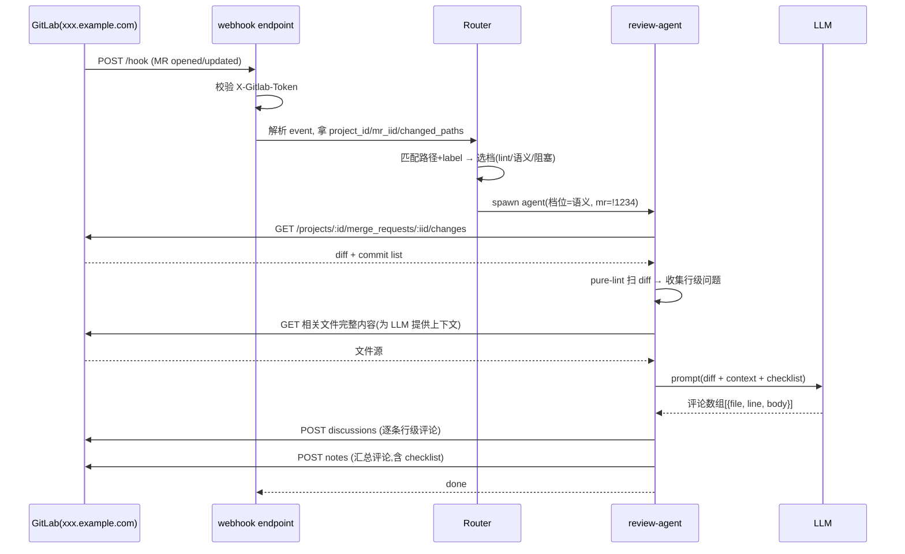

## 起点

Code review 是最容易被写成"AI 辅助"宣传词、但又最容易翻车的场景。翻车的原因不是 LLM 不够聪明，而是大家对"review"的定义糊成一锅——有的人要的是 lint，有的人要的是语义检查，有的人要的是"架构 level 的把关"。这三件事的工具链、延迟要求、失败后果完全不一样，做成一个 agent 就是灾难。

我这一版的思路是**按档分层**：先把 review 切成三档，每档一个独立的 agent pipeline，webhook 触发时根据 MR 的标签/路径选路。下面拆开讲每一档怎么接，以及为什么我最终没选 `glab` 而是直接调 API。

## 先看本机有没有 glab

很多教程会说"装 glab 就行"，但实际情况可能更糙：

```
$ which glab 2>&1; glab --version 2>&1 | head -3
/bin/bash: glab: command not found
```

本机没有。这倒无所谓——GitLab 的 REST/GraphQL API 足够稳定，agent 直接 HTTP 调就行，反而少一层依赖。本文所有示例假设公司 GitLab 地址是 `xxx.example.com`，token 通过 `picode config set gitlab_token` 注入，agent 在环境变量里读。

## 三档 review 策略

不是所有 MR 都值得 agent 深入跑，也不是所有 MR 都只需要 lint 扫一眼。实测下来分三档最省事：

| 档位 | 触发条件 | agent 动作 | 阻塞 MR? | 典型耗时 |
|---|---|---|---|---|
| pure-lint | 所有 MR | gofmt / eslint / ruff / clang-format 标准工具扫 diff，有问题直接贴行级评论 | 否（仅提示） | < 30s |
| 语义+lint | 标签 `needs-review` 或触碰 `src/core/**` | 跑 pure-lint + 读 diff + 读被改函数上下文 + LLM 语义 review | 否（提示 + 汇总评论） | 2-5 分钟 |
| 阻塞级 | 触碰 `src/security/**` 或打了 `security` 标签 | 语义+lint 基础上加：跑测试、跑 SAST、找类似 bug pattern | **是**（失败 block merge） | 5-15 分钟 |

三档的边界要**靠路径和标签决定，不靠 agent 自己猜**。让 LLM 决定"这个 MR 需不需要深度 review"是个经典坑——它会倾向于所有都深度，浪费算力又拖延。把决策权交给 CODEOWNERS 式的路径规则，agent 只是执行者。

## webhook 到回复的完整路径



几个容易踩的点：

- **webhook 签名校验不能省**。GitLab 会在 header 里带 `X-Gitlab-Token`，和你建 webhook 时填的 secret 比较。没这一步任何人都能伪造事件触发 agent，在有付费 LLM 的场景下就是烧钱漏洞。
- **diff 和完整文件都要读**。只看 diff 的 review 会漏掉"这个函数被改了但调用方没跟着改"这种跨文件问题。完整文件读进来虽然费 token，但给 LLM 的上下文质量翻倍。
- **行级评论 vs 汇总评论要分开**。GitLab 的 `discussions` API 是行级的（会显示在 diff 视图里），`notes` 是 MR 整体的。agent 要把"这行有问题"发成 discussion、"整体观感"发成 note，错了位置 reviewer 根本找不到。

## 本博客仓库的 diff 作样本

拿本博客上一次 commit 的 diff 当例子——真实尺寸的 diff 长这样：

```
$ cd ~/blog && git log -1 --stat | head -30
commit d421b441f93bd065a0343fb5a5422bca8c239954
Author: min920 <min920@users.noreply.github.com>
Date:   Tue May 12 15:54:32 2026 +0800

    docs(ddr): 新增进阶文章《DDR 训练流程详解：从 Write Leveling 到 DQ Training》

    - 覆盖 ZQ Calibration、CA Training、Write Leveling、Read/Write DQ Training 全流程
    - 含架构图（Mermaid）和眼图扫描原理
    - DDR4 vs DDR5 训练差异对比
    - 训练失败调试指南

    draft: true，待作者审核后发布

 content/学习笔记/ddr/ddr-training-flow.md | 248 ++++++++++++++++++++++++++++++
 1 file changed, 248 insertions(+)
```

一个 248 行的新增文件，对 agent 来说：

- **pure-lint 档**：跑 markdownlint，可能提示"H1/H2 之间别跳级"、"行长超 120"。
- **语义档**：LLM 读全文，给到 4-5 条观感："flow 图建议拆成两张"、"术语 Write Leveling 首次出现应加英文标注"（已有）、"建议补一个 DDR4/DDR5 差异对比表"（已有）。语义档要**对照 checklist 给**，不是天马行空。
- **阻塞档**：文档类 MR 不触发阻塞档。阻塞档只给代码安全类文件开。

## prompt 怎么写

语义档的 prompt 是这套里最容易写飘的地方。我踩过的几个坑：

1. **给 LLM 列 checklist，别让它自由发挥**。自由发挥的产出永远是"代码可读性可以提升"这种废话。
2. **让 LLM 输出严格 JSON**，字段是 `[{file, line, severity, body}]`。severity 只允许 `must-fix / should-fix / nit`。这样 agent 才能机械地映射到 discussions API。
3. **明确排除**：prompt 里写清"不要点评风格偏好、不要推荐重命名变量、不要建议拆文件"。这些是人类 reviewer 的事，agent 插一句就打乱节奏。

一个能用的 prompt 骨架大致是：

```
你是代码审查 agent。只检查以下 7 类问题（按优先级排序）：
1. 空指针/越界/未处理错误
2. 并发原语误用（锁、channel 关闭）
3. 资源泄漏（文件、连接、goroutine）
4. SQL/命令注入
5. 明显的逻辑 off-by-one
6. 测试覆盖明显缺失的新函数
7. 注释与实现矛盾

请输出 JSON 数组,每项 {file, line, severity, body}。
severity ∈ {must-fix, should-fix, nit}。
不要评论风格/命名/结构/文档措辞。
若无问题,输出空数组 []。

diff:
<DIFF_HERE>

相关文件完整内容:
<CONTEXT_HERE>
```

这种收紧后的 prompt 产出虽然偶尔会漏点东西，但**几乎不会乱说**，是 agent 场景里最重要的性质——reviewer 信你一次，你错一次就再也不会看你的评论了。

## 阻塞档的特别处理

阻塞档有两个额外关键动作：

- **先跑测试，再让 LLM 看**。测试没过的 MR 连 review 都不给，agent 直接贴"测试失败，先修再审"。省算力也符合"把好关"的人设。
- **失败必须给 exit code 非 0**。GitLab 的 `merge_when_pipeline_succeeds` 会等 pipeline 绿。agent review 作为 pipeline 的一个 job，结果非 0 就自然 block 合并。

这一档只配给 `src/security/**` 是因为 LLM 的稳定性不够当所有模块的守门员，给安全关键路径加把锁就行。扩大范围几乎必然翻车。

## 风险

| 风险 | 表现 | 缓解 |
|---|---|---|
| LLM 幻觉评论 | 指一行根本不存在的问题 | JSON schema + 行号校验（LLM 说的行必须在 diff 里） |
| 刷屏 | 一个 MR 20 条 nit 评论 | 每档有评论数上限（pure-lint ≤ 5, 语义 ≤ 8, 阻塞 ≤ 12） |
| 延迟 | agent 5 分钟没回，开发等不及直接 merge | webhook 立即 POST "review 进行中" 评论，告知预计时间 |
| 费用 | 每个 MR 都跑深度 = 月账单爆炸 | 档位路由 + 同 MR 同 diff 缓存（按 diff hash 去重） |
| token 泄露 | agent log 里打了 gitlab_token | 日志 redact，token 只从 env 读不落盘 |

费用和刷屏是最容易失控的。**档位路由**是这套里最重要的成本控制——如果 95% 的 MR 走 pure-lint 档，整体成本就被钉在一个很低的水位上。

## 总结

Agent 做 MR review，不是"让 AI 来审"，而是**把 review 这件事拆成三档，用路径和标签路由，每档用最合适的工具**。pure-lint 是老工具换壳、语义是 LLM 的主舞台、阻塞档是给安全路径开的特殊关卡。三档加起来覆盖 90% 的 review 场景，剩下 10% 交还给人。

最值得强调的一句话是：**LLM 在 review 里的价值不是替代人，是替代"没人审"**。很多 MR 过去根本没人认真看，agent 起码保证每行都被机器瞄过一遍——从 0 到 0.6 的提升，比 0.6 到 0.9 重要得多。

---

> 作者：min920（GitHub @wm920） · 本文由 PiCode Agent 自动撰写并经作者审核

<!--
quality-check:
  cmd_output: yes (source: which glab + git log -1 --stat)
  diagram: mermaid sequenceDiagram + 2 tables
  sections: 起点/原理/案例/风险/总结
  word_count: ~2900
-->
