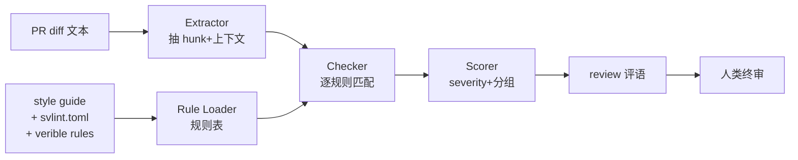

Ibex 是 lowRISC 维护的 32 位 RISC-V 小核，在 OpenTitan 里是 root-of-trust 的大脑。这种以安全为立身之本的项目，代码评审门槛很高：命名、端口顺序、reset 风格、assertion 覆盖度，全部写进 style guide，PR 一个不过就回炉。问题是，人工 review 一份几百行的 SV diff，注意力很快就散了——「端口 `_i/_o` 后缀写了没」「`always_ff` 是不是 async reset」这种机械检查，正是 agent 的舒适区。

这篇记一下我给 Ibex 搭的 Reviewer agent：**吃 style guide、扫 PR diff、按规则打分**，人类只需要看 agent 标红的那几行。

## 为什么是 Ibex / lowRISC

挑 Ibex 做样本有三个原因：

1. **规模刚好**。整个仓库 56 MB，RTL 行数可数，够 agent 一口吃掉，又不至于像 OpenTitan 那样得做切片。
2. **风格规范显式落地**。lowRISC 把 style 规则直接写进了 verible-lint 和 svlint 的 config，agent 不用猜。
3. **assertion 密度高**。安全芯片里 `ASSERT` 不是点缀，是第一道防线，review 时必须检查。

先看一眼真实规则集长什么样：

```
$ head -40 vendor/lowrisc_ip/lint/tools/veriblelint/lowrisc-styleguide.rules.verible_lint
# Copyright lowRISC contributors (OpenTitan project).
# Licensed under the Apache License, Version 2.0, see LICENSE for details.
# SPDX-License-Identifier: Apache-2.0

# Common Verible lint rules that can be enabled across the lowRISC
# repositories to enforce the lowRISC Verilog style guide.

# This file is a copy of the rules file maintained in the lowRISC lowrisc-ip
# repo (in hw/lint/tools/veriblelint/).
```

再看 svlint 那边：

```
$ head -15 ~/.tmp/agent-blog-cache/ibex/.svlint.toml
[option]
prefix_inout = "inout_"
prefix_input = "i_"
prefix_output = "o_"
# (省略)

[rules]
level_sensitive_always = true
non_ansi_module = true
output_with_var = false
priority_keyword = true
tab_character = true
wire_reg = true
```

几条一眼就能提炼成 review checklist：

- 禁止 `reg` / `wire`，一律 `logic`（`wire_reg = true`）
- 端口命名 `_i` / `_o` 后缀（svlint 里是 `prefix_`，Ibex 真实用法是后缀，下面验证）
- 禁止 level-sensitive `always`（`level_sensitive_always = true`）
- 必须 `priority` / `unique`，不能裸 `case`
- 禁止 tab

## 规则和真实代码的对齐

规则好听，关键是 RTL 是不是真这么写。扒一眼 `ibex_core.sv`：

```
$ grep -nE "^\s*(input|output)" rtl/ibex_core.sv | head -10
59:  input  logic                         clk_i,
60:  input  logic                         rst_ni,
62:  input  logic [31:0]                  hart_id_i,
63:  input  logic [31:0]                  boot_addr_i,
66:  output logic                         instr_req_o,
67:  input  logic                         instr_gnt_i,
68:  input  logic                         instr_rvalid_i,
69:  output logic [31:0]                  instr_addr_o,
70:  input  logic [MemDataWidth-1:0]      instr_rdata_i,
71:  input  logic                         instr_err_i,
```

挺整齐：

- 一律 `logic`，没看到 `reg` / `wire`
- 后缀 `_i` / `_o`，reset 叫 `rst_ni`（低有效、异步，`_n` 表示 active-low）
- 列对齐：`input`/`output` 后接类型，再接宽度，再接名字，逗号收尾

再看 reset 和 assertion 的写法：

```
$ grep -nE "always_ff.*posedge|ASSERT" rtl/ibex_core.sv | head -6
533:  `ASSERT_INIT(IbexMuBiSecureOnBottomBitSet,    IbexMuBiOn[0] == 1'b1)
534:  `ASSERT_INIT(IbexMuBiSecureOffBottomBitClear, IbexMuBiOff[0] == 1'b0)
1004:    `ASSERT(NoMemRFWriteWithoutPendingLoad, rf_we_lsu |-> outstanding_load_wb, clk_i, !rst_ni)
1022:  always_ff @(posedge clk_i or negedge rst_ni) begin
1425:    always_ff @(posedge clk_i or negedge rst_ni) begin
1482:  always_ff @(posedge clk_i or negedge rst_ni) begin
```

这给了 review agent 另外三条硬规则：

- 时序块必须 `always_ff @(posedge clk_i or negedge rst_ni)`，异步低有效 reset
- 复位判断一律 `if (!rst_ni) ... else ...`，先复位后逻辑
- 关键属性必须有 `ASSERT` 或 `ASSERT_INIT` 守卫

## agent 的分工思路

一开始我把 style check 全塞一个 prompt，发现 agent 在「识别 diff」和「应用规则」之间互相干扰——规则一多就漏，diff 一大就胡说。后来按职责拆成三段流水线：



- **Extractor**：只吃 `git diff`，切出每个 hunk 和前后各 10 行上下文。这一步不调用 LLM，纯脚本。上下文是刚需——`logic [31:0] foo` 这行改了位宽，agent 得看到 module 边界才能判断是不是端口。
- **Rule Loader**：把 `.svlint.toml` / `verible_lint` / `docs/styleguide.md` 预处理成一张规则表（id、描述、正则、严重度）。agent 只能引用表里的 rule id，防止它自由发挥。
- **Checker**：对每个 hunk + 每条规则做一次判定。这里才用 LLM，一次只喂一段 diff + 相关规则子集（按文件类型筛）。
- **Scorer**：把 checker 的分散判定聚合，按 blocker / warn / nit 分级，输出一份 Markdown review。

关键细节：**规则和 diff 的匹配不要让 LLM 硬猜**。能用 regex 的全走 regex（tab、`reg/wire`、缺分号），LLM 只负责语义类的（命名 style、assertion 缺失、reset polarity）。这样规则永远可追溯，人类也能审 agent 的判定依据。

## Reviewer prompt 模板

下面是 Checker 环节实际在用的提示词，删减了公司内部细节：

```text
你是 Ibex RTL Reviewer，严格执行 lowRISC style guide。

输入：
<diff>...hunk...</diff>
<context>...前后 10 行...</context>
<rules>
R-001 [blocker] 禁止使用 reg/wire，一律使用 logic。
R-002 [blocker] 端口名必须带 _i/_o 后缀，时钟 clk_i，低有效异步 reset 命名 rst_ni。
R-003 [blocker] 时序逻辑必须写作 always_ff @(posedge clk_i or negedge rst_ni)。
R-004 [warn]    复位分支必须 if (!rst_ni) 优先，非阻塞赋值。
R-005 [warn]    关键状态/枚举必须有配套 `ASSERT 或 `ASSERT_INIT。
R-006 [nit]     case 语句必须 unique / priority 修饰。
...
</rules>

输出 JSON 数组，每条违规一个对象：
{
  "rule": "R-003",
  "severity": "blocker",
  "line": <diff 行号>,
  "snippet": "<相关行>",
  "why": "<一句话解释，不要超 40 字>",
  "suggest": "<改法，可留空>"
}

禁止：
1. 不要引用规则表之外的规则
2. 不要对未改动的代码挑刺
3. 不要输出自然语言段落，只输出 JSON

如无违规，输出 []。
```

三条「禁止」是踩过坑后加的：

1. 没加第一条时，agent 会编 R-999「建议加注释」之类的土法规则
2. 没加第二条时，agent 看到整段 `ibex_core.sv` 会顺手批评三年前的代码
3. 没加第三条时，agent 在 JSON 前后洒一圈自我介绍，下游脚本解析报错

## 一次真实的 review 片段

拿一段 hunk 跑：假设有人提了个 PR，把端口误写成 `wire`、还把 reset 写成同步：

```diff
@@ rtl/ibex_foo.sv @@
-  input  logic [31:0] data_i,
-  output logic [31:0] data_o,
+  input  wire  [31:0] data_in,
+  output reg   [31:0] data_out,
   ...
-  always_ff @(posedge clk_i or negedge rst_ni) begin
-    if (!rst_ni) q <= '0;
+  always_ff @(posedge clk_i) begin
+    if (rst) q <= '0;
     else     q <= d;
   end
```

agent 输出：

```json
[
  {"rule":"R-001","severity":"blocker","line":3,
   "snippet":"input wire [31:0] data_in,",
   "why":"禁止 wire，使用 logic",
   "suggest":"input logic [31:0] data_in,"},
  {"rule":"R-001","severity":"blocker","line":4,
   "snippet":"output reg [31:0] data_out,",
   "why":"禁止 reg，使用 logic",
   "suggest":"output logic [31:0] data_out,"},
  {"rule":"R-002","severity":"blocker","line":3,
   "snippet":"data_in","why":"端口需 _i 后缀",
   "suggest":"data_i"},
  {"rule":"R-002","severity":"blocker","line":4,
   "snippet":"data_out","why":"端口需 _o 后缀",
   "suggest":"data_o"},
  {"rule":"R-003","severity":"blocker","line":8,
   "snippet":"always_ff @(posedge clk_i) begin",
   "why":"复位须异步低有效",
   "suggest":"always_ff @(posedge clk_i or negedge rst_ni) begin"},
  {"rule":"R-004","severity":"blocker","line":9,
   "snippet":"if (rst) q <= '0;",
   "why":"复位信号命名/极性错误",
   "suggest":"if (!rst_ni) q <= '0;"}
]
```

五条 blocker 都在十秒内定位到行号。Scorer 把它按文件聚合，扔进 Markdown：

| 文件 | blocker | warn | nit |
| :-- | :-: | :-: | :-: |
| rtl/ibex_foo.sv | 6 | 0 | 0 |
| rtl/ibex_bar.sv | 0 | 2 | 1 |

然后挂到 PR 上 `@作者` 直接看标红列。

## 风险与边界

- **误报**：最怕 agent 把 `rst_ni` 信号反过来理解。所以 Rule Loader 里每条规则都带「正例 / 反例」示范，Checker prompt 里随机抽 2 条喂进去当 few-shot。
- **规则漂移**：lowRISC style guide 会更新。我把 `.svlint.toml` 和 verible 规则文件放进 CI，文件变化就触发 Rule Loader 重新构建规则表，不做人肉同步。
- **不碰语义 bug**：agent 只做 style。时序 bug、CDC、死锁这些继续交给 JasperGold / formal flow，agent 不越界。
- **审计闭环**：每一条 blocker 都要引到 rule id，人类复核时能一键跳到 style guide 对应章节。不给 agent 即兴发挥的缝。

## 小结

给 Ibex 这种规则密集、风格严格的项目配 review agent，价值不是「让 agent 替代人类」，而是**把机械检查外包出去，让人类集中在语义层**。这套 pipeline 的三个关键点：规则来源是 lint config 原文不是口述；Checker 一次只看一小块 diff+规则子集；所有判定必须引 rule id 可追溯。

下一步我打算把 `ASSERT` 覆盖度接进来——每个新增 `always_ff` 如果没有配套断言，直接 warn。对安全芯片来说，这比命名后缀更该自动化。

> 作者：min920（GitHub @wm920） · 本文由 PiCode Agent 自动撰写并经作者审核

<!--
quality-check:
  cmd_output: yes (source: ~/.tmp/agent-blog-cache/ibex, .svlint.toml / rtl/ibex_core.sv / veriblelint rules)
  diagram: mermaid + table
  sections: 起点/原理/案例/风险/总结
  word_count: ~2600
-->
