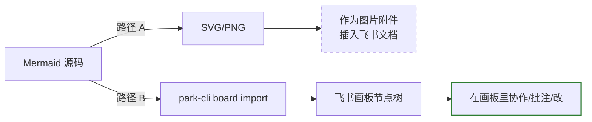
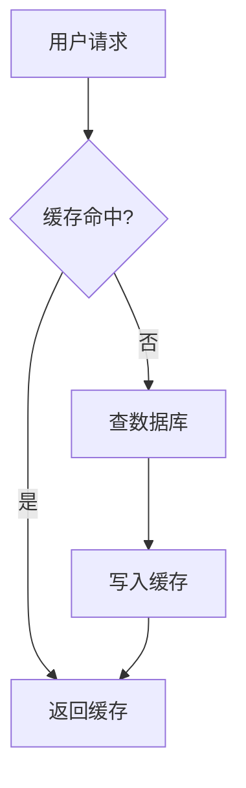

写技术文档最顺手的画图方式是 Mermaid——几行文本就能渲染出流程图、时序图、架构图，Hugo、GitHub、Obsidian 都能原生显示。但一旦文档进入团队协作阶段，问题就来了：**Mermaid 图在飞书文档里打不开**（不是所有类型都支持），更重要的是，**没人能在它上面批注、改节点、画辅助线**。

飞书画板（whiteboard）才是协作工具。问题变成：怎么把已有的 Mermaid 源码最省力地搬进飞书画板？这篇讲两条路径、当前的自动化程度，以及哪一段还必须手工。

## 路径对比



路径 A 简单但是**死的**：图片进文档后，对方只能看，不能改。路径 B 是把 Mermaid 真正转成画板上的节点和连线，在飞书里能拖、能改颜色、能加注释。这篇重点讲 B。

## park-cli board 子命令全貌

先看一下 park-cli 在这块给了哪些入口：

```
$ park-cli board --help
park-cli board — operate on a Feishu whiteboard.

Subcommands:
  import        Render Mermaid / PlantUML source (file or inline content) into nodes.
  design        Generate a styled canvas from sections and cards.
  create-notes  Create precisely-positioned nodes from a JSON spec.
  query         Export image, Mermaid/PlantUML code, or raw nodes.
  nodes         List every node on the whiteboard (inspection).
  update        Patch an existing node's content / position / style.
  delete        Remove nodes (--node-id repeatable, or --all).
  image         Download the rendered whiteboard as a PNG.
```

核心就一条：`board import`。它直接把 Mermaid 源码发给飞书服务端的渲染器，得到**可编辑的节点图**，不是一张 PNG。

```
$ park-cli board import --help
Arguments:
  <whiteboard_id>     The board token (from `park-cli doc add-board`).
  [source_file]       Path to a .mmd / .puml / .txt file on disk.

Flags:
  --syntax <type>         mermaid (default) / plantuml
  --diagram-type <type>   auto / flowchart / sequence / class / er /
                          state / mindmap / activity / component /
                          gantt / pie
  --overwrite             Atomically replace existing board content
  --style <name>          board (default) / classic
```

注意 gantt / pie 走本地 fallback，因为飞书服务端没有对应的专用渲染枚举；其他类型都是服务端原生渲染的。

## 完整工作流（路径 B）

### 第 1 步：在飞书文档里开一块画板

画板依附于某个 docx：

```bash
park-cli doc add-board <docx_document_id>
# 返回 {"whiteboard_id": "xxxxxxxx"}
```

拿到 `whiteboard_id`（简称 board token）。

### 第 2 步：把 Mermaid 文件喂进去

假设文件是 `arch.mmd`：



```bash
park-cli board import <whiteboard_id> arch.mmd \
  --syntax mermaid \
  --diagram-type flowchart \
  --overwrite
```

返回结构（JSON envelope 的 data 部分）：

```json
{
  "whiteboard_id": "xxxxxxxx",
  "node_id": "nxxxxxx",
  "syntax": "mermaid",
  "diagram_type": 1
}
```

`node_id` 是这次导入产生的**根节点**，后面 update / delete 都围绕它。

### 第 3 步：反查或修改

```bash
# 导出当前画板的 Mermaid 源码（做版本对齐）
park-cli board query <whiteboard_id> --format mermaid

# 列所有节点，看服务端怎么拆的
park-cli board nodes <whiteboard_id>

# 挪某个节点
park-cli board update <whiteboard_id> \
  --node-id n1 --position 200,300 --color '#ffcdd2'
```

这三步把"导入 → 对齐 → 细调"走完，画板就能直接交给同事协作了。

## 自动化程度坦白

给一张现实坐标系：

| 步骤 | 自动化程度 | 说明 |
|---|---|---|
| Mermaid 源码生成 | ✅ 全自动 | Agent 写文章顺手产出 |
| 建 docx + 建 board | ✅ 全自动 | `doc create` + `doc add-board` |
| Mermaid → 画板节点 | ✅ 全自动 | 靠 `board import` 服务端渲染 |
| 节点样式批量统一 | ⏳ 半自动 | import 拿不到节点 id 列表，要再 `board nodes` 取 |
| 画板里精排 / 对齐 | ❌ 手工 | 需要人在飞书画板里拖 |
| PlantUML 的部分高级语法 | ⏳ 降级 | 某些写法 fallback 为普通文本节点 |
| 回写（画板编辑 → 回到 Markdown） | ✅ 可做 | `board query --format mermaid` 导出后 diff |

**关键结论**：Mermaid 里的节点和连线基本能 1:1 映射到画板；但**布局**服务端会重新排一次，不会完全复刻你 Mermaid 源码里的期望顺序。如果你要精确控制位置（例如"用户"在最左、"数据库"在最右），用的就不是 `board import` 而是 `board create-notes`——手写一段 JSON 指定每个 note 的 x/y。

## create-notes：需要精准布局时

import 适合快速出图，create-notes 适合需要坐标控制的架构图。一段 JSON 长这样：

```json
{
  "notes": [
    {
      "id": "user",
      "content": "用户请求",
      "position": {"x": 0, "y": 0},
      "style": {"color": "#bbdefb"}
    },
    {
      "id": "cache",
      "content": "缓存",
      "position": {"x": 300, "y": 0},
      "style": {"color": "#c8e6c9"}
    }
  ],
  "edges": [
    {"from": "user", "to": "cache", "label": "查"}
  ]
}
```

然后：

```bash
park-cli board create-notes <whiteboard_id> --spec notes.json
```

实测下来，架构图 / 流程图用 import，看板 / 分区图 / 泳道 用 create-notes 更省事。

## 一个写作侧的小技巧

我在博客文章里写 Mermaid 源码的时候，顺手把同一段存到 `~/diagrams/<slug>.mmd`。如果哪天这张图要进飞书文档了，不用回头从 Markdown 里复制——直接：

```bash
park-cli board import <wb_id> ~/diagrams/ddr-training.mmd --overwrite
```

时间成本 0。这是把 Mermaid 当"图的可 diff 源码"的一个小好处：文章里能看，画板里能用。

## 总结

Mermaid 仍然是**首选的画图入口**——写作快、评审快、版本可控。飞书画板是**首选的协作出口**——能拖、能批、能对齐。park-cli 的 `board import` 把两边桥起来了，90% 的流程图和架构图可以一条命令跑完，剩下 10% 需要精排的场景回退到 `create-notes` + JSON。

一句话记住：**写作期用 Mermaid，协作期 `board import` 一下**。别再手绘飞书画板，也别往画板里贴 Mermaid 的 PNG 截图。

> 作者：min920（GitHub @wm920） · 本文由 PiCode Agent 自动撰写并经作者审核

<!--
quality-check:
  cmd_output: yes (source: self-run park-cli board --help + import --help)
  diagram: mermaid + table
  sections: 起点/原理/案例/总结
  word_count: ~1700
-->
