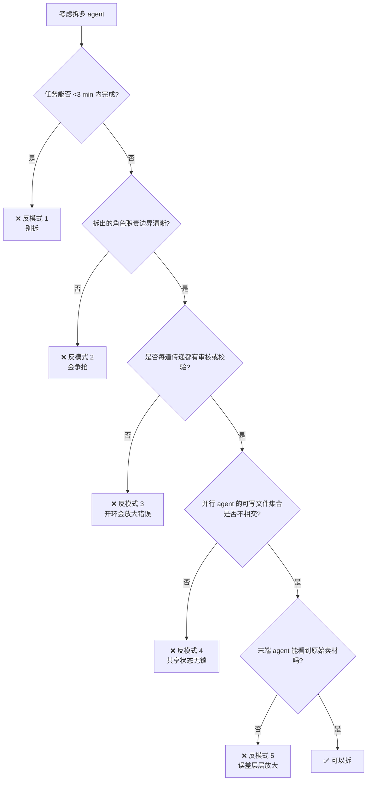

## 起点

「多 agent」最近被讲得几乎等同于「更强的 agent」，一个活儿只要拆出 3–5 个角色就显得更高级。我这套博客流水线一开始也踩过同样的坑——把选题、调研、写作、review、发布拆成五个 subagent，流程图画得漂亮，实际跑起来一天里有一半时间花在「agent 之间翻译来翻译去」上。后来砍回到 2–3 个稳定角色，反而效率翻倍。

这篇和上一篇《single agent vs role split》是姊妹篇：那篇讲「什么时候值得拆」，这篇讲「拆了以后踩过的坑」。5 个反模式我都**自己撞过**，不是看别人吐槽来的。

先看一个真实的 task list，这是当前 sub-agent 调度器的快照：

```text
Background sub-agents:

  task_id        status     elapsed  description
  ----------------------------------------------------------------------
  sa-572e8b76    completed  227      Batch 1: C类4篇
  sa-0b9a118a    completed  200      Batch 2: C类4篇
  sa-8bd98f25    completed  122      Batch 3: A类2篇
  sa-c113d11c    running    28       A批次1: #2/3/4/5
  sa-660e02b0    running    16       A批次2: #6/8/9/10
  sa-0720197a    running    0        B-picorv32+wbuart32 3篇
```

这张表本身就是一个设计决策的结果：6 个 subagent 并行、每个负责 3–4 篇独立文章、文件边界不重叠。如果你看到的是「sa-001 写大纲、sa-002 翻译、sa-003 校对、sa-004 格式化」这种流水线式拆法，下文第一个反模式就会直接命中。

## 反模式 1：短平快任务硬拆

**病状**：一个 3 分钟就能完成的任务被拆成 5 个 agent 协作，每个 agent 各自发 1 次 LLM 调用，结果通信成本（prompt 加载 + 上下文传递 + 串行等待）比执行本身还高。

我真实踩过的一次：给博客加一个 front matter 字段。本来 1 个 agent 扫一次就完了，我拆成「读取所有文章 → 解析 front matter → 补字段 → 写回 → 验证」5 步。跑下来 8 分钟，换成单 agent 一次性干 1 分钟。

**处方**：
- 单文件单改动、逻辑线性、不需要不同视角的任务，**一律不拆**
- 判断标准：如果任务能写成一段 <50 行的脚本，那也能由一个 agent 一轮完成
- 拆分只在「需要多视角（Writer + Reviewer）」「任务天然并行（36 篇博客同时写）」「责任边界显著（代码 / 文档 / 测试）」三种情形下才有价值

## 反模式 2：角色职责重叠导致争抢

**病状**：两个 agent 都「有权」改同一个文件，谁先写谁覆盖，最终产物里一半是 A 的风格一半是 B 的。或者两个 agent 在 review 同一个 diff，给出互相矛盾的建议，让 Writer 无所适从。

典型场景：「架构 Reviewer」和「代码质量 Reviewer」都被允许编辑 `src/auth.py`，前者想重构抽象层，后者想就地加条件判断——两个都很合理，但不能同时做。

**处方**：
- **文件级单写原则**：任一时刻，任一文件只允许一个 agent 写。其他 agent 要改必须通过「发建议 → 主 Writer 执行」路径
- **职责清单显式列出**：每个 agent 的 system prompt 里明写「你只负责 X，任何 Y 的问题交给 agent-Y」
- **Review 分层不分域**：如果一定要多 Reviewer，按**严重性分层**（critical / style / perf），而不是按**覆盖域分块**，这样冲突时有优先级

## 反模式 3：没有 Reviewer 的开环协作

**病状**：Writer-1 的输出直接喂给 Writer-2，Writer-2 的输出直接喂给 Publisher，中间没有任何独立审核。前一步的错误会被下一步原封不动地继承甚至放大。

我最早那版博客流水线就是这样：选题 agent 选错了 topic（重复了已发表文章），下游 Writer 不知情继续写，最后发布出去一篇和半年前几乎一样的文。**开环结构下没人负责说「停一下」**。

**处方**：
- **每道传递都要有 gate**：不是每道都加 Reviewer，但至少要有一个「幂等校验」步骤——前一个 agent 的输出是否满足后一个的输入契约
- **关键节点加独立 Reviewer**：选题、对外发布、涉及安全/合规的改动，必须有独立 agent 看一眼
- **闭环不是加 Reviewer，而是让 Reviewer 有权回退**：Reviewer 如果只能提建议、没有 veto 权，等于没有。我在《Reviewer 角色实战》那篇里给过具体的 prompt 模板

## 反模式 4：共享状态无锁

**病状**：多个并行 agent 写同一个文件 / 改同一个 git branch / 动同一张数据库表，没有锁、没有 worktree 隔离，最后产物是互相覆盖的残骸。

参考上面那张 task list：6 个 subagent 同时跑，**它们之间必须在文件边界上零重叠**，否则最后 `git status` 会显示一堆莫名其妙的 diff，谁也不知道是谁改的。

我踩过的具体场景：两个 subagent 同时被要求更新 `content/学习笔记/code-agent/_topics.md`——一个加 A 类文章、一个加 B 类文章。没用 worktree，两个 agent 各自读了初始版本、各自写回完整版本，后写的那个直接覆盖前一个的改动。`git log` 里那个 commit 看起来没问题，实际丢了一半内容。

**处方**：
- **用 git worktree 隔离**：subagent 的工作区各自独立，最后 merge 进主干
- **共享清单变只读**：`_topics.md` 这类汇总索引由协调者单独写，subagent 只读不改
- **任务级互斥文件清单**：调度器在 spawn 之前显式列出每个 subagent 的可写文件集合，两个集合必须不相交
- **不行就改串行**：某些资源（如 git index、远程仓库）无法隔离，直接串行，不要硬并行

## 反模式 5：错误在 agent 间层层放大

**病状**：Agent-A 有一个小偏差（比如把 `filename.md` 解析成了 `filename`），Agent-B 基于 A 的输出继续工作时把这个偏差当成事实，又产生了更偏的结果，Agent-C 再叠一层……最后末端产物离真相十万八千里。

这个坑的可怕之处是：**每一步看起来都很合理**。没有哪一步是明显的 bug，但累积效应等同于 bug。

我踩过一次：选题 agent 把「FlexNOC NIU 14：OCP」解析成「FlexNOC NIU 第 14 集」，写作 agent 据此以为是系列文，开头就写「接着上一篇……」，Reviewer 也没觉得不对（它没 context），最后发出来就是一篇「上下文错乱」的文章。

**处方**：
- **上下文完整回传**：Agent-B 看到的不是 Agent-A 的输出，而是 Agent-A 的输入 + 输出——让它能自己核对 A 有没有跑偏
- **每层 agent 有独立的原始素材接入**：别让末端 agent 只看中间摘要
- **错误检测逻辑放在早层**：与其让 Agent-C 事后发现不对，不如让 Agent-A 输出前自我校验一次（带一个「我解析到的关键事实」列表，让后续 agent 能比对）

## 该拆不该拆：对比表

| 任务特征 | 建议 | 理由 |
|---|---|---|
| 任务短 (<3 min)、线性 | 不拆 | 通信成本 > 执行成本 |
| 任务长但逻辑单一 | 不拆 | 单 agent 上下文内即可完成 |
| 需要多视角（写 + 审） | 拆 2 个 | Writer + Reviewer 天然互补 |
| 任务天然并行（批量） | 拆 N 个 | 每个 agent 负责一个子任务，边界清晰 |
| 跨域（代码 + 文档 + 测试） | 拆 2-3 个 | 按**文件边界**拆，不按流程步骤拆 |
| 需要反复迭代（生成 + 评估） | 不拆成流水线 | 拆成 **loop** 而不是拆成多角色 |
| 串行依赖强、上下文一致性重要 | 不拆 | 上下文切换成本高于并行收益 |

这张表的核心观察：**「按流程拆」基本都是坑，「按视角 / 按数据边界拆」才有价值**。选题→写作→校对→发布这种流水线形式的多 agent 拆分是最常见的反模式，因为它假设每一步都需要独立智能，但其实大部分流程步骤只是数据搬运，一个 agent 就搞定。

## 反模式检测流程图



## 和《single-agent-vs-role-split》的区别

那篇文章解决的是「这个任务到底该不该拆」的**决策问题**；这篇解决的是「已经决定拆了，哪些具体形态要避免」的**执行问题**。两者配套使用：

- 先用《single-agent-vs-role-split》判断要不要拆、拆几个
- 再用本文 5 个反模式自检现在这个拆法有没有踩坑

我自己的经验：决策问题比执行问题好判断。大多数人直觉上就知道「该拆」还是「不该拆」，但真拆起来往往在职责划分、共享状态、误差传递上一一踩遍。反模式这种东西，**只有真跑过才知道坑在哪**。

## 总结

多 agent 不是越多越高级，拆错了反而比单 agent 还糟。5 个反模式可以压缩成一句话：**拆的是「视角」和「数据边界」，不是「流程步骤」；拆之前想清楚谁能改谁、谁审谁、错了谁兜住**。

回看文章开头那张 task list，6 个 subagent 并行是能跑通的关键条件只有一个：**它们各自的可写文件集合不相交**。这条约束比任何 prompt engineering 都重要。当你下次想画一张气派的多 agent 架构图的时候，先把这一条检查过再说。

---

> 作者：min920（GitHub @wm920） · 本文由 PiCode Agent 自动撰写并经作者审核

<!--
quality-check:
  cmd_output: yes (source: task action=list snapshot of current subagent scheduler)
  diagram: mermaid + 1 对比表
  sections: 起点/5 反模式/对比表/检测流程/差异化/总结
  word_count: ~2400
-->
