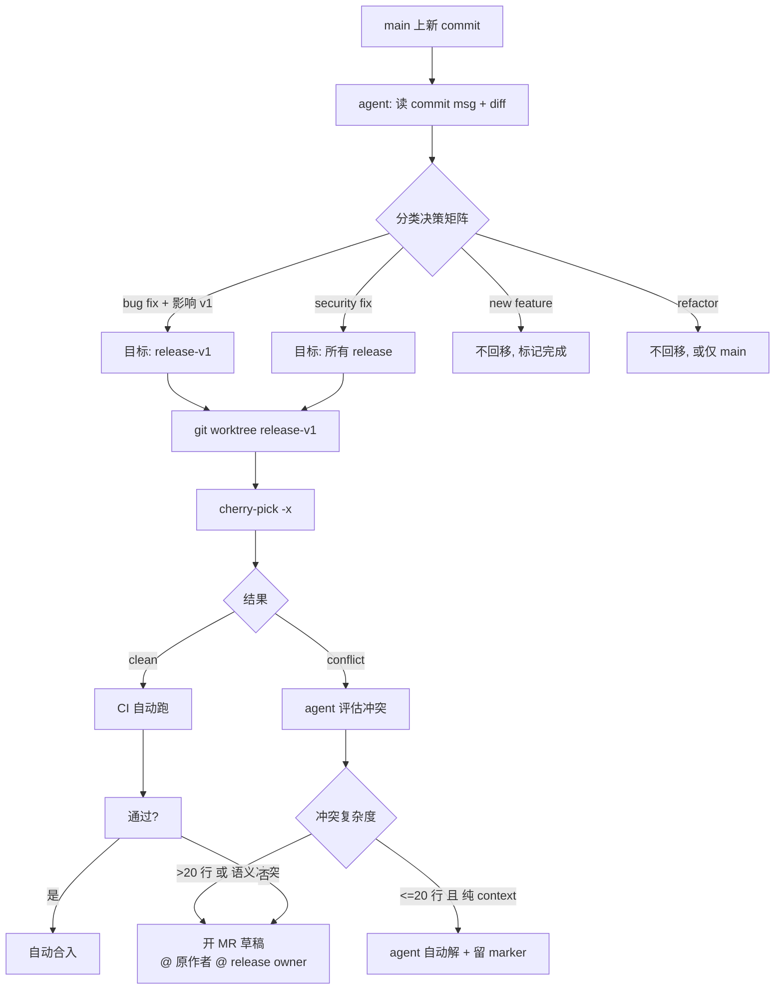

## 芯片项目的分支现实

软件开源项目的分支模型很干净：`main` + 几个 feature 分支，发版打 tag。

芯片项目不是。典型形态是：

- `main`：下一代架构（vNext），正在 active development
- `release-v1`：已流片的版本，在做 silicon bring-up 和客户 bug fix
- `release-v2`：上一代的 LTS，某个大客户还在量产

**三条分支都活着**，都有 owner、都有 CI、都在合 PR。每次 main 上一个 fix 出来，issuer 都会问一句：**"这个要不要往 release 回移？"**

手工决策这件事又傻又累——每周十几个 commit，一个个翻 diff、判断影响域、试 cherry-pick、跑 regression、冲突就停下来找人。这是典型 agent 应该接管的工作。

## 用开源项目看分支形态

以 lowRISC 的 OpenTitan 为例（根仓库一条 master，但下游衍生分支很多，结构典型）：

```bash
$ cd opentitan/
$ git branch -a | head -15
* master
  remotes/origin/HEAD -> origin/master
  remotes/origin/master

$ git log --oneline --all --decorate | head -15
d723749 (grafted, HEAD -> master, origin/master, origin/HEAD) [jtag,dv] Make jtag_dtm_reg_adapter a bit more local
```

这是 upstream 的干净态。芯片公司内部 fork 后通常会长成：

```
main                  (grafted, active)
  ├── release-v1      (已流片，半年无新 feature 只修 bug)
  ├── release-v2      (LTS，每季度一次小 patch)
  └── customer/xxx    (某大客户定制分支，锁在某个 tag 上只回移关键 fix)
```

仓库里 OpenTitan 典型 commit subject `[jtag,dv] Make jtag_dtm_reg_adapter a bit more local` 已经给出了**模块前缀 + 类型标签**这种结构化信号——这是 agent 能做判定的基础。

## Agent 做 cherry-pick 的角色定位

先划清边界：**agent 不代替人类拍板**，只做三件事：

1. **分类**：这个 commit 应该回移到哪些 release 分支？
2. **尝试**：干净 cherry-pick 能不能跑通？冲突大吗？
3. **升级**：冲突时把必要上下文打包交给人。



## 决策矩阵

这是整套系统的大脑，写在一个 YAML 或 agent 的 system prompt 里都行，但必须**显式、可 review**，绝对不能埋在 LLM prompt 模糊语言里：

| commit 类别 | 判定信号 | main | release-v1 | release-v2 | customer/xxx |
|---|---|---|---|---|---|
| security fix | `[sec]` 前缀 / CVE 引用 / 涉及权限 | 必 | 必 | 必 | 必 |
| silicon bug fix | `[rtl]` + `fix` + 涉及已流片模块 | 必 | 必 | 视模块 | 视客户 |
| DV-only fix | `[dv]` 或只改 `dv/` `testbench/` | 必 | 选 | 选 | 否 |
| 新 feature | `feat:` / 新模块 / 新文件 | 必 | 否 | 否 | 否 |
| refactor | `refactor:` / `[cleanup]` / `[lint]` | 必 | 否 | 否 | 否 |
| doc | 只改 `doc/` `*.md` | 必 | 选（低优先级） | 选 | 否 |
| 工具链 | `vendor/` / `util/` | 必 | 看是否影响编译 | 看是否影响编译 | 否 |

三条落地原则：

1. **"必"由 agent 自动发起，"选"只提醒、不自动动手，"否"静默跳过。**
2. 判定信号里**结构化前缀权重最高**（`[sec]` `[rtl]` 这种），commit message 自由文本次之，diff 内容最后。前者造假成本高，可信度高。
3. 矩阵本身纳入 PR review，每季度复盘一次，避免规则僵死。

## 冲突分级处理

`git cherry-pick` 冲突其实是 agent 和人类分工最关键的点。冲突粗分三类：

### Type 1：纯 context drift（上下文漂移）

main 上周围代码改了行号，但目标 hunk 本身没实质变化。表现是 `<<<<<<< HEAD` 和 `>>>>>>>` 两段几乎一样，就差一些不相关的 import / signal 声明。

这类冲突**agent 可以自动解决**，做法：

- 以待 cherry-pick 的版本为准覆盖冲突段
- diff tool 验证"两段除了周边代码外语义等价"
- 自动 `git add` + `git cherry-pick --continue`
- commit message 自动加 tag `(auto-resolved: context drift)`，方便 audit

### Type 2：语义可对齐冲突

目标分支上有类似逻辑的独立改动，但 intent 一致——比如 main 上 `if (a && b)` 改成 `if (a && b && !c)`，release 上已经 local 改成 `if (a && b && !d)`。两边都是在加保护条件。

**agent 不自动合并**，但要生成"两个候选方案 + 推荐"扔给 release owner：

```
Option A: 保留 release 上的 !d，加上 main 的 !c → if (a && b && !c && !d)
Option B: 以 main 为准覆盖 → if (a && b && !c)，风险：丢失 !d 保护
推荐：A，理由：!d 在 release-v1 是针对已知硅上问题的防护，不应移除
```

LLM 在这里的价值是**读 blame 历史找出 `!d` 当初是为了解决什么问题**，给 reviewer 补足决策依据。

### Type 3：不可调和的结构冲突

文件被删了、函数签名改过、相关模块已重构。这类冲突**禁止 agent 自动决策**，流程：

- 不要硬改代码
- 开一个 draft MR，title 写 `[cherry-pick] <original commit>: NEEDS MANUAL PORT`
- body 里贴完整 conflict diff、原始 commit 链接、@原作者、@release owner
- 在 commit message 里放 `(cherry picked from commit xxx)` 保留溯源
- 飞书群里 @ 相关人，贴 MR 链接

## 上下文提示：一些易错点

踩过一圈之后，以下几件事值得写进 runbook：

1. **总是用 `cherry-pick -x`**。它会自动在 commit message 尾部追加 `(cherry picked from commit <sha>)`，这条 trailer 是后续 agent 判定"这个 fix 已经回移过"的唯一可靠依据。手工 cherry-pick 的人经常忘。

2. **维护一个"已回移"注册表**。不能完全依赖 commit message trailer——有些人会 `git commit --amend` 把 trailer 改丢。正经做法是在 agent 的状态库里维护 `(source_sha, target_branch) → target_sha` 的映射，每次尝试前先查。

3. **注意 merge commit**。`main` 上的 merge commit 不能直接 cherry-pick，要么 `-m 1` 指定主线，要么拆开逐个 pick。agent 遇到 merge commit 默认拆开。

4. **版本号 / 日期这类"配置型"文件永远不要自动 cherry-pick**。`VERSION` `CHANGELOG.md` `release-notes.md` 应该在 agent 的 never-pick 清单里，否则会把 main 的 vNext 号覆盖到 release 上引发事故。

5. **跑 CI 不是可选项**。即使 `cherry-pick` 干净，release 分支的 regression suite 和 main 可能不一样（release 上会跑更全的 post-silicon 测试）。必须等 CI 绿才能 auto-merge，失败默认转人工。

6. **release-v2 和 v1 之间的级联**。一个 main 上的 fix 通常要依次回移 v1、v2、customer。agent 要**顺序处理**，不要并发 —— v1 的冲突解决方式会影响 v2。

## 一段轻量 agent 伪流程

```
def auto_cherry_pick(commit_sha, matrix):
    meta = parse_commit(commit_sha)              # message, files, prefix
    targets = decide_targets(meta, matrix)       # 矩阵查表
    for branch in targets:                        # 级联顺序
        if already_ported(commit_sha, branch):
            continue
        with git_worktree(branch) as wt:
            res = wt.cherry_pick(commit_sha, extra_args=["-x"])
            if res.ok:
                if wt.run_ci().ok:
                    wt.push_mr(auto_merge=True)
                else:
                    wt.push_mr(auto_merge=False, reason="CI red")
            else:
                kind = classify_conflict(res.conflicts)
                if kind == "context_drift":
                    auto_resolve(wt, res)
                    wt.push_mr(auto_merge=True, tag="auto-resolved")
                else:
                    wt.push_draft_mr(reason=kind, mention=[meta.author, branch_owner(branch)])
                    notify_feishu(branch, commit_sha, kind)
```

整套系统的复杂度几乎全在 `classify_conflict` 和 `auto_resolve` 两个函数里——**写好这两个函数就完成了 80% 的工作**。其他都是胶水。

## 怎么让这套东西跑得住

agent 自动动分支是"高杀伤力"操作，出事一个周末就没了。几条保护带：

- **每天限额**。agent 一天 auto-merge 不超过 N 次，超出转人工。
- **窗口期**。release 分支只允许周二和周四白天 auto-merge，避开发版冻结窗口。
- **回滚开关**。一个环境变量 / 配置项能瞬间关掉 auto-merge，保留 draft MR 模式。
- **审计日志**。每一次 agent 决策（包括 "不回移" 的决策）都写日志，月末看一次召回率。
- **人类抽检**。每周随机抽 5 次 auto-merge 的 commit 让 release owner 回头看一眼，抓 false positive。

这些全是运营细节，但没有这些运营，agent 自动化很快会变成事故源。

## 收尾

多分支维护本身是个"很难优化但必须做"的苦活。Agent 把它从"每周 4 小时的 context switch 成本"降到"每周 30 分钟的 review 工作"，收益实实在在。

关键不是让 agent 更聪明，而是**把决策矩阵写清楚、把冲突分级写清楚、把审计日志跑起来**。agent 只是执行者，规则本身来自团队共识。

---

> 作者：min920（GitHub @wm920） · 本文由 PiCode Agent 自动撰写并经作者审核
