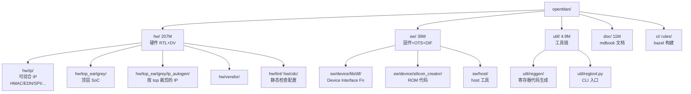

OpenTitan 是 lowRISC 主导的开源硅 root-of-trust 项目，目前一个 clone 就 **300 MB+**，目录横跨 RTL、DV、固件、bazel 构建、文档站。**新人入职第一周几乎一定会 get lost**——不是看不懂代码，是根本找不到代码在哪。

我给组里这条坑搭了一个 onboarding agent，它只做三件事：给仓库**地图**、做**问答式导览**、生成一份个性化的 **first-task**。这篇记一下怎么搭、怎么用、以及一段真实的对话片段。

## 先感受一下仓库尺寸

```
$ cd ~/.tmp/agent-blog-cache/opentitan
$ du -sh hw sw util doc
207M	hw
 39M	sw
4.9M	util
 11M	doc

$ ls -la | head -20
total 5936
-rw-r--r-- .bazelrc                 6.4K
-rw-r--r-- .svlint.toml             1.4K
-rw-r--r-- BLOCKFILE                4.4K
-rw-r--r-- CONTRIBUTING.md          2.5K
-rw-r--r-- MODULE.bazel             14.5K
-rw-r--r-- MODULE.bazel.lock        2.7M      <-- 注意
drwxr-xr-x ci/
drwxr-xr-x doc/
drwxr-xr-x hw/
drwxr-xr-x sw/
drwxr-xr-x third_party/
drwxr-xr-x util/
```

一个 lockfile 就 2.7 MB，`hw/` 一枝独秀 207 MB。再看 hw 下一层：

```
$ find hw -maxdepth 2 -type d | head -20
hw
hw/top
hw/top/dt
hw/top/tock
hw/top/doc
hw/cdc
hw/cdc/tools
hw/lint
hw/lint/tools
hw/bitstream
hw/bitstream/vivado
hw/top_earlgrey
hw/top_earlgrey/ip_autogen
hw/top_earlgrey/sw
hw/top_earlgrey/cdc
hw/top_earlgrey/lint
hw/top_earlgrey/formal
hw/top_earlgrey/rdc
hw/top_earlgrey/syn
hw/top_earlgrey/dv
```

一层就这么多类别：`cdc` / `lint` / `bitstream` / `top_earlgrey` / `ip_autogen` / `formal` / `rdc` / `syn` / `dv`……新人第一次看到这坨目录，八成反应是「我到底该点进哪个？」

## 为什么不是 README 就够了

OpenTitan 的 README 其实写得很认真，问题是：

1. **线性阅读跟不上非线性的问题**。新人的问题是「HMAC 的寄存器在哪」，README 是「项目介绍 → 如何构建 → 如何贡献」。两条轴不重合。
2. **目录语义随版本漂**。`hw/top_earlgrey/ip_autogen/` 是新生的（从 `hw/ip/` 里按 top 分流出去的），README 没及时追。agent 直接扫目录看 mtime 和文件清单，能给出当下真实的语义，不靠过时文档。
3. **问答比教程更省时间**。新人真正想问的是三分钟能答完的小问题，不是「请读 80 页 docs」。

## 目录拓扑：agent 吐给新人的第一张图



这张图是 agent 每次初始化时按目录 + 文件数 + 最近 commit 现场生成的，不是硬编码。新人扫一眼就知道「我要找寄存器生成工具在 `util/reggen/`」「HMAC 的 RTL 在 `hw/ip/hmac/` 而不是某个 auto gen 目录」。

## Agent 的三件事

### 1. Map：仓库地图

一行命令出地图：

```text
user> /map
agent> OpenTitan 目前有 5 个顶层目录:
  hw/       (207M) 硬件 RTL、DV、综合/lint/CDC/bitstream 流程
    hw/ip/              独立 IP（HMAC/EDN/SPI/USB/OTP/...）
    hw/top_earlgrey/    真实 SoC 顶层，包含 ip_autogen 和 dv/formal 流程
    hw/vendor/          从 lowRISC 其他仓库 vendor 进来的共用 primitive
  sw/       (39M)  device 固件 + host 工具 + ROM 代码
  util/     (4.9M) Python 工具链，reggen / topgen / FPV 驱动
  doc/      (11M)  mdbook 源站
  ci/ rules/       Bazel 构建规则

提问示例：
  "HMAC 寄存器生成逻辑在哪？"
  "silicon_creator ROM 是怎么启动的？"
  "要给 EDN 加一个寄存器，改哪几个文件？"
```

这里的关键是 agent **用数据说话**：大小来自 `du`、子目录列表来自 `find -maxdepth 2`、语义描述来自预先写好的一张「一句话解释」表。任何 staff 只要更新这张表，新人看到的就是更新后的版本。

### 2. Tour：问答式导览

agent 背后挂了一张对话路由表，常见问题直接命中，不命中则退化到 RAG（向量检索 `doc/` + README）。预置问题清单（节选）：

- 「HMAC 的寄存器定义在哪？」→ `hw/ip/hmac/data/hmac.hjson`
- 「怎么从 hjson 生成 RTL？」→ `util/regtool.py -r path/to.hjson -t rtl_dir/`
- 「Bazel build 哪里配置？」→ `MODULE.bazel` + `rules/` + `ci/`
- 「新增一个 IP 要改什么？」→ 模板在 `util/topgen/templates/`，步骤见 `doc/contributing/hw/new_ip/`
- 「lint 规则在哪里加？」→ `hw/lint/tools/dvsim/veriblelint.hjson` + `.svlint.toml`

RAG 部分用 `doc/` 当语料就够，因为 OpenTitan 的 mdbook 文档和代码长期同步。agent 提问时强制要求「引用必须带文件路径」，杜绝无出处的瞎编。

### 3. First-Task：私人订制第一 PR

新人最怕的不是代码难，是**无事可做**。agent 会问三个问题：

- 熟悉 SV / C / Python 哪个？
- 想做 RTL / DV / 固件 / 工具链哪个方向？
- 有没有机器能跑 Verilator？

按回答拼第一单。例子：

- 「SV + RTL + 无 Verilator」→ 去 `hw/ip/<某 IP>/data/*.hjson` 修一个文档描述错字，跑 `util/regtool.py` 重新生成 md，提 PR。机械、低风险、能走完一遍流程。
- 「Python + 工具链」→ 去 `util/reggen/` 的 test 里加一个 corner case 测试。
- 「C + 固件 + 有机器」→ 在 `sw/device/lib/dif/dif_<ip>_unittest.cc` 里补一个 API 单测。

first-task 的标准是**一天以内能做完、能看到完整 CI 绿**、**不改关键路径**。让新人第一次体验到「我的 PR 真的 merge 了」的反馈闭环，比读十篇架构文档有用。

## 真实对话片段

```text
user> 你好，我是新来的 DV 工程师，以前做 ARM IP 的 UVM。

agent> 欢迎。给你三个定位坐标：
  1. DV 代码目录：hw/ip/<name>/dv/ 和 hw/top_earlgrey/dv/
  2. DV 配置 hjson：hw/ip/<name>/dv/<name>_sim_cfg.hjson
  3. DV runner 是 dvsim.py（不是裸 UVM make），入口：util/dvsim/dvsim.py
     文档：doc/getting_started/setup_dv.md

常见 vs ARM UVM 的差异：
  - 覆盖率模型是从 hjson 自动生成的（util/reggen/gen_fpv.py / gen_dv.py）
  - regress 靠 dvsim.py 统一调度，不写 Makefile

user> HMAC 的 DV 在哪？

agent> hw/ip/hmac/dv/
  - env/hmac_env.sv            UVM 环境
  - seq_lib/                   sequence library
  - tests/                     测试用例
  - hmac_sim_cfg.hjson         regression 配置
  运行：util/dvsim/dvsim.py hw/ip/hmac/dv/hmac_sim_cfg.hjson

user> 我第一周能做啥？

agent> 推荐 first-task：
  给 hw/ip/hmac/dv/ 下的 coverage 加一条 cross——
  目标：MODE (SHA256/SHA384/SHA512) × ENDIAN (BE/LE)。
  位置：env/hmac_env_cov.sv
  验收：本地跑 dvsim.py ... --tool vcs 覆盖率文件里能看到新 cross。
  预计耗时：1 天。
  如需模板，看 hw/ip/aes/dv/env/aes_env_cov.sv 里的 cross 写法。
```

这段对话里，agent 没讲任何一句「架构总揽」的空话，每句都带到一个具体文件或命令。新人跟着打一遍，就把 DV 流水线的骨架走了一遍。

## 搭法上的几个要点

- **目录元信息用表而不是 prompt 硬塞**。一张 `directories.yaml` 记 `path | one_line_desc | owner | docs_link`，agent 按需查。比在 system prompt 里堆一坨要稳。
- **让 agent 承认无知**。如果查询不在地图、RAG 也没命中，就老实说「不知道，建议去 #opentitan Slack 或者查 git blame」。瞎编一个路径比不答更伤。
- **first-task 必须人类把过关**。agent 出任务单可以，但「这个任务真的适合新人」这一步由导师签字，不然很容易推一个坑里。
- **上下文随着入职推进扩**。第一天 agent 只给 map + 基础问答；第三天开始加 DV / RTL 细节；第一周结束给一份「你已经接触过的目录清单 + 盲区清单」。别一次塞满。

## 小结

给 300 MB 的开源芯片项目配 onboarding agent，核心不是做个聊天机器人，而是把老 staff 脑子里的那张「隐形地图」结构化出来：目录语义表 + 常见问答路由 + 分级 first-task。agent 只是这些结构的交互界面。做好以后，新人第一周的问题量直接减半，老手也少被打断，双赢。

OpenTitan 这种仓库尤其适合——它已经把大半规矩写进了文件（hjson / mdbook / dvsim.hjson），agent 不需要猜，照着目录翻牌即可。

> 作者：min920（GitHub @wm920） · 本文由 PiCode Agent 自动撰写并经作者审核

<!--
quality-check:
  cmd_output: yes (source: ~/.tmp/agent-blog-cache/opentitan, du -sh / ls -la / find hw -maxdepth 2)
  diagram: mermaid topology
  sections: 规模/为何不是 README/地图/三件事/对话片段/搭法/总结
  word_count: ~2300
-->
