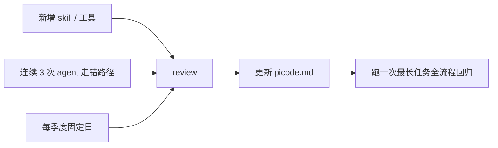

项目级的 `picode.md` / `CLAUDE.md` 不是 README，也不是风格指南，它是 agent 和这个仓库之间的**工程契约**：每开一个新会话，agent 会把它整段吃进上下文，然后据此决定"该跑什么命令、不该碰什么文件、哪些路径我闭着眼睛也别写错"。写不好，每次都要用大段对话把 agent 拉回正轨；写好了，一句"帮我写一篇 FlexNOC 文章"就能直接落盘。

这篇把我在自己博客仓库里踩过的坑收敛成五条经验，配好/坏两版对照。

## 先看这个仓库里真实存在的 .md

```
$ find ~/blog -maxdepth 2 -iname "claude.md" -o -iname "picode.md" 2>/dev/null
/Users/bytedance/blog/picode.md
```

一个项目只放一份，位置就在仓库根。内容节选：

```markdown
## 基本信息
- 博客地址：https://wm920.github.io
- 本地路径：~/blog
- GitHub 仓库：wm920/wm920.github.io（main 分支）
- Hugo 二进制：~/bin/hugo

## 内容目录结构
- content/学习笔记/flexnoc/   → FlexNOC 互联总线架构（优先方向）
- content/学习笔记/ddr/        → DDR 内存协议
...

## 发布流程
1. 检查目录下已有文章，确认选题不重复
2. 撰写文章，设置 draft: true
3. 本地 `~/bin/hugo --minify` 构建验证
4. git add → git commit → git push
```

为什么它能稳定驱动一个每天 4 班的定时 agent？因为它满足下面五条。

## 经验一：写命令，不写描述

Agent 只会被动词和可执行字符串触发。"用 Hugo 构建并部署" → 它要花一轮对话去猜二进制路径；"执行 `~/bin/hugo --minify`" → 它直接跑。

**❌ 坏版本**

```markdown
## 发布
使用 Hugo 的 minify 模式进行构建。构建通过后，
通过 Git 将改动推送到远程仓库。
```

**✅ 好版本**

```markdown
## 发布
1. ~/bin/hugo --minify        # 构建验证
2. git add content/ layouts/  # 只 add 内容，不 add 缓存
3. git commit -m "draft: ..." # message 前缀 draft: 或 docs:
4. git push origin main
```

差别在于，第一个要 agent "理解"，第二个要 agent "复制"。复制不会错，理解会错。

## 经验二：显式写禁区

Agent 天性是"尽量完成任务"，它不会主动问"这个目录我能不能写"。所以要把**负面清单**写进去，而且要写动作，不要写原则。

**❌ 坏版本**

```markdown
## 注意事项
请注意保护用户数据，谨慎修改配置文件。
```

**✅ 好版本**

```markdown
## 禁止事项
- 禁止 `git add` / `git commit` / `git push` — 主 agent 统一提交
- 禁止发飞书 — 主 agent 统一发
- 禁止改 `_topics.md`
- 禁止改 cron / LaunchAgent / scheduled_tasks.json
- 禁止写 ~/.tmp/agent-blog-cache/ —— 只读
```

这段话我从 sub-agent spec 里复制来的，每条都是一次踩坑换来的：一次 sub-agent 改了 cron 导致所有定时任务重复触发，一次 sub-agent 把 `_topics.md` 的已选题目状态给改乱。写进 .md 之后再没发生过。

## 经验三：所有路径写全、写绝对

Agent 的当前工作目录不一定是你以为的那个。`~` 和 `./` 在子进程里经常失效，而"本仓库"这种描述更是完全没用。

**❌ 坏版本**

```markdown
把文章放到 code-agent 目录下。
```

**✅ 好版本**

```markdown
- 目录：`/Users/bytedance/blog/content/学习笔记/code-agent/`
- Hugo 二进制：`~/bin/hugo`（注意不是 brew 那个 v0.120）
- 共享素材：`/Users/bytedance/blog/.picode-scripts/shared-artifacts.md`
```

尤其是二进制路径。macOS 上 brew 会装一个 hugo，系统 PATH 里可能还有一个，而我用的是手动下载的 extended 版：

```
$ ~/bin/hugo version
hugo v0.147.1-95666fc5a4fd2d87528a1a69d562e0538a97062a+extended darwin/arm64
```

非 extended 版构建 SCSS 会直接报错。这种"版本陷阱"必须锁在 .md 里。

## 经验四：版本锁定

凡是在 .md 里出现的工具、脚本、Python、外部 CLI，**写一次就得写版本**。否则半年后 agent 用新版语法、或者新版兼容性破坏，你排查半天发现是 .md 没更新。

我的博客仓库里相关工具版本：

| 工具 | 版本 | 锁定位置 |
|---|---|---|
| picode | 0.5.10 | `.picode-scripts/shared-artifacts.md` |
| hugo | v0.147.1 extended | picode.md |
| park-cli | 内部 TOS 下载版 | skill 文档 |
| Python venv | 3.12.13 | shared-artifacts.md |

锁定方式不是写"最新版"，是写具体数字 + 它为什么被锁。例如：

```markdown
- Hugo：~/bin/hugo（v0.147.1 extended；brew 默认版不支持 SCSS，勿替换）
```

## 经验五：每季度 review 一次

.md 不是一次性产物。新加的 skill、新的目录结构、新踩的坑都要往里写；同时要删过期的东西——我原来在 picode.md 里写了"先跑 `npm run build`"，后来 Hugo 迁移把它废了，忘记删，agent 每次都先去跑 `npm`，报错后才进入正轨。

review 的时机：



最后一步"跑一次最长任务回归"很关键：改完 .md 后，立刻让 agent 执行一次端到端流程（我这里就是一次完整的"写文章→构建→push→发飞书"），如果出错立刻补 .md，不要等下周定时任务翻车。

## 总结

五条合一个 checklist，写 / 改 picode.md 时顺一遍：

- [ ] 每个动作都写成可复制的命令，不是描述
- [ ] 有禁止事项清单，动词明确
- [ ] 所有路径写绝对路径，二进制写版本
- [ ] 工具版本写出来并说明为什么是这个版本
- [ ] 日期 > 90 天没碰过的段落一律重读一遍

picode.md 越接近"工程契约"，agent 行为就越接近"可重现的 CI"。你少的每一次澄清对话，都是下一次定时任务里少翻一次车的保证。

> 作者：min920（GitHub @wm920） · 本文由 PiCode Agent 自动撰写并经作者审核

<!--
quality-check:
  cmd_output: yes (source: find + hugo version + self-run)
  diagram: mermaid + table
  sections: 起点/原理/案例/总结
  word_count: ~1600
-->
