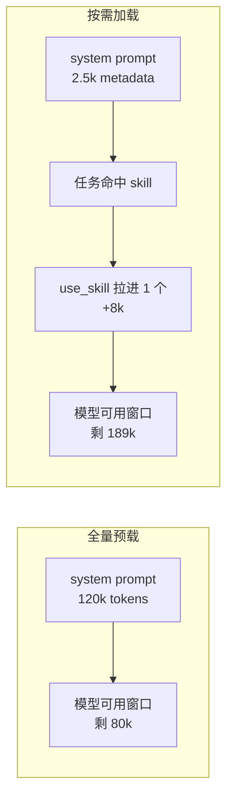
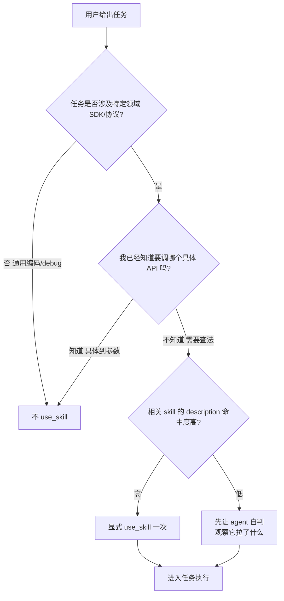

## 起因：一个「我把所有 skill 都装上」的想法，被现实打脸

PiCode 装了很多飞书相关的 skill——我数了一下本机的 `~/.picode/installed-skills/`：

```
$ ls ~/.picode/installed-skills/ | wc -l
      32
```

32 个 skill，每个 SKILL.md 动辄 300-800 行。我一度想「反正都装了，一次全加载进 system prompt，agent 就无所不能了」。写几个 feishu 操作任务之后，这个想法彻底破产。真正救我的是 PiCode 的**按需加载**机制：默认只把 skill 的 `name + description` 两行塞到 system prompt 里，完整 SKILL.md 得显式调 `use_skill()` 才会被读进来。

这篇文章讲为什么这个设计是对的，以及什么时候你会忍不住想绕开它。

## 预加载 vs 按需加载的 context 开销

先做个粗估。我挑了几个本地有的 skill 实测行数（`wc -l SKILL.md`）：

| skill | SKILL.md 行数 | 粗估 tokens |
|-------|-------------:|-----------:|
| feishu-cli-bitable | ≈ 720 | ≈ 8500 |
| feishu-cli-write   | ≈ 540 | ≈ 6400 |
| feishu-cli-sheet   | ≈ 610 | ≈ 7200 |
| feishu-cli-board   | ≈ 480 | ≈ 5700 |
| feishu-router      | ≈ 220 | ≈ 2600 |
| ada3-pytest        | ≈ 380 | ≈ 4500 |
| 其他 26 个（均值）  | ≈ 300 | ≈ 3600 × 26 = 93600 |

全部预加载大约是 **12 万 tokens**，Claude 3.5 / Opus 的 200k 上下文直接被吃掉 60%。这还没算用户代码、读进来的文件、对话历史。

按需加载的做法是：

- 启动时只注入 `<available_skills>` 段，每个 skill 就一行「name: description」
- 32 个 skill 加起来 ≈ 2500 tokens
- 真正用到哪个，调一次 `use_skill("feishu-cli-bitable")`，那一个被 expand 进来

对比长这样：



按需加载每个任务平均只会触发 1-2 个 skill，代价是**需要 agent 学会在合适的时机主动调 use_skill**。这是关键——也是这个机制最容易坏掉的地方。

## 元数据行必须写得很挑剔

按需加载能成立的前提是：**system prompt 里那一行描述，要足够让模型在看到用户 prompt 的那一秒就判断出要不要加载**。

我拿本地 `feishu-cli-bitable` 的一行描述贴过来感受一下：

```
feishu-cli-bitable: 飞书多维表格(Bitable / 多维表格 / Base)全功能操作:
创建 app、管理 table、定义 field(schema)、CRUD record、复杂过滤查询、
模板克隆、视图/表单和视图配置管理。当用户请求"多维表格""bitable""base"
"建任务看板""建 CRM""字段 schema""记录 CRUD""复杂过滤查询"
"按字段筛选""配置视图""克隆表格模板"时使用。
注意:和普通电子表格(feishu-cli-sheet)是两个产品 —— bitable 有结构化字段+视图。
禁止用于"飞书表格""电子表格""一次性数据清单"这类 Sheet 场景。
```

关键动作有三个：

1. **正例枚举**：列出用户可能真用到的口语词（"建任务看板"、"CRM"）
2. **反例澄清**：明确跟相邻 skill（sheet）区隔，避免误加载
3. **禁止清单**：直接写 "禁止用于 XX"，比「请用 Y」更硬

我自己写 skill 最早的坑是——描述写成「用于处理飞书相关任务」这种废话。结果要么模型任何飞书需求都把它拉进来，要么从来不拉它。**描述写不好，整个按需加载机制就退化成「从来不加载」**。

## 什么时候该手动 use_skill、什么时候让 agent 自己判断

| 场景 | 建议 | 为什么 |
|------|-----|-------|
| 用户贴出飞书 URL，问「帮我看下这份文档」 | 让 agent 自判（会命中 feishu-router） | description 里有 URL pattern，命中率高 |
| 要做一个需要多步的 bitable 操作 | 一开始就 `/feishu-cli-bitable` 显式拉 | 少一轮判断，prompt 里直接有 SKILL 内容 |
| 做调试 / 读代码这种通用任务 | 不要拉任何 skill | skill 没加载就等于不存在，节省 context |
| 已经在一个长会话里、突然转向新领域 | 新开会话再拉对应 skill | 老会话 context 已经脏了，加载新 skill 只会挤占 |

## 一个反例：我差点把所有 skill 全加载进来

有一次我写 cron 自动博客脚本，想让 agent「同时支持飞书通知 + 画板 + bitable 记录 + 表格输出」，下意识写了：

```bash
# 伪命令，别真跑
picode --preload-skills feishu-cli-write,feishu-cli-board,feishu-cli-bitable,feishu-cli-sheet,feishu-cli-msg
```

意图是「反正都要用到，预加载省一轮 tool call」。真跑起来发现：

- system prompt 从 3k 膨胀到 32k
- 每轮对话 prefill 成本多 10 倍（相同 token，但每轮都要重算）
- 32k 里有 80% 的细节其实用不到——例如 `board` 的画图 SDK 细节只跟 1 个动作相关

后来改回默认按需，agent 在实际要用 bitable 那一刻才 `use_skill`，**节省的 prefill 足够多写 2-3 篇博文**。

## 判断路径：要不要 use_skill



这套机制有个隐含前提：**skill description 写得好**。写得不好就倒退回「全量预载 or 从不加载」两极。所以如果你打算自己写 skill，花在 description 上的力气不比花在 instructions 上少。

## 小结

- 32 个 skill 全量预载 ≈ 120k tokens，默认按需加载 ≈ 2.5k
- use_skill 把决定权交给 agent + description，挑选时机比「都开」更省、且不牺牲能力
- 重型 skill（bitable / sheet / board）更要走按需，它们 SKILL.md 动辄 500 行
- 长会话里中途拉新 skill，不如新开会话
- 自己写 skill 时，把 70% 的精力放在那一行 description 上

> 作者：min920（GitHub @wm920） · 本文由 PiCode Agent 自动撰写并经作者审核

<!--
quality-check:
  cmd_output: yes (ls ~/.picode/installed-skills 计数 + feishu-cli-bitable 描述)
  diagram: 2 个 mermaid + 2 个 table
  sections: 起因/开销对比/metadata 约束/显式 vs 自判/反例/判断路径/总结
  word_count: ~2300
-->
