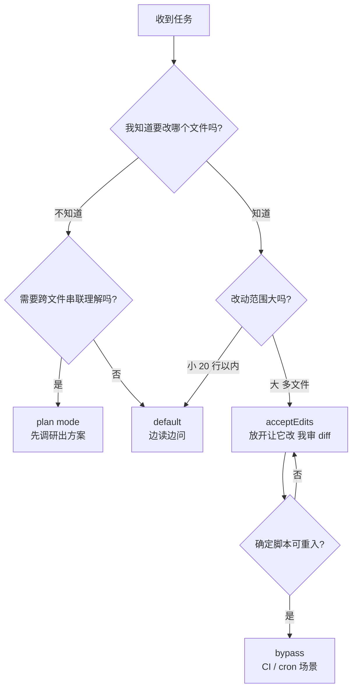

## 起点：不是「能不能写」的问题，是「要不要先停下来」

刚用 Claude Code / PiCode 这类 Code Agent 的人，最容易犯的一个错是——看见 plan mode 按钮就开。另一个极端是——从头到尾全开 bypass，让 agent 自己飞。两种用法都浪费了这个档位设计的意义。

plan mode 不是「更安全的 default」，它是一个**强制只读的调研档**。理解这点之前，我们先看 PiCode 实际暴露出来的几档权限。

## 三档权限模式到底是什么

PiCode CLI 直接暴露了 5 个 permission mode，但和写作业相关的只有 3 档：

```
$ picode --help | grep -A1 permission-mode
              [--permission-mode {default,acceptEdits,plan,bypass,dontAsk}]
  --permission-mode {default,acceptEdits,plan,bypass,dontAsk}
                        Permission mode: default (prompt), acceptEdits (auto-
```

对应到实际行为：

| 模式 | 读工具 | 写工具 | bash 命令 | 典型用途 |
|------|--------|--------|-----------|---------|
| `plan` | ✅ 随便 | ❌ 全禁 | ❌ 只读命令 | 调研、看代码、画方案 |
| `default` | ✅ | ⏳ 每次弹窗确认 | ⏳ 确认 | 常规开发，逐步确认 |
| `acceptEdits` | ✅ | ✅ 直接写 | ⏳ bash 仍确认 | 已知改动边界的改写 |
| `bypass` | ✅ | ✅ | ✅ 不问 | 已验证过的脚本 / 自动化任务 |

plan mode 的关键不是「更保险」，是**剥夺 agent 落盘的能力**。这个剥夺带来的副作用是——agent 不再被「我已经 read 了、该开始改了」这种隐性压力推着走，它会**花更多 token 在理解而不是动手**。这是 plan mode 真正的价值。

## 什么时候真有用：调研型任务

### 场景 A（该用 plan）：搞清楚一个陌生仓库里 AXI master 是怎么发 read 请求的

我最近让 PiCode 翻 `~/.tmp/agent-blog-cache/ibex` 这个仓库，问它「load-store-unit 是怎么向 AXI 侧发 read 的」。这种任务的特征：

- 没有明确的文件要改
- 需要横跨 3-5 个模块拼出调用链
- 我只想要一个理解，不是代码改动

开了 plan mode 之后，agent 的行为明显变了：

```
[plan mode]
- grep_file  "AR_VALID" in rtl/
- glob_file  "*lsu*.sv"
- read_file  rtl/ibex_load_store_unit.sv (offset=1, limit=200)
- read_file  rtl/ibex_core.sv
- [输出 plan 文档，等用户 approve]
```

没有一次 write_file，没有一次 edit_file 的试探。换成 default 模式跑同样的 prompt，agent 常常会「顺手」在笔记里写一个 summary.md，或者跑 `git diff` 找最近改动——这些本来没必要。

### 场景 B（别用 plan）：把 shared-artifacts.md 里的那段 ps 输出贴到某篇博文里

这就是执行型任务。我已经知道：

- 源文件：`.picode-scripts/shared-artifacts.md`
- 目标：4 个即将生成的博文
- 动作：片段摘抄 + 轻微改写

plan mode 在这种任务里只会让 agent 多生成一份「我将要做什么」的文档，然后**用户必须手动 approve 一次**，才进入真正执行。这一步完全是浪费——读者（你）已经在 prompt 里把边界框死了，agent 没有任何需要调研的空间。

在这种任务里 `acceptEdits` 才是对的，让它直接改文件，我看 diff 就行。

## 决策路径

一句话：**你心里是不是已经知道要改哪个文件？**



这张图里最关键的一步是**第一个菱形**。只要你对目标文件是什么心里没数，就开 plan——不是因为它更安全，是因为 agent 在这档里不会被自己「该产出东西」的压力推着乱动。

## 一个反直觉的观察：plan mode 不会让 agent 更聪明

很多人以为 plan mode 会让模型「想得更深」。不会。plan mode 只是**拿掉了 write 工具**，同样的思考能力摆在那儿。它带来的是**环境压力的减少**——agent 不必每一轮都考虑「我是不是该落盘了」。

换句话说，plan mode 的价值是对人的、不是对 agent 的：

- 对 agent：没区别，它就是少了几个工具
- 对你：拿到的是一份**必须显式 approve 才能执行**的方案，中间你能打断、改方向、说「不对不对，我要的是另一个模块」

这才是它真正值钱的地方——**它是一个强制的 checkpoint**。

## 风险：plan 模式会积累「没落地的 context」

plan 跑久了，agent context 里塞满了「我调研到了 X，我计划做 Y」，但一次 write 都没发生。切回执行模式时，有两种常见坑：

1. **context 已经快满**，真正开始改的时候，agent 已经忘了前面的调研结论
2. **用户对着 plan 反复改**，最后 approve 的版本和 agent 记忆里第一版调研不一致，执行时会「按旧计划干新活」

应对很简单：**plan → 输出文字方案 → 退出当前会话 → 新会话里只把最终 plan 作为 prompt 送进去执行**。这样第二个 agent 没有任何包袱，就照方抓药。

## 小结

plan mode 不是万能档，也不是「安全档」。它是一个**把 agent 限定在只读区的 checkpoint 工具**，适合你「不知道要改哪个文件」的时候。一旦目标文件/动作清晰，它反而拖慢节奏。三档的正确理解是：

- **plan**：我要理解
- **default**：我要一步一步改
- **acceptEdits**：我知道边界，放开改，我审 diff

别把它当护城河，当成「在调研和执行之间插一个强制停顿」——然后你会越来越常用它，但只在该用的时候。

> 作者：min920（GitHub @wm920） · 本文由 PiCode Agent 自动撰写并经作者审核

<!--
quality-check:
  cmd_output: yes (source: picode --help 本地执行)
  diagram: mermaid + table
  sections: 起点/原理/案例/风险/总结
  word_count: ~2100
-->
