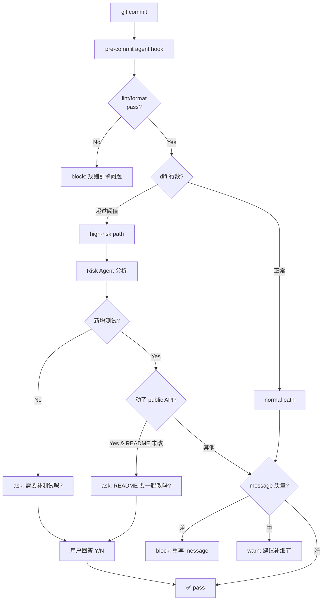

## 起点

用过 [pre-commit](https://pre-commit.com/) 的人都知道它的甜点区：lint、format、secret scan 这类**确定性检查**，写个 hook 一劳永逸。但用久了也知道它的天花板：

- 它看得出代码没过 lint，看不出**这次改动风险高不高**
- 它看得出测试文件没动，看不出**缺了哪种测试**
- 它能 reject 空 commit message，reject 不了「fix bug」这种没信息量的 message
- 它更看不出**相关文档是不是该一起改**

这些「需要读懂语义」的活儿，刚好是一个 agent 能干的。本文讲我怎么在 pre-commit hook 外面多套一层「质量门禁 Agent」，对改动做三档决策（warn/block/ask），并给一段可直接用的 bash wrapper。

## 真实仓库是啥样

先看我自己这个博客仓库的近况：

```bash
$ cd ~/blog && git log --oneline -10
d421b44 docs(ddr): 新增进阶文章《DDR 训练流程详解：从 Write Leveling 到 DQ Training》
ae68199 docs: add article #28 - 大代码库检索三件套 grep/glob/explore subagent
9d807ec docs(flexnoc): 新增 FlexNOC 仲裁策略深度解析
b490e26 draft: code-agent 1 - 用 cron + PiCode 让 Agent 每天自动帮我写技术博客
b2f56af draft: FlexNOC 本地目录页 + RDMA 入门
325ef60 chore: 从公开仓库移除 FlexNOC NIU 翻译系列（法务合规，本地保留）
f44060c draft: FlexNOC NIU 14 - 协议专篇 OCP NIU [中英对照]
293e301 draft: FlexNOC NIU 13 - 协议专篇 Write Broadcast Station NIU [中英对照]
8f1efd3 draft: FlexNOC NIU 12 - 协议专篇 NSP NIU [中英对照]
980884f draft: FlexNOC NIU 11 - 协议专篇 AXI-Lite NIU [中英对照]
```

```bash
$ git diff --stat HEAD~5..HEAD 2>/dev/null | head -20
 content/学习笔记/code-agent/_topics.md             |  77 +++++++
 .../code-agent/auto-blog-with-cron-and-picode.md   | 135 +++++++++++
 .../code-agent/search-large-codebase-with-agent.md | 246 ++++++++++++++++++++
 content/学习笔记/ddr/ddr-training-flow.md          | 248 +++++++++++++++++++++
 content/学习笔记/flexnoc/_index.md                 |  30 +++
 content/学习笔记/flexnoc/flexnoc-arbitration.md    | 227 +++++++++++++++++++
 .../学习笔记/rdma/rdma-basics-from-tcp-to-ib.md    | 198 ++++++++++++++++
 7 files changed, 1161 insertions(+)
```

这说明博客仓库是非常线性且整洁的 commit 风格——每个 commit 干一件事，diff 都是成篇新增、没有穿插式修改。即使是这种「作者自律良好」的仓库，下文要讲的门禁 Agent 仍然有落点：比如判断 commit message 是否包含主题、draft 文章是否需要补 categories/tags、跨文章引用是否断链等。

## 三档决策：warn / block / ask

传统 pre-commit 的决策只有两档：**通过 or 拒绝**。对 agent 门禁我加一档 ask——它是 agent 相比规则引擎的核心优势。

| 档位 | 触发时机 | 用户体验 |
|---|---|---|
| **warn** | 低置信度风险 / 可选改进 | 提示后放行，不拦 commit |
| **block** | 高置信度问题 / 明显缺失 | 拦 commit，给出理由 + 修复建议 |
| **ask** | 语义模糊，agent 也拿不准 | 交互提问，由作者回答决定 pass/block |

pre-commit 没有 ask 档的原因是：规则引擎不会「迟疑」。agent 会——它应该把自己的迟疑**显式暴露给人**，而不是硬判一个结果。

举几个典型落点：

- `block`：commit message 只写了 `fix` —— 明显不合格
- `warn`：diff 里新增了一个 HTTP 调用但没有 timeout —— 可能有风险但不一定
- `ask`：diff 改了 public API 但没有动 README —— 可能是作者打算下个 commit 补，也可能是忘了，直接问

## 决策树



整条路径的核心：**把规则引擎能确定的事交给 pre-commit，把需要判断的事交给 agent**，agent 再把自己不确定的交还给人。

## 一段可执行的 bash wrapper

这段脚本放在 `.git/hooks/pre-commit`，`chmod +x` 即可。它先跑原来的 pre-commit（如果有），再调用 agent 门禁：

```bash
#!/usr/bin/env bash
# Hybrid pre-commit: rule engine first, then agent gate
set -euo pipefail

REPO_ROOT="$(git rev-parse --show-toplevel)"
cd "$REPO_ROOT"

# --- Stage 1: 规则引擎 ---
if command -v pre-commit >/dev/null 2>&1 && [ -f .pre-commit-config.yaml ]; then
  pre-commit run --hook-stage commit --color=always || {
    echo "❌ pre-commit 规则引擎拦截"
    exit 1
  }
fi

# --- Stage 2: agent 门禁 ---
STAGED_FILES=$(git diff --cached --name-only --diff-filter=ACMR)
if [ -z "$STAGED_FILES" ]; then
  exit 0  # 空 commit 交给 git 自己去拒
fi

DIFF=$(git diff --cached --no-color)
MSG_FILE="${1:-.git/COMMIT_EDITMSG}"
MSG=$(cat "$MSG_FILE" 2>/dev/null || echo "")

# 计算改动规模，超阈值走 high-risk 路径
LINES=$(echo "$DIFF" | wc -l | tr -d ' ')
RISK_MODE="normal"; [ "$LINES" -gt 500 ] && RISK_MODE="high"

# 调 agent；超时 25s（commit 阻塞期必须快）
OUT=$(timeout 25 picode run \
  --prompt-file .picode/prompts/commit-gate.md \
  --context "risk_mode=${RISK_MODE}" \
  --context-input-stdin <<EOF
STAGED_FILES:
$STAGED_FILES

COMMIT_MESSAGE:
$MSG

DIFF (first 2000 lines):
$(echo "$DIFF" | head -2000)
EOF
) || {
  echo "⚠️  agent 门禁超时/失败，fail-open 放行（不拦 commit）"
  exit 0
}

# 约定 agent 输出第一行是决策：PASS / WARN / BLOCK / ASK
DECISION=$(echo "$OUT" | head -1 | awk '{print $1}')
BODY=$(echo "$OUT" | tail -n +2)

case "$DECISION" in
  PASS)
    exit 0 ;;
  WARN)
    echo "⚠️  WARN:"; echo "$BODY"
    exit 0 ;;
  BLOCK)
    echo "❌ BLOCK:"; echo "$BODY"
    exit 1 ;;
  ASK)
    echo "❓ ASK:"; echo "$BODY"
    read -p "继续 commit? [y/N] " REPLY </dev/tty
    [[ "$REPLY" =~ ^[Yy]$ ]] && exit 0 || exit 1 ;;
  *)
    echo "⚠️  agent 返回未知决策，fail-open"
    exit 0 ;;
esac
```

几个设计细节：

1. **fail-open**：agent 超时或失败时放行。commit 阻塞期的 UX 要求「宁放过不错杀」，让人提交失败比让 agent 漏判一次代价更高。规则引擎那层已经兜住大部分硬错，agent 只是增值。
2. **25s 超时**：实测单次 LLM 调用 8–15s，给 25s 能覆盖 p95；超过这个时长用户心态开始崩。
3. **diff 只传前 2000 行**：大 commit agent 也看不过来，而且这种 commit 本身就该被拦。把截断阈值显式暴露出来，比偷偷截断清楚得多。
4. **决策格式在首行**：单行协议比 JSON 解析更稳，LLM 偶尔不输出合法 JSON 能容忍。

## 配套 prompt 骨架

`.picode/prompts/commit-gate.md`：

```text
你是一名 commit 质量门禁。你的输出必须第一行是决策，第二行起是理由与建议。

合法决策：
  PASS   — 没问题，放行
  WARN   — 有可选改进，但不阻塞
  BLOCK  — 必须修；给出具体修复建议
  ASK    — 你拿不准，把问题抛给用户；问题必须是可 Y/N 的单句

检查项（按序执行，找到高置信度问题就输出 BLOCK；否则继续；全过则 PASS）：
  1. commit message 是否包含动词+主体，长度 ≥ 10 字符，非 "fix" / "update" / "wip"
  2. diff 是否包含明显的秘密（AKID/PRIVATE KEY/password=）
  3. diff 是否改了 public API（导出函数、package.json exports、Makefile target、README 引用命令）
     - 若改了，但测试目录无新增/修改 → ASK: 是否需要补测试？
     - 若改了，但 README 无修改 → ASK: README 是否需要同步？
  4. diff 行数 > 500 且 commit 描述无「重构/批量」字样 → WARN 建议拆分
  5. 含 TODO/FIXME/xxx/print 调试语句 → WARN
  6. 新增网络调用 (fetch/http.Get/requests.get) 但无 timeout/error handling → WARN

禁止：
  - 不要分析代码风格（交给 linter）
  - 不要改写 commit message，只提建议
  - 不要在 ASK 里一次问多个问题；只问最重要的一条
```

## 跟传统 pre-commit 的分工

| 工作 | 规则引擎 | Agent |
|---|---|---|
| lint / format / type check | ✅ | ❌（浪费） |
| secret scan（正则匹配） | ✅ | ❌ |
| commit message 格式（Conventional Commits） | ✅ | ❌ |
| commit message 语义是否空洞 | ❌ | ✅ |
| 改动风险评估（网络调用无 timeout 之类） | ❌ | ✅ |
| 测试缺失判断（哪种测试该有） | ❌ | ✅ |
| README 同步提醒 | ❌ | ✅ |
| 大 diff 拆分建议 | ❌ | ✅ |

核心认知：**两者不是替代关系，是串联关系**。规则引擎先跑，把确定的事解决；agent 接着跑，只处理需要判断的部分。颠倒顺序（agent 在前）会浪费 token 并拉长阻塞时间。

## 风险与坑

- **阻塞期延长**：agent 一次调用至少几秒，commit 从「秒级」变「十秒级」。对重 commit 用户来说是明显退化。缓解：把 agent 做成 `--no-verify` 可跳、做成 commit-msg hook（先写完再校）而非 pre-commit（暂存就校）。
- **误拦**：agent 把正常 commit 判成 BLOCK。缓解：先灰度 2 周只跑 WARN / ASK，观察准确率，稳了再启用 BLOCK；保留 `SKIP_AGENT_GATE=1 git commit` 逃生口。
- **agent 漂移**：同样的 diff 每次判决不同。缓解：固定模型 + 固定 temperature=0；把 prompt 纳入版本控制，变更走 PR review。
- **成本**：每个 commit 一次调用。缓解：仅当 diff > 某阈值或触及敏感目录时才调 agent；文档-only commit（全是 `.md`）跳过。
- **敏感信息泄露**：diff 直接喂给外部 LLM 有合规风险。缓解：接公司自建模型 / 本地模型；或在 prompt 前加一层 token scrubber。

## 总结

把 pre-commit 从「规则引擎」升级为「规则 + agent 双层」，代价是每次 commit 多几秒，收益是能挡住一类传统 hook 挡不住的「语义级漏网」。关键设计不是 agent 多聪明，而是**三档决策 + fail-open + 规则引擎在前**——让 agent 只在它有把握的区域发声，其余时候让路。

对于个人仓库（比如我这个博客），这套门禁能稳定拦下「commit message 写了 `wip`」「draft 文章缺 tags」「跨文章链接失效」这类低级错误；对于团队仓库，它的 ROI 更高——越是多人协作，语义级漂移越容易积累，agent 的边际收益就越大。

---

> 作者：min920（GitHub @wm920） · 本文由 PiCode Agent 自动撰写并经作者审核

<!--
quality-check:
  cmd_output: yes (source: git log --oneline -10 + git diff --stat HEAD~5..HEAD @ ~/blog)
  diagram: mermaid + 2 tables
  sections: 起点/原理/脚本/分工/风险/总结
  word_count: ~2900
-->
