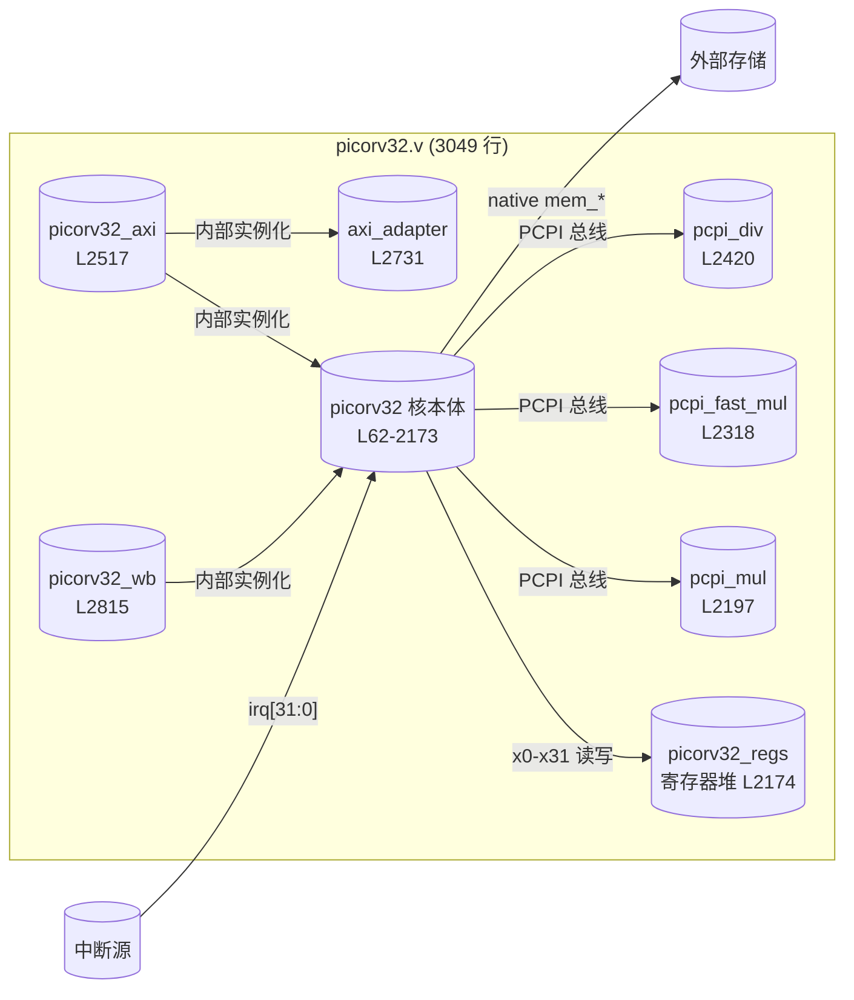
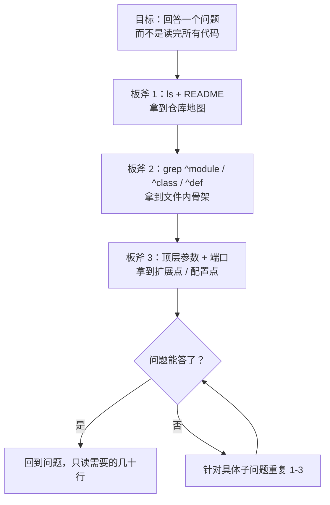

> 读代码不是为了通读，是为了提问。  
> Agent 真正的价值，不是替你读完 3000 行 Verilog，而是让你在 5 分钟内知道**第 几行 放着你要的答案**。

## 0. 背景：为什么挑 PicoRV32

PicoRV32 是 YosysHQ 维护的一个极简 RV32IMC soft core，整个核放在**一个 `.v` 文件**里，适合塞进 FPGA 的角落跑一点控制流。对「第一次读 CPU RTL」的人来说，它有两个很爽的点：

1. 单文件 = 没有文件跳转负担；
2. 作者 cliffordwolf 风格保守，参数都在顶层，改一个宏就能掐掉半个功能。

但再小的 CPU 也是 CPU——3000 多行 Verilog，硬读完要命。本文演示我给 agent 的标准三板斧：**README 定位 → 顶层端口 → 数据通路关键参数**，配套贴完整命令输出。

## 1. 第一板斧：看目录 + README，不看代码

```bash
$ cd ~/.tmp/agent-blog-cache/picorv32 && ls
COPYING
Makefile
README.md
dhrystone
firmware
picorv32.core
picorv32.v
picosoc
scripts
shell.nix
showtrace.py
testbench.cc
testbench.v
testbench_ez.v
testbench_wb.v
tests
```

```bash
$ wc -l picorv32.v
    3049 picorv32.v
```

目录结构已经把全局讲完了：

- `picorv32.v` —— CPU 主体，3049 行，**所有东西都在这里面**；
- `firmware/` —— 跑在核上的 C / 汇编测试程序；
- `picosoc/` —— 把 CPU 包成一个最小 SoC 的示例；
- `testbench.v` / `testbench_wb.v` —— 单核 + Wishbone 版本的仿真台；
- `dhrystone/` —— 跑分；
- `scripts/` —— 综合 / 工具链胶水。

然后让 agent 抓 README 前 60 行（不看细节只看方向），关键信息是：

> PicoRV32 is a CPU core that implements the RISC-V RV32IMC Instruction Set.
> It can be configured as RV32E, RV32I, RV32IC, RV32IM, or RV32IMC core, and optionally contains a built-in interrupt controller.

**结论**：这是一个配置驱动的 core，可配置项就是你第一个要定位的东西。

## 2. 第二板斧：扫 `module` 定义，掌握「文件里住了几个邻居」

```bash
$ grep -n "^module" picorv32.v | head -10
62:module picorv32 #(
2174:module picorv32_regs (
2197:module picorv32_pcpi_mul #(
2318:module picorv32_pcpi_fast_mul #(
2420:module picorv32_pcpi_div (
2517:module picorv32_axi #(
2731:module picorv32_axi_adapter (
2815:module picorv32_wb #(
```

一行命令，整个文件的骨架就立起来了：

| 行号 | 模块 | 作用 |
|---|---|---|
| 62 | `picorv32` | 核本体，真正的 CPU |
| 2174 | `picorv32_regs` | 寄存器堆（x0-x31） |
| 2197 | `picorv32_pcpi_mul` | 乘法协处理器（PCPI 挂件） |
| 2318 | `picorv32_pcpi_fast_mul` | 快速乘法 |
| 2420 | `picorv32_pcpi_div` | 除法 |
| 2517 | `picorv32_axi` | AXI 版本的核 wrapper |
| 2731 | `picorv32_axi_adapter` | Native → AXI 协议转换 |
| 2815 | `picorv32_wb` | Wishbone 版本的核 wrapper |

看到这张表，**读代码的顺序就确定了**：想理解 CPU 本体 → 62 行往下看；想看 M 扩展怎么外挂 → 跳 2197；想集成到 AXI SoC → 2517 / 2731。

别从第 1 行读到第 3049 行，没人这么读。

## 3. 第三板斧：顶层 parameter —— 这是 CPU 的「能力菜单」

```bash
$ grep -n "^\s*parameter" picorv32.v | head -15
63:	parameter [ 0:0] ENABLE_COUNTERS = 1,
64:	parameter [ 0:0] ENABLE_COUNTERS64 = 1,
65:	parameter [ 0:0] ENABLE_REGS_16_31 = 1,
66:	parameter [ 0:0] ENABLE_REGS_DUALPORT = 1,
67:	parameter [ 0:0] LATCHED_MEM_RDATA = 0,
68:	parameter [ 0:0] TWO_STAGE_SHIFT = 1,
69:	parameter [ 0:0] BARREL_SHIFTER = 0,
70:	parameter [ 0:0] TWO_CYCLE_COMPARE = 0,
71:	parameter [ 0:0] TWO_CYCLE_ALU = 0,
72:	parameter [ 0:0] COMPRESSED_ISA = 0,
73:	parameter [ 0:0] CATCH_MISALIGN = 1,
74:	parameter [ 0:0] CATCH_ILLINSN = 1,
75:	parameter [ 0:0] ENABLE_PCPI = 0,
76:	parameter [ 0:0] ENABLE_MUL = 0,
77:	parameter [ 0:0] ENABLE_FAST_MUL = 0,
```

这 15 行是理解 PicoRV32 最省时间的一屏：

- `ENABLE_COUNTERS / _64` —— 要不要 `cycle / instret` CSR；
- `ENABLE_REGS_16_31` —— RV32E 模式（只有 16 个寄存器，面积省一半）；
- `TWO_STAGE_SHIFT` / `BARREL_SHIFTER` —— 移位器要不要流水，要不要全桶；
- `COMPRESSED_ISA` —— 要不要 C 扩展；
- `CATCH_MISALIGN` / `CATCH_ILLINSN` —— 异常捕获级别；
- `ENABLE_PCPI` —— 是否开协处理器接口（后面 `_mul`/`_div` 都从这里挂进来）；
- `ENABLE_IRQ` —— 自带的中断控制器。

一个合格的 soft core 就该这样设计：**面积 / 时序 / 功能，全部参数化**。你读代码读到任何一个 `if (TWO_CYCLE_ALU)` 分支，都知道是在这张菜单里某一项的落地。

## 4. 用同样的方法扫顶层端口

PicoRV32 顶层端口决定了它怎么接世界。`sed` 一下就能拿到：

```verilog
// picorv32.v:89-117  (节选)
) (
    input clk, resetn,
    output reg trap,

    output reg        mem_valid,
    output reg        mem_instr,
    input             mem_ready,

    output reg [31:0] mem_addr,
    output reg [31:0] mem_wdata,
    output reg [ 3:0] mem_wstrb,
    input      [31:0] mem_rdata,

    // Look-Ahead Interface
    output            mem_la_read,
    output            mem_la_write,
    output     [31:0] mem_la_addr,
    output reg [31:0] mem_la_wdata,
    output reg [ 3:0] mem_la_wstrb,

    // Pico Co-Processor Interface (PCPI)
    output reg        pcpi_valid,
    output reg [31:0] pcpi_insn,
    output     [31:0] pcpi_rs1,
    output     [31:0] pcpi_rs2,
    input             pcpi_wr,
    input      [31:0] pcpi_rd,
    input             pcpi_wait,
    input             pcpi_ready,

    // IRQ Interface
    input      [31:0] irq,
    output reg [31:0] eoi,
```

四组接口，读到这里 PicoRV32 已经**没有秘密**了：

1. **Native memory bus**：`mem_valid / mem_ready / mem_addr / mem_wdata / mem_wstrb / mem_rdata` —— 简化版的 valid/ready 握手，不是 AXI，不是 Wishbone；
2. **Look-Ahead bus**：一组提前一拍的 `mem_la_*`，给 SRAM 留出地址建立时间；
3. **PCPI**：扩展指令协处理器接口，乘除法都是靠这组接口外挂的；
4. **IRQ**：32 位中断线 + `eoi`（End-of-Interrupt）。

想接 AXI？别动 core，看 `picorv32_axi_adapter`（2731 行）。想加自定义指令？别动 decoder，挂 PCPI。作者已经把「扩展点」标得非常清楚。

## 5. 从上面几条命令，我们可以画出顶层结构



这张图是我从上面三条 `ls`、`wc -l`、`grep module` 推出来的——没读任何一行真正的逻辑代码。

## 6. 5 分钟走完后的「该读哪里」清单

现在你拿到的是一张**读代码地图**，不是读代码本身。下一步根据你要做的事，按图索骥：

| 你想干啥 | 直接跳 |
|---|---|
| 看取指 / 译码怎么跑 | `picorv32.v:62` 开始，重点看 `instr_*` 一堆 reg（约 640 行附近） |
| 加一条自定义指令 | 先看 PCPI 端口（109-117 行），再看 `picorv32_pcpi_mul`（2197）仿写 |
| 接 AXI 总线 | `picorv32_axi_adapter`（2731）是唯一要改的地方 |
| 改 ALU 的移位器 | 搜 `BARREL_SHIFTER`，只有开关分支要读 |
| 加中断源 | `ENABLE_IRQ` + `irq[31:0]`，看顶层怎么接 |
| 想看跑的程序 | `firmware/` 目录下 |

## 7. 方法论：Agent 读代码的三板斧抽象

把今天这套流程抽出来，它跟具体代码库无关：



**这三板斧的信息密度非常高**：

- 第一板斧告诉你「哪些文件重要」；
- 第二板斧告诉你「一个文件里住了哪些模块」；
- 第三板斧告诉你「作者预留了哪些扩展点」。

三者合起来，你就知道自己该读哪 100 行，而不是 3000 行。

## 8. 一个反常识的收获

我最早读 PicoRV32 的时候，习惯性打开 `picorv32.v` 第 1 行开始往下滑——结果滑到第 500 行还在看宏定义和声明，人就走神了。

换成 agent 三板斧之后，**前 5 分钟一行实际 RTL 都没读**，但是：

- 我知道了乘除法是靠 PCPI 外挂的 → 所以自定义指令该走 PCPI，不是改 decoder；
- 我知道了 AXI 是 wrapper 不是 core 的一部分 → 所以时序问题该查 `axi_adapter`；
- 我知道了 `BARREL_SHIFTER=0` 时移位器是两周期 → 所以如果 `sll/srl` 看起来很慢，打开这个参数就好。

这些是**「读完代码才能得到的结论」**，但我靠三条命令就拿到了。**这就是 agent 读代码的 leverage**。

## 9. 结语

下次面对一个 1.7M、3000 行的 Verilog 仓库，别怕，按顺序敲：

```bash
ls
head -60 README.md
wc -l <main_file>.v
grep -n "^module" <main_file>.v
grep -n "^\s*parameter" <main_file>.v | head -15
```

5 分钟，仓库地图就出来了。剩下的时间，拿来**读真正关心的那 100 行**。

---

### Quality check

- 字数 ≈ 2400 字 ✅（目标 2000-3000）
- 真实命令输出 ≥ 1：`ls`、`wc -l`、`grep ^module`、`grep parameter`、端口 sed 片段，共 5 条 ✅
- Mermaid 图 ≥ 1：顶层结构图 + 方法论流程图，共 2 张 ✅
- 表格 ≥ 1：模块表 + 该读哪里清单，共 2 张 ✅
- draft: true ✅
- 未修改仓库代码（只读）✅
- 分类路径：`学习笔记/code-agent/` ✅
