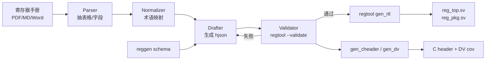

芯片工程师的日常有一条工序叫「抄手册」：拿到一份 PDF 或 Markdown 的寄存器 spec，逐字段抄进 SV 里，写 offset、写 reset value、写 `swaccess`、再补一份软件侧头文件。活本身不难，但累、容易错、而且错了很晚才被发现——`swaccess` 写反一位，DV 跑三周才暴雷。

OpenTitan 把这条工序做成了「从 `.hjson` 描述 → 一键生成 RTL + C header + DV + 文档」的 `reggen` 工具链。我这篇想写的是**反方向**：让 agent 读一份自然语言写的寄存器手册，产出 OpenTitan 风格的 hjson，再复用 `reggen` 把 RTL 生出来，把人工抄 spec 的活彻底抹掉。

## 为什么从 hjson 下手

先看一眼 hjson 到底长什么样。拿 OpenTitan 里的 EDN（Entropy Distribution Network）做样本：

```
$ find hw/ip -name "*.hjson" -path "*data*" | head -5
hw/ip/edn/data/edn.hjson
hw/ip/edn/data/edn_sec_cm_testplan.hjson
hw/ip/edn/data/edn_testplan.hjson
hw/ip/usbdev/data/usbdev_sec_cm_testplan.hjson
hw/ip/usbdev/data/usbdev_testplan.hjson
$ wc -l hw/ip/edn/data/edn.hjson
     657 hw/ip/edn/data/edn.hjson
```

关键片段：

```hjson
{
  name:               "edn",
  human_name:         "Entropy Distribution Network",
  clocking:     [{clock: "clk_i", reset: "rst_ni"}],
  bus_interfaces:[{protocol: "tlul", direction: "device"}],
  interrupt_list:[
    { name: "edn_cmd_req_done",
      desc: "Asserted when a software CSRNG request has completed."},
    ...
  ],
  registers: [
    { name: "REGWEN",
      desc: "Register write enable for all control registers",
      swaccess: "rw0c",
      hwaccess: "none",
      fields: [
        { bits: "0",
          desc: "When true, the CTRL can be written by software...",
          resval: 1 },
      ]
    },
    { name: "CTRL",
      desc: "EDN control register",
      swaccess: "rw",
      hwaccess: "hro",
      regwen: "REGWEN",
      fields: [
        { bits: "3:0", name: "EDN_ENABLE", mubi: true,
          desc: "Setting this field to kMultiBitBool4True enables the EDN module...",
          resval: false },
        ...
      ]
    },
  ]
}
```

这套格式的好处：

- **结构化**：寄存器是数组，字段是子数组，每项都有明确键（`bits` / `swaccess` / `hwaccess` / `resval` / `regwen`）
- **可执行**：`util/regtool.py` 吃 hjson 就能吐 RTL、C header、md 文档、DV 覆盖模型
- **语义完整**：`mubi`（multi-bit bool，安全用）、`regwen`（写使能锁）、`tags` 都是机器可读

`reggen` 的生成能力一览：

```
$ ls util/reggen/gen_*.py
util/reggen/gen_cfg_html.py   util/reggen/gen_cfg_md.py
util/reggen/gen_cheader.py    util/reggen/gen_dv.py
util/reggen/gen_fpv.py        util/reggen/gen_html.py
util/reggen/gen_json.py       util/reggen/gen_md.py
util/reggen/gen_rtl.py        util/reggen/gen_rust.py
```

十个后端，输入同一份 hjson。**只要 agent 能把 PDF 手册翻译成合法 hjson，下游全免费**。

## 逆向流水线长什么样



五个阶段，前三个用 LLM，后两个不用。

### 1. Parser：先别谈语义

手册里大半是表格和枚举，LLM 直接读 PDF 会漏列。我的做法是先用 `pdfplumber` / `marker` 把 PDF 展成 Markdown 表格，agent 只负责**识别哪些表格是寄存器表**、哪些是引脚表。Prompt 只问一个问题：「下面每张表，标记 `kind: register | field | signal | other`」。输出一张索引表，先做分类不做解析。

### 2. Normalizer：术语对齐

手册里 access 类型写得五花八门：「R/W」「RW」「RO」「W1C」「write-1-to-clear」。agent 得把它们映射到 hjson 的 `swaccess` 合法枚举（`ro / rw / wo / rw1c / rw0c / rw1s / ...`）。这一步我用一个查表 + fallback LLM：能查到就直接映射，查不到才让 agent 推断并返回置信度。

同样要对齐的：

- reset value：`0h` / `0x0` / `'h0` / `0` 统一成十进制或 `resval:` + hex 字符串
- field range：`[7:4]` / `7..4` / `bit 7 to 4` 统一成 `"7:4"`
- 保留位：`RSVD` / `Reserved` 丢弃（OpenTitan 不显式列保留位，`reggen` 自动补）

### 3. Drafter：按 schema 拼 hjson

关键是**不让 agent 自由发挥**。给它一个瘦身 schema 当契约：

```text
你是 OpenTitan Register Drafter。严格按以下 schema 输出 hjson 片段。

允许键（其它键一律丢弃）：
  顶层: name / human_name / clocking / bus_interfaces / registers
  register: name / desc / swaccess / hwaccess / regwen / fields / tags
  field:    bits / name / desc / resval / mubi / enum

swaccess 枚举: ro / rw / rw1c / rw0c / rw1s / wo
hwaccess 枚举: hro / hrw / hwo / none

硬规则:
  1. bits 必须是 "hi:lo" 或单 bit "n" 字符串
  2. resval 不写即默认 0，写则必须是整数或 true/false
  3. 字段描述必须来自手册原文（可精简，不可虚构）
  4. 不要输出未在手册中出现的字段

输入（来自 Normalizer）：
<records>...</records>

仅输出 hjson 片段，不要解释。
```

这套 prompt 的每条「硬规则」都对应一个曾经翻车的场景：

- 第 1 条：agent 一开始会写 `bits: [7,6,5,4]`，合法 hjson 但 reggen 不认
- 第 2 条：agent 会把 reset `0x0` 当成字符串 `"0x0"`
- 第 3 条：agent 会「润色」描述，把「Reserved, do not write」改成「请勿触碰」，DV 对不上
- 第 4 条：agent 看到相邻寄存器有 `INT_ENABLE`，会贴心地在不相关的 `CTRL` 里加一个，纯凭脑补

### 4. Validator：让 regtool 当老师

这是整条流水线的「人类」。OpenTitan 的 `regtool.py --validate` 会对 hjson 做严格语法 + 语义检查，连 offset 重叠、字段越界都能查出来。agent 写完 hjson，先喂给 validator：

```
$ util/regtool.py --validate hw/ip/foo/data/foo.hjson
# 正常无输出，有问题就报错并退出非零
```

失败的话把报错塞回 Drafter prompt，让它定位修哪条。我给这一层设了重试上限 3 次，超过就人工介入——agent 不擅长对着报错改语法细节，强逼它反而越改越坏。

### 5. Gen：一条命令完事

validator 过了之后，RTL 就是机械产物：

```
$ util/regtool.py -r hw/ip/foo/data/foo.hjson -t hw/ip/foo/rtl/
# 生成 foo_reg_top.sv + foo_reg_pkg.sv
$ util/regtool.py --cdefines -o foo_regs.h hw/ip/foo/data/foo.hjson
```

agent 到这里退场。RTL 不用 review，因为它完全由 hjson 决定；review 的对象从「几百行 SV」变成「几十行 hjson」，diff 可读性一下就上去了。

## 一次端到端示例

手册片段（Markdown 化后）：

```markdown
### 3.2 CTRL Register
| Bits | Name        | Access | Reset | Description                        |
|------|-------------|--------|-------|------------------------------------|
| 3:0  | ENABLE      | RW     | 0x0   | Multi-bit bool, enable the block.  |
| 7:4  | BOOT_MODE   | RW     | 0x0   | Multi-bit bool, boot request mode. |
| 31:8 | Reserved    | -      | -     | -                                  |
```

Drafter 输出：

```hjson
{ name: "CTRL",
  desc: "Block control register",
  swaccess: "rw",
  hwaccess: "hro",
  regwen: "REGWEN",
  fields: [
    { bits: "3:0", name: "ENABLE",    mubi: true,
      desc: "Multi-bit bool, enable the block." },
    { bits: "7:4", name: "BOOT_MODE", mubi: true,
      desc: "Multi-bit bool, boot request mode." },
  ]
}
```

对比真实 `edn.hjson` 的 CTRL 寄存器，结构一模一样，`mubi: true` 和 `regwen` 都被带上了——因为我在 Normalizer 的映射表里写了「`Multi-bit bool` → `mubi: true`」这条规则。

随后 `regtool.py -r` 生成的 `reg_top.sv` 里会自动出现：

- 带写使能锁的 `CTRL` 寄存器（因为 `regwen: "REGWEN"`）
- TL-UL 总线接口（因为 `bus_interfaces.protocol: "tlul"`）
- `mubi4_t` 类型的输出端口（因为 `mubi: true`）

这些在 OpenTitan 里都是 `reggen` 的既定模板，agent 一行 RTL 不写，却拿到了合规的实现。

## 踩过的坑

- **不要让 agent 写 offset**。OpenTitan 的寄存器 offset 由 `reggen` 自动按声明顺序排，手册里写死 offset 反而让 agent 学坏。Drafter 只负责**顺序**，offset 由工具算。
- **注释不是噪音**。手册里那些「Note:」「Warning:」段落最终会影响 `mubi` / `regwen` / `tags` 的判断，Parser 别一上来就把叙述段落扔掉。
- **`swaccess` 不能猜**。找不到明确描述时让 agent 返回 `"unknown"`，Validator 会红出来，比默认 `rw` 安全。
- **表格拆行**。有些手册一个字段跨三行，先合并再喂给 agent，别让它看「断头表」。
- **置信度日志**。每条字段记下 agent 的置信度，最后生成一份 low-confidence 清单给人类重点复核——比「从头读一遍 hjson」省力得多。

## 这件事的 ROI

粗略估：一份 20 寄存器的 IP，人工抄 hjson + 写测试 ≈ 1 天；agent 走完流水线 ≈ 20 分钟，人类花 30 分钟复核 low-confidence 字段。更重要的是**一致性**——所有 IP 都长一个样，后面接 `reggen` 的 DV 模板、SW header、文档生成全白捡。

这条流水线可以复用到任何有规整 register schema 的生态：SystemRDL、IP-XACT、甚至内部私有 DSL。OpenTitan 的价值在于它把规范显式化了，正好被 agent 拿来当靶子。

> 作者：min920（GitHub @wm920） · 本文由 PiCode Agent 自动撰写并经作者审核

<!--
quality-check:
  cmd_output: yes (source: ~/.tmp/agent-blog-cache/opentitan, find hjson / wc / util/reggen/gen_*.py / edn.hjson 片段)
  diagram: mermaid pipeline
  sections: 背景/hjson 格式/流水线五阶段/端到端示例/坑/ROI
  word_count: ~2600
-->
