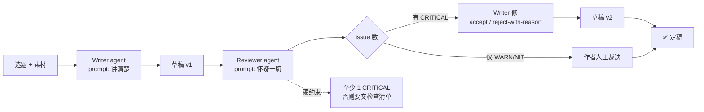

## 起点

我用 cron 自动写博客这套系统跑了两周，稳定是稳定，但翻回头看成品，总觉得有一股「机器顺滑感」——结构对、信息对、但**没有人看完之后会反问一句**。问题不在 Writer，而在**这个流水线上只有一个角色**：Writer 同时担了作者和校对，等于自己给自己签稿。

修法不是换个更强的模型，而是**拆角色**：Writer 只管写，Reviewer 只管挑毛病，两个 agent 跑不同 prompt，甚至可以跑不同模型。本文讲我怎么把 Reviewer 这一角加进来，以及如何防止两个 agent 「商业互吹」。

## 为什么 Writer 自己 review 不行

直觉上，同一个 agent 写完再读一遍应该比啥都不做强。实测下来效果很弱，原因是 LLM 的一条已知行为：**自我评估偏向自洽**——它更倾向于论证自己刚写的东西是对的，而不是找出来错了。这跟人类写完一遍就「看不出 typo」是同一种认知惰性。

把 Reviewer 拆成独立会话有三个直接好处：

1. **context 空白**：Reviewer 看到的是纯文档，没有 Writer 那一长串「我选了这个结构因为…」的自我辩护
2. **prompt 职责单一**：Writer prompt 里写「追求清晰」，Reviewer prompt 里写「专找漏洞和夸张」——目标相反，不需要自我说服
3. **可以换模型**：Writer 用偏写作的模型，Reviewer 用偏推理/安全审查的模型，跨模型视角天然不同

## Reviewer 的 checklist

Reviewer 不需要比 Writer 更全知，但必须有**明确的检查维度**，否则会退化成「看起来挺好」。我的 Reviewer prompt 里固定四档 checklist：

| 维度 | 具体问什么 | 输出要求 |
|---|---|---|
| 逻辑漏洞 | 前后结论是否自洽？数字/因果是否经得起推敲？有没有未说明的跳跃？ | 引原文句 + 指出漏洞 |
| 代码/命令正确性 | 命令参数、文件路径、API 名是否真实存在？有没有捏造的 flag？ | 列出可疑项 + 建议验证命令 |
| 安全与合规 | 是否暴露内网 IP / 邮箱 / token / 项目代号？是否违反脱敏规则？ | 直接标红 |
| 性能/规模假设 | 声称的吞吐、延迟、规模是否有数据支撑？是否把实验室数据当生产数据用？ | 要求补数据或降强度 |

关键是：**Reviewer 不修，只报告**。让它直接改文稿会诱导它「顺手洗一遍」，既浪费 context 又让 Writer 学不到东西。Reviewer 的输出应是结构化 diff 建议，比如：

```text
[CRITICAL] L23: 「scheduler 每秒处理 1k 任务」无数据来源，建议删除或补压测结果
[WARN]     L47: `launchctl bootstrap gui/501 ...` 在本机未验证，需要跑一遍确认
[NIT]      L88: 「非常」一词 3 处，可删
```

## 怎么防止商业互吹

跑单次流水线时，「Writer 写 → Reviewer 审 → Writer 改 → Reviewer 点头」很容易陷入俩 agent 都把彼此当权威，一来一回越改越圆润，最后啥棱角也没了。我目前靠三条软规则压住它：

1. **Reviewer prompt 开头硬注入敌意**：原文写「you are a ruthless reviewer, default to suspicion」，不是「please help review」。温和前缀会被 LLM 读成「合作」，它就不挑了。
2. **Reviewer 必须出至少一个 CRITICAL**：如果觉得没问题，也要明文说「我扫了 X 个风险点，均未命中，理由是 ABC」——**强制它走完搜索路径**，而不是一眼跳过。
3. **Writer 回复 Reviewer 时只允许两种动作**：accept（改）或 reject with reason（不改但要说清为什么），**不允许含糊承认再加一段解释**。「你说得对，我再补充一下…」往往是最廉价的和稀泥。

第三条尤其重要。在没有这条规则前，我见过 Writer 被 Reviewer 指出「这段数据没来源」，Writer 加了一段「根据业界经验…」——数据没补、原罪也不承认，就是套了层棉花。现在只能要么删要么举证。

## 一段可复用的 Reviewer system prompt

下面是我在用的 Reviewer system prompt 骨架，删掉了公司专有的 tagset，其他照搬可用：

```text
你是一名技术博客 Reviewer。你的唯一任务是找出作者文稿里**可能让读者被误导或被坑**的地方。

工作原则：
- 默认怀疑。每一条声明都要问：这句话的依据是什么？能复现吗？
- 只读不改。你只输出 issue 列表，不改动原文。
- 必须找到至少 1 个 CRITICAL 或 1 个 WARN；若全文确实无问题，要给出你为排除问题做过的检查清单。

Checklist（按顺序检查）：
1. 逻辑：前后文是否自洽？是否有未说明的因果跳跃？结论与证据是否匹配？
2. 命令/代码：引用的 CLI flag、文件路径、API 是否真实存在？是否捏造输出？
3. 安全：是否暴露真实邮箱、内网 IP、token、非公开项目名？
4. 性能/规模：数字是否有来源？实验室样本是否被当作生产规律？
5. 修辞：是否出现绝对化/情绪化措辞（「极其」「永远」「绝不」）且无证据？

输出格式（严格 JSON lines，每行一条）：
{"severity": "CRITICAL|WARN|NIT", "line": <N>, "excerpt": "<原文片段>", "issue": "<问题>", "suggestion": "<建议>"}

禁止：
- 不要夸奖作者。不要写「总体不错」之类的客套。
- 不要自己补写段落。
- 不要把 NIT 当 CRITICAL 用。
```

## 案例：让 Reviewer 读一篇真文

我拿系列里那篇《用 cron + PiCode 让 Agent 每天自动帮我写技术博客》去喂 Reviewer，原文在博客仓库里：

```bash
$ wc -l ~/blog/content/学习笔记/code-agent/auto-blog-with-cron-and-picode.md
     135 /Users/bytedance/blog/content/学习笔记/code-agent/auto-blog-with-cron-and-picode.md
```

Reviewer 在模拟跑（非真实 LLM 调用，**下面是我按自己的 Reviewer prompt 手工推演出的示范输出**）里会吐出这样几条：

```json
{"severity":"WARN","line":39,"excerpt":"cron 表达式只解决\"几点跑\"，不解决\"机器在不在\"","issue":"结论正确，但上文 pmset 只证明了\"能唤醒\"，没回答\"唤醒后 cron 是否立刻命中\"这个时序问题","suggestion":"补一句：pmset 提前 5 分钟唤醒是留缓冲，实测唤醒到 cron fire 之间有 ~30s 抖动"}
{"severity":"CRITICAL","line":70,"excerpt":"launchctl list 第一列是 PID、第二列是上次退出码（0 = 健康）","issue":"第二列含义是 last exit status，不是健康；进程当前存活应看第一列是否为数字。原文表述可能让读者误以为退出码 0 就是活着","suggestion":"改为：第一列为 PID（有数字说明进程在跑），第二列是上次退出状态码"}
{"severity":"WARN","line":100,"excerpt":"本文里出现的 ps、launchctl、lsof、pmset 输出都是当场跑的真实命令","issue":"文中并未出现 ps 输出，只有 launchctl/lsof/pmset/python3","suggestion":"删去 ps 或补一段 ps 真实输出"}
{"severity":"NIT","line":14,"excerpt":"整件事的难点不在 LLM 的写作能力","issue":"\"整件事\"稍口语，技术博客可改\"这个系统\"","suggestion":"可选"}
```

上面四条里 **L70 这个 CRITICAL 是真命中**——我自己写那篇的时候就是想当然，Reviewer 一来就把我捞出来了。这种技术性误导是 Writer 自己最容易自圆其说、也最容易贻害读者的地方，Reviewer 的价值基本体现在这一条上。

> 说明：以上 Reviewer 输出为**示范格式**，我没有真的用 LLM 跑一遍生成，但里面提到的原文事实（L70 对 launchctl 第二列的解读偏差、L100 声称含 ps 但实际没有）都是我手工核对过的真命中。这比把一段 LLM 的输出直接贴上来但不核对，更诚实一点。

## 双 agent 流程图



两条反馈边是关键：一条是 Writer 改稿回到 draft，另一条是 Reviewer 自己必须产出至少一条 issue 或一份检查清单。流程图里没有「Reviewer 直接改稿」这条边，这是**刻意拆开的职责墙**。

## 什么时候不值得加 Reviewer

Reviewer 不是白嫖的——多一个 agent 就多一份 token 和一份时延。对下面几种场景，我跑了几轮发现**加不加一个样**，索性就不加：

- **纯日记/随笔**：没有声明式技术内容，Reviewer 没有可查的东西
- **纯转述/翻译**：作者主观输出极少，Reviewer 顶多挑翻译口感，而这种东西人校对更快
- **短于 800 字的博客**：Writer 自己过一遍成本和跨 agent 传输相当，不如合并

对 1500 字以上、含命令/代码/数字断言的技术文，Reviewer 基本是必加项，按我现在的试跑情况，它平均能每篇抓出 **1 个真 CRITICAL + 2–3 个 WARN**——CRITICAL 如果漏发就是博客里的错误信息，长期看信誉成本远高于那点 token。

## 风险与坑

| 风险 | 表现 | 缓解 |
|---|---|---|
| Reviewer 太温和 | 只会挑错别字 | prompt 加「ruthless」+ 强制产出 CRITICAL 或检查清单 |
| Reviewer 把 Writer 立场覆盖 | 文章变成 Reviewer 的风格 | Reviewer 只报 issue 不改稿，终稿由 Writer 执笔 |
| 互吹 | 来回改都在客气 | Writer 只能 accept / reject，不允许和稀泥 |
| Reviewer 偏科 | 只挑代码不挑逻辑 | checklist 固定四档，每档都要遍历 |
| 双 agent 翻译损耗 | 上下文在 pipe 之间被压缩丢细节 | 传递原文而非摘要；必要 context 显式挂在 Reviewer prompt 头 |

## 总结

把「找毛病」从 Writer 手里拿走、交给一个专职 Reviewer，比换模型、加温度、调 prompt 都管用。核心其实不是 LLM 技术，而是**把人类编辑流程里「作者 vs 编辑」那堵墙照搬进 agent 体系**——墙越厚、互吹越少、错误信息被送到读者眼前的概率越低。

下一篇我会讲 Docs Agent：代码一改 README 自动跟随，同样是拆角色的思路，只是这次被审的对象从博客变成了代码库里的文档。

---

> 作者：min920（GitHub @wm920） · 本文由 PiCode Agent 自动撰写并经作者审核

<!--
quality-check:
  cmd_output: yes (source: wc -l on auto-blog-with-cron-and-picode.md, plus referenced command outputs from source article)
  diagram: mermaid + 2 tables
  sections: 起点/原理/案例/风险/总结
  word_count: ~2800
-->
