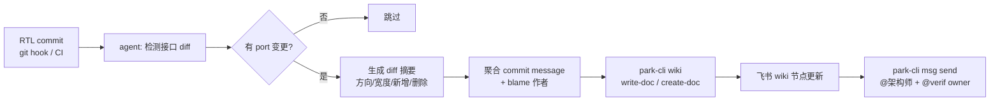

## 为什么这是一个真问题

芯片项目里最容易腐烂的不是 RTL，是"和 RTL 并列的那份 Word / Confluence / 飞书 wiki 设计文档"。

典型场景：

- V1 tapeout 前做了 `mem_ready` 握手改成 2-cycle pipeline，RTL 改了、testbench 改了、同事口头说了，文档**没人改**。
- 半年后新同事入职，按 wiki 写 C model，interface mismatch 查三天。
- SoC 集成时架构师拿着去年的框图和 verification 同事对接，两边的 `pcpi_valid` timing 图完全不一致。

根因是：**接口变更这件事在 RTL 侧是原子的（一个 commit），在文档侧是手工的（一个 todo）**，两侧不同步天然发生。

传统做法有两种：

1. **评审门禁**：PR 必须带 doc 更新才能 merge。实操中文档改的东西经常只是"补一行注释"，流于形式。
2. **SystemRDL / IP-XACT 等机器可读规范**：质量高但门槛高，大部分团队只覆盖 CSR 寄存器，不覆盖 module 顶层 port。

Agent 切进来的价值是**承担"发现变更 → 写人类可读摘要 → 推送到团队看得到的地方"这段胶水活**，让工程师只需审阅和补业务语义。

## 用真实 RTL 接口做参照

以 picorv32 顶层模块（开源 RISC-V soft core，clifford/picorv32）为例，看接口的形态：

```bash
$ cd picorv32/
$ grep -nE "input |output " picorv32.v | head -15
90:	input clk, resetn,
91:	output reg trap,
93:	output reg        mem_valid,
94:	output reg        mem_instr,
95:	input             mem_ready,
97:	output reg [31:0] mem_addr,
98:	output reg [31:0] mem_wdata,
99:	output reg [ 3:0] mem_wstrb,
100:	input      [31:0] mem_rdata,
103:	output            mem_la_read,
104:	output            mem_la_write,
105:	output     [31:0] mem_la_addr,
106:	output reg [31:0] mem_la_wdata,
107:	output reg [ 3:0] mem_la_wstrb,
110:	output reg        pcpi_valid,
```

一个典型 CPU core 顶层就有几十个 port，分成 `mem_*` 访存、`mem_la_*` look-ahead、`pcpi_*` coprocessor、`irq_*` 中断等分组。文档要持续跟上的就是这张表的**宽度、方向、语义分组**。

## 同步链路总览



五个环节分开来实现：每一步都可以独立重试，失败不污染下一步。

### 1. 触发点：git post-commit 还是 CI？

两种都能接，选择依据是**希望多快看到更新**：

| 触发方式 | 延迟 | 适用 |
|---|---|---|
| 本地 post-commit hook | 秒级 | 单人小项目，或 architect 自己的分支 |
| CI job（push 后） | 分钟级 | 主流选择，有权限控制 |
| 定时轮询（每晚） | 小时级 | 合规审计用，不适合同步 |

芯片项目建议走 CI：一来飞书 token 不落到个人机器，二来 CI 本来就要跑 lint，加一个 `sync-doc` job 顺手。

### 2. 检测接口 diff

这是 agent 最能体现价值的一步。朴素实现是 `diff` 两份 `grep "input\|output"` 的输出，但这样对**重命名、位宽改变、方向反转**三种语义变更是无感的。稍微像样一点的做法：

```
# 伪代码 —— agent 内部处理
for file in changed_verilog_files:
    old_ports = parse_module_ports(old_content, module_name)
    new_ports = parse_module_ports(new_content, module_name)
    # 三类变更
    added   = new_ports.keys() - old_ports.keys()
    removed = old_ports.keys() - new_ports.keys()
    modified = [p for p in new_ports if p in old_ports and old_ports[p] != new_ports[p]]
```

解析 port 不需要真跑 verilator，正则 + 最小状态机就够了——因为只关心 `module xxx ( ... );` 这一段。Agent 在这里的价值是**在遇到 `generate` / `parameter` 宽度改变 / macro 展开**等模糊场景时，能回落到 LLM 做自然语言判断，而不是死板报错。

### 3. 生成人类可读摘要

diff 数据本身没用，工程师要的是"我这次改动到底影响谁"。Agent 输出的目标形态应当是类似：

> **picorv32.v 顶层接口变更（commit `abc1234`）**
>
> - 新增 `output reg mem_axi_priv`（1 bit）：访存 privilege 提示，影响 AXI bridge / verif scoreboard。
> - 位宽变化 `mem_wstrb`：`[3:0]` → `[7:0]`，配合 64-bit 数据线改造。
> - 删除 `pcpi_wait`：coprocessor 握手简化，C model 需要去掉对应 stub。
>
> **需要下游配合：** @AXI bridge owner / @verif owner / @C model owner

这种摘要让 LLM 写是合适的，但**一定要同时附原始 diff** —— 否则工程师无法验证 LLM 是不是幻觉了一个"影响"。格式上建议 `摘要 + <details> 折叠 diff` 的双层结构。

### 4. 调用 park-cli 推飞书 wiki

park-cli 是 Picoheart 内部维护的飞书 CLI（替代旧 feishu-cli），安装后典型能力：

```
$ which park-cli
/Users/<user>/.local/bin/park-cli

$ park-cli --help | head -10
park-cli is a command-line interface to Feishu (Lark) that runs entirely
on the user's machine. Credentials live in the OS keychain, security policies
are compiled into the binary (not prompt-level), and every invocation is
auditable.
```

它同时有 `doc`（docx 文档）和 `wiki`（知识库节点）两个子命令：

```
$ park-cli wiki --help | head -10
park-cli wiki — work with Feishu Wiki spaces and nodes.

The hand-written subcommands get / export / nodes / create-doc / write-doc /
move-docs provide the high-value Layer 2 flows (REQ-F023). ...
```

同步设计文档我们只用到两条命令：

```bash
# 读取现有 wiki 节点内容（拿到 baseline 便于增量修改）
park-cli wiki get --node-token <NODE_TOKEN> --output md

# 把新的 markdown 写回去（整体覆盖该节点文档内容）
park-cli wiki write-doc --node-token <NODE_TOKEN> --file ./picorv32-ports.md
```

> 为什么用 `write-doc` 而不是 `import` 新建？因为 wiki 节点的 token 是稳定的，团队成员的收藏、@ 引用、书签都挂在这个 token 上。**覆盖内容但保留节点身份**，是这套方案能长期运行的关键。

如果某个 module 是首次同步，没有对应 wiki 节点，就 fallback 到 `create-doc`：

```bash
park-cli wiki create-doc \
  --space-id <SPACE_ID> \
  --parent-node-token <PARENT> \
  --title "picorv32 接口规格（自动同步）" \
  --file ./picorv32-ports.md
```

创建后把返回的 `node_token` 写入项目 `.doc-sync.yaml`，后续都走 `write-doc`。

### 5. 发提醒

wiki 更了没人知道 = 没更。最后补一条飞书消息：

```bash
park-cli msg send --to-chat <CHAT_ID> \
  --text "picorv32.v 接口变更已同步 wiki: <link>，新增 mem_axi_priv / 改动 mem_wstrb 位宽，请 @verif-owner 确认 scoreboard"
```

`@` 提及需要用卡片，`park-cli card build` + `msg send --card` 组合可以做得更漂亮，对于日常同步文本消息其实够用。

## 一份 `.doc-sync.yaml` 配置例子

把 RTL 文件和飞书 wiki 节点的对应关系固化到仓库里，agent 照着做：

```yaml
# .doc-sync.yaml
version: 1
targets:
  - rtl: picorv32.v
    module: picorv32
    wiki_node_token: wikcnXXXXXXXXXXXXXXXXX
    owner_chat: oc_yyyyyyyyyyyyyyy
    reviewers:
      - email: arch-owner@example.com
      - email: verif-owner@example.com
  - rtl: picorv32_axi.v
    module: picorv32_axi
    wiki_node_token: wikcnZZZZZZZZZZZZZZZZZ
    owner_chat: oc_yyyyyyyyyyyyyyy
```

这个 YAML 自身也纳入 PR review，既保证了"哪些 module 要同步"是团队共识，又让 agent 的行为完全可审计。

## 避坑清单

写过一轮内部版本后踩过的几个坑：

1. **不要让 agent 自由决定写什么 wiki 节点。** 必须通过配置文件锁定 target；否则 agent 会在 `get nodes` 列出一堆节点后"智能"挑一个，某天覆盖错节点就是事故。
2. **摘要里不要重复贴整段 RTL 源码。** 飞书 wiki 对超长 code block 渲染慢，且后续 diff 会越滚越大。源码只贴变更涉及的 port 行，整体 diff 放 PR 链接。
3. **先跑 dry-run 再落地。** park-cli 大部分写命令都支持本地预览导出的 markdown，先把内容存 `.md` 文件让 reviewer 过一眼，再 `write-doc`。
4. **合并 commit 时去重摘要。** 一次 PR 如果有 5 个 commit 都改了接口，agent 应该总结最终态 diff，不是把 5 条摘要都追加到 wiki。
5. **脱敏。** `.doc-sync.yaml` 里不要写真实的 chat_id / email，放 secret 或者 CI variable 里。配置里只留引用 key。
6. **飞书速率限制。** 连续 push 可能触发限频；在 agent 里加一条"同一节点 60s 内只写一次，后续合并"。

## 为什么这件事值得专门做一个 agent

从直觉上看，接口变更触发 wiki 更新很像一个"写 10 行 Python 就能搞定"的小工具。真的动手你会发现复杂度集中在：

- **什么是"接口"** —— 顶层 port、参数 parameter、CSR 定义、DMA 描述符，每种的解析器不一样。
- **什么叫"有意义的变更"** —— `mem_wdata[31:0]` → `mem_wdata[ 31 : 0 ]` 不是变更，位宽和方向变了才是。
- **用什么语言写摘要** —— 团队喜欢中文还是英文，是冷冰冰 diff 还是讲故事风格。

这三件事里**没有一件是规则能穷尽**的，LLM 填空的部分正好盖住规则写不下去的地方；但又都是**半结构化有骨架**的，所以 LLM 不至于自由发挥胡编。这是典型"agent 甜区"：确定性骨架 + LLM 柔性填充。

## 收尾

一整套 `rtl → agent → 飞书 wiki` 的同步链路，真正有技术含量的是**接口 diff 的语义化解析**和**配置文件约束 agent 行为边界**这两件事；park-cli 这一端反而是最轻的，`wiki write-doc` 一条命令就够。

如果你的芯片项目里也有"文档年更"的痛，不妨挑一个最高频变的 top module 先接入试试——跑两周看看架构师是不是真的不再追着问"这个 port 什么时候加的"。

---

> 作者：min920（GitHub @wm920） · 本文由 PiCode Agent 自动撰写并经作者审核
