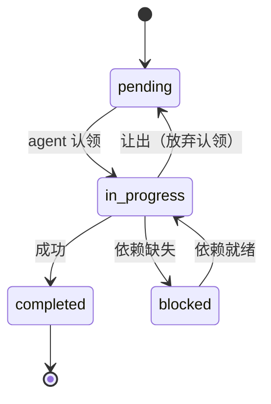
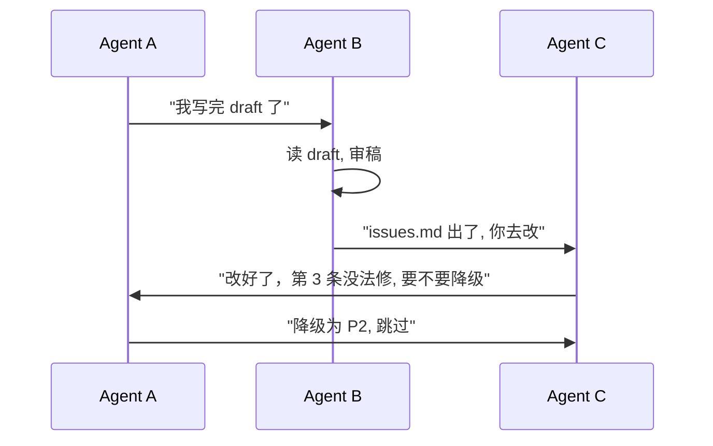
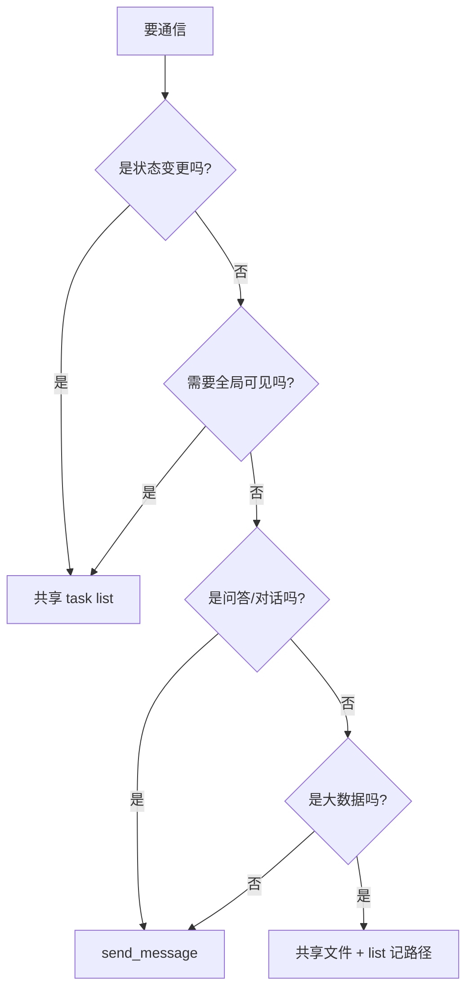

多 agent 协作永远绕不开一个问题：**agent 之间怎么说话？**

PiCode 给了两种原语：

- **共享 task list**（todo_write / todo_read）：所有 agent 看同一张列表，状态就是通信
- **send_message**：agent 对 agent 定向递一张纸条

二选一，或者混用？本文拆三个维度比较，再给三个真实场景的推荐。

## 原语长什么样

先用最小的样例把两者摆出来。

**共享 task list**——任何 agent 都能写、任何 agent 都能读：

```
- [completed] 拉取 picorv32 仓库
- [in_progress] 跑 baseline 测试
- [pending] 分析失败的 3 个 case
- [pending] 写 fix 并 PR
```

**send_message**——定向发给某个 agent：

```
send_message(to="sa-660e02b0",
             subject="baseline 已跑完",
             body="log 在 ~/.tmp/cache/baseline.log，失败 3 个")
```

两者不是互斥的，但使用模式完全不同。前者像一张公共白板，后者像 IM 私聊。

## 三维度对比

### 延迟

- **共享 task list**：读者要主动 poll。默认不给 push 通知；上游更新了 todo 之后，下游要到下次读取时才能发现。poll 间隔越短越及时，代价是浪费 token。
- **send_message**：原生事件语义，下游收到就处理，延迟 ≈ 调度延迟。

### 一致性

- **共享 task list**：单写多读的读者视图强一致——只要一次 `todo_read` 就能拿到完整全景，不会看到半截状态。但"谁在改"这件事本身没有锁，多个 agent 同时 write 会最后写入赢（LWW）。
- **send_message**：点对点，没有一致性问题；代价是全局状态散落在各自信箱里，谁都拼不出"现在整件事做到哪一步"。

### 可审计

- **共享 task list**：每次更新都写回文件，历史版本可 diff。事后任何时间点都能重放。
- **send_message**：消息默认过程态，消费完就消失。除非 agent 显式落盘收件箱，否则复盘只能靠日志。

### 汇总

| 维度 | 共享 task list | send_message |
|---|---|---|
| 延迟 | 高（需 poll） | 低（事件驱动） |
| 一致性 | 全景强一致；并发写 LWW | 无全景；点对点 |
| 可审计 | 默认落盘，可 diff | 默认即焚，需额外落盘 |
| 扇出 | 天然广播（n 读者免费） | 1-to-1，广播要 n 次发送 |
| 耦合度 | 低（agent 不需知道彼此 ID） | 高（得知道收件人） |
| 幂等 | 天然（读取无副作用） | 需手动去重 |
| 典型形状 | 看板 / kanban | 对讲机 / IM |

## 状态机视角

共享 task list 的本质，是把每个任务视作一个有限状态机，所有 agent 通过转移状态来通信：



所有 agent 看的是同一张状态图，每个转移边就是一次通信。这种模型的最大好处是：**新加入的 agent 不需要任何人"通知"它现在进展到哪——它 read 一次就全知道了**。

send_message 则是反过来：状态分散在每个 agent 内部，通信是显式的。画出来更像一张图：



这种写法对人类读起来直观，但对 agent 系统不友好——**谁持有"整件事的真相"？没人**。A 只知道 draft 写完了，B 知道审稿完了，C 知道自己改到哪；要拼全景得把 3 个信箱合起来看。

## 三个真实场景的推荐

### 场景一：写作接力（Outliner → Illustrator → Writer → Reviewer）

**推荐：共享 task list + 共享文件**。

这是典型的"流水线"——上游状态 `completed` 就是下游的发令枪。用 send_message 既浪费（每次完成都得主动 notify 下游）、又容易漏（下游离线或正忙时纸条可能被埋）。

实际 todo 长这样（本文写作过程真实状态，`todo_read` 截出来）：

```
[x] Write team-spawn-meta-demo.md
[x] Write role-system-prompt-5-rules.md
[>] Writing communication comparison   ← 就是你现在在读的这篇
[ ] Write git-worktree-multi-agent.md
[ ] Cleanup worktree
```

Writer agent 只要周期性 `todo_read`，看到自己那行变成 `in_progress` 或上一行变成 `completed` 就开工。**状态即通信**，不需要一个字的"纸条"。

### 场景二：Bug triage（QA 发现 bug → 分诊到模块 owner → 修复 → 回归验证）

**推荐：send_message 为主，task list 做全局索引**。

为什么不是纯 task list？因为 triage 过程里有**定向提问**：QA 发现一个 crash，需要去问 RTL owner"你这周改过 AXI arbiter 吗"。这种问答天然是 1-to-1，扔到共享 list 里既污染全景、又没回复上下文。

但光用 send_message 也不行——bug 数量一多，没人知道"此刻有几个 P0 bug 在修"。所以折中是：

- 每个 bug 在 task list 里建一行，记录状态
- 具体 triage 对话走 send_message，结论回写 task list

这样全局看板是一致的，过程对话各自私有。

### 场景三：长跑流水线（每天跑一轮 regression，7 个 agent 并行跑不同子集）

**推荐：共享 task list，send_message 仅用于异常**。

regression 的典型形状是 100+ 个独立 case，按 agent 分片跑。这时候：

- **共享 task list** 是天然看板——每个 case 一行，agent 跑完改状态。
- 某个 agent 挂了，总指挥扫一眼 list 就知道哪些 case 还是 `in_progress` 没更新、哪些 `pending` 没人认领，直接重派。

send_message 只在两种情况下用：

1. **异常求救**：某 agent 发现共享基础设施挂了（如 license server 不可达），广播 send_message 让其他 agent 也提前退出，不要白跑 token。
2. **人工介入**：总指挥把一个意外 block 的任务 send_message 给人类 operator。

## 混用反模式：什么时候千万别混

**反模式 1：用 send_message 代替状态转移**。

典型：agent A 写完 draft，`send_message(to=B, "done")`，但 task list 里还是 `in_progress`。结果 B 收到了就干，list 里其他看客一脸懵——"这任务到底完了没？"。**真相来源只能有一个**，要么全走 list 要么全走 message，状态和通知走两条路必翻车。

**反模式 2：用 task list 传递大块数据**。

典型：有人把完整的 log 内容粘到 `content` 字段里。task list 读取成本是 `O(全部内容)`，每个 agent 每次 `todo_read` 都要把那堆 log 过一遍。**数据走文件，状态走 list，引用走路径**——这是铁律。

**反模式 3：send_message 期待同步回复**。

有人把 send_message 当 RPC 用——发完阻塞等回。PiCode 的消息是异步投递，同步等复就是死锁。要 RPC 语义，用文件约定："我写 request.json，你写 response.json，我 poll"。

## 选择决策树

用一张快速决策树收尾：



## 总结

两条原语，两种心智模型：

- **共享 task list = 看板**。所有 agent 盯同一张图，状态即通信，天然广播，可审计。代价是延迟高、需要 poll。
- **send_message = 对讲机**。定向、低延迟，但全景散落、需手动落盘才能审计。

三条实操建议记一下：

1. **流水线类协作默认用 task list**，send_message 只在异常求救时用
2. **对话类协作（triage、问答）用 send_message**，但关键结论要回写到 list
3. **状态和通知只能有一个真相来源**，混用前先问自己：如果两条通道不一致以谁为准？

写不下这三条的时候，退回到更保守的做法——**全部走共享文件 + task list**。共享 task list 在可审计和幂等上的优势，几乎永远比 send_message 的低延迟更值得要。低延迟是锦上添花，全景一致是保命。

> 作者：min920（GitHub @wm920） · 本文由 PiCode Agent 自动撰写并经作者审核

<!--
quality-check:
  cmd_output: yes (source: 本文写作过程的真实 todo_read 状态)
  diagram: 2 张 mermaid (状态图 + 序列图 + 决策树) + 三维度对比表
  sections: 原语/三维度/状态机/三场景/反模式/决策树/总结
  word_count: ~2400
-->
