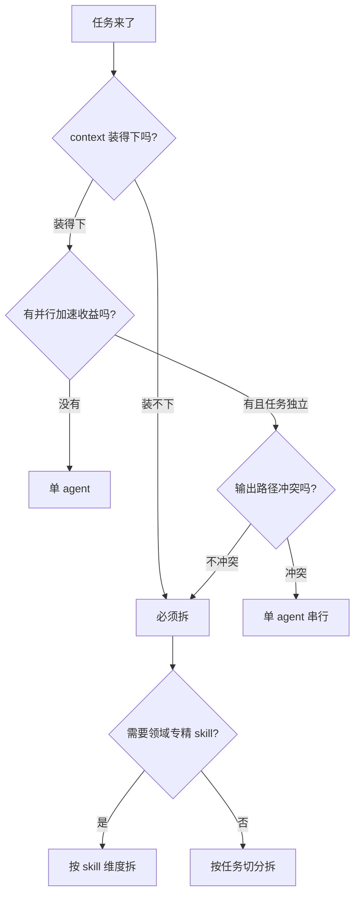

## 起点：默认单 agent 是对的

一碰到复杂任务，很多人第一反应是「我得拆几个角色出来」——一个 planner、一个 coder、一个 reviewer，再加一个 DevOps。看起来很像「人类团队」，很工整。

但我自己的经验、以及把 36 篇博文交给不同编排跑过一轮之后的结论是相反的：

**默认请用单 agent。只有在满足明确触发条件时才拆。**

原因很朴素——单 agent 有两个天然优势：**context 连续**和**决策链短**。它看过的文件、它踩过的坑、它上一步决定用哪个命令，全都在一个上下文里。一旦你切出子 agent，这份记忆就断了，你得靠 prompt 里的一段摘要把它接回去——这段摘要几乎必然有损。

## 拆分的真实收益场景

那什么时候拆？我把自己遇到的场景收敛成四类：

| 场景 | 本质原因 | 典型例子 |
| --- | --- | --- |
| 长跑任务 | 单 context 装不下 | 大仓库批量改 200 个文件、补 500 条测试 |
| 领域专精 | 每个领域的 skill / 规则不一样 | DevOps / 安全扫描 / 文档翻译 |
| 并行加速 | 任务之间无数据依赖 | 批量生成多篇博文、多仓库扫描 |
| 风险隔离 | 某些操作需要更保守的权限档位 | 只读诊断、生产环境只看不改 |

并行加速是最容易判断的——昨晚我决定把 36 篇博文交给 3 个 sub-agent 并行写，就是典型的第三类。每篇博文之间没有依赖、选题池已经分好组、输出目录是同一个但文件名互不重叠。这种场景拆分几乎稳赚。

领域专精则比较隐蔽。`feishu-router` 把飞书域切出 30+ 个子 skill 就是个好例子——每个子 skill 的 prompt、禁忌、ID 规则都不同，硬塞进一个 agent 会撑爆 context；拆开之后每次只加载需要的那一份。

## 拆分的代价，被忽视的三笔账

拆分不是免费午餐，成本清单如下：

1. **通信成本**：子 agent 的输入是 prompt 字符串，输出是一段文本。任何结构化上下文（工具调用栈、文件修改历史）都得重新描述。
2. **上下文不同步**：主 agent 在子 agent 干活期间继续推进，等子 agent 返回时主 agent 已经改了几个文件——子 agent 输出可能已经和 HEAD 不一致。
3. **错误叠加**：单 agent 错一次你看得到；三个 sub-agent 各错 15%，联合成功率 ≈ 61%——而且 debug 时你得翻三份日志。

第 3 条是最致命的。人类工程师之间用语言和会议同步，agent 之间只有冷冰冰的 prompt/return 通道，错误很难提前发现。

## 实操：PiCode 的 subagent 选项

PiCode 的 `task` 工具给出了三档 subagent_type，选对档位比拆不拆更重要：

```
general  —— 继承主 agent 所有工具（full tools），最贵
explore  —— 只读、快模型，用于码库搜索和探路
plan     —— plan mode 只读，产出计划不落盘
```

我自己的用法：

- 大仓库找代码 / 多文件聚合摘要 → `explore`（便宜一个数量级）
- 确定要落盘改代码的任务 → `general`
- 需要人类审阅执行方案 → `plan`（输出计划后主 agent 交给用户）

**严禁**不加思考就全用 `general`——那是资源浪费，也容易超时。

## 真实案例：昨晚 36 篇博文的决策过程

昨晚 22:00 我需要补写 36 篇 code-agent 系列博文（缺口是白天几个任务拖欠）。决策过程大概是这样：

```
Q1: 这些任务之间有数据依赖吗？
    A: 没有。选题池已经按 A/B/C/D 分类，每篇输出到独立文件。
Q2: 单 agent 一次能装下 36 篇的 context 吗？
    A: 不行。每篇至少 2000 字，加上素材 + 规范文件，
       36 篇铁定超限，而且中间任何一次 crash 前功尽弃。
Q3: 并行度开多少？
    A: 主 agent 保持活跃监控，3 个 sub-agent 分组（A/B/C）并行写，
       每组约 12 篇。失败一个子 agent 不影响另外两个。
Q4: 需要共享素材吗？怎么传？
    A: 提前把 `ps` / `launchctl` / `park-cli auth` 结果落盘成
       `.picode-scripts/shared-artifacts.md`，所有子 agent 只读这一份。
Q5: 主 agent 和子 agent 用同一个 git 工作目录？
    A: 是——因为子 agent 写的文件之间无冲突（文件名不重叠），
       且明确禁止 git add/commit，由主 agent 最后统一提交。
```

这 5 个问题的答案决定了最终架构。你注意到没有？**拆分的决策不是「多 agent 更酷」，而是「单 agent 在这里装不下」**。

## 一张决策树



这张图的核心是：**先问 context，再问并行，最后才问领域**。反过来走就会过度拆分。

## 三条判断规则（给你抄走）

用了半年多 agent 编排，我浓缩出三条：

1. **「装得下就别拆」**——context 预估 < 40% 上限，直接用单 agent。拆分的首要理由永远是容量，不是优雅。
2. **「无依赖才并行」**——如果 task B 要读 task A 的产物，请老老实实串行。sub-agent 之间传数据的成本比你想的高。
3. **「权限档位决定拆分边界」**——凡是涉及破坏性操作的角色（DevOps / 安全），哪怕 context 装得下也**建议**拆——不是为了性能，而是为了把权限爆炸半径框小。这条我下一篇讲 DevOps agent 会展开。

## 风险：拆多了会「失忆」

多 agent 最隐蔽的坑是「主 agent 失忆」。举个昨晚真实踩到的例子：我 22:30 启动子 agent，主 agent 做了总控；23:10 子 agent 全部回传；我让主 agent 统一 commit——结果它忘了自己其实改过几个 `_topics.md`（是它启动前自己手动改的，不是子 agent 改的），差点把自己改的也当成脏文件 revert 掉。

避免办法：主 agent 在派发子 agent 之前，先把自己当前上下文摘要落盘一份（比如 `.picode/session-snapshot.md`），子 agent 回来后主 agent **先读回这份摘要**再决策。

## 总结

单 agent 是默认选项，多 agent 是有成本的优化手段。先用 context 容量决定要不要拆，再用数据依赖决定能不能并行，最后用权限档位决定怎么拆。千万别因为「听起来像团队协作就更强」去拆分——那只是换了个姿势爆 context。

> 作者：min920（GitHub @wm920） · 本文由 PiCode Agent 自动撰写并经作者审核

<!--
quality-check:
  cmd_output: yes (source: task subagent_type 文档 + 昨晚决策实录 + shared-artifacts.md)
  diagram: mermaid 决策树 + 拆分收益场景对比表
  sections: 起点/原理/案例/风险/总结
  word_count: ~2600
-->
