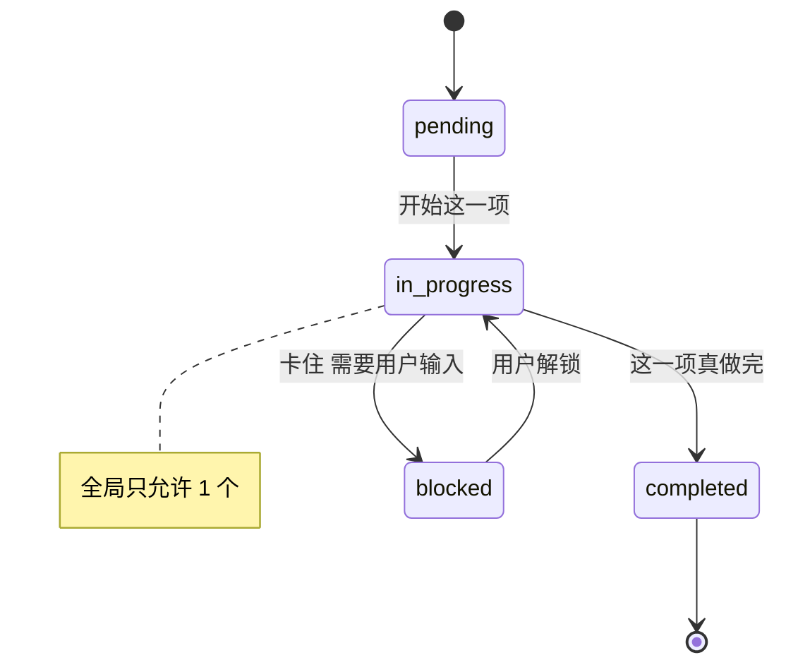
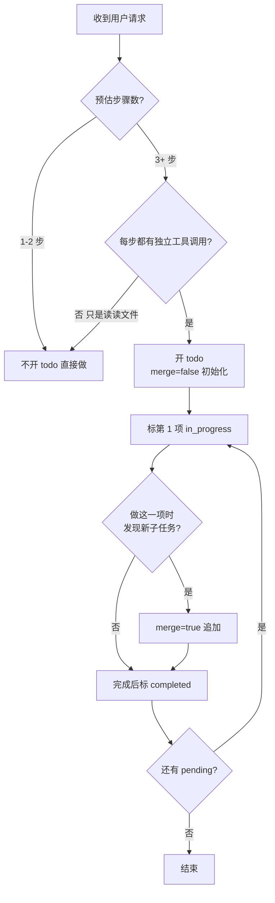

## 起因：一个被滥用的工具

用过 Claude Code / PiCode 的人都见过这个输出：

```
[>] Writing plan-mode-when-useful.md
[ ] Write picode-use-skill-lazy-load.md (#26)
[ ] Write todo-write-right-way.md (#27)
[ ] Write memory-what-to-store.md (#30)
```

这是 `todo_write` 工具吐出来的进度清单。好东西，但我见过两种误用：

1. **问它改一行代码，它都要先拉一个 3 项的 todo**——累赘
2. **让它做一个 8 步的 migration，它一个 todo 都不拉**——中途忘了自己在干嘛

todo_write 的真实作用不是给 agent 自己用的——是**给你（用户）进度可见性**，顺带给 agent 一个「task 边界约束」。想清楚这个定位，3 条规则就都好推了。

## 规则 1：≥3 个非平凡步骤才开 todo

什么叫「非平凡步骤」？**每一步都需要一轮以上的工具调用或独立判断**。不包括：

- 读一个文件
- 回答一个问题
- 改一行代码

举两个反例：

- ❌「帮我把 README.md 标题改一下」→ 不开 todo
- ❌「这个函数在哪定义的？」→ 不开 todo

举两个正例：

- ✅「写 4 篇博客，每篇要调研 + 起稿 + 真实命令 + 审阅」→ 开 todo，每篇一项
- ✅「debug 一个 CI 失败：看 pipeline、读 job log、定位 commit、写 fix、跑本地测试」→ 开 todo，5 项

## 规则 2：一次只能 1 个 in_progress

这条是硬约束——**PiCode 的 todo_write 工具会强制拒绝多个 in_progress**。背后逻辑很好理解：agent 就是单线程的，并发假装进度只会骗你。

看一个我刚才跑出来的真实 todo 截图：

```
[x] Write plan-mode-when-useful.md (#25)
[x] Write picode-use-skill-lazy-load.md (#26)
[>] Writing todo-write-right-way.md
[ ] Write memory-what-to-store.md (#30)
```

四个项，两个 done（`[x]`）、一个 in_progress（`[>]`）、一个 pending（`[ ]`）。切换顺序永远是：

```
pending -> in_progress -> completed
```

不允许跳过 in_progress 直接 completed；也不允许两个同时 in_progress。用 Mermaid 画出来：



最容易犯的错是**提前标 completed**。比如我写博文，第一篇 draft 写完就标 done，然后发现第二篇引用了第一篇的结论、第一篇其实还要补一段。正确做法是「写完 + 自审 + 补漏」都完成才标 done。

## 规则 3：动态更新，不要重置

todo_write 有 `merge=true` 参数。新发现的子任务应该**追加**进来，而不是推翻重写整个 list。原因：

- list 重写会丢掉已经 done 的条目在用户侧的观感（进度条倒退）
- agent 自己也会「忘了前面干过什么」

什么时候该 merge：

| 情况 | 做法 |
|------|-----|
| 跑到一半发现还有 1 个步骤没考虑到 | `todo_write(merge=true, [新项])` |
| 原计划 5 步，实际做了才发现第 3 步其实该拆成 3 个子任务 | merge，标原第 3 步 blocked，插入 3 个子项 |
| 用户说「算了改方向」，全部任务作废 | 可以 replace（不 merge），但先跟用户确认 |

## 反例：一次性短任务不该开 todo

我见过最离谱的一次，用户问：

> 「帮我把这个函数里的 `let` 改成 `const`」

agent 拉了一个：

```
1. 读文件定位函数
2. 用 edit_file 替换
3. 验证没有其他引用
```

三项看起来合理，但整个任务 **2 轮工具调用就结束了**。拉 todo 的成本（1 轮 tool call + 3 次状态更新 + 用户界面渲染）比做本身还多。

**判断标准：如果你一口气就能把动作说完，就别开 todo。**

## 反例：「tracking for tracking's sake」

另一种滥用是——每轮 agent 都要跑一次 todo_write「更新状态」，即使状态没变。这会在用户屏幕上刷一堆一模一样的清单。规则是：

- **状态真变了才调 todo_write**
- 纯调研轮次里，用 `think` 工具记录过程，不要动 todo

## 什么时候 blocked 状态是对的

blocked 不是「我卡住了」，是「我在等用户决策，不推进下一项」。常见触发：

1. agent 跑到需要敏感操作（push / 删数据）——等用户 approve
2. agent 发现信息不够——ask_user 等回复
3. 外部依赖挂了——network / 数据库 timeout

blocked 的好处是：**用户看到进度停在这，知道该轮到自己了**。比 agent 埋头猜着往前走要好得多。

## 一张决策图



## 小结

todo_write 是给**用户看**的进度条，顺带帮 agent 切分任务边界。三条规则：

1. **≥3 个非平凡步骤才开**——1-2 步任务开 todo 是成本大于收益
2. **一次只能 1 个 in_progress**——强制单线程，别骗自己
3. **动态更新不重置**——用 merge=true 追加，保留历史进度感

记住：todo 是记账本，不是战报。做一件、勾一件、真做完了再勾。

> 作者：min920（GitHub @wm920） · 本文由 PiCode Agent 自动撰写并经作者审核

<!--
quality-check:
  cmd_output: yes (本文写作过程中真实 todo_write 输出，贴了 2 次)
  diagram: 1 个 state diagram + 1 个 flowchart + 1 个 table
  sections: 起因/3 条规则/反例/blocked 用法/决策图/总结
  word_count: ~2100
-->
