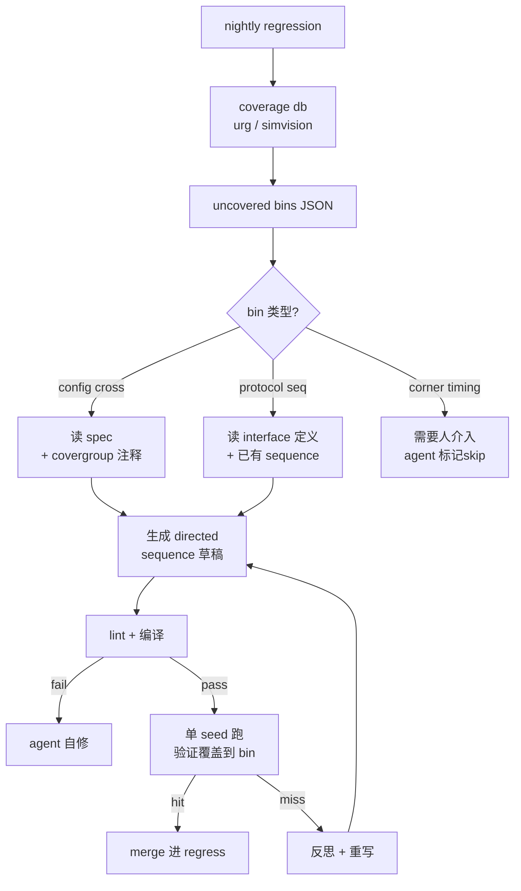

## 起点：覆盖率报告末尾那几行红字

UVM regression 跑一个通宵，早上看报告，line coverage 94%、branch 91%、功能覆盖 `covergroup` 里一堆 bin **0 hits**。这些 bin 通常是配置组合（比如 PMP region 数 × lock 位 × 地址对齐四选一），落在随机分布尾部。继续加 iteration 数是没用的——加 10 倍 seed 可能只多点亮一两个 bin，指数级低效。

传统解法：DV 工程师手写 directed test，针对未覆盖的 bin 约束激励。这活机械但不简单：**读 spec → 读 covergroup 定义 → 反推激励空间 → 写 sequence**。一个 bin 从分析到落下 10-30 分钟，多的时候几百个 bin，一周就没了。

Agent 能不能做？能，但**必须是语义定向，不是盲目随机增补**。本文讲这个 pipeline 怎么搭。

## 原理：为什么不能用"多跑几轮"解决

功能覆盖率的每个 bin 背后是一个**设计意图**。举个例子，OpenTitan 的 `flash_ctrl_env_cov.sv` 里会定义"读取 × 某擦除状态 × 某 MP region"的交叉 bin。随机约束打出来的激励在这个三维空间里**不是均匀分布**——擦除状态有生命周期，MP region 配置有重置默认，read 操作更偏向特定地址段。结果就是三维交叉里有一块"随机永远到不了"的区域。

要到那块区域，必须：

1. 搞清楚这个未覆盖 bin 在**语义上**代表什么场景
2. 反推要让 DUT 走到这个场景，激励需要满足哪些前置条件
3. 写一个 directed sequence，明确设置寄存器 / 触发顺序 / 约束随机种子

第 1、2 步是**语义理解**——这恰好是 agent 相对于"多跑几 seed"的唯一优势。第 3 步是模板化代码生成，agent 也擅长。

## 真实材料：OpenTitan / Ibex / CVA6 的 covergroup 布局

三个仓库里 coverage 文件分布（命令真实跑过）：

```
$ find ~/.tmp/agent-blog-cache/opentitan/hw -iname "*cov*" | head -5
opentitan/hw/top_earlgrey/ip_autogen/rstmgr/dv/env/rstmgr_env_cov.sv
opentitan/hw/top_earlgrey/ip_autogen/rstmgr/dv/cov/rstmgr_cov_bind.sv
opentitan/hw/top_earlgrey/ip_autogen/flash_ctrl/dv/env/flash_ctrl_env_cov.sv
opentitan/hw/top_earlgrey/ip_autogen/flash_ctrl/dv/cov/flash_ctrl_cov_bind.sv
opentitan/hw/top_earlgrey/ip_autogen/flash_ctrl/dv/cov/flash_ctrl_cov.vRefine

$ find ~/.tmp/agent-blog-cache/ibex -iname "*cov*" | head -5
ibex/dv/uvm/icache/dv/ibex_icache_core_agent/ibex_icache_core_agent_cov.sv
ibex/dv/uvm/icache/dv/fcov/ibex_icache_fcov_if.sv
ibex/dv/uvm/icache/dv/fcov/ibex_icache_fcov.core
ibex/dv/uvm/icache/dv/fcov/ibex_icache_fcov_bind.sv
ibex/dv/uvm/icache/dv/env/ibex_icache_env_cov.sv

$ find ~/.tmp/agent-blog-cache/cva6/verif -maxdepth 5 -iname "*uvm*" | head -5
cva6/verif/tests/uvmt
cva6/verif/tests/uvmt/vseq/uvmt_cva6_vseq_lib.sv
cva6/verif/tests/uvmt/base-tests/uvmt_cva6_base_test.sv
cva6/verif/tb/uvmt/uvmt_cva6_tb.sv
cva6/verif/tb/uvmt/uvmt_cva6_pkg.sv
```

三个项目的共性：`env/*_cov.sv` 放 covergroup 定义，`fcov/*_if.sv` 放接口绑定，`vseq/*_vseq_lib.sv` 放 virtual sequence 库。agent 要动的就是**读前两类，写第三类**。

## 闭环流水线



关键在两个点：
- **agent 只在语义可解的 bin 上工作**，看不懂的（corner timing、race）直接标 skip，让人接手
- **生成 → 编译 → 单 seed 验证**是闭环：agent 必须能证明它写的 sequence 真的点亮了目标 bin，而不是凭感觉交差

## Agent 工作流伪代码

```python
# 输入：uncovered_bins.json，每个 bin 包含 covergroup 定义位置 + 未命中条件
for bin in uncovered_bins:
    # 1. 读 covergroup 定义
    cg_src = read_file(bin.cov_file, lines=bin.cg_line_range)

    # 2. 读相关寄存器 / 接口 spec（通过 RAL 或 Markdown doc）
    spec_ctx = grep_file(
        pattern=bin.signal_names,
        path="hw/ip/<ip>/doc",
        output_mode="content",
        context_lines=5
    )

    # 3. 读已有 sequence，找最接近的模板
    similar_seq = task(
        subagent_type="explore",
        prompt=f"在 vseq/ 下找一条和 {bin.scenario} 最接近的 sequence，返回文件和关键片段"
    )

    # 4. 分类：config-cross / protocol-seq / corner
    category = classify_bin(cg_src, bin.scenario)

    if category == "corner":
        log("skip, needs human", bin.id)
        continue

    # 5. 生成 directed sequence
    draft = llm_generate(
        template=similar_seq,
        covergroup=cg_src,
        spec=spec_ctx,
        target_bin=bin.scenario,
        constraints_hint=bin.missing_condition
    )

    # 6. 写到 vseq/auto_gen/ 下（和人写的隔离）
    write_file(f"vseq/auto_gen/bin_{bin.id}_vseq.sv", draft)

    # 7. 编译 + 单 seed 跑 + 检查 coverage delta
    if not run_single_seed_check(bin.id):
        log("coverage not hit, retry", bin.id)
        retry_with_more_context(bin)
```

几个细节：
- **隔离目录**：agent 生成的放 `vseq/auto_gen/`，code review 按目录 diff 更清楚，不混进主库
- **命名规则**：`bin_<id>_vseq.sv`，每条 sequence 注明它服务哪个 bin——后面回归如果这个 bin 又掉了能马上找到对应的 sequence
- **闭环验证**：生成 → 编译 → 单 seed → urg 确认该 bin hits>0，全绿才算成功。只到生成那步是耍流氓。

## 案例：一个 config-cross bin

假设 Ibex icache 的 covergroup 里有这样一个 cross（简化示意）：

```systemverilog
// ibex_icache_env_cov.sv (示意)
covergroup icache_cfg_cg;
  cp_enabled:   coverpoint cfg.enable;
  cp_scramble:  coverpoint cfg.scramble_en;
  cp_ecc_err:   coverpoint cfg.inject_ecc_err {
    bins none = {0}; bins single = {1}; bins double = {2};
  }
  cx_cfg: cross cp_enabled, cp_scramble, cp_ecc_err;
endgroup
```

regression 跑完 `(enable=1, scramble=1, ecc_err=double)` 这个交叉 bin **0 hit**。原因大概率是随机配置里 `scramble_en` 和 `inject_ecc_err=double` 的联合概率 <1%。

Agent 该做的：

1. `grep_file("scramble_en", path="ibex/dv/uvm/icache/")` 找到配置对象的定义和已有约束
2. `task(explore, "找一条开启 scramble 的现有 sequence 作为起点")`
3. 生成新 sequence，**硬编码**这三个信号的组合：

```systemverilog
class icache_cfg_enable_scramble_double_ecc_vseq extends icache_base_vseq;
  `uvm_object_utils(icache_cfg_enable_scramble_double_ecc_vseq)

  virtual task body();
    cfg.enable        = 1'b1;
    cfg.scramble_en   = 1'b1;
    cfg.inject_ecc_err = 2'd2;  // double
    // 接一段已有的 icache_basic_read_seq
    `uvm_do_on(read_seq, p_sequencer.icache_seqr)
  endtask
endclass
```

4. 跑一个 seed，看 coverage 报告里那个 bin 变成 `1 hit`。点亮，交差。

几行代码的事，但**关键不是代码本身，而是 agent 知道要点亮哪个 bin**。这就是"语义定向"和"多跑 seed"的本质区别。

## 风险：哪些坑必须人工兜底

**一、agent 可能写出"点亮 bin 但功能不对"的 sequence。**
比如为了点亮一个 `ecc_err=double` 的 bin，agent 直接把 `inject_ecc_err` 赋值到 2，绕过了 DUT 实际产生 double ECC error 的路径。coverage 漂亮了，DUT 行为没被验证。缓解：covergroup 的采样条件要在 interface 上做，而不是在 config 对象上。人需要在 code review 时检查 sequence 有没有"偷懒"。

**二、假"覆盖"和假"未覆盖"。**
某些 bin 永远达不到（被 design constraint 禁掉），叫 unreachable bin。agent 不知道这个上下文，会疯狂尝试点亮一个物理上不可能的组合。必须有一个 exclusion list，人工维护。agent 在工作前先过一遍 exclusion，跳过已知不可达。

**三、回归膨胀。**
每个 bin 一条 sequence，几百个 bin 就是几百条。regression 时间线性增长。缓解：按 bin 聚类，一条 sequence 覆盖多个相关 bin；或者这些 auto-gen sequence 只在 tier-2 regression 里跑，tier-1 还是人写的代表性 case。

**四、spec 理解深度有限。**
agent 读 Markdown spec 和 RAL 描述没问题，但 spec 里写"under certain boundary condition"这种措辞它很难落地成具体激励。这种 bin 应该直接归为 corner 类，让人接手。

## 和随机的关系：不是取代，是补盲

新手容易误解成"有了 agent 就不需要 constrained random 了"。错。随机仍然是主力——它能以低成本扫到 80-90% 的 bin，还能撞到人写 directed test 想不到的 corner。agent 的位置是**尾部收尾**：

| 阶段 | 工具 | 典型覆盖率增长 |
|------|------|--------------|
| 第 1 周 | 基本 directed + 随机 | 0 → 70% |
| 第 2-3 周 | 随机扩 seed + 调权 | 70 → 88% |
| 第 4 周+ | **agent 定向补 bin** | 88 → 98% |
| 收尾 | 人工 corner | 98 → 100% |

最后那 2% 永远要留给人。

## 小结

覆盖率驱动的 agent 补 case 是 DV 自动化里**信息不对称最严重**的一环——人懂 spec 不懂随机分布，随机懂分布不懂 spec，agent 介于两者之间作为翻译官。做得好 1 周省 5 个工程师日，做得差生成一堆假覆盖垃圾。

核心三条：
1. **语义定向不是盲猜**：agent 必须读 covergroup 和 spec，不是撒更多 seed
2. **闭环验证**：生成 → 编译 → 单 seed 点亮 → 证据齐才算完
3. **分类 + 退避**：看不懂的 bin 直接标 skip，不硬撑

做到这三条，agent 在 DV 流程里就是个称职的 junior；做不到，那就是垃圾生成器。

---

> 作者：min920（GitHub @wm920） · 本文由 PiCode Agent 自动撰写并经作者审核

<!--
quality-check:
  cmd_output: yes (source: find cov files in opentitan/ibex/cva6)
  diagram: mermaid + table
  sections: 起点/原理/案例/风险/小结
  word_count: ~3000
-->
