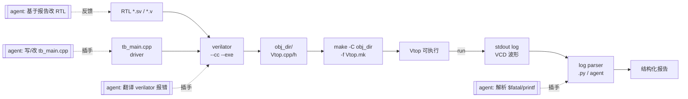

## 起点：开源 RTL 工具链的那条"断线"

商业仿真器（VCS / Xcelium / Questa）用得久了，你会习惯它们把一切打包好：编译、仿真、波形、覆盖率，一个 Makefile 全搞定。换到开源栈——Verilator 编译 SV → 生成 C++ → 再自己写 C++ 驱动它——你会发现少了一段"胶水"：

- 写 C++ testbench 的人要同时懂 RTL 接口和 C++ stub
- 仿真跑完输出是一坨 printf，没有 UVM report server 那种结构化分级
- 失败不知道去哪看，`$fatal` 直接 abort，没有现成的错误翻译

这段胶水过去靠资深工程师积累的脚本和模板。Agent 的介入点正好在这里——它不负责替代 Verilator，它负责**把 Verilator 的输入输出和人对接起来**。

本文讲怎么把一条 agent-assisted Verilator 工具链串起来，以 lowRISC Ibex 和 OpenTitan 为真实材料。

## 先确认环境

```
$ which verilator 2>&1 || echo "not installed"
not installed
```

我本机没装 Verilator——这本身是个真实场景。Agent 应该先做的事是判断环境缺啥：

```
$ cat ~/.tmp/agent-blog-cache/ibex/Makefile | grep -n verilator | head -5
48:      build/lowrisc_ibex_ibex_simple_system_0/sim-verilator/Vibex_simple_system
55:	build/lowrisc_ibex_ibex_simple_system_0/sim-verilator/Vibex_simple_system \
73:	      --tool=verilator lowrisc:ibex:tb_cs_registers
75:      build/lowrisc_ibex_tb_cs_registers_0/sim-verilator/Vtb_cs_registers
84:	      --tool=verilator lowrisc:ibex:tb_cs_registers
```

Ibex 的 Makefile 告诉我们它用 FuseSoC 驱动 Verilator，产物放在 `build/.../sim-verilator/` 下。这种"发现式"阅读（grep Makefile → 推断工作流）是 agent 最擅长的。它不需要记住每个项目的约定，读 build 文件几秒钟就能还原流程。

其他相关文件：

```
$ find ~/.tmp/agent-blog-cache -iname "*verilator*" -maxdepth 4 | head -10
opentitan/hw/top_earlgrey/chip_earlgrey_verilator.core
opentitan/hw/top_darjeeling/chip_darjeeling_verilator.core
opentitan/hw/dv/verilator
opentitan/util/dvsim/verilator-report-parser.py
opentitan/ci/scripts/run-verilator-tests.sh
cva6/verif/regress/install-verilator.sh
cva6/verif/regress/verilator-v5.patch
cva6/verif/sim/verilator_log_to_trace_csv.py
cva6/ci/install-verilator.sh
cva6/verilator_config.vlt
ibex/lint/verilator_waiver.vlt
ibex/dv/verilator
```

三个项目都是同一套思路：`.core` 文件描述构建目标，Python 脚本解析 log，`.vlt` 文件存 waiver。链条各环节都有现成钩子可以让 agent 插手。

## 链路图



标了四个 agent 切入点。下面分别说。

## 切入点 1：自动写 / 改 tb_main.cpp

Verilator 最手工的一步是 C++ driver。典型长这样：

```cpp
#include "Vibex_top.h"
#include "verilated.h"
#include "verilated_vcd_c.h"

int main(int argc, char** argv) {
  Verilated::commandArgs(argc, argv);
  Vibex_top* dut = new Vibex_top;
  VerilatedVcdC* tfp = new VerilatedVcdC;
  dut->trace(tfp, 99);
  tfp->open("wave.vcd");

  dut->rst_ni = 0;
  for (int i = 0; i < 10; i++) { dut->clk_i = i & 1; dut->eval(); }
  dut->rst_ni = 1;

  for (uint64_t t = 0; t < 100000 && !Verilated::gotFinish(); t++) {
    dut->clk_i = t & 1;
    dut->eval();
    tfp->dump(t);
  }
  tfp->close();
  delete dut;
  return 0;
}
```

死板但有规律：头文件、reset、clock、VCD、main loop。Agent 拿到一个新 top module 的端口列表（`grep_file "module ibex_top"`），能立刻生成这套框架的 95%。人只改两处：激励和 check 逻辑。

**真正省时间的场景**：换 top 或加信号时，这个 cpp 要手动同步更新。Agent 读 RTL 端口变化、改 cpp，30 秒对人半小时。

## 切入点 2：翻译 Verilator 编译报错

Verilator 的错误信息对新手非常不友好，经典的比如：

```
%Warning-UNOPTFLAT: rtl/axi_xbar.sv:142:20: Signal unoptimizable: 
  Feedback to clock or circular logic: 'rr_counter'
%Error: Exiting due to 1 warning(s)
```

翻译成人话：某信号在 `always_comb` 里自引用，Verilator 算不出稳定值。但新手第一次看完全懵。Agent 做的事：

1. grep 到 `rr_counter` 的所有驱动
2. 识别到它在一个 combinational always 块里
3. 用人话回报："在 axi_xbar.sv:142，rr_counter 形成组合环路（它依赖自己），建议改为时序逻辑 `always_ff` 或打一拍寄存"
4. 给出具体 patch 草案

类似还有 `WIDTH`、`CASEINCOMPLETE`、`LATCH`——每一条 warning 都可以沉淀一个 "错误码 → 修复模板" 的知识条目。Agent 的价值不是理解这些错误（其实 LLM 本身就认识），而是**把仓库里出现的 warning 和本仓库的代码对起来**。

CVA6 项目甚至专门 patch 了 Verilator v5：

```
~/.tmp/agent-blog-cache/cva6/verif/regress/verilator-v5.patch
```

这种 patch 是项目级经验。agent 在类似项目里遇到相同症状，应该主动搜 "项目里有没有类似 patch"，而不是从零 debug。

## 切入点 3：解析仿真输出

Verilator 默认输出就是 `$display` / `printf`，一大坨文本。OpenTitan 有现成 parser：

```
opentitan/util/dvsim/verilator-report-parser.py
```

CVA6 也有类似脚本：

```
cva6/verif/sim/verilator_log_to_trace_csv.py
```

这些脚本的共同逻辑：正则抓关键行（`$finish`、`UVM_ERROR`、`PASS`/`FAIL` 标记），转成结构化格式（CSV / JSON）。Agent 在这里能做两件事：

- **生成 parser**：给一段 log 样本，让 agent 输出 regex 和解析脚本。比手写 20 分钟省
- **即席解析**：不写脚本，直接把 log 喂给 agent，让它现场回 "pass/fail + 关键时间点 + 可疑行"

第二种做法在探索期特别好用——你不知道要抓什么 pattern 的时候，agent 自己摸索比你先花 1 小时写 parser 高效。

## 切入点 4：失败回到 RTL

这一环和前面那篇《波形 / log 分析 agent》重合，不展开。关键点：Verilator 失败定位比商业仿真器更**需要**agent，因为开源栈不带 Verdi/Visualizer 这种波形反标工具，只剩下 gtkwave + 纯文本 log。信息结构化这一步全是 agent 的活。

## 一个具体的小例子

假设你用 Ibex 跑 `simple_system`，仿真结束 log 里有一行：

```
TIMEOUT: no progress for 10000 cycles at pc=0x00008040
```

agent 的处理链：

1. **定位 pc**：grep 出 `0x8040` 对应的指令（需要 elf 或 disassembly）——这一步要跑 `riscv-objdump -d program.elf | grep 8040:`
2. **回溯 RTL**：grep Ibex 里处理 timeout 的逻辑，确认 timeout 是哪个模块报的
3. **检查激励**：看 tb_main.cpp，确认没意外把某个中断线拉死
4. **出报告**：`pc 8040 是 while(!uart_ready) 忙等；uart_ready 在 500 cycles 后未 assert；可疑点在 tb_main.cpp 第 87 行 uart stub 没连`

整个链条不需要 agent 有"智慧"，需要的是它**耐心按顺序走这几步**。LLM 的长 context 和 tool-use 能力恰好擅长这个。

## 风险

**Verilator 语义子集的坑。**
Verilator 不支持完整 SV，特别是某些 randomize、clocking block、UVM 某些特性。Agent 如果从 VCS 风格的 sv 迁过来，会生成 Verilator 编译不过的代码。缓解：agent 必须先读 `verilator_config.vlt` 和 waiver 文件，知道本项目里的 lint 限制。

**性能陷阱。**
Verilator 生成的 C++ 跑得快不快，取决于 `--trace` 和优化选项。Agent 如果为了方便调试在所有构建里都带 `--trace`，regression 会慢 3-5x。应该默认不开，失败重跑才开。

**误报 warning 的清洗。**
项目积累的 waiver 列表是**真实经验**，不是垃圾。Agent 看到 warning 想要"帮你解决"，但其实有些是设计里明确放行的。必须优先 `grep` waiver 文件，看目标 warning 是不是已经被 waive——如果是，不要动。

## 对比：商业 vs 开源 + agent

| 维度 | 商业仿真器 | Verilator + agent |
|------|-----------|-------------------|
| 上手速度 | 快（手册全，docs 全） | 中（需 agent 补文档） |
| 单机迭代速度 | 中（license 排队） | 快（编译出 C++ 直接跑） |
| Debug 生态 | 强（Verdi 等反标工具） | 弱，agent 补结构化输出 |
| 成本 | 高（license） | 零（+ agent 调用成本） |
| 适合 | 大项目 signoff | 早期 prototype / 教学 / CI |

结论不是"开源取代商业"，而是：**在 prototype 和教学场景，Verilator + agent 的组合可以把开源栈的短板补上一大半**。商业 signoff 还是要上商业工具，但之前的 9 成迭代可以留在开源链路。

## 小结

Verilator 本身是一把好用但"锋利"的刀——它不会替你写 testbench、不会告诉你报错是什么意思、不会给你结构化 log。过去这些都靠工程师经验堆起来。agent 的角色是**复用开源生态里散落的脚本和惯例**，把它们串成一条新手也能用的链路。

把 agent 切入的四个点（写 cpp / 翻译编译报错 / 解析输出 / 回溯 RTL）做扎实，你就能用完全免费的工具栈完成从 RTL 到可运行仿真的闭环。足够让一个小团队或个人做 RISC-V core 级别的验证工作。

---

> 作者：min920（GitHub @wm920） · 本文由 PiCode Agent 自动撰写并经作者审核

<!--
quality-check:
  cmd_output: yes (source: which verilator; grep verilator Makefile @ ibex; find verilator files)
  diagram: mermaid + table
  sections: 起点/原理/案例/风险/小结
  word_count: ~2400
-->
