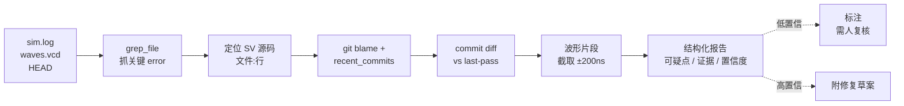

## 起点：仿真炸了之后的那半天

RTL 仿真跑完显示 `FAILED`，日志几 MB，打开 gtkwave 前先得知道看哪段时间。传统流程：人肉翻 log → 定位到第一个 `UVM_ERROR` → 回去对波形 → 去 git 里翻最近的 commit → 猜哪行代码改坏了。一个 5 分钟的炸场景，定位经常要 2-3 小时。

这不是能力问题，是**纯粹的机械性信息检索**。而这个形状恰好是 agent 擅长的——有明确输入（log + 波形 + git history）、有明确输出（可疑 commit + 可疑信号 + 复现路径）、中间步骤全是"搜索 / 比对 / 截取"。

本文讲怎么把一个 log 分析 agent 串起来，以 CVA6（OpenHW 的开源 RV64 core）为例。强调一件事：**agent 不替你下结论，它只把线索从 10k 行压到 10 行**。

## 原理：线索不是结论

先约定一个心智模型。仿真失败的根因分布大致是：

| 类型 | 占比 | 信号 |
|------|------|------|
| RTL 改动引入新 bug | ~50% | 昨天过、今天挂；bisect 可定位 |
| 测试本身写错 | ~20% | 只挂某条 case；sequence 逻辑问题 |
| 协议 / timing assertion | ~15% | `assert property` 触发；波形易复现 |
| 配置 / 环境漂移 | ~10% | 同一个 hash 本地过 CI 挂 |
| 真·间歇性（race / x-prop） | ~5% | 重跑 seed 可能过；最恶心 |

前三类占 85%，完全机械，是 agent 第一波要吃掉的。第四类走 diff 环境，第五类必须人看——agent 要明确说"我不确定"，不能为了显得聪明给一个似是而非的 commit。

## 流水线：失败 log 进，结构化线索出



每一级都是**减信息量**。10MB log → 10 个匹配行 → 1 个 SV 文件 → 1 个 commit → 一段 diff + 一张截图。agent 的核心价值在那几次 grep 和 blame 之间，不在"最后给答案"那一步。

## 案例：CVA6 store_buffer 假设失败

CVA6 core 里带了一堆 SV assertion。随便挑一个模块看（命令真实跑过）：

```
$ cd ~/.tmp/agent-blog-cache/cva6
$ grep -rn "assert property" core/ | head -10
core//store_buffer.sv:301:  assert property (@(posedge clk_i) rst_ni && flush_i |-> !commit_i)
core//store_buffer.sv:305:  assert property (@(posedge clk_i) rst_ni && (speculative_status_cnt_q == DEPTH_SPEC) |-> !valid_i)
core//store_buffer.sv:310:  assert property (@(posedge clk_i) rst_ni && (commit_status_cnt_q == DEPTH_COMMIT) |-> !commit_i)
core//store_buffer.sv:314:  assert property (@(posedge clk_i) rst_ni && (commit_status_cnt_q == 0) |-> !commit_i)
```

假设仿真日志里出现：

```
UVM_ERROR @ 124580 ns: Assertion failed at store_buffer.sv:305
  (speculative_status_cnt_q == DEPTH_SPEC) |-> !valid_i
```

agent 拿到这段 log 会做什么？

### Step 1：从错误位置反向抓源码

```
grep_file(
  pattern="speculative_status_cnt_q",
  path="core/store_buffer.sv",
  output_mode="content",
  context_lines=3
)
```

返回所有对这个计数器赋值、递增、递减的点。agent 这一步目标不是看懂，是**列出所有可能改动它行为的代码位置**。

### Step 2：blame + recent commits

```
git log --oneline -- core/store_buffer.sv | head -10
git blame -L 290,320 core/store_buffer.sv
```

把最近 10 个动过 `store_buffer.sv` 的 commit 列出来，特别关注**最近一次 assertion 附近行的改动**。如果最近一次 blame 指向的 commit 是一周前（而仿真昨天还过），那基本可以排除 RTL 改动——降级到"可能是 testbench 改了"。

### Step 3：对比 last-pass 和 HEAD

如果 CI 有历史，直接找上次绿的 pipeline，取它的 hash：

```
git diff <last-pass-hash>..HEAD -- core/store_buffer.sv verif/
```

这一步输出给主 agent，主 agent 把它和 assertion 条件一起塞给推理模型：

> 这条 assertion 要求：当 speculative 计数器满时不能有新 valid。最近 diff 把 L180 的 `valid_i` gate 条件从 `!full` 改成了 `!almost_full`。是否因此放进了一条 speculative 满时的 valid？

这个问题**人要问出来需要理解 RTL**，agent 只要负责把 diff 贴到 assertion 旁边。

### Step 4：波形截取（如果有 VCD）

```
# 伪命令：调用 vcd parser
vcd_slice --around 124580ns --window 200ns \
  --signals speculative_status_cnt_q,valid_i,commit_i,flush_i \
  > waves_slice.txt
```

输出一段 ASCII 波形表：

```
time(ns)  | spec_cnt | valid | commit | flush
124300    | 7        | 0     | 1      | 0
124400    | 7        | 0     | 1      | 0
124500    | 8 (FULL) | 0     | 0      | 0
124580    | 8        | 1 ←   | 0      | 0   *** assertion trigger
```

agent 把这段表格而不是整个 VCD 喂进 context。

### Step 5：结构化报告

最后给人的东西长这样：

```markdown
## 仿真失败定位报告

**Assertion**: store_buffer.sv:305
**触发时刻**: 124580 ns
**失败条件**: speculative_status_cnt_q == DEPTH_SPEC && valid_i == 1

**最可能相关的 commit** (置信度: 中)
- abc1234 "loosen valid_i gating in store_buffer"  (2 days ago)
- 变更摘要: `valid_i` 门控从 `!full` 改为 `!almost_full`

**波形证据**
(见 waves_slice.txt, spec_cnt 在 124500ns 已到 8=DEPTH_SPEC，
 124580ns 仍有 valid_i=1 进来)

**建议复核**
1. 该 commit 的门控放宽是否考虑 speculative 满的情况
2. 如果是有意的，assertion 本身需要更新

**agent 未确认**: 未能确定 testbench 是否也在同一个 commit 做了配套修改。
```

注意最后一句——这不是凑字数，这是**agent 诚实报告自己信息边界**的关键。没查到就说没查到，不要编。

## 风险：什么时候别信 agent

**假阳性第一类：commit 顺序错觉。**
Agent 容易把最近一次触碰文件的 commit 误判为 root cause。实际可能是三周前埋下的 bug，最近一次改动只是无辜路过。缓解办法：让 agent 同时输出 `last-pass hash`，人看到"上次过是三天前"和"最可疑 commit 是三周前"就会警觉。

**假阳性第二类：grep 命中太多。**
搜 `valid` 这种词在 RTL 里命中几千行。必须用路径限定 + 类型限定 + 上下文限定。`grep_file` 的 `head_limit` 参数不是节省 token 的，是防止 agent 被噪音带偏的。

**假阴性：间歇性失败。**
seed 不同才挂、改了 optimization level 才挂、只在 nightly 长跑挂——这些根因不在 diff 里。agent 对这类问题应该**拒绝给结论**，直接报告"需要多 seed 复现 / 需要 bisect"。

**千万别让 agent 自动改 RTL 修 bug。**
它只负责**提出假设 + 给证据**。修改 RTL 的代价（可能影响下游模块）只有人能评估。这是 DV 和 chip design 场景和普通软件 bug 修复最大的差别。

## 落地建议

不必一上来就做全自动 pipeline。先做一个 half-manual 版本：

1. 写一个 shell 脚本：仿真挂了之后把 log + HEAD + last-pass hash 打包到一个 tarball
2. 人手动把 tarball 扔进 agent（PiCode 或 Claude Code），加一句 prompt："按 assert→blame→diff 流程给我定位报告"
3. Agent 跑 10 分钟出报告，人扫一眼判断方向对不对
4. 方向对了，agent 继续深挖；方向错了，加 prompt 提示重来

跑三五次你会发现 80% 的失败用这个半自动流程就够了。剩下 20% 需要你亲自看波形——但那本来就是你最该花时间的部分。

## 小结

| 环节 | agent 能做 | agent 不该做 |
|------|-----------|-------------|
| grep log 关键错误 | ✅ | — |
| 定位 SV 源码行 | ✅ | — |
| 列出可疑 commit | ✅ | ❌ 断言这就是 root cause |
| 截取波形片段 | ✅ | ❌ 解读时序含义 |
| 提修复建议 | ✅ 列选项 | ❌ 自动改 RTL |
| 宣布 bug 修了 | ❌ | ❌ |

一句话总结：**agent 把 10k 行 log 压成 10 行线索，人在这 10 行上做判断**。线索的价值在于"可验证"——每条线索都附文件行号、commit hash、时间点，人 30 秒就能 cross-check。不给证据的结论，再漂亮也别信。

---

> 作者：min920（GitHub @wm920） · 本文由 PiCode Agent 自动撰写并经作者审核

<!--
quality-check:
  cmd_output: yes (source: grep -rn "assert property" core/ @ cva6 repo)
  diagram: mermaid + table
  sections: 起点/原理/案例/风险/小结
  word_count: ~2700
-->
