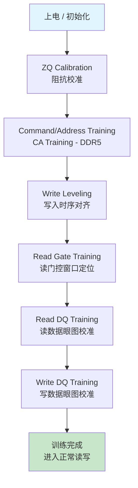

> DDR 基础篇介绍了 DRAM 的存储原理和时序参数。但在实际系统中，即使时序参数正确，如果 PHY（Physical Layer）的信号采样点不精确，数据仍然无法正确传输。**训练（Training）** 就是解决这个问题的核心机制——通过一系列校准步骤，让控制器和 DRAM 之间就"什么时候发、什么时候收"达成精确共识。

## 为什么需要训练？

### 物理层面的挑战

DDR 信号在 PCB 上传输时，不同信号线的延迟不一致：

```
                  Memory Controller (PHY)                    DRAM
                  ┌──────────────┐                     ┌──────────┐
                  │              │                     │          │
     DQS ────────│──────────────│─── 5.2ns ──────────│──────────│─── DQS
     DQ[0] ──────│──────────────│─── 5.4ns ──────────│──────────│─── DQ[0]
     DQ[7] ──────│──────────────│─── 5.1ns ──────────│──────────│─── DQ[7]
     CLK ────────│──────────────│─── 5.5ns ──────────│──────────│─── CLK
     CMD ────────│──────────────│─── 5.3ns ──────────│──────────│─── CMD
                  │              │                     │          │
                  └──────────────┘                     └──────────┘
```

**关键矛盾：**

| 因素 | 影响 |
|------|------|
| PCB 走线长度差异 | DQ 各 bit 到达时间不同（skew） |
| 封装寄生参数 | 芯片管脚引入额外延迟 |
| PVT 变化 | 电压/温度波动导致延迟漂移 |
| 频率提升 | DDR5-4800 周期仅 ~208ps，容错窗口极小 |

在 DDR5-4800 速率下，一个 UI（Unit Interval）只有约 **208ps**。如果 DQS 和 DQ 之间的 skew 超过 ±50ps，数据就可能采错。人工设计无法保证这种精度——必须靠硬件自动校准。

## 训练流程全景



每个阶段解决一个具体问题，且有严格的**先后依赖关系**——前一步的结果是后一步的前提。

## 阶段一：ZQ Calibration（阻抗校准）

**目标：** 校准 I/O 驱动器的输出阻抗和 ODT（On-Die Termination）阻值，确保信号质量。

**原理：**
- DRAM 的 ZQ 引脚外接精密电阻（通常 240Ω）
- 控制器发送 ZQ Calibration 命令
- DRAM 内部通过逐次逼近（SAR）调整 pull-up/pull-down 电阻，使输出阻抗匹配目标值

```
    DRAM Die
    ┌─────────────────────────┐
    │   Pull-Up Network       │
    │   ┌─┐┌─┐┌─┐┌─┐┌─┐     │
    │   │R││R││R││R││R│ ←SAR │    VDD
    │   └┬┘└┬┘└┬┘└┬┘└┬┘     │     │
    │    └──┴──┴──┴──┴───────│─────┘
    │              │          │
    │              ├──────────│──── DQ Pad
    │              │          │
    │    ┌──┬──┬──┬──┬───────│─────┐
    │   ┌┴┐┌┴┐┌┴┐┌┴┐┌┴┐     │     │
    │   │R││R││R││R││R│ ←SAR │    GND
    │   └─┘└─┘└─┘└─┘└─┘     │
    │   Pull-Down Network     │
    └─────────────────────────┘
              │
             ZQ Pin ── 240Ω ── GND (外部参考电阻)
```

**ZQ 校准完成后**，所有 I/O 的阻抗一致，后续训练步骤才有意义。

## 阶段二：CA Training（DDR5 新增）

**目标：** 对齐 Command/Address 信号与 CLK 的时序关系。

DDR4 的 CA 总线是 SDR（单倍速率），时序余量充裕，不需要专门训练。但 DDR5 的 CA 总线升级为 **DDR 传输**（双沿采样），频率翻倍后余量大幅缩小，必须训练。

**流程：**
1. 控制器在 CA 总线上发送已知 pattern
2. DRAM 将收到的 pattern 通过 DQ 总线回传
3. 控制器逐步调整 CA 信号的延迟（以 fine delay step 为单位）
4. 找到 pattern 正确匹配的 delay 窗口，取中心值

## 阶段三：Write Leveling（写入对齐）

**目标：** 让控制器发出的 DQS 到达 DRAM 时，与 DRAM 端的 CLK 上升沿对齐。

**为什么重要：**
- 写操作中，DRAM 用自己的 CLK 边沿去采样控制器发来的 DQS/DQ
- 但 CLK 和 DQS 走不同路径，到达 DRAM 的时间不同
- 必须调整 DQS 的发送时刻，补偿路径差异

**硬件机制：**

```
    Controller                              DRAM
    ┌────────┐                         ┌────────┐
    │        │   CLK ──── tFlight_CLK ──→│        │
    │        │                         │  比较器 │──→ DQ[0] 回传结果
    │        │   DQS ──── tFlight_DQS ──→│  (CLK  │
    │        │         ↑               │  vs    │
    │        │    可调延迟              │  DQS)  │
    └────────┘                         └────────┘
```

**训练步骤：**
1. 控制器进入 Write Leveling 模式（通过 MRS 命令配置 DRAM）
2. 控制器发出 DQS 脉冲，同时逐步增加 DQS 的延迟值
3. DRAM 在每个 CLK 上升沿采样 DQS 电平，结果通过 DQ[0] 返回：
   - DQS 在 CLK 上升沿之前到达 → 返回 **0**
   - DQS 在 CLK 上升沿之后到达 → 返回 **1**
4. 控制器检测到 0→1 的跳变点，该点即为 DQS 与 CLK 对齐的延迟值

**结果：** 每个 byte lane 得到独立的 DQS 发送延迟值，补偿各自的飞行时间差。

## 阶段四：Read Gate Training

**目标：** 确定读操作中 DQS 信号的有效窗口起止位置，即 PHY 应该在什么时刻"打开接收门控"去捕获 DQS。

**背景：** 读操作时 DQS 由 DRAM 驱动。但在非读操作期间，DQS 线处于高阻态（浮空），可能因噪声产生伪边沿。PHY 必须精确知道 DQS 的 preamble 何时到来，才能避免被伪边沿误触发。

**训练方法：**
1. 控制器发出读命令
2. PHY 逐步调整 gate 信号的延迟
3. 找到 DQS preamble 被正确检测的窗口范围
4. 将 gate 延迟设置在窗口中心

## 阶段五：Read DQ Training（读数据眼图校准）

**目标：** 在每个 DQS 边沿精确地采样 DQ 数据——找到最佳采样点。

**原理：** 读操作中，DRAM 将 DQS 和 DQ **源同步（source-synchronous）** 发出，DQS 边沿对齐 DQ 数据的中心。但经过 PCB 传输后，这种对齐关系会因 skew 而偏移。

```
          ┌───────┐       ┌───────┐       ┌───────┐
  DQS:  ──┘       └───────┘       └───────┘       └──
                      ↑               ↑
          ╔═══════╗       ╔═══════╗       ╔═══════╗
  DQ:   ──╢ Bit 0 ╟───────╢ Bit 1 ╟───────╢ Bit 2 ╟──
          ╚═══════╝       ╚═══════╝       ╚═══════╝

  理想情况：DQS 边沿正好在 DQ 数据眼图中心 ↑
  实际情况：需要微调 DQS 延迟才能对准中心
```

**数据眼图扫描过程：**

1. 控制器发出读命令，DRAM 返回已知的 pattern
2. PHY 以最小步长（通常 ~5ps）逐步调整 DQS 采样点的延迟
3. 在每个延迟点比较读回的数据与预期 pattern：
   - 匹配 → 该采样点在眼图内（passing）
   - 不匹配 → 该采样点在眼图外（failing）
4. 扫描完所有延迟步后，得到 pass/fail 边界
5. 取 passing 窗口的中心作为最终采样点

```
  Delay Steps →  0   5  10  15  20  25  30  35  40  45  50  55  60
  Pass/Fail:     F   F   F   P   P   P   P   P   P   P   F   F   F
                             │←─── Eye Width ───→│
                                      ↑
                               最终采样点（中心）
```

**DDR5 改进——Per-bit Deskew：**

DDR4 中，同一 byte lane 的 8 个 DQ 共享一个 DQS 延迟调整。DDR5 增加了 **per-bit deskew** 能力——每个 DQ bit 可以独立微调延迟，进一步收紧实际有效眼宽。

## 阶段六：Write DQ Training（写数据眼图校准）

**目标：** 调整写方向上 DQ 与 DQS 的相对延迟，确保 DRAM 端能正确采样。

**难点：** 写操作的接收端在 DRAM 内部，控制器无法直接观测 DRAM 内部的采样结果。

**解决方法（Write-Read-Back）：**
1. 控制器以当前 DQ 延迟设置写入已知 pattern
2. 立即读回该数据（使用已校准好的读路径）
3. 比较写入值与读回值：
   - 一致 → 当前写延迟在 DRAM 采样眼图内
   - 不一致 → 当前写延迟超出眼图边界
4. 逐步扫描 DQ 延迟，得到 passing 窗口，取中心值

这就是为什么 **Write Training 必须在 Read Training 之后**——它依赖已经校准好的读路径来验证写入的正确性。

## DDR4 vs DDR5 训练差异总结

| 特性 | DDR4 | DDR5 |
|------|------|------|
| CA Training | 不需要（SDR，余量足） | **必须**（CA 改为 DDR 传输） |
| Write Leveling | 支持 | 支持，精度要求更高 |
| DQ Training 粒度 | Per-byte lane | **Per-bit deskew** |
| 训练主导方 | 控制器主导 | 引入 **DRAM-side training** |
| 通道架构 | 64-bit 单通道 | 2×32-bit 子通道，独立训练 |
| 温度补偿 | ZQ Cal 周期执行 | 增加 DQS interval 自动补偿 |

## 训练失败的常见表现与调试

训练不是"跑一次就完"的流程。在实际芯片 bring-up 中，训练失败是最常见的问题之一：

| 故障现象 | 可能原因 | 排查方向 |
|----------|----------|----------|
| Write Leveling 找不到跳变沿 | CLK 或 DQS 信号质量差 | 检查 SI 仿真、测眼图 |
| Read Training 眼宽过窄 | PCB 串扰 / ISI | 检查走线间距、长度匹配 |
| 训练通过但跑 memtest 报错 | 训练 pattern 覆盖不足 | 增加 stress pattern、检查 Vref |
| 高温下训练失败 | PVT 变化超出补偿范围 | 检查 ODT 设置、增加 margin |
| 单个 byte lane 失败 | 该 lane 硬件缺陷 | 检查焊接、换片验证 |

## 实际系统中训练的时机

训练并非只在上电时执行一次：

1. **冷启动训练（Boot Training）**：上电后完整执行所有步骤
2. **热重训练（Re-training）**：温度变化超过阈值时触发（DDR5 支持）
3. **S3 Resume**：从睡眠恢复时，部分训练结果可从 NVRAM 恢复，跳过完整训练以加速启动
4. **Periodic Retraining**：某些控制器支持后台周期性微调，补偿慢速漂移

## 总结

DDR 训练流程的本质是一场**自动化的信号完整性校准**。它通过硬件机制自动测量并补偿 PCB、封装、PVT 带来的时序偏差，让数字设计者不必精确掌控每一根走线的延迟——只要偏差在训练可补偿范围内，系统就能正常工作。

理解训练流程对以下工作直接有帮助：
- **芯片设计**：设计 DDR PHY 时理解每个校准模块的功能
- **PCB 设计**：知道哪些 skew 是可训练补偿的，哪些必须严格控制
- **Firmware 开发**：编写 DDR 初始化代码时理解训练序列的依赖关系
- **Bring-up 调试**：训练失败时快速定位问题层级

> 作者：min920（GitHub @wm920） · 本文由 PiCode Agent 自动撰写并经作者审核
