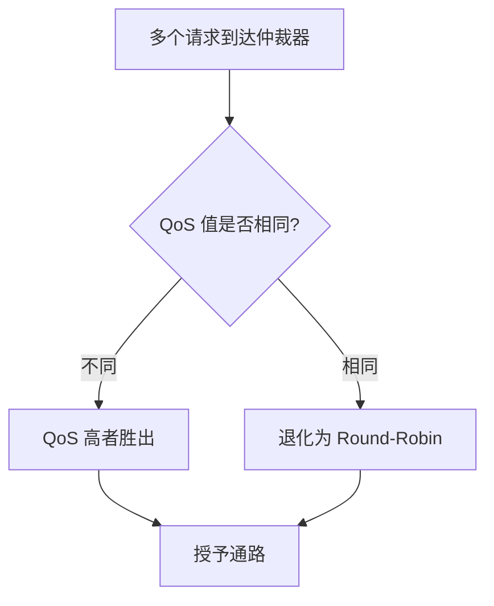

## 为什么仲裁是 NoC 的核心问题

片上网络（NoC）的本质是多个 Initiator 共享有限的互联通路和 Target 端口。当多个请求同时竞争同一资源时，**仲裁器（Arbiter）** 决定谁先通过、谁等待。仲裁策略直接影响三个关键指标：

1. **延迟确定性**：实时场景（如显示控制器）能否在 deadline 内拿到数据
2. **带宽利用率**：互联通路是否被高效填满
3. **公平性**：低优先级流量会不会被饿死（starvation）

FlexNOC 作为 Arteris 的商用 NoC IP，在仲裁层提供了多种可配置策略，本文逐一拆解其机制与适用场景。

## FlexNOC 仲裁器在网络中的位置

```text
┌──────────┐    ┌──────────┐    ┌──────────┐
│Initiator0│    │Initiator1│    │Initiator2│
│  (CPU)   │    │  (GPU)   │    │  (DMA)   │
└────┬─────┘    └────┬─────┘    └────┬─────┘
     │               │               │
     ▼               ▼               ▼
┌─────────────────────────────────────────────┐
│              NIU (Initiator Side)            │
│  Transaction Mapping / Packetization        │
└────────────────────┬────────────────────────┘
                     │  Packets
                     ▼
┌─────────────────────────────────────────────┐
│          Transport Layer (Switch Fabric)      │
│                                              │
│   ┌─────────────────────────────────┐       │
│   │  ★ ARBITER (本文重点)            │       │
│   │  - 多输入端口竞争同一输出端口    │       │
│   │  - 按策略选择胜出者             │       │
│   └─────────────────────────────────┘       │
│                                              │
└────────────────────┬────────────────────────┘
                     │
                     ▼
┌─────────────────────────────────────────────┐
│              NIU (Target Side)               │
│  Depacketization / Protocol Conversion      │
└────────────────────┬────────────────────────┘
                     │
                     ▼
            ┌────────────────┐
            │  Target (DDR)  │
            └────────────────┘
```

仲裁发生在 **Switch Fabric 内部**，每个交叉开关（crossbar）的输出端口都配有独立仲裁器。当 N 个输入端口同时有 packet 需要从同一输出端口发出时，仲裁器做出选择。

## 核心仲裁策略详解

### 1. 固定优先级（Fixed Priority）

最简单的策略：每个输入端口分配一个静态优先级编号，编号最高者永远优先。

**工作方式：**
- 优先级在 SoC 集成时通过寄存器配置，运行时不变
- 高优先级端口只要有请求，低优先级端口就必须等待
- 仲裁延迟极低（纯组合逻辑判断）

**适用场景：**
- 系统中存在绝对实时约束的 Master（如 Display Controller 必须在 blanking interval 内读回 framebuffer）
- Master 数量少、流量模式可预测

**风险：**
- 低优先级 Master 可能被饿死（starvation）
- 不适合 Master 数量多或流量突发性强的系统

### 2. 轮转仲裁（Round-Robin）

经典的公平策略：每次仲裁后，上一次的胜出者优先级降到最低，其余依次轮转。

**工作方式：**

```text
时刻 T0: 优先级顺序 A > B > C → A 胜出
时刻 T1: 优先级顺序 B > C > A → B 胜出
时刻 T2: 优先级顺序 C > A > B → C 胜出
时刻 T3: 回到 A > B > C（周期循环）
```

**特征：**
- 长期来看每个端口获得相等的仲裁机会
- 无 starvation 风险
- 不区分流量紧急程度，实时流量无法获得确定性保障

**适用场景：**
- 所有 Master 地位对等（如多核 CPU cluster 内部的 L2 → L3 通路）
- 不存在硬实时约束

### 3. 加权轮转（Weighted Round-Robin, WRR）

Round-Robin 的增强版：每个端口分配一个权重值 W，表示在一轮中可以连续胜出的次数。

**工作方式：**

```text
配置: A 权重=3, B 权重=2, C 权重=1
一轮分配: A A A B B C → 然后重新开始
```

权重值通过寄存器配置，通常以 packet 或 beat 为单位计数。

**特征：**
- 带宽按权重比例分配（上例中 A 获得 50%、B 获得 33%、C 获得 17%）
- 仍保证公平性——即使权重最低的端口也不会被饿死
- 权重可以在运行时通过软件动态调整

**适用场景：**
- 不同 Master 带宽需求差异明显但都不能饿死（如 GPU 需要大带宽，但 Audio DMA 也必须持续传输）

### 4. 基于 QoS 的优先级仲裁（QoS-Aware）

FlexNOC 支持将 AXI AxQOS 信号（4-bit，0-15）作为仲裁依据。这是 **动态优先级** 机制：同一个 Master 在不同时刻可以发出不同 QoS 值的事务。

**工作方式：**
- NIU 将 AXI 事务的 AxQOS 字段封装进 NoC packet header
- Switch 仲裁器比较竞争者的 QoS 值，高者优先
- QoS 值相同时，退化为次级仲裁策略（通常是 Round-Robin）



**特征：**
- 动态适应：软件可以根据运行时状态调整 Master 的 QoS 输出
- 结合 QoS 调节器（Regulator），可实现带宽预留和延迟上界
- 比纯固定优先级更灵活，比纯 Round-Robin 更有区分度

**适用场景：**
- 复杂 SoC（手机/车载芯片），多个场景动态切换优先级需求

### 5. 令牌桶限速 + 仲裁（Rate Regulation）

严格来说这不是独立的仲裁策略，而是 FlexNOC 在仲裁之前的 **流量整形** 机制，与仲裁器协同工作：

- 每个 Initiator NIU 可配置令牌桶参数（带宽上限 + 突发容量）
- 超出限速的事务会被 NIU 暂时阻塞，不进入 Switch
- 仲裁器看到的竞争者都是已通过限速检查的合法流量

这种 "先整形、再仲裁" 的两级架构可以防止单个 Master 垄断互联带宽。

## 策略对比总结

| 策略 | 延迟确定性 | 公平性 | 配置复杂度 | 典型用途 |
|------|-----------|--------|-----------|---------|
| Fixed Priority | ★★★★★ | ★☆☆☆☆ | 低 | 硬实时 Master |
| Round-Robin | ★★☆☆☆ | ★★★★★ | 最低 | 对等 Master |
| Weighted RR | ★★★☆☆ | ★★★★☆ | 中 | 差异化带宽需求 |
| QoS-Aware | ★★★★☆ | ★★★☆☆ | 高 | 动态场景切换 |
| Rate Regulation | ★★★★☆ | ★★★★☆ | 高 | 防垄断 + 带宽预留 |

## 实际配置示例：多媒体 SoC

以一个典型的多媒体 SoC 为例，展示如何组合使用多种仲裁策略：

```text
系统组成:
- CPU Cluster (4 core): 通用计算
- GPU: 图形渲染，高带宽突发
- Display Controller: 读 framebuffer，硬实时
- Video Decoder: 中等带宽，有软实时要求
- Audio DMA: 低带宽，但不能中断

仲裁配置方案:
┌─────────────────────────────────────────────────────┐
│ DDR Controller 前的仲裁器配置:                        │
│                                                      │
│ 第一级: QoS-Aware 仲裁                               │
│   - Display Controller: QoS=15 (最高，硬实时)         │
│   - Video Decoder:      QoS=10 (软实时)              │
│   - CPU/GPU/Audio:      QoS=5  (默认)               │
│                                                      │
│ 第二级 (QoS 相同时): Weighted Round-Robin            │
│   - GPU:   权重=4 (需要大带宽)                        │
│   - CPU:   权重=3                                    │
│   - Audio: 权重=1 (带宽需求小但必须保证)              │
│                                                      │
│ 前置整形: Audio DMA 配置令牌桶                        │
│   - 限速 50MB/s，突发 4KB                            │
│   - 防止 DMA 异常时洪泛互联                          │
└─────────────────────────────────────────────────────┘
```

这种分层组合策略是 FlexNOC 在实际 SoC 中最常见的用法：**QoS 分级兜底实时性，WRR 在同级之间分配带宽，令牌桶防止意外洪泛**。

## 仲裁与死锁

仲裁策略设计不当可能引发死锁。FlexNOC 通过以下机制规避：

1. **虚拟通道（Virtual Channel）**：将物理链路分为多个逻辑通道，不同流量类别互不阻塞
2. **分离式事务（Split Transaction）**：请求和响应走独立通道，避免请求-响应循环依赖
3. **超时机制**：仲裁器可配置超时计数器，长时间未获得服务的请求强制提升优先级

## 设计选型建议

1. **先明确约束再选策略**：如果系统有硬实时 Master，优先用 Fixed Priority 或 QoS 最高级保护它
2. **不要过度使用固定优先级**：超过 2-3 个不同优先级层就应该考虑 WRR 或 QoS 动态方案
3. **务必做仿真验证**：仲裁策略的效果高度依赖实际流量模式，理论分析不能替代 cycle-accurate simulation
4. **预留调整空间**：优先选择运行时可通过寄存器配置的方案（如 WRR 权重、QoS 映射表），避免固化

## 总结

FlexNOC 的仲裁机制不是单一算法，而是一套 **可组合的策略工具箱**。理解每种策略的权衡（延迟 vs 公平 vs 复杂度），结合具体 SoC 的流量特征进行分层配置，才是正确的使用方式。核心原则：

- 实时流量用优先级保护
- 非实时流量用 WRR 按比例分配
- 全局用令牌桶限速防止失控
- 虚拟通道隔离不同类别，规避死锁

> 作者：min920（GitHub @wm920） · 本文由 PiCode Agent 自动撰写并经作者审核
