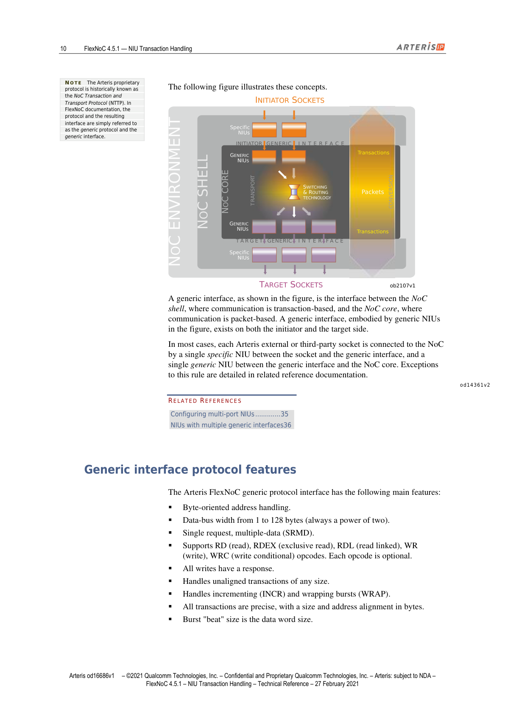

> **说明**：本系列基于 Arteris IP《FlexNoC NIU Transaction Handling Technical Reference》（FlexNoC 4.5.1，2021年2月27日版）逐章翻译整理，采用中英双语对照排版，原文以引用块呈现，译文紧随其后。信号名、参数名、寄存器字段名保留英文原样。

---

## About the FlexNoC NIU Transaction Handling Technical Reference（文档说明）

> The Arteris FlexNoC NIU Transaction Handling Technical Reference is primarily for chip architects who want to understand how FlexNoC network interface units (NIU) handle transactions within FlexNoC interconnects, and for design implementation engineers who want to know how to configure them with FlexNoC FlexArtist software.

《Arteris FlexNoC NIU 事务处理技术参考手册》主要面向两类读者：一是希望理解 FlexNoC 网络接口单元（NIU）如何在 FlexNoC 互连中处理事务的芯片架构师；二是希望使用 FlexNoC FlexArtist 软件对其进行配置的设计实现工程师。

> It covers, in particular:
>
> - Transformations performed on transactions in transit between initiators and targets.
> - Handling of unsupported transactions that are responded to as errors.
> - Handling of transaction attributes such as byte enables, user info, and so forth.
> - Transaction handling documentation only briefly covers performance-related aspects such as pending transactions, ordering constraints, latency, throughput, or QoS requirements, about which more information is available in related documentation.

本手册重点涵盖以下内容：

- 事务在 initiator（发起方）和 target（目标方）之间传输过程中所经历的转换处理。
- 不支持的事务如何以错误响应方式处理。
- 事务属性的处理，例如字节使能（byte enable）、用户信息（user info）等。
- 事务处理文档仅简要涉及性能相关方面，如挂起事务（pending transactions）、排序约束（ordering constraints）、延迟（latency）、吞吐量（throughput）或 QoS 需求，更多相关信息可参见配套文档。

> FlexNoC documentation is available directly through the FlexNoC FlexArtist software help system, which you can access from the software by pressing the F1 key, or by clicking the corresponding command on the Help menu.

FlexNoC 文档可直接通过 FlexNoC FlexArtist 软件帮助系统访问，按 F1 键或点击帮助菜单中的对应命令即可打开。

### 相关文档（Designer's Manuals）

| 文档名称 | 说明 |
|---|---|
| FlexNoC Concepts | 概念总览 |
| FlexNoC Addressing and Security | 寻址与安全 |
| FlexNoC Clocking and Reset | 时钟与复位 |
| FlexNoC Memory Units | 存储单元 |
| **FlexNoC NIU Transaction Handling** | **本文档（NIU 事务处理）** |
| FlexNoC Observability | 可观测性 |
| FlexNoC Physical Implementation | 物理实现 |
| FlexNoC Power Management | 电源管理 |
| FlexNoC Quality-of-Service | 服务质量（QoS） |
| FlexNoC Run-time Configuration | 运行时配置 |
| FlexNoC Resilience Features | 弹性特性 |

---

## Concepts（概念篇）

> The Arteris FlexNoC network interface unit (NIU) is fundamental at the transaction-level within FlexNoC interconnects.

Arteris FlexNoC 网络接口单元（NIU，Network Interface Unit）是 FlexNoC 互连中事务级处理的核心组件。

> A typical example of NIU transaction handling occurs when initiator sockets emit burst transactions destined for end points that are not burst capable. In this situation, transactions are split within the NoC prior to delivery to a target socket.

NIU 事务处理的一个典型场景：当 initiator socket（发起方套接字）发出的突发事务（burst transaction）目标端点不支持突发传输时，事务会在 NoC 内部被拆分（split），再送达 target socket（目标套接字）。

> This section covers the concepts underlying the technology.

本章介绍该技术的基础概念。

---

### Generic interfaces, specific NIUs, and transaction handling（通用接口、专用 NIU 与事务处理）

> The Arteris internal FlexNoC generic protocol interface makes it possible to handle transactions exchanged between Arteris-external or third-party sockets that operate under different protocols.

Arteris 内部的 FlexNoC 通用协议接口（generic protocol interface）使得不同协议的外部或第三方 socket 之间的事务交换成为可能。

> In FlexNoC technology, the term **generic** qualifies functionality that is largely independent of the specifics of Arteris-external or third-party socket protocols, and the term **specific** qualifies functionality that is heavily dependant on them.

在 FlexNoC 技术中，**generic（通用）** 指的是与外部或第三方 socket 协议细节基本无关的功能；**specific（专用）** 指的是与这些协议细节强相关的功能。

> Consequently, FlexNoC specific and generic NIUs exploit the Arteris protocol to convert transactions to generic descriptions that can be handled by the FlexNoC interconnect core.

因此，FlexNoC 的专用 NIU 和通用 NIU 都利用 Arteris 协议，将事务转换为 FlexNoC 互连核心（interconnect core）能够处理的通用描述。

> Specific NIUs are thus fundamental to protocol conversion, and are referred to differently depending on where they are situated:
>
> - When between the socket protocol interface and the generic interface to the core, they are called **specific initiator NIUs**.
> - When between the generic interface and the socket protocol interface, they are called **specific target NIUs**.

专用 NIU 是协议转换的核心，根据其位置不同有不同的称呼：
- 位于 socket 协议接口与核心通用接口之间时，称为**专用 initiator NIU（specific initiator NIU）**。
- 位于通用接口与 socket 协议接口之间时，称为**专用 target NIU（specific target NIU）**。

> The following figure illustrates these concepts.

下图展示了上述概念。

*图1：NIU 架构示意——通用接口位于 NoC shell 与 NoC core 之间，专用 NIU 负责协议转换（原文：Figure illustrating generic and specific NIU concepts）*

> A generic interface, as shown in the figure, is the interface between the NoC shell, where communication is transaction-based, and the NoC core, where communication is packet-based. A generic interface, embodied by generic NIUs in the figure, exists on both the initiator and the target side.

如图所示，通用接口（generic interface）是 NoC shell（事务级通信）与 NoC core（分组级通信）之间的接口。通用接口由图中的通用 NIU（generic NIU）体现，同时存在于 initiator 侧和 target 侧。

> In most cases, each Arteris external or third-party socket is connected to the NoC by a single specific NIU between the socket and the generic interface, and a single generic NIU between the generic interface and the NoC core. Exceptions to this rule are detailed in related reference documentation.

在大多数情况下，每个外部或第三方 socket 通过一个专用 NIU（连接 socket 与通用接口）和一个通用 NIU（连接通用接口与 NoC core）接入 NoC。特殊情况详见相关参考文档。

> **Related References**
> - Configuring multi-port NIUs … p.35
> - NIUs with multiple generic interfaces … p.36

**相关参考**
- 多端口 NIU 配置 … p.35
- 具有多个通用接口的 NIU … p.36

---

### Generic interface protocol features（通用接口协议特性）

> **Note:** The Arteris proprietary protocol is historically known as the NoC Transaction and Transport Protocol (NTTP). In FlexNoC documentation, the protocol and the resulting interface are simply referred to as the generic protocol and the generic interface.

**注意：** Arteris 专有协议历史上被称为 NoC Transaction and Transport Protocol（NTTP，NoC 事务与传输协议）。在 FlexNoC 文档中，该协议及其接口统称为通用协议（generic protocol）和通用接口（generic interface）。

> The Arteris FlexNoC generic protocol interface has the following main features:
>
> - Byte-oriented address handling.
> - Data-bus width from 1 to 128 bytes (always a power of two).
> - Single request, multiple-data (SRMD).
> - Supports RD (read), RDEX (exclusive read), RDL (read linked), WR (write), WRC (write conditional) opcodes. Each opcode is optional.
> - All writes have a response.
> - Handles unaligned transactions of any size.
> - Handles incrementing (INCR) and wrapping bursts (WRAP).
> - All transactions are precise, with a size and address alignment in bytes.
> - Burst "beat" size is the data word size.

Arteris FlexNoC 通用协议接口具备以下主要特性：

- 以字节为单位的地址处理。
- 数据总线宽度为 1～128 字节（必须是 2 的幂次）。
- 单请求多数据（SRMD，Single Request Multiple Data）模式。
- 支持以下操作码（每项均可选）：
  - `RD`（读）
  - `RDEX`（独占读，exclusive read）
  - `RDL`（链式读，read linked）
  - `WR`（写）
  - `WRC`（条件写，write conditional）
- 所有写操作均有响应（response）。
- 支持任意大小的非对齐（unaligned）事务。
- 支持递增突发（INCR）和回绕突发（WRAP）。
- 所有事务均为精确（precise）事务，大小和地址以字节对齐。
- 突发"节拍"（beat）大小等于数据字宽（data word size）。

#### Optional features（可选特性）

> - Handles other burst types including streaming, or fixed, bursts (STRM), and BLOCK (2D) bursts.
> - Flow and sequence capability supports out-of-order transactions.
> - Response interleaving between out-of-order transactions.
> - Handles locked sequences of transactions (will be kept atomic by the NoC).
> - QoS signaling.
> - User signals sampled with the address phase.
> - Security signals sampled with the address phase.
> - Handles power disconnect signals.
> - Error codes with response phase.

- 支持其他突发类型，包括流式/固定突发（`STRM`）和块（2D）突发（`BLOCK`）。
- 流（flow）和序列（sequence）能力，支持乱序（out-of-order）事务。
- 乱序事务之间的响应交织（response interleaving）。
- 支持锁定事务序列（NoC 保证其原子性）。
- QoS 信号传递。
- 与地址阶段（address phase）同步采样的用户信号（user signals）。
- 与地址阶段同步采样的安全信号（security signals）。
- 支持断电信号（power disconnect signals）处理。
- 响应阶段（response phase）携带错误码（error codes）。

---

### Parameterization of the generic interface（通用接口的参数化）

> No detailed understanding of the FlexNoC generic protocol is required to configure a FlexNoC interconnect instance because FlexArtist software automatically configures most of the FlexNoC generic interface based on parameter settings for socket protocol.

配置 FlexNoC 互连实例无需深入了解 FlexNoC 通用协议，因为 FlexArtist 软件会根据 socket 协议的参数设置，自动完成大部分通用接口的配置。

> This automatic parameterization occurs as follows:
>
> - For **initiator NIUs**, FlexArtist configures native support of as many initiator socket features as possible, in order to minimize processing in the specific NIU.
>   When the generic interface does not provide native support, processing takes place in the specific NIU, as in the case of certain AHB, AXI, or OCP protocol features, for example:
>   - Imprecise or early terminated bursts.
>   - Symmetric protocols (one request phase per data phase).
>   - Bursts of word size less than the data bus width.
> - For **target NIUs**, FlexArtist minimizes tasks in the specific NIU by supporting, if possible, only a subset of target protocol features: tasks usually include simple signal re-encodings, only rarely issuing imprecise bursts, and never narrow bursts, for example.
>   Mandatory protocol conversions, such as SRMD to MRMD, are performed in the specific NIU.

自动参数化的工作方式如下：

- 对于 **initiator NIU**，FlexArtist 尽量在通用接口层面原生支持 initiator socket 的特性，以减少专用 NIU 中的处理开销。当通用接口无法原生支持时，处理工作落到专用 NIU 中，例如以下 AHB、AXI 或 OCP 协议特性：
  - 非精确（imprecise）突发或提前终止（early terminated）突发。
  - 对称协议（每个数据阶段对应一个请求阶段）。
  - 字长（word size）小于数据总线宽度的突发。
- 对于 **target NIU**，FlexArtist 尽量减少专用 NIU 的任务，仅支持目标协议特性的一个子集：通常只做简单的信号重编码，极少发出非精确突发，且从不发出窄突发（narrow burst）。强制性的协议转换（如 SRMD 转 MRMD）在专用 NIU 中完成。

> **Note:** It is possible to alter certain automatic settings for the generic interface in order to optimize particular aspects of the design.

**注意：** 可以修改通用接口的某些自动配置项，以优化设计的特定方面。

---

### Transaction processing（事务处理）

> In FlexNoC interconnects, transaction processing occurs at network interfaces (NIUs). Transactions comprise requests and optionally, responses. To process complete transactions, NIUs pair responses with requests.

在 FlexNoC 互连中，事务处理发生在网络接口（NIU）处。事务由请求（request）和可选的响应（response）组成。NIU 通过将响应与请求配对来完成完整的事务处理。

> **Note:** Routing, QoS, and other features are applied during transport in FlexNoC interconnects.

**注意：** 路由（routing）、QoS 及其他特性在 FlexNoC 互连的传输过程中应用。

#### Transaction execution（事务执行）

> A transaction is executed by a single target IP, unless the transaction:
>
> - Is sent to targets that are entirely internal to the NoC, such as service network targets.
> - Is split into fragments that are executed by different targets.
> - Cannot be executed by any target, and consequently returns an error, for example an address decode error.

一个事务通常由单一 target IP 执行，以下情况除外：

- 目标是 NoC 内部的目标（如服务网络目标，service network target）。
- 事务被拆分为多个片段（fragment），分别由不同 target 执行。
- 事务无法被任何 target 执行，因此返回错误（如地址解码错误）。

#### Error marking（错误标记）

> Transactions can be marked in error by:
>
> - FlexNoC NIUs.
> - Interconnect transport elements, such as firewalls, power disconnect units, and so forth.
> - Target IPs.

以下组件可以将事务标记为错误：

- FlexNoC NIU。
- 互连传输元件，如防火墙（firewall）、断电单元（power disconnect unit）等。
- Target IP。

---

### NIU transaction issuing limitations（NIU 事务发起限制）

> There are a number of situations that limit the ability of FlexNoC NIUs to issue transactions.

多种情况会限制 FlexNoC NIU 发起事务的能力。

> For example, FlexNoC generic initiator NIUs can stall the processing of the request flow for the following reasons:
>
> - Lack of available pending transaction contexts.
> - Lack of available pending order IDs, if their number is less than the maximum number of pending transactions.
> - Lack of reassembly buffers, if their number is less than the maximum number of pending transactions.
> - Read response interleaving avoidance. When an initiator NIU is configured not to support read response interleaving, that is, by setting its generic parameter `useInterleave` to `False`, the NIU can stall to prevent read response interleaving caused either by splitting at an initiator side, or interleaving at a target.
> - Ordering constraints: a transaction that uses the same sequence ID as a previous transaction destined for another target.
> - Shaping enabled.

例如，FlexNoC 通用 initiator NIU 可能因以下原因阻塞（stall）请求流的处理：

- 无可用的挂起事务上下文（pending transaction context）。
- 无可用的挂起排序 ID（pending order ID），当排序 ID 数量小于最大挂起事务数时出现。
- 无可用的重组缓冲区（reassembly buffer），当其数量小于最大挂起事务数时出现。
- 避免读响应交织（read response interleaving）。当 initiator NIU 被配置为不支持读响应交织时（即通用参数 `useInterleave` 设为 `False`），NIU 会阻塞以防止由 initiator 侧拆分或 target 侧交织引发的读响应交织。
- 排序约束：某事务与前一个发往不同 target 的事务使用了相同的序列 ID（sequence ID）。
- 整形（shaping）已启用。

> Some FlexNoC NIU special features can also stall the processing of the request flow, for example:
>
> - QoS boxes set to limiter mode at run time.
> - Lack of reorder buffer resources when NIUs implement reorder buffers.

部分 FlexNoC NIU 特殊功能也可能阻塞请求流处理，例如：

- QoS 限速盒（QoS box）在运行时设为限制（limiter）模式。
- NIU 实现了乱序缓冲区（reorder buffer）但资源不足。

> Sometimes limitations are introduced indirectly by configuring FlexNoC specific NIUs for third-party protocols, typical examples of which are:
>
> - Pending transaction handling for the ARM AHB protocol.
> - Sequence ID allocation for OCP sockets without write responses.
> - Sequence ID allocation for ARM AXI sockets, for which AXI IDs are compressed into FlexNoC generic signal `SeqID`.

有时，限制是由配置 FlexNoC 专用 NIU 适配第三方协议时间接引入的，典型示例包括：

- ARM AHB 协议的挂起事务处理。
- 无写响应的 OCP socket 的序列 ID 分配。
- ARM AXI socket 的序列 ID 分配——AXI ID 被压缩映射到 FlexNoC 通用信号 `SeqID` 中。

> These limitations can occur combined with the generic initiator NIU ordering-related issues.

这些限制可能与通用 initiator NIU 的排序相关问题叠加出现。

> Limitations can also be imposed by targets, the obvious example being the number of pending transactions, or by the number of sequence IDs that can be allocated, which is equal to 2^wSeqId when parameter `seqIDAllocation` is set to `DYNAMIC` mode (Architecture: Performance: Generic NIU), or again, by third-party socket protocols, such as AHB.

限制也可能由 target 端施加，典型示例是最大挂起事务数，或可分配的序列 ID 数量——当参数 `seqIDAllocation` 设为 `DYNAMIC` 模式（Architecture: Performance: Generic NIU）时，序列 ID 数量等于 2^wSeqId；也可能来自第三方 socket 协议（如 AHB）。

> **Note:** When NIUs are set with a number of pending order IDs smaller than the number of pending transactions, adequate performance is achieved only if the traffic through these NIUs uses the same ID, and is destined for the same target.

**注意：** 当 NIU 配置的挂起排序 ID 数量少于挂起事务数量时，只有当通过该 NIU 的流量使用相同 ID 且目标为同一 target 时，才能保证足够的性能。

---

## 本章小结

本章介绍了 FlexNOC NIU 事务处理的核心概念：

| 概念 | 说明 |
|---|---|
| Generic Interface（通用接口） | NoC shell（事务级）与 NoC core（分组级）之间的标准内部接口 |
| Specific NIU（专用 NIU） | 负责外部协议（AXI/AHB/OCP 等）与通用接口之间的协议转换 |
| Generic NIU（通用 NIU） | 负责通用接口与 NoC core 之间的事务处理 |
| SRMD | 单请求多数据模式，是通用接口的基本数据传输模式 |
| Initiator NIU | 位于 initiator socket 与 NoC 之间，处理请求发出 |
| Target NIU | 位于 NoC 与 target socket 之间，处理请求接收与响应返回 |
| Transaction Stall | NIU 因资源不足、排序约束或 QoS 限制而阻塞请求流 |
