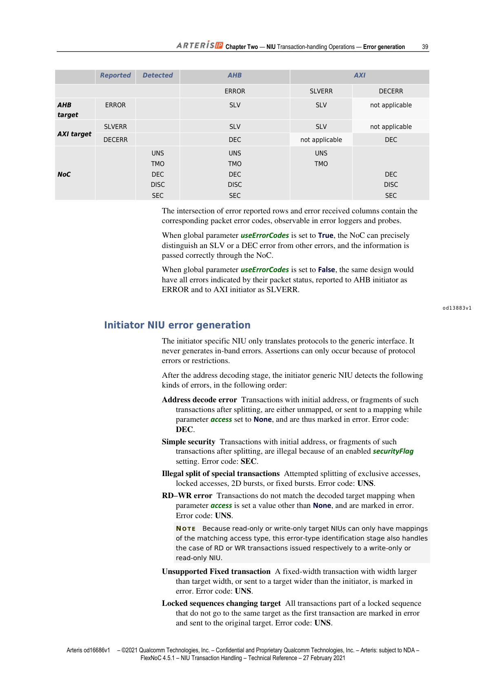

> **说明**：本文基于 Arteris IP《FlexNoC NIU Transaction Handling Technical Reference》（FlexNoC 4.5.1，2021年2月27日版）第二章后半部分翻译整理，采用中英双语对照排版。信号名、参数名保留英文原样，首次出现时括号内附中文释义。

---

## Block (2D) Bursts（块突发 / 二维突发）

> 2D bursts are only supported on OCP protocol (with `burstseq_blck_enable=1`). They may however be issued to OCP MRMD targets not supporting 2D bursts, in which case they will be split into single accesses. This can be typically used to issue 2D burst to SRAMs.

2D burst（二维突发）仅在 OCP 协议下支持（需设置 `burstseq_blck_enable=1`）。但此类事务可以发往不支持 2D burst 的 OCP MRMD 目标，届时会被拆分为单次访问。此特性常用于向 SRAM 发起二维突发访问。

> The following rules apply for a 2D burst transaction to be sent from an initiator IP to a target IP. They apply in sequence, that is, if one condition implies an error, an error is returned regardless of the following conditions:

以下规则适用于从 Initiator IP 向 Target IP 发送 2D burst 事务的场景，规则按顺序检查——若某条规则触发错误，则直接返回错误，不再检查后续规则：

> - All Initiator and Targets that send or receive 2D bursts in a design must be OCP protocols with the same socket data width, greater than or equal to 64 bits.
> - The maximum size, in bytes, of a 2D burst that is supported by an OCP initiator NIU is the same as for incrementing bursts, that is: `MburstLength x MBlockHeight <= 2^(burstlength_wdth) – 1`.
> - If an initiator attempts to send a larger 2D burst, behavior is undefined.
> - When parameter `usePreBlck` is set to False at target NIU generic interface, or when the size of the 2D burst in bytes exceeds the target `2^wLen1`, an in-band error is returned.
> - If the target OCP socket supports 2D bursts, but the transaction exceeds the target Height, Length, or Stride capacity, the transaction is split into BLCK accesses of Length and Height 1 by the specific NIU.
> - If the target OCP does not support 2D bursts but is MRMD, the transaction is split by the target specific NIU into single-word accesses.

- 设计中所有收发 2D burst 的 Initiator 和 Target 均须为 OCP 协议，且 socket 数据位宽相同，不得低于 64 bit。
- OCP Initiator NIU 所支持的 2D burst 最大字节数与递增突发相同，即：`MburstLength × MBlockHeight ≤ 2^(burstlength_wdth) – 1`。
- 若 Initiator 尝试发送超出上限的 2D burst，行为未定义。
- 当 Target NIU 通用接口参数 `usePreBlck`（是否支持块突发）设为 False，或 2D burst 字节数超过 Target 的 `2^wLen1` 时，返回带内错误（in-band error）。
- 若 Target OCP socket 支持 2D burst，但事务超出 Target 的 Height、Length 或 Stride 容量，则由 Specific NIU 将其拆分为 Length=1、Height=1 的 BLCK 访问。
- 若 Target OCP 不支持 2D burst 但为 MRMD，则由 Target Specific NIU 将其拆分为单字访问。

---

## Atomic Sequences and Exclusive Accesses（原子序列与独占访问）

### Atomic Sequences（原子序列）

> Atomic sequences are sequences of transactions from the same initiator that must atomically reach the same target (that is, with no other transaction introduced by the fabric inside the sequence). They typically imply to lock some arbiters within the fabric until the sequence is finished.

原子序列是指来自同一 Initiator 的一组事务，这些事务必须原子地到达同一 Target——即 Fabric 内部不得在序列中间插入其他事务。实现上通常需要在序列完成之前锁定 Fabric 内部的某些仲裁器。

> Such sequences are: AMBA Locked access, OCP RDEX, and other protocol-specific read-modify-write sequences. NIUs can support two mechanisms to handle such sequences: READEX, and locked sequences.

此类序列包括：AMBA Locked access（锁定访问）、OCP RDEX，以及其他协议特定的读-修改-写序列。NIU 支持两种机制来处理原子序列：**READEX** 和**锁定序列（Locked sequences）**。

---

### READEX

> The READEX sequence implements an OCP RDEX, or equivalently a read-modify-write sequence generated by SWAP instructions in processors: it is composed of a special read (read with `ARLOCK=Locked` for AXI, read with `HLOCK=1` for AHB) followed by a write to the same address. The NIUs and fabric natively implement the READEX sequence, in an interoperable fashion between specific protocols that support it. Support for this sequence on a particular NIU can be enabled by setting the generic interface parameter `useHardLock` to True.

READEX 序列实现了 OCP RDEX 语义，等价于处理器 SWAP 指令生成的读-修改-写序列：由一个特殊读操作（AXI 中 `ARLOCK=Locked`，AHB 中 `HLOCK=1`）加上紧随其后的对同一地址的写操作组成。NIU 和 Fabric 原生支持 READEX 序列，可在不同协议之间互操作。在特定 NIU 上启用此功能，需将通用接口参数 `useHardLock` 设为 True。

> At initiator NIUs, setting `useHardLock` to True implies that READEX sequence is the only possible atomic sequence that can be generated by the initiator IP.

在 Initiator NIU 上，将 `useHardLock` 设为 True 意味着 READEX 序列是该 Initiator IP 唯一可能产生的原子序列。

> At target NIUs, setting `useHardLock` to True implies that the READEX sequence must appear on the target socket interface (either using the AMBA LOCK mechanism, or the OCP RDEX opcode). However target NIUs with `useHardLock` set to False properly process the READEX sequence by replacing the opcode of the initial request with RD, and dropping any lock indication.

在 Target NIU 上，将 `useHardLock` 设为 True 意味着 READEX 序列必须出现在 Target socket 接口上（通过 AMBA LOCK 机制或 OCP RDEX opcode）。而 `useHardLock` 为 False 的 Target NIU 会将初始请求的 opcode 替换为 RD，并丢弃所有锁定标志，从而正确处理 READEX 序列。

> **NOTE** To avoid width conversion issues, socket protocols recommend to only use READEX sequences on a single byte of data (using partial access). If the initiator transaction is wider than the target data word, an error may be reported.

**注意**：为避免位宽转换问题，建议 READEX 序列只操作单字节数据（使用部分访问）。若 Initiator 事务位宽大于 Target 数据字宽度，可能会报错。

---

### Locked Sequences（锁定序列）

> Locked sequences are arbitrary sequences of transactions that must be kept together from a single initiator to a single target. These can be issued by AMBA AHB and AXI3 as Locked access. Such Locked sequences can be enabled in the NIUs by setting parameter `usePreLock` to True.

锁定序列是必须从单一 Initiator 连续发往单一 Target 的任意事务序列，可由 AMBA AHB 和 AXI3 的 Locked access 机制发起。在 NIU 上将参数 `usePreLock` 设为 True 即可启用锁定序列。

> At initiator NIUs, setting `usePreLock` to True implies that READEX sequence is not supported (the NIU would not be able to decide if a sequence is a READEX or a locked sequence when seeing the assertion of the AMBA lock signal). When a locked sequence is detected, all transactions part of the sequence are forced to be routed to the target of the first transaction of the sequence, and they are kept atomic by the fabric.

在 Initiator NIU 上，`usePreLock` 设为 True 意味着不再支持 READEX 序列（NIU 无法仅凭 AMBA lock 信号区分 READEX 和锁定序列）。检测到锁定序列后，序列内的所有事务都被强制路由到第一个事务的目标 Target，由 Fabric 保证其原子性。

> At target NIUs, setting `usePreLock` to True implies that the Locked sequence should appear on the target socket, using the AMBA Lock signal. However target NIUs with `usePreLock` set to False will simply drop the lock indication, and process the transactions as if they were not part of a sequence.

在 Target NIU 上，`usePreLock` 设为 True 意味着锁定序列将通过 AMBA Lock 信号出现在 Target socket 上。而 `usePreLock` 为 False 的 Target NIU 会直接丢弃锁定标志，将事务视为普通事务处理。

> **NOTE** If the generic interface is configured without enabling either parameter `usePreLock` or `useHardLock`, an AMBA initiator NIU will trigger a simulation assertion error if it receives any transaction with `ALock` or `HLock` set to LOCK.

**注意**：若通用接口既未启用 `usePreLock` 也未启用 `useHardLock`，则当 AMBA Initiator NIU 收到 `ALock` 或 `HLock` 置为 LOCK 的事务时，将触发仿真断言错误。

---

### Exclusive Accesses（独占访问）

> Exclusive accesses implement semaphores, without having recourse to locking fabric arbiters. In AMBA, Exclusive Accesses are indicated through the lock signal (but with a different lock code than Locked accesses), and on OCP through different opcodes (RDL/WRC). They are implemented in the initiator NIUs as a RDL and WRC opcodes, supported up to a transaction size of 128 bytes.

独占访问实现了信号量语义，无需锁定 Fabric 仲裁器。在 AMBA 协议中，独占访问通过 lock 信号指示（使用与 Locked access 不同的 lock code）；在 OCP 协议中通过不同的 opcode（`RDL`/`WRC`）指示。Initiator NIU 以 RDL 和 WRC opcode 实现独占访问，支持的最大事务大小为 128 字节。

> **NOTE** Only incrementing and wrapping burst types are supported as exclusive accesses. FIXED or 2D bursts marked as exclusive accesses by the initiator are considered illegal and treated as initiator protocol violations (simulation assertion, undefined silicon behavior).

**注意**：独占访问仅支持递增（incrementing）和回绕（wrapping）突发类型。Initiator 将 FIXED 或 2D burst 标记为独占访问属于非法操作，视为 Initiator 协议违规（触发仿真断言，硅级行为未定义）。

> Since the sequence of associated read and write transactions is not atomic any more, any transaction, including exclusive access from another initiator may be inserted within a RDL and WRC. The WRC is even optional. This has the following consequences:
> - A WRC may fail if the semaphore location has been accessed since the associated RDL (but this is not considered an error).
> - To compute the WRC status, the initiator of the WRC may be checked to be the same as the initiator of the RDL, implying that a unique identifier of the process requesting a semaphore is passed to the semaphore itself. This is required by AMBA specification.

由于关联的读写事务序列不再是原子的，任何事务（包括来自其他 Initiator 的独占访问）都可能被插入 RDL 和 WRC 之间，且 WRC 本身也是可选的。这带来以下后果：
- 若 RDL 之后信号量地址被其他事务访问，WRC 可能失败（这不视为错误）。
- 为计算 WRC 状态，可能需要校验 WRC 的发起方与 RDL 的发起方是否一致，这意味着请求信号量的进程唯一标识符需传递给信号量本身。这是 AMBA 规范的要求。

> FlexNoC offers several means of supporting the monitoring logic associated with exclusive access:
> - **Internal monitors**: the target NIU contains the monitor logic reserving the semaphores, and computing the WRC status. It does not contain the memory containing the read and written data, assumed to be in the target and accessed after conversion of the RDL/WRC into standard RD and WR by the monitor logic. This mode is activated on a target by setting `conversion: exclusiveSupport` to Internal on the target socket, and can be activated on sockets that do not support exclusive access or for whose exclusive access has been disabled by setting `useSoftLock=False` on their associated generic interface. The number of possible simultaneously pending monitors is configured with parameter `exclusiveSupport: nMonitors`.

FlexNOC 提供以下几种方式支持独占访问所需的监控逻辑：

- **内部监控器（Internal monitors）**：Target NIU 内部包含信号量保留和 WRC 状态计算的监控逻辑，但不包含读写数据所在的存储器（存储器位于 Target 侧，监控逻辑将 RDL/WRC 转换为标准 RD/WR 后再访问）。在 Target socket 上将 `conversion: exclusiveSupport` 设为 Internal 即可激活此模式，适用于不支持独占访问或通过 `useSoftLock=False` 禁用了独占访问的 socket。同时待处理的监控器数量由参数 `exclusiveSupport: nMonitors` 配置。

> **NOTE** Internal monitors option expects the external IP to not do transaction reordering - ie two write requests to the same address shall be executed in order irrespectively from the request ID.

**注意**：内部监控器要求外部 IP 不进行事务重排序，即对同一地址的两个写请求必须按顺序执行，与请求 ID 无关。

> - **External monitors**: the target NIU does not contain the monitoring logic, which is part of the target itself. RDL/WRC transactions are passed through the socket. This mode is activated on a target by setting `conversion: exclusiveSupport` to External on the target socket supporting exclusive access, as indicated by `useSoftLock=True` on their associated generic interface.

- **外部监控器（External monitors）**：Target NIU 不含监控逻辑，监控逻辑由 Target 本身提供。RDL/WRC 事务直接透传至 socket。在支持独占访问的 Target socket 上将 `conversion: exclusiveSupport` 设为 External（对应通用接口 `useSoftLock=True`）即可激活此模式。

> **NOTE** The `conversion: exclusiveSupport` parameter only appears at a target socket if at least one initiator with `generic: useSoftLock=True` is connected to the target through the connectivity map.

**注意**：仅当至少有一个 `generic: useSoftLock=True` 的 Initiator 通过连接映射与该 Target 相连时，`conversion: exclusiveSupport` 参数才会出现在 Target socket 上。

> The first method is necessary when the final target cannot support the RDL/WRC by itself: it is the case of most memory controllers, which implies that the monitoring logic must be part of the memory scheduler since it must be past the last arbiter in the NoC. The second method is necessary when the target includes the monitoring logic, for example because it itself includes an arbiter between various sources of exclusive access, such as a multi-ported memory controller.

第一种方式适用于最终 Target（如大多数内存控制器）无法自行处理 RDL/WRC 的场景——此时监控逻辑必须位于内存调度器内部，处于 NOC 最后一级仲裁器之后。第二种方式适用于 Target 自身包含监控逻辑的场景，例如 Target 内部已有来自多个独占访问源的仲裁器（如多端口内存控制器）。

> **NOTE** When `conversion: exclusiveSupport` is set to Not Supported, incoming RDL and WRC are converted to RD and WR respectively, no error is generated (unless the target responds with ERR) and both will return a FAIL status to initiator. It is strongly recommended to not issue the corresponding WRC after the RDL has already returned a FAIL status.

**注意**：当 `conversion: exclusiveSupport` 设为 Not Supported 时，收到的 RDL 和 WRC 将分别转换为 RD 和 WR，不产生错误（除非 Target 回应 ERR），且两者均向 Initiator 返回 FAIL 状态。强烈建议：若 RDL 已返回 FAIL 状态，则不要再发出对应的 WRC。

---

### RDL/WRC Source Identification（RDL/WRC 源标识）

> The source of the RDL/WRC is identified by user flags. The user flags that participate in the identification are selected by the list `exclusiveSupport: userFlagsForId`. They are typically driven from OCP, AXI, or AHB initiators by `MReqInfo`, certain AXI ID bits, or bits of signal `HMaster` respectively, or from initiator NIUs by constants, in order to create a unique identifier for a potential source of RDL/WRC transactions.

RDL/WRC 的来源通过用户标志位（user flags）识别，参与识别的标志位由 `exclusiveSupport: userFlagsForId` 列表指定。这些标志位通常分别由 OCP 的 `MReqInfo`、AXI 的某些 ID 位、AHB 的 `HMaster` 信号位驱动，或由 Initiator NIU 以常量形式提供，从而为 RDL/WRC 事务的潜在来源创建唯一标识符。

---

### RDL/WRC Identification Compression（RDL/WRC 标识压缩）

> For AXI targets with External exclusive monitor support, there may be more AXI ID bits selected in the `userFlagsForId` than AXI ID bits available at the target. In that case, the target NIU can compress the RDL/WRC ID into a smaller number, while still guaranteeing that an ID, temporarily unique, common to RDL and WRC requests, is assigned per source. This compression is selected by setting a `maxID` value in `exclusiveSupport: maxID`.

对于支持外部独占监控器的 AXI Target，`userFlagsForId` 中选择的 AXI ID 位数可能多于 Target 侧可用的 AXI ID 位数。此时 Target NIU 可以将 RDL/WRC ID 压缩为较小的数值，同时保证为每个来源分配一个临时唯一的、RDL 与 WRC 共用的 ID。通过设置 `exclusiveSupport: maxID` 的值来启用此压缩功能。

> Note that generated compressed ID can be reused once the corresponding WRC request has been emitted even though its response has not been yet received, or when all the available IDs have already been allocated for pending RDL without WRC.

注意：压缩后的 ID 可以在对应 WRC 请求已发出（即使尚未收到响应）后复用，或在所有可用 ID 已被无 WRC 的待处理 RDL 占满时复用。

---

### Exclusive Response Mapping（独占访问响应映射）

> Responses to exclusive transactions indicate the status of the corresponding monitored addresses for the transactions. When slave IPs use protocols that support multi-beat exclusive transactions, the slave monitors must provide a consistent and unified response status for all the beats of the corresponding responses.

对独占事务的响应表示对应被监控地址的状态。当 Slave IP 使用支持多节拍（multi-beat）独占事务的协议时，Slave 监控器必须为对应响应的所有节拍提供一致且统一的响应状态。

> **EXAMPLE** Slave IPs that use the AXI protocol must use only one of the OKAY, FAIL, or EXOKAY response statuses for all the beats of a response to a multi-beat exclusive transaction.

**示例**：使用 AXI 协议的 Slave IP 对多节拍独占事务的响应，必须对所有节拍统一使用 OKAY、FAIL 或 EXOKAY 中的某一个响应状态。

> If the maximum burst size supported by a slave monitor is less than the maximum burst size supported by the IP interface, then the IP exclusive response must be FAIL. IPs must not send status OKAY or EXOKAY in one beat of an exclusive response followed by EXOKAY or OKAY in another beat of the same response.

若 Slave 监控器支持的最大突发大小小于 IP 接口支持的最大突发大小，则 IP 的独占响应必须为 FAIL。IP 不得在同一独占响应的不同节拍中混用 OKAY/EXOKAY 与其他状态。

---

## Read-Only and Write-Only NIUs（只读与只写 NIU）

> Most FlexNoC NIUs always handle both read and write transactions, and cannot be restricted and optimized for particular transaction types. FlexNoC target NIUs, however, can be prevented from receiving transactions of a particular type, either by:
> - restricting access to memory mappings associated with target NIUs, or
> - explicitly configuring socket interface protocols that support restricted access.
>
> The latter option results in optimized gate count.

大多数 FlexNOC NIU 始终同时处理读写事务，无法针对特定事务类型进行限制和优化。但 FlexNOC Target NIU 可通过以下方式阻止接收特定类型的事务：
- 限制与 Target NIU 关联的内存映射的访问权限；
- 显式配置支持受限访问的 socket 接口协议。

后一种方式可优化门电路数量。

> **IMPORTANT** When restricted access is configured, all FlexNoC features that require both read and write transactions on the same socket, such as READEX sequences, are automatically disabled.

**重要**：配置受限访问后，所有要求同一 socket 上同时存在读写事务的 FlexNOC 特性（如 READEX 序列）将自动禁用。

**配置方法：**

> - To restrict access by configuring NIU memory mapping: Set parameter `access` to ReadOnly or WriteOnly, for all mappings associated with the target NIU (Specification: Mappings: Memory).
> - To restrict access by configuring socket interface protocols: For OCP protocols, set parameters `read_enable` or `write_enable` to True. For AXI protocols, set parameters `useRead` or `useWrite` to True.

- 通过内存映射限制：对 Target NIU 关联的所有映射，将参数 `access` 设为 ReadOnly 或 WriteOnly（配置路径：Specification → Mappings → Memory）。
- 通过 socket 接口协议限制：OCP 协议设置 `read_enable` 或 `write_enable` 为 True；AXI 协议设置 `useRead`（是否启用读通道）或 `useWrite`（是否启用写通道）为 True。

### AXI Case（AXI 协议的特殊说明）

> AXI read-write NIU has a single generic interface and transport interface to the fabric, implying that read and write transactions are multiplexed and share a single flow control in the fabric: flow control on the write channels will also stall the read channels, and conversely.

AXI 读写 NIU 只有一个通用接口和一个到 Fabric 的传输接口，这意味着读写事务被多路复用，共享 Fabric 中的同一流量控制：写通道的流量控制会同时阻塞读通道，反之亦然。

> When AXI NIUs are used with IPs that do not require support locks between read and write access (that is, read-modify writes, or atomic sequences of read and write transactions), the flow control independence between the read and write channels can be recovered by declaring a read-only and a write-only AXI socket, instead of a single read-write socket, without changing the combined pinout. This allows the fabric to process reads and writes independently, unless they explicitly merge in the transport.

当 AXI NIU 连接的 IP 不需要读写之间的锁定支持（即不需要读-修改-写或原子读写序列）时，可以通过声明一个只读 AXI socket 和一个只写 AXI socket（而非单一读写 socket）来恢复读写通道之间的流量控制独立性，且无需改变组合引脚定义。这样 Fabric 便可独立处理读写事务，除非它们在传输层显式合并。

---

## Configuring Multi-Port NIUs（多端口 NIU 配置）

> FlexNoC specific NIUs can handle multiple socket ports, thus reducing both gate count and area.

FlexNOC Specific NIU 可处理多个 socket 端口，从而减少门电路数量和芯片面积。

> Except for the case of write broadcast stations, a dedicated transport flow exists between the NIUs and each socket. Because the FlexNoC connectivity map is flow-based, access is configured per socket.

除写广播站（Write Broadcast Station）外，NIU 与每个 socket 之间存在独立的传输流（transport flow）。由于 FlexNOC 连接映射基于流（flow-based），访问权限以 socket 为单位进行配置。

> In the case of write broadcast stations, which are considered as special multi-port target NIU, all ports of the target NIU are simultaneously sending the same request, controlled by a user bit in case multi-cast is desired. This is not controlled by a flow.

写广播站作为特殊的多端口 Target NIU，其所有端口同时发送相同请求；如需多播，可通过用户控制位控制。写广播站不受流（flow）控制。

> Because multi-port NIUs must share resources between multiple sockets, NIU performance may drop. To avoid this, best practice is to implement such NIUs in subsystems that run at low clock frequencies, or to configure them to handle only sockets that are physically close on the SoC floor plan.

由于多端口 NIU 需要在多个 socket 之间共享资源，NIU 性能可能下降。最佳实践是：将多端口 NIU 部署在低时钟频率的子系统中，或仅配置物理上在 SoC 布图中相邻的 socket。

### Configuration Constraints（配置约束）

> FlexNoC multi-port NIUs can only handle:
> - Synchronous sockets with the same protocol.
> - Ordered protocols, such as AHB, APB, NSP for write broadcast, and OCP-Lite.
>
> **NOTE** OCP-Lite is a subset of the OCP protocol, which does not support tags, threads, or 2D bursts.

FlexNOC 多端口 NIU 仅支持：
- 使用相同协议的同步 socket；
- 有序协议，如 AHB、APB、用于写广播的 NSP，以及 OCP-Lite。

**注意**：OCP-Lite 是 OCP 协议的子集，不支持 tag、线程（thread）和 2D burst。

### Multi-Port Initiator NIUs（多端口 Initiator NIU）

> A multiport initiator NIU is available for AHB and AHB-based socket protocols. Each socket has an associated specific NIU. The generic interfaces are multiplexed before entering a shared generic NIU. Transactions issued from different sockets can be executed out of order, assuming generic NIU performance parameters `nPendingTrans` and `nPendingOrderId` have been set appropriately.

多端口 Initiator NIU 适用于 AHB 及基于 AHB 的 socket 协议。每个 socket 拥有独立的 Specific NIU，通用接口在进入共享的 Generic NIU 之前进行多路复用。来自不同 socket 的事务可以乱序执行，前提是通用 NIU 性能参数 `nPendingTrans`（最大待处理事务数）和 `nPendingOrderId`（有序 ID 数量）已正确配置。

### Multiport Target NIUs（多端口 Target NIU）

> FlexNoC multiport target NIUs are available for AHB, APB, NSP write broadcast (NSP_BROADCAST) and OCP-Lite socket protocols. Sockets share both the generic NIU and the specific NIU, down to the last pipeline stage, thus reducing gate count.

FlexNOC 多端口 Target NIU 适用于 AHB、APB、NSP 写广播（NSP_BROADCAST）和 OCP-Lite socket 协议。各 socket 共享 Generic NIU 和 Specific NIU 直至最后一级流水线阶段，从而降低门电路数量。

> **NOTE** Sharing both generic and specific NIUs implies that most request phase signals, such as address, write data, and so forth, toggle on all sockets whenever a transaction is issued for one of the targets. Only signals that indicate the presence of a request, such as `HTRANS`, `HSEL`, `MCmd`, and so forth, can have a different value per socket.

**注意**：共享 Generic NIU 和 Specific NIU 意味着，每当向某个 Target 发出事务时，地址、写数据等大多数请求阶段信号会在所有 socket 上同时翻转。只有表示请求存在的信号（如 `HTRANS`（AHB 传输类型）、`HSEL`（AHB 片选）、`MCmd`（OCP 主命令）等）才能在不同 socket 上具有不同值。

> Except for write broadcast, the specific NIU can only handle a single target socket simultaneously. Consequently, flow control is applied in order to flush pending transactions on a socket before issuing transactions to another socket.

除写广播外，Specific NIU 同一时刻只能处理一个 Target socket。因此需要流量控制：在向另一个 socket 发出事务之前，必须先清空当前 socket 上的待处理事务。

---

## NIUs with Multiple Generic Interfaces（具有多个通用接口的 NIU）

> In general, NIUs, including multiport NIUs, have a single generic socket. Very special NIUs may have several generic interfaces: LLI controller NIU, memory scheduler NIU, and other NIUs supporting special features. Please refer to the configuration guide of these NIUs for more information.

通常，NIU（包括多端口 NIU）只有一个通用 socket。极少数特殊 NIU 可能具有多个通用接口，如 LLI 控制器 NIU、内存调度器 NIU 等支持特殊功能的 NIU，详情请参阅对应的配置指南。

> OCP multithreaded NIUs with `threadbusy_exact` are another exception: since such OCP interfaces support independent flow control per thread, each thread is handled by a dedicated generic and specific NIU, and the single threaded OCP sockets are then multiplexed into a single multi-threaded OCP socket with independent flow control.

带 `threadbusy_exact` 的 OCP 多线程 NIU 是另一个例外：由于此类 OCP 接口支持每个线程独立的流量控制，每个线程由独立的 Generic NIU 和 Specific NIU 处理，最终将多个单线程 OCP socket 多路复用为一个具有独立流量控制的多线程 OCP socket。

---

## Service Network Target NIU（服务网络 Target NIU）

> Contrary to other NIUs, the service network target NIU has no socket. Instead, the NIU comprises an internal service target generic interface that is the initiator side of a service network. Targets are service targets when parameter `niuType` is set to Internal Target (Specification: Interface: NIU).

与其他 NIU 不同，服务网络 Target NIU 没有 socket。它包含一个内部服务目标通用接口，作为服务网络的 Initiator 侧。当参数 `niuType` 设为 Internal Target 时，该 Target 即为服务目标（配置路径：Specification → Interface → NIU）。

> Service target transactions sent to address space that is allocated to a FlexNoC hardware IP unit can access any register within the unit address space, including reserved registers. Conversely, transactions falling outside that space are returned in error as SLVERR. The service target address range is set by parameter `mask` (Specification: Mappings: Memory).

发往 FlexNOC 硬件 IP 单元所分配地址空间的服务目标事务，可以访问该单元地址空间内的任意寄存器（包括保留寄存器）。超出该地址空间的事务将以 SLVERR 错误返回。服务目标地址范围由参数 `mask` 设置（配置路径：Specification → Mappings → Memory）。

### Address Space and Burst Length（地址空间与突发长度）

> Service target NIUs comprise a 32-bit generic target NIU with an ordered generic interface. The interface supports 20 address bits, which translates into a 1 MB address space. Parameter `wLen1` sets burst length (Specification: Interface: NIU: generic: Burst). For instance, when set to 7, the interface can receive bursts of up to 128 bytes. Bursts are then split and converted to single 32-bit transactions before entering the service network.

服务目标 NIU 包含一个有序通用接口的 32 位 Generic Target NIU，接口支持 20 位地址，对应 1 MB 地址空间。参数 `wLen1` 设置突发长度（配置路径：Specification → Interface → NIU → generic → Burst），例如设为 7 时，接口可接收最多 128 字节的突发。突发在进入服务网络之前会被拆分并转换为单次 32 位事务。

### Service Target Limitations（服务目标限制）

> Lock, fixed, and 2D bursts are not supported by service target interfaces, and generate in-band errors. Exclusive accesses return FAIL.

服务目标接口不支持 Lock 突发、FIXED 突发和 2D burst，这些操作将产生带内错误。独占访问将返回 FAIL 状态。

---

## Error Generation（错误生成）

> Errors can be generated and processed by NIUs at multiple stages (see "Transaction processing steps" on page 192). NIUs do not check for protocol correctness of transactions from their attached IPs. Some internal NIU assertions may fire during simulation when an IP does not conform to its protocol specification, or to a protocol restriction.

NIU 可在多个阶段生成和处理错误（详见第 192 页"事务处理步骤"）。NIU 不检查所连接 IP 的事务协议正确性；当 IP 不符合其协议规范或协议限制时，仿真期间可能触发 NIU 内部断言，但硅级行为未定义。

### Error Codes and Precise Error Reporting（错误码与精确错误报告）

> When global parameter `useErrorCodes` is set to True (Specification: Global parameters), a code indicating the precise error type is stored in transport packet field `ErrCode`. Such codes can be extracted by probes and logged in observers. Target NIUs whose third-party specific protocol supports multiple error codes can thus distinguish and report the exact type of error that occurred. The codes are conveyed in response packets through the NoC to initiator NIUs.

当全局参数 `useErrorCodes` 设为 True 时（配置路径：Specification → Global parameters），表示精确错误类型的错误码将存储在传输数据包字段 `ErrCode` 中。探针（probe）可提取这些错误码并记录在观察器（observer）中。支持多种错误码的第三方协议 Target NIU 可借此区分并报告具体的错误类型。错误码通过响应数据包经 NOC 传递至 Initiator NIU。

> Precise error reporting is automatically enabled by FlexArtist software for each generic interface whose corresponding NIU uses a protocol that supports precise error codes, such as AXI SLVERR and DECERR, for example.

FlexArtist 软件会自动为使用支持精确错误码协议（如 AXI 的 SLVERR 和 DECERR）的 NIU 对应的通用接口启用精确错误报告。

### Error Code Mapping（错误码映射）

> Precise error code reporting requires mapping specific third-party protocol codes to FlexNoC transport codes, at target and initiator NIUs. FlexNoC FlexArtist software does this automatically as follows:
> - **Target NIUs**: Specific error codes returned by target IP cores are mapped to transport error codes. Codes for errors that occur beyond the generic NIU interface, such as target time-out (TMO) or disconnect (DISC) errors, are mapped to the corresponding transport error codes.
> - **Initiator NIUs**: Transport error codes that are generated either by the NIUs themselves, or by target IP cores, are mapped to the set of supported specific error codes at the initiator socket interface.

精确错误码报告需要在 Target NIU 和 Initiator NIU 处，将第三方协议特定错误码映射到 FlexNOC 传输错误码。FlexArtist 软件自动完成如下映射：
- **Target NIU**：Target IP 核返回的特定错误码映射为传输错误码；Generic NIU 接口之外发生的错误（如目标超时 TMO、断开 DISC）也映射到对应传输错误码。
- **Initiator NIU**：NIU 自身或 Target IP 核生成的传输错误码，映射为 Initiator socket 接口支持的特定错误码集合。

> If precise error reporting is disabled, specific and transport error codes are converted into default FlexNoC specific or transport codes, at initiator or target NIUs respectively.

若精确错误报告被禁用，特定错误码和传输错误码将分别在 Initiator NIU 或 Target NIU 处转换为 FlexNOC 默认错误码。

#### Example of Error Code Mapping Table（错误码映射表示例）

下图展示了在 `useErrorCodes=True`、所有通用接口保持默认值的设计中，AHB/AXI 混合场景下的错误码映射关系：

*图1：错误码映射示例——行为检测到的错误类型，列为各 Initiator 接收到的错误码（SLV=从设备错误，DEC=解码错误，TMO=超时，DISC=断开，SEC=安全，UNS=不支持）*

> When global parameter `useErrorCodes` is set to True, the NoC can precisely distinguish an SLV or a DEC error from other errors, and the information is passed correctly through the NoC. When global parameter `useErrorCodes` is set to False, the same design would have all errors indicated by their packet status, reported to AHB initiator as ERROR and to AXI initiator as SLVERR.

当 `useErrorCodes=True` 时，NOC 可精确区分 SLV 错误、DEC 错误与其他错误，并正确传递该信息。当 `useErrorCodes=False` 时，同一设计中所有错误仅通过数据包状态指示——AHB Initiator 收到 ERROR，AXI Initiator 收到 SLVERR。

---

### Initiator NIU Error Generation（Initiator NIU 错误生成）

> The initiator specific NIU only translates protocols to the generic interface. It never generates in-band errors. Assertions can only occur because of protocol errors or restrictions.

Initiator Specific NIU 只负责协议转换到通用接口，不产生带内错误。断言仅因协议错误或违反限制而触发。

> After the address decoding stage, the initiator generic NIU detects the following kinds of errors, in the following order:

地址解码阶段之后，Initiator Generic NIU 按以下顺序检测各类错误：

> - **Address decode error**: Transactions with initial address, or fragments of such transactions after splitting, are either unmapped, or sent to a mapping while parameter `access` set to None, and are thus marked in error. Error code: **DEC**.

- **地址解码错误**：事务的初始地址或拆分后的片段地址未映射，或目标映射的 `access` 参数设为 None，事务标记为错误。错误码：**DEC**（解码错误）。

> - **Simple security**: Transactions with initial address, or fragments of such transactions after splitting, are illegal because of an enabled `securityFlag` setting. Error code: **SEC**.

- **简单安全检查**：事务初始地址或拆分后片段地址因 `securityFlag` 启用而非法。错误码：**SEC**（安全错误）。

> - **Illegal split of special transactions**: Attempted splitting of exclusive accesses, locked accesses, 2D bursts, or fixed bursts. Error code: **UNS**.

- **特殊事务非法拆分**：尝试拆分独占访问、锁定访问、2D burst 或 FIXED burst。错误码：**UNS**（不支持）。

> - **RD–WR error**: Transactions do not match the decoded target mapping when parameter `access` is set to a value other than None, and are marked in error. Error code: **UNS**.

- **读写类型错误**：事务类型与解码后目标映射的 `access` 参数不匹配。错误码：**UNS**。

> - **Unsupported Fixed transaction**: A fixed-width transaction with width larger than target width, or sent to a target wider than the initiator, is marked in error. Error code: **UNS**.

- **不支持的 FIXED 事务**：FIXED 事务位宽大于 Target 位宽，或 Target 比 Initiator 更宽。错误码：**UNS**。

> - **Locked sequences changing target**: All transactions part of a locked sequence that do not go to the same target as the first transaction are marked in error and sent to the original target. Error code: **UNS**.

- **锁定序列目标变更**：锁定序列中与第一个事务目标不同的所有事务标记为错误，并发往原始目标。错误码：**UNS**。

> Subsequent to error detection, the transaction is processed normally, that is, sent to the corresponding target NIU, which returns error responses to the initiator NIU.

错误检测之后，事务仍按正常流程处理——发往对应 Target NIU，由其向 Initiator NIU 返回错误响应。

---

### Target NIU Error Generation（Target NIU 错误生成）

> The target generic NIU detects and reports the following errors with in-band error responses:

Target Generic NIU 通过带内错误响应检测并报告以下错误：

> - **Timeout error**: Forward progress of transactions has been delayed too long, when parameter `watchDogs` sub-parameter `Timeout` is configured. Error code: **TMO**.
> - **Power management error**: Target socket is disconnected and signal `powerStall` is set to report an error. Error code: **DISC**.
> - **Request error**: The request is already in error. Error code already set upstream.
> - **Unsupported request**: The request is not supported at target NIU. Error code: **UNS**. This kind of error occurs when:
>   - a) Fixed bursts when NIU parameters `converFixedToSingle` and `usePreStrm` are both set to False
>   - b) 2D bursts when NIU parameter `usePreBlck` is set to False.

- **超时错误（Timeout）**：事务推进被延迟过久（需配置 `watchDogs` 子参数 `Timeout`）。错误码：**TMO**。
- **电源管理错误（Power management）**：Target socket 断开连接，且 `powerStall` 信号置位报告错误。错误码：**DISC**（断开）。
- **请求已在错误状态（Request error）**：请求上游已标记为错误，错误码已在上游设置。
- **不支持的请求（Unsupported request）**：Target NIU 不支持该请求，错误码：**UNS**。以下情况触发此错误：
  - a) `converFixedToSingle`（FIXED 转单次）和 `usePreStrm`（流式预取）均为 False 时收到 FIXED burst；
  - b) `usePreBlck`（块突发预取）为 False 时收到 2D burst。

> In addition, the target generic NIU forwards errors from the target, with error code **SLV**.

此外，Target Generic NIU 还会转发来自 Target 的错误，错误码为 **SLV**（从设备错误）。

---

### In-Band Error Aggregation and Reporting（带内错误聚合与报告）

> Because transactions can be split at initiator NIUs and bursts have multiple read responses with individual status, some response status aggregation occurs in the NIUs.

由于事务可能在 Initiator NIU 处被拆分，且突发事务的每个节拍都有独立的读响应状态，NIU 内部会对响应状态进行聚合。

> The following rules apply at initiator NIU sockets:
> - Early-responded write transaction status at initiator NIUs is never an error, even for address decode errors.
> - For MRMD initiator non-bufferable writes, an error may be reported only on the last data, even if some previous data also triggered an error.
> - For SRMD initiators, write transactions not early-responded have their single status in error if at least one of the fragments triggered an error after splitting.
> - For read data, error status is aggregated at the word level by the initiator generic NIU before being passed to the socket with each word. If a request or a fragment of a request triggers an error, all the associated response words report the error. If different error codes have been received for the same initiator response word, the first error code received will be used for the entire word.
> - When a transaction within an atomic sequence is in error, the remainder of the transactions may also be reported in error, even if they are executed at the target.
> - For not early-responded write transactions split by the initiator generic NIU, an error response is sent to the initiator if any of the split fragment transactions triggered an error. If different error codes have been received for the various fragments of the split transaction, the first error code received will be used for the entire transaction.

Initiator NIU socket 处适用以下规则：
- 提前响应（early-responded）的写事务状态在 Initiator NIU 处永不为错误，即使发生地址解码错误。
- 对于 MRMD（多请求多数据）Initiator 的不可缓冲写，错误仅在最后一个数据上报告，即使之前的数据也触发了错误。
- 对于 SRMD（单请求多数据）Initiator，未提前响应的写事务，只要拆分后有任意片段触发错误，该事务的唯一状态即为错误。
- 对于读数据，Initiator Generic NIU 在将每个字传递给 socket 之前，在字级别对错误状态进行聚合：若某请求或其片段触发错误，所有关联响应字均报告该错误；若同一 Initiator 响应字收到了不同错误码，则使用第一个收到的错误码。
- 当原子序列中的某个事务发生错误时，序列中剩余事务也可能被报告为错误，即使它们已在 Target 侧执行。
- 对于 Initiator Generic NIU 拆分后未提前响应的写事务：只要任意拆分片段触发错误，就向 Initiator 发送错误响应；若各片段收到了不同错误码，则使用第一个收到的错误码。

---

## 本章小结

本章覆盖了 FlexNOC NIU 操作层面最复杂的三类机制：

| 机制 | 关键参数 | 核心要点 |
|------|---------|---------|
| 原子序列 | `useHardLock`、`usePreLock` | READEX 用于读-修改-写；Locked 序列用于任意原子序列；两者互斥 |
| 独占访问 | `useSoftLock`、`exclusiveSupport` | 基于信号量，无需锁定仲裁器；内部/外部监控器按场景选择 |
| 错误生成 | `useErrorCodes`、`watchDogs` | 多级检测（Initiator/Target）；精确错误码按流水线向上游传递；拆分事务的错误聚合取第一个错误码 |
