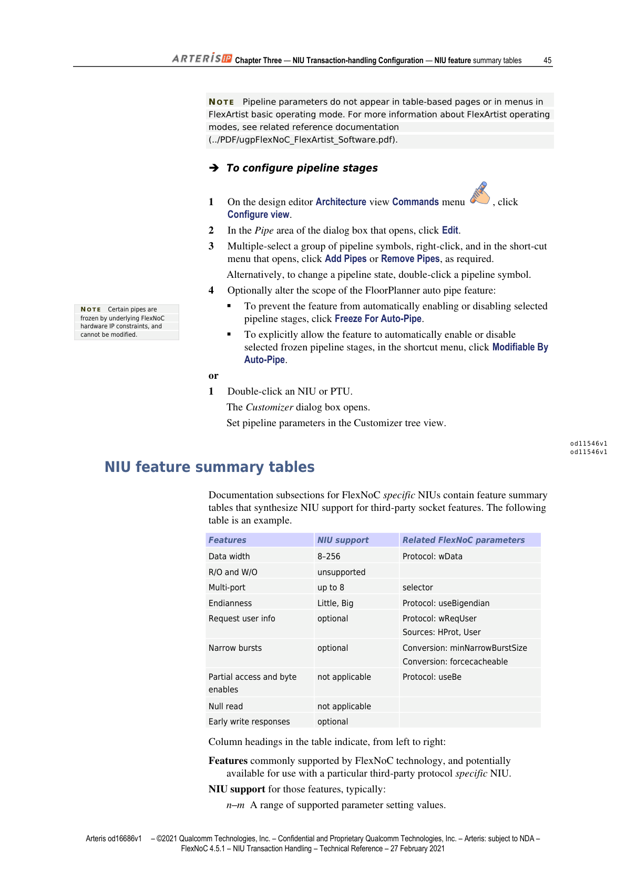

> **说明**：本文基于 Arteris IP《FlexNoC NIU Transaction Handling Technical Reference》（FlexNoC 4.5.1，2021年2月27日版）第三章翻译整理，采用中英双语对照排版。信号名、参数名保留英文原样，首次出现时括号内附中文释义。

---

> FlexNoC NIUs are configured and parameterized with FlexNoC FlexArtist software during the specification and architecture phases of the FlexNoC workflow.

FlexNOC NIU 在 FlexNOC 工作流的规格定义（Specification）阶段和架构（Architecture）阶段，通过 FlexNOC FlexArtist 软件进行配置和参数化。

> The specification phase generally begins by creating third-party protocol-specific socket objects in the FlexArtist design editor Specification view Interface section. Specific NIU and FlexNoC generic protocol NIU parameters can then be set to support protocol features.

规格定义阶段通常从在 FlexArtist 设计编辑器的 **Specification → Interface** 页面创建第三方协议专属的 socket 对象开始，随后可设置 Specific NIU 和 FlexNOC Generic NIU 参数以支持各项协议特性。

> Detailed descriptions of parameters and their settings are provided in the technical reference sections dedicated to generic and specific NIUs. The latter sections contain feature-summary tables that provide a synthetic view of NIU support for third-party protocol features.

参数及其配置的详细说明由专门针对 Generic NIU 和 Specific NIU 的技术参考章节提供。后者包含功能汇总表（feature-summary tables），以简洁的方式呈现 NIU 对第三方协议特性的支持情况。

> **TIP** You can create FlexArtist protocol objects to aggregate parameter configurations that you can easily apply to multiple sockets.

**提示**：可以创建 FlexArtist 协议对象（protocol objects）来汇聚参数配置，从而方便地应用到多个 socket 上。

---

## Protocol and Protocol Conversion Parameters（协议与协议转换参数）

> Sockets are configured by setting parameter group `protocol` in FlexNoC FlexArtist software (Specification: Interface: NIU).

Socket 通过在 FlexArtist 软件中设置参数组 `protocol` 进行配置（路径：Specification → Interface → NIU）。

> Specific sockets, which typically use Arteris external or third-party protocols, are connected to one or more corresponding Arteris internal FlexNoC generic NIUs. The corresponding generic interface parameters appear when you expand NIU elements in the NIU page of the design editor Specification view Internal section.

Specific socket 通常使用 Arteris 外部协议或第三方协议，并连接到一个或多个 Arteris 内部 FlexNOC Generic NIU。展开设计编辑器 **Specification → Internal** 页面中的 NIU 元素，即可查看对应的通用接口参数。

> Parameter group `conversion` specifies in detail how conversions are handled between Arteris external or third-party protocol-specific interfaces, and the Arteris internal FlexNoC generic interface (Specification: Interface: NIU).

参数组 `conversion`（转换）详细规定了 Arteris 外部协议/第三方协议专属接口与 Arteris 内部 FlexNOC 通用接口之间的转换处理方式（路径：Specification → Interface → NIU）。

---

### `protocol` 参数

> Parameter group `protocol` allows you to assign and manually configure, for the referenced NIU, one of the supported third-party protocols. Access to other standard or customer-specific protocols may require additional FlexNoC licenses.

参数组 `protocol` 允许为指定 NIU 分配并手动配置一种受支持的第三方协议。访问其他标准协议或客户定制协议可能需要额外的 FlexNOC 许可证。

> As an alternative to repeatedly setting identical protocol configurations manually for many NIUs, you can set the parameter to `REFERENCE`, then set sub-parameter `reference` to FlexNoC FlexArtist protocol objects.

若多个 NIU 需要相同的协议配置，可将参数设为 `REFERENCE`，再将子参数 `reference` 指向 FlexArtist 协议对象，避免重复手动配置。

> Setting `SERVICE` configures the referenced NIU as an internal interface to the NoC service network.

将参数设为 `SERVICE` 可将指定 NIU 配置为 NOC 服务网络（service network）的内部接口。

| 属性 | 说明 |
|------|------|
| **路径** | Specification → Interface → NIU |
| **取值** | 支持的协议列表、`REFERENCE`、`SERVICE` |
| **相关参考** | Specific NIU Technical Reference（第87页）|

---

### `reference` 参数

> Parameter `reference` assigns a protocol object to the referenced socket. Several sockets can reference the same protocol.

参数 `reference` 将一个协议对象（protocol object）分配给指定 socket，多个 socket 可引用同一个协议对象。

> The parameter is available only when parameter group `protocol` is set to `REFERENCE`, and when at least one protocol object has been configured in the project.

该参数仅在 `protocol` 设为 `REFERENCE` 且项目中已配置至少一个协议对象时才可用。

| 属性 | 说明 |
|------|------|
| **路径** | Specification → Interface → NIU → protocol |
| **取值** | 协议对象列表 |

---

## NIU Performance Parameters（NIU 性能参数）

> NIU performance parameters are set in the NIU page of the design editor Architecture view Datapath NIU section.

NIU 性能参数在设计编辑器 **Architecture → Datapath → NIU** 页面中设置。

> Specific NIUs typically have fewer performance parameters than the corresponding generic NIUs. Specific NIU performance parameters appear when you expand NIU elements in the page.

Specific NIU 的性能参数通常少于对应的 Generic NIU。展开页面中的 NIU 元素即可查看 Specific NIU 的性能参数。

---

## Pipeline Stage Parameters（流水线阶段参数）

> Pipeline stage parameters are set in the Topology pages of the Datapath Transport, Observation, Service, and Dvm sections of the design editor Architecture view.

流水线阶段参数在设计编辑器 **Architecture** 视图的 Topology 页面中设置，涵盖 Datapath Transport、Observation、Service 和 Dvm 各节。

> **NOTE** Pipeline parameters do not appear in table-based pages or in menus in FlexArtist basic operating mode. For more information about FlexArtist operating modes, see related reference documentation.

**注意**：在 FlexArtist 基础操作模式下，流水线参数不会出现在表格页面或菜单中。详细信息请参阅相关参考文档。

**配置流水线阶段的步骤：**

> 1. On the design editor Architecture view Commands menu, click **Configure view**.
> 2. In the Pipe area of the dialog box that opens, click **Edit**.
> 3. Multiple-select a group of pipeline symbols, right-click, and in the short-cut menu that opens, click **Add Pipes** or **Remove Pipes**, as required. Alternatively, to change a pipeline state, double-click a pipeline symbol.
> 4. Optionally alter the scope of the FloorPlanner auto pipe feature:
>    - To prevent the feature from automatically enabling or disabling selected pipeline stages, click **Freeze For Auto-Pipe**.
>    - To explicitly allow the feature to automatically enable or disable selected frozen pipeline stages, in the shortcut menu, click **Modifiable By Auto-Pipe**.

1. 在设计编辑器 Architecture 视图的 Commands 菜单中，点击 **Configure view**。
2. 在弹出对话框的 Pipe 区域，点击 **Edit**。
3. 多选一组流水线符号，右键点击，在弹出菜单中选择 **Add Pipes**（添加流水线）或 **Remove Pipes**（删除流水线）；也可双击流水线符号切换状态。
4. 可选：调整 FloorPlanner 自动布管功能的作用范围：
   - 点击 **Freeze For Auto-Pipe**（冻结自动布管）以阻止自动启用/禁用所选流水线阶段。
   - 在右键菜单中点击 **Modifiable By Auto-Pipe** 以允许自动功能修改已冻结的流水线阶段。

**或者（另一种方式）：**

> 1. Double-click an NIU or PTU. The Customizer dialog box opens.
> 2. Set pipeline parameters in the Customizer tree view.

1. 双击 NIU 或 PTU（协议转换单元），打开 Customizer 对话框。
2. 在 Customizer 树形视图中设置流水线参数。

> **NOTE** Certain pipes are frozen by underlying FlexNoC hardware IP constraints, and cannot be modified.

**注意**：某些流水线阶段受底层 FlexNOC 硬件 IP 约束而被冻结，无法修改。

---

## NIU Feature Summary Tables（NIU 功能汇总表）

> Documentation subsections for FlexNoC specific NIUs contain feature summary tables that synthesize NIU support for third-party socket features.

FlexNOC Specific NIU 文档的各子章节包含功能汇总表，以简洁方式汇总 NIU 对第三方 socket 特性的支持情况。

*图1：NIU 功能汇总表格式示例，包含特性名称、NIU 支持情况和相关 FlexNOC 参数三列*

### 表格列含义说明

> Column headings in the table indicate, from left to right:

表格列从左到右依次表示：

> **Features**: Features commonly supported by FlexNoC technology, and potentially available for use with a particular third-party protocol specific NIU.

**Features（特性）**：FlexNOC 技术支持的通用特性，在特定第三方协议 Specific NIU 上可能可用。

> **NIU support**: NIU support for those features, typically:
> - `n–m`：A range of supported parameter setting values.
> - `supported`：The specific NIU supports the feature for the third-party protocol.
> - `unsupported`：The specific NIU does not support the feature for the third-party protocol.
> - `optional`：The specific NIU supports the feature for the third-party protocol if the parameters listed in column Related FlexNoC parameters are set for the corresponding FlexNoC FlexArtist socket or specific NIU object.
> - `not applicable`：Specific NIU support for the feature is irrelevant because the feature is not compatible with the third-party socket protocol used by the NIU.

**NIU support（NIU 支持情况）**，常见取值含义：
- `n–m`：支持的参数值范围。
- `supported`（支持）：Specific NIU 对该第三方协议支持此特性。
- `unsupported`（不支持）：Specific NIU 对该第三方协议不支持此特性。
- `optional`（可选）：若设置了"相关 FlexNOC 参数"列所列参数，则 Specific NIU 支持此特性。
- `not applicable`（不适用）：该特性与 NIU 所用第三方 socket 协议不兼容，支持情况无意义。

> **EXAMPLE** Imprecise burst support does not apply to AXI specific NIUs because imprecise bursts are not supported by the AXI protocol.

**示例**：不精确突发（imprecise burst）支持对 AXI Specific NIU 标注为 not applicable，因为 AXI 协议本身不支持不精确突发。

> **Related FlexNoC parameters**: Related FlexNoC parameters that change standard FlexNoC handling of these features as described in FlexNoC documentation.

**Related FlexNoC parameters（相关 FlexNOC 参数）**：改变 FlexNOC 对该特性默认处理方式的相关参数，详见对应第三方协议专属子章节。

### User Signals 列的特殊说明

> When support for user signals is available, column entries also list the related socket user signals, either as:
> - **Sources** for initiator NIUs: a list of initiator IP socket signals that can be used as a source for the NoC User flags.
> - **Destinations** for target NIUs: a list of target IP socket signals that can be driven by the target NIU from a NoC user flag.

当某特性涉及用户信号时，表格中还会列出相关 socket 用户信号：
- **Initiator NIU**：列出可作为 NOC 用户标志（User flags）来源的 Initiator IP socket 信号（Sources）。
- **Target NIU**：列出可由 Target NIU 从 NOC 用户标志驱动的 Target IP socket 信号（Destinations）。

### Unsupported Features 的说明

> Unsupported third-party socket protocol features in initiator NIUs are very rare, one example being response user info bits. Unsupported features in target NIUs simply indicate that the target NIU will never issue a particular type of transaction (for example, AXI narrow bursts).

Initiator NIU 中标注为 unsupported 的第三方协议特性极为罕见，一个例子是响应用户信息位（response user info bits）。Target NIU 中的 unsupported 特性则仅表示该 Target NIU 永远不会发出该类型事务（例如 AXI narrow bursts）。

> Support for some NIU features that are not directly related to third-party socket protocol semantics, such as read-only or write-only, or multi-port NIU, depends on the socket protocol type.

某些与第三方 socket 协议语义无直接关联的 NIU 特性（如只读/只写、多端口 NIU）的支持情况，取决于 socket 协议类型。

---

## 本章小结

| 配置类别 | FlexArtist 路径 | 核心参数 |
|---------|----------------|---------|
| 协议选择 | Specification → Interface → NIU | `protocol`（取值：协议名/`REFERENCE`/`SERVICE`）|
| 协议对象复用 | Specification → Interface → NIU → protocol | `reference` |
| 协议转换细节 | Specification → Interface → NIU | `conversion` 参数组 |
| NIU 性能调优 | Architecture → Datapath → NIU | 各 NIU 性能参数 |
| 流水线阶段 | Architecture → Topology（各子节）| 流水线符号 / Customizer |

本章篇幅精简，重点是为后续各 NIU 专篇建立配置操作的框架意识：所有参数均通过 FlexArtist 软件界面设置，功能汇总表是快速判断某协议是否支持特定特性的第一入口。
