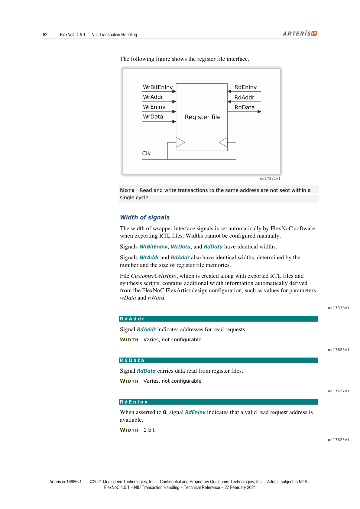

> **说明**：本文基于 Arteris IP《FlexNoC NIU Transaction Handling Technical Reference》（FlexNoC 4.5.1，2021年2月27日版）第四章前半部分翻译整理，采用中英双语对照排版。信号名、参数名保留英文原样，首次出现时括号内附中文释义。

---

> This section describes the FlexNoC generic network interface units (NIUs) used in FlexNoC technology.

本节介绍 FlexNOC 技术中使用的通用网络接口单元（NIU）。

---

## FlexNoC Parameter Naming Convention（参数命名规范）

> Many FlexNoC parameter names are prefixed according to the convention in the following table.

FlexNOC 大多数参数名称采用如下前缀命名规范：

| 前缀 | 含义 |
|------|------|
| `use` | 布尔值，通常用于启用或禁用某项特性或操作 |
| `n` | 数值，通常为整数，决定某特性、属性或操作的数量 |
| `w` | 整数，通常用于设置信号位宽；设为 0 表示该信号不出现在接口上 |

---

## Generic Interface Parameters（通用接口参数）

> Generic interface parameters are set in the relevant FlexArtist software page (Specification: Interface: NIU: generic). FlexArtist software sets most of the generic interface parameters automatically. Consequently, no detailed understanding of the FlexNoC generic interface protocol is required to configure Arteris interconnects.

通用接口参数在 FlexArtist 软件的 **Specification → Interface → NIU → generic** 页面设置。FlexArtist 会自动配置大多数通用接口参数，因此配置 Arteris 互联时无需深入了解 FlexNOC 通用接口协议的细节。

---

### `wAddr`

> Generic interface parameter `wAddr` sets the width of request signal `Addr`.

参数 `wAddr` 设置请求信号 `Addr`（地址）的位宽。

| 属性 | 值 |
|------|-----|
| **路径** | Specification → Interface → NIU → generic |
| **取值范围** | 8–48 |

---

### `wData`

> Parameter `wData` sets the width, in bits, of the request (write) and response (read) data channels.

参数 `wData` 设置请求（写）和响应（读）数据通道的位宽（单位：bit）。

> **NOTE** The actual range of available parameter values is determined by the third-party socket protocol assigned to interfaces. When `wData = 2048`, Fixed burst and Exclusive accesses are not supported.

**注意**：可用参数值的实际范围由分配给接口的第三方 socket 协议决定。当 `wData = 2048` 时，不支持 Fixed burst 和独占访问。

| 属性 | 值 |
|------|-----|
| **路径** | Specification → Interface → NIU → generic |
| **取值范围** | 8–2048（必须为 2 的幂次）|

---

### `Burst` 参数组

> Parameter group `Burst` allows you to specify the type and maximum size of bursts. Insofar as FlexNoC technology supports third-party protocols, it supports the burst types defined by those protocols.

参数组 `Burst` 用于指定突发类型和最大突发大小。FlexNOC 在支持第三方协议的范围内，支持这些协议定义的突发类型。

#### `useBurstAlign`

> When set to True, `useBurstAlign` ensures that burst addresses are aligned on their length in bytes, which must be a power of 2.

设为 True 时，`useBurstAlign` 确保突发地址按其字节长度对齐（必须为 2 的幂次）。

| **路径** | Specification → Interface → NIU → generic → Burst |
|----------|------|
| **取值** | True、False（默认）|

#### `crossBoundary`

> Parameter `crossBoundary` determines address boundaries beyond which bursts cannot cross. The setting is a power of two, expressed in bytes, typically 1 KB or 4 KB.

参数 `crossBoundary` 决定突发不能跨越的地址边界，以字节为单位的 2 的幂次表示，典型值为 1 KB 或 4 KB。

| **路径** | Specification → Interface → NIU → generic → Burst |
|----------|------|
| **取值** | None、地址边界列表 |

#### `wrapAlign`

> Parameter `wrapAlign` indicates the minimum alignment, in bytes, for all wrapping burst boundaries.

参数 `wrapAlign` 指示所有回绕突发边界的最小对齐单位（字节）。

> **NOTE** To set `wrapAlign` to None, parameter `maxWrap` must also be set to None.

**注意**：将 `wrapAlign` 设为 None 时，`maxWrap` 也必须设为 None。

| **路径** | Specification → Interface → NIU → generic → Burst |
|----------|------|
| **取值** | None、0–128 |

#### `maxWrap`

> Parameter `maxWrap` sets the maximum size, in bytes, of wrapping bursts.

参数 `maxWrap` 设置回绕突发的最大字节数。

> For initiator NIUs, best practice is to set the parameter to the maximum wrapping burst size that the initiator can generate.

对于 Initiator NIU，最佳实践是将该参数设为 Initiator 可产生的最大回绕突发大小。

> **CAUTION** Setting a value that does not comply with the initiator IP specification will lead to unpredictable behavior.

**注意**：设置与 Initiator IP 规格不符的值将导致不可预期的行为。

> For target NIUs, the parameter indicates the maximum wrapping burst size that the NIU can generate. By default this size is equal to the maximum wrapping burst size that the NIU protocol supports.

对于 Target NIU，该参数指示 NIU 可产生的最大回绕突发大小，默认等于 NIU 协议支持的最大回绕突发大小。

> When set to None, wrapping bursts to the referenced target are split by initiator NIUs into incrementing bursts, thus allowing targets that do not support wrapping bursts to be connected to initiators that generate them.

设为 None 时，Initiator NIU 会将发往该 Target 的回绕突发拆分为递增突发，从而允许不支持回绕突发的 Target 与能产生回绕突发的 Initiator 相连。

> **IMPORTANT** Initiator parameter `maxWrap` must not be set to None if the corresponding initiator IP can issue wrapping bursts.

**重要**：若 Initiator IP 会发出回绕突发，则 `maxWrap` 不得设为 None。

> **TIP** Best practice is to set the parameter to the cache line size in the system, typically 64 or 128 bytes.

**提示**：最佳实践是将参数设为系统 Cache 行大小，通常为 64 或 128 字节。

| **路径** | Specification → Interface → NIU → generic → Burst |
|----------|------|
| **取值** | None、2、4、8、16、32、64、n（默认值取决于协议）|

#### `wLen1`

> Parameter `wLen1` sets the maximum transfer size, in bytes, equal to 2^wLen1.

参数 `wLen1` 设置最大传输大小（字节），等于 2^wLen1。

> **NOTE** The maximum burst length on a generic interface is 256 words. Consequently, the maximum burst length supported on any NIU socket is `wData × 256`, that is, 1 KB for a 32-bit socket. The absolute 4 KB maximum burst length supported by FlexNoC technology requires 128-bit or wider sockets.

**注意**：通用接口的最大突发长度为 256 个字（word）。因此，任意 NIU socket 支持的最大突发长度为 `wData × 256`，即 32-bit socket 对应 1 KB。FlexNOC 支持的 4 KB 绝对最大突发长度需要 128-bit 或更宽的 socket。

| **路径** | Specification → Interface → NIU → generic → Burst |
|----------|------|
| **取值** | 0–n（默认值：Target socket 支持的最大突发长度）|

---

### `Opcode` 参数组

> Parameter group `Opcode` specifies handling of operational codes on FlexNoC generic sockets.

参数组 `Opcode` 指定 FlexNOC 通用 socket 上操作码的处理方式。

#### `useHardLock`

> When set to True, `useHardLock` enables RDX and WR opcodes, in which case the only atomic operations supported are Read-Modify-Write, or Swap.

设为 True 时，`useHardLock` 启用 RDX 和 WR opcode，此时唯一支持的原子操作为读-修改-写（Read-Modify-Write）或 Swap。

> **NOTE** When set to True, parameters `useRead` and `useWrite` must also be set to True.

**注意**：设为 True 时，`useRead` 和 `useWrite` 也必须设为 True。

| **路径** | Specification → Interface → NIU → generic → Opcode |
|----------|------|
| **取值** | True、False（默认值因协议而异）|

#### `useSoftLock`

> When set to True, `useSoftLock` enables either opcode RDL or WRC, or both, for exclusive accesses supported by the OCP and AXI protocols.

设为 True 时，`useSoftLock` 启用 RDL 或 WRC opcode（或两者），用于 OCP 和 AXI 协议支持的独占访问。

| **路径** | Specification → Interface → NIU → generic → Opcode |
|----------|------|
| **取值** | True、False（默认，OCP 除外）|

#### `useRead`

> When set to True, `useRead` enables read transactions. Either parameter `useRead` or `useWrite` must be set to True.

设为 True 时，`useRead` 启用读事务。`useRead` 和 `useWrite` 中至少一个必须为 True。

| **路径** | Specification → Interface → NIU → generic → Opcode |
|----------|------|
| **默认值** | AXI 由 `enRead` 派生；OCP 由 `read_enable` 决定；其他协议为 True |

#### `useWrite`

> When set to True, `useWrite` enables write transactions. Either parameter `useRead` or `useWrite` must be set to True.

设为 True 时，`useWrite` 启用写事务。

| **路径** | Specification → Interface → NIU → generic → Opcode |
|----------|------|
| **默认值** | AXI 由 `enWrite` 派生；OCP 由 `write_enable` 决定；其他协议为 True |

---

### `Ordering` 参数组

> Parameter group `Ordering` is used to configure ordering rules.

参数组 `Ordering` 用于配置事务排序规则。

#### `useInterleave`

> When set to True (default), `useInterleave` enables word-level response interleaving. For the AHB protocol, it is forced to True for initiator NIUs, and False for target NIUs.

设为 True（默认）时，`useInterleave` 启用字级响应交错（interleaving）。对于 AHB 协议，Initiator NIU 强制为 True，Target NIU 强制为 False（AHB 不支持响应交错）。

| **路径** | Specification → Interface → NIU → generic → Ordering |
|----------|------|
| **取值** | True（默认）、False |

#### `wSeqId`

> Parameter `wSeqId` sets the width of signal `SeqId` (Sequence ID). Setting OCP interface parameter `wSeqID` to a value less than `log2(tags)` reduces out-of-order handling capability.

参数 `wSeqId` 设置序列 ID 信号 `SeqId` 的位宽。对 OCP 接口，将 `wSeqID` 设为小于 `log2(tags)` 的值会降低 NIU 的乱序处理能力：Initiator 侧多个 OCP tag 产生相同的 seqID；Target 侧多个 seqID 映射到相同的 OCP tag。

| **路径** | Specification → Interface → NIU → generic → Ordering |
|----------|------|
| **取值** | 0–8 |

#### `useSeqUnique`

> When set to True, `useSeqUnique` assigns a single transaction per sequence ID, thus enabling fully unordered responses. When True, `nPendingOrderId` is forced to `max(2^wSeqId, 64)`, and `nPendingTrans` is forced to the same value.

设为 True 时，`useSeqUnique` 为每个序列 ID 仅分配一个事务，从而实现完全乱序响应。设为 True 时，`nPendingOrderId` 被强制为 `max(2^wSeqId, 64)`，`nPendingTrans` 也被强制为同值。Target 通用接口的 `useSeqUnique` 被强制为 False。

| **路径** | Specification → Interface → NIU → generic → Ordering |
|----------|------|
| **取值** | True、False（默认）|

---

### `Preamble` 参数组

> Parameter group `Preamble` is used to configure special transaction types or sequences.

参数组 `Preamble` 用于配置特殊事务类型或序列。

| 参数 | 说明 | 默认值 |
|------|------|--------|
| `usePreLock` | 启用管理多事务原子序列的前导（preamble），仅适用于 AMBA 接口，与 `useHardLock` 互斥 | False |
| `usePreNullRead` | 启用零字节读指令的前导处理；为 False 时将零字节读转换为同地址的单字节读 | False |
| `usePreRdCondWr` | 启用读-条件写（read-conditional-write）操作的前导，PIF 协议需要 | False（PIF 除外）|
| `usePreStrm` | 启用 FIXED burst（AXI 或 OCP STRM） | True（AXI 默认）|
| `usePreBlck` | 启用 BLCK burst（OCP 块突发）处理 | False |

---

### `QoS` 参数组

> Parameter group `QoS` can be configured to implement one of three available pressure mechanisms. The number of possible priority levels is determined globally by parameter `nUrgencyLevel`.

参数组 `QoS` 可配置三种压力（priority）机制之一。全局优先级数量由全局参数 `nUrgencyLevel` 决定。

| 参数 | 说明 |
|------|------|
| `useHurry` | 设为 True 时，在接口上添加旁路信号 `Hurry`；NIU 将待处理事务的优先级提升到不低于 `Hurry` 信号所示级别（二进制编码） |
| `usePress` | 设为 True 时，配置旁路信号 `Req.Press`；NIU 将请求通道优先级提升到不低于 `Press` 信号所示级别（二进制编码）|
| `useUrgency` | 设为 True 时，带内请求信号 `Urgency` 携带事务优先级；具体信号映射由 Specific NIU 转换参数 `UrgencyMap` 指定 |

---

### `Response` 参数组

#### `useErrorCodes`

> When set to True, `useErrorCodes` enables the mapping of specific third-party protocol error codes to internal FlexNoC transport error codes. When set to False, a single error code is available.

设为 True 时，`useErrorCodes` 启用第三方协议特定错误码到 FlexNOC 内部传输错误码的映射。设为 False 时，仅有一种错误码（如 AHB ERROR、AXI SLVERR）。

> **NOTE** Can only be set to True if global parameter `useErrorCodes` is also True.

**注意**：仅当全局参数 `useErrorCodes` 也为 True 时，本参数才能设为 True。

| **路径** | Specification → Interface → NIU → generic → Response |
|----------|------|
| **取值** | True、False（默认值因协议而异）|

---

## Generic Initiator NIU（通用 Initiator NIU）

> The generic initiator NIU handles incoming transactions from the generic initiator socket. The NIU converts the transactions, which comply with the generic socket protocol, to comply with the internal Arteris transport interface protocol.

通用 Initiator NIU 负责处理来自通用 Initiator socket 的事务，将符合通用 socket 协议的事务转换为符合 Arteris 内部传输接口协议的格式。

### Request Processing（请求处理）

> The initiator generic NIU is responsible for packetizing transactions, taking into account the characteristics of the transaction target. The initiator generic NIU performs this task in six stages.

Initiator Generic NIU 负责将事务打包成数据包，同时考虑目标的特性。处理过程分六个阶段：

#### 阶段一：Address Decode Stage（地址解码）

> The current addressing mode, the transaction flow ID, and the transaction address can be looked up in a translation table, synthesized from the address map of the NoC specification. If the transaction lookup fails, the NIU issues request packets with ERR status. If it succeeds, it creates packets with an appropriate route identifier.

当前寻址模式、事务 Flow ID 和事务地址在地址映射表（由 NOC 规格的地址映射综合生成）中查找。查找失败时，NIU 发出带 ERR 状态的请求包；查找成功时，创建带有适当路由标识符的请求包。

> **NOTE** Decode error packets can be assigned a particular target route by setting parameter `defaultErrorTarget`. This makes it possible to centralize error logging.

**注意**：通过设置 `defaultErrorTarget` 参数，可为解码错误包指定特定目标路由，从而实现集中式错误日志记录。

可在该阶段之后插入请求前向流水线（request forward pipe）。

#### 阶段二：Splitting（拆分）

事务映射与拆分过程详见第02篇，此处不再赘述。可在该阶段之后插入请求前向/后向流水线（`reqFwd.PostSplit` 和/或 `reqBwd.PostSplit`）。

#### 阶段三：Basic Security（基本安全检查）

> Target mapping access restrictions are extracted from the address decode table and compared to the incoming request. If a violation occurs, the request is sent to the transport with an ERR status.

从地址解码表中提取 Target 映射访问限制（读/写权限、opcode 支持、安全级别），与传入请求对比。若违规，请求以 ERR 状态发送至传输层，路由到解码 Target NIU 但不发给 Target。

#### 阶段四：Ordering Control（排序控制）

> To avoid costly reorder buffers, an initiator generic NIU can be configured to handle only a single pending target per combined flowID and seqID transaction. The number of possible pending combinations is set by `nPendingOrderId`.

为避免昂贵的重排序缓冲，Initiator Generic NIU 可配置为每个 flowID+seqID 组合只允许一个待处理目标。`nPendingOrderId` 设置可同时待处理的最大路由数。若 Initiator IP 尝试超出此限制，NIU 将延迟请求处理，直到响应减少到允许新事务处理为止。

#### 阶段五：Interleaving Control（交错控制）

> A read-capable initiator that does not support response interleaving can only have a single target and routeID pending if that target is capable of response interleaving.

对于不支持响应交错（`useInterleave=False`，`wSeqId>0`）的读 Initiator，若某 Target 支持响应交错，则该 Initiator 在该 Target 上只能有一个待处理目标和路由 ID。若 Initiator IP 尝试超出此限制，NIU 将延迟处理直到交错条件解除。

#### 阶段六：QoS Management（QoS 管理）

> NoC QoS mechanisms can be driven by initiator socket, or from within the NoC itself. A QoS Generator unit can be instantiated within the NIU to drive the QoS mechanisms.

NOC QoS 机制可由 Initiator socket 驱动，也可由 NOC 内部驱动。可在 NIU 内实例化 QoS 发生器单元来驱动 QoS 机制。可在 NIU 的传输请求输出端实现请求流水线。

---

### Response Processing（响应处理）

> The initiator generic NIU is responsible for constructing generic responses from transport response packets. This process is simple compared to request processing, because it mostly involves extracting data from packet, along with transaction response status OK, ERR, or FAIL. If the transaction was split on the request side, the NIU aggregates transaction status.

Initiator Generic NIU 负责从传输层响应包构建通用响应。此过程比请求处理简单——主要是从数据包中提取数据，以及事务响应状态（OK/ERR/FAIL）。若请求侧发生了拆分，NIU 负责聚合事务状态。

#### Response Reassembly（响应重组）

> An initiator NIU may receive response fragments of a size smaller than its word size `wData`. This is because the minimum response fragment size is determined by target parameter `wData`, not initiator parameter `wData`.

Initiator NIU 可能收到小于其字宽 `wData` 的响应片段，这是因为最小响应片段大小由 Target 的 `wData` 决定，而非 Initiator 的 `wData`。

> To reassemble responses up to the initiator word size, the NIU instantiates reassembly buffers, whose number is determined by parameter `nReassemblyBuffer`.

NIU 实例化重组缓冲区（reassembly buffer）来将响应重组至 Initiator 字宽，缓冲区数量由参数 `nReassemblyBuffer` 决定。

> **NOTE** There can be no more than one data reassembly buffer per pending transaction.

**注意**：每个待处理事务最多分配一个数据重组缓冲区。

---

### Architecture Phase Parameters（架构阶段参数）

#### Serialization（序列化参数）

> Parameters in the Serialization group define the serialization of the request and response interfaces on the transport side.

序列化参数组定义传输侧请求和响应接口的序列化方式。

**`nBytePerWord`**

> Sets the serialization of the request and response interfaces. Settings are determined by socket data width `wData` and cannot be changed directly.

设置请求和响应接口的序列化。取值由 socket 数据位宽 `wData` 决定，不可直接修改。

| **路径** | Architecture → Datapath Transport → Serialization |
|----------|------|
| **取值** | 0、1、2、4、8、16、32、64、128 |

**`headerPenalty`**

> Sets the number of latency clock cycles that can be introduced while transferring packet headers. Data is transferred after headers.

设置传输数据包头时可引入的延迟时钟周期数。数据在头部之后传输。

| **路径** | Architecture → Datapath Transport → Serialization |
|----------|------|
| **取值** | None（默认）、ONE、TWO、AUTO |

---

#### Performance Parameters（性能参数）

**`nPendingOrderId`**

> Sets the number of routes that the NIU can track simultaneously, a route being a combination of initiator flows and sequences. Each route defines an ordered stream of transactions (responses returned in the same order as requests).

设置 NIU 可同时追踪的路由数，一条路由为 Initiator Flow 与 SeqID 的组合。每条路由定义一个有序事务流（响应按请求顺序返回）。

**示例**：`nFlow=1`、`wSeqID=4` 的 Initiator NIU 可有 16 条待处理路由，可以是同一 Target Flow 上的 16 个不同 SeqID，也可以是最多 16 个不同 Target 各一个 SeqID，或介于两者之间的任意组合。

> When an initiator IP sends a transaction that exceeds the number of pending routes, flow control is applied until enough responses have been returned.

当 Initiator IP 发送的事务超出待处理路由数时，流量控制生效，直到足够多的响应返回允许新事务处理。

> **NOTE** If `nPendingOrderId` is set greater than `nPendingTrans`, an issue is raised.

**注意**：`nPendingOrderId` 不得大于 `nPendingTrans`，否则会报错。

| **路径** | Architecture → Datapath NIU → NIU |
|----------|------|
| **取值** | 1–256（最大值取决于 socket 协议）|

---

**`nPendingTrans`**

> Limits the number of transactions that can be pending at the referenced interface, regardless of transaction ordering constraints.

限制该接口上可同时待处理的事务数量，不受排序约束限制。

> **NOTE** `nPendingTrans` is a count of generic interface transactions. Initiator Specific NIU may split incoming bursts (imprecise, STRM/FIXED, BLCK bursts) or aggregate narrow AXI/AHB bursts.

**注意**：`nPendingTrans` 计数的是通用接口事务数。Specific NIU 可能拆分不精确突发、STRM/FIXED 或 BLCK burst，也可能将窄 AXI/AHB burst 聚合。

| **路径** | Architecture → Datapath NIU → NIU |
|----------|------|
| **取值** | 1–256 |

---

**`nReassemblyBuffer`**

> When a transaction is issued to a target that may return smaller read response fragments, the generic NIU instantiates reassembly buffers. Each buffer is one data-word wide. If the NIU runs out of reassembly buffers, it stalls requests that require reassembly.

当事务发往可能返回更小读响应片段的 Target 时，Generic NIU 实例化重组缓冲区，每个缓冲区宽度为一个数据字。若重组缓冲区耗尽，NIU 将需要重组的请求挂起，直到缓冲区可用。

| **路径** | Architecture → Datapath NIU → NIU |

---

**`qosGenerator`**

> Parameter group `qosGenerator` configures placement of programmable FlexNoC QoS Generator units upstream of FlexNoC generic initiator NIUs. When implemented, generator units drive QoS priority information from within the FlexNoC interconnect.

参数组 `qosGenerator` 配置可编程 FlexNOC QoS 发生器单元在 Initiator NIU 上游的位置。实例化后，发生器单元从 FlexNOC 互联内部驱动 QoS 优先级信息。

---

### Reorder Buffering（重排序缓冲）

> If socket specification parameter `useReorderBuffer` is set to True, the NIU page shows additional parameters to configure initiator NIU reorder buffering. The reorder buffer can manage several independent channels.

若 socket 规格参数 `useReorderBuffer` 设为 True，NIU 页面将显示额外的重排序缓冲配置参数。重排序缓冲可管理多个独立通道（多通道仅在涉及 Initiator 与 Target 之间速率适配的特殊场景中有用）。

> FlexNoC reorder buffer units comprise read and write response buffers, which are allocated when request transactions arrive. Write buffers only store response packet headers. Read buffers, whose size is set by `nBytePerReadBuffer`, store read data.

FlexNOC 重排序缓冲单元包含读和写响应缓冲区，在请求事务到达时分配。写缓冲区仅存储响应包头；读缓冲区（大小由 `nBytePerReadBuffer` 设置）存储读数据。

**缓冲区分配与释放机制：**

> When a request causes a buffer to be allocated, a unique sequence ID is assigned to the request. Buffers are de-allocated when responses are reissued to the initiator socket, according to protocol ordering requirements.

请求导致缓冲区分配时，唯一序列 ID 被分配给该请求。根据协议排序要求，响应重新发给 Initiator socket 后，缓冲区即被释放——若 socket 无 ID 则按序发出，若请求乱序发出则乱序发出响应。

#### 关键参数

| 参数 | 说明 | 取值 |
|------|------|------|
| `useReorderBuffer` | 设为 True 时实例化重排序缓冲 | True、False（默认）|
| `nWriteBuffer` | 写数据缓冲区数量及待处理写事务数 | 1–256 |
| `nReadBuffer` | 读数据缓冲区数量及待处理读事务数 | 1–256 |
| `nBytePerReadBuffer` | 每个读数据缓冲区的字节数；必须 ≥ `nBytePerWordResponse` | 16–256 |
| `splitWriteRespMux` | True：将写响应 mux 拆分为 2 个 2 周期仲裁 mux（适合输入数≥64时）| True、False |
| `splitReadRespMux` | True：将读响应 mux 拆分为 2 个 2 周期仲裁 mux | True、False |
| `nBytePerWordResponse` | 自动设置，不可手动修改；反映重排序缓冲到 Generic NIU 响应接口的序列化 | 自动 |
| `throughputRatio` | 期望吞吐率比（Initiator 响应 / 通道响应）；Store and Forward 模式在数据缓冲区满或最后响应到达时发出 | STORE AND FORWARD、1–4 |
| `registerFile` | 为重排序缓冲实例化读数据寄存器文件（可导出为客户 cell 替换为硬宏）| Standard Cells、Customer Cell |

> **Reorder buffer performance tip**: Parameters `splitReadRespMux` and `splitWriteRespMux` are recommended only for response multiplexers with many inputs (≥ 64 or 128 buffers). This 2-cycle arbitration is not optimal for single accesses.

**性能提示**：`splitReadRespMux` 和 `splitWriteRespMux` 仅推荐在响应多路选择器输入数量较多（≥64 或 128）时使用；2 周期仲裁对单次访问不友好。

#### Register File Interface Signals（寄存器文件接口信号）

*图1：重排序缓冲寄存器文件 wrapper 接口示意图，包含 WrBitEnInv、WrAddr、WrEnInv、WrData、RdEnInv、RdAddr、RdData 等信号*

| 信号 | 方向 | 说明 |
|------|------|------|
| `RdAddr` | — | 读请求地址 |
| `RdData` | — | 从寄存器文件读出的数据 |
| `RdEnInv` | 1-bit | 置 0 时表示有效读请求地址可用 |
| `WrAddr` | — | 写地址 |
| `WrData` | — | 写入寄存器文件的数据 |
| `WrEnInv` | 1-bit | 置 0 时表示 `WrData` 上有效写数据可用 |
| `WrBitEnInv` | — | 对应位为 0 时，`WrData` 对应位写入寄存器文件 |

> **NOTE** Read and write transactions to the same address are not sent within a single cycle. Signal widths are set automatically by FlexNoC software when exporting RTL files and cannot be configured manually.

**注意**：对同一地址的读写事务不在同一个周期内发出。信号位宽由 FlexNOC 软件在导出 RTL 文件时自动设置，不可手动配置。

#### Timing Diagrams（时序图）

*图2：寄存器文件读事务信号时序示意（阴影区域表示对应信号可为 0 或 1）*

*图3：寄存器文件写事务信号时序示意*

---

### Pipeline Stage Parameters（流水线阶段参数）

#### `reqFwdPostDecode`

> When set to True, enables forward pipeline stage `PostDecode.forward` after the decode stage. Adds one cycle of request latency, useful when complex address decoding occurs.

设为 True 时，在解码阶段后启用前向流水线阶段 `PostDecode.forward`，增加一个周期的请求延迟，适用于地址解码复杂的场景。

#### `reqFwdPostSplit`

> When set to True, enables forward pipeline stage `PostSplit.Forward` after the ordering control stage. Useful when transaction splitting becomes complex because of NIU alignment capabilities.

设为 True 时，在排序控制阶段后启用前向流水线阶段 `PostSplit.Forward`，适用于因 NIU 对齐能力导致事务拆分复杂的场景。

#### `reqBwdPostSplit`

> When set to True, enables backward pipeline stage `PostSplit.Backward` after the ordering control stage.

设为 True 时，在排序控制阶段后启用后向流水线阶段 `PostSplit.Backward`。

#### `genericPipes`

> Parameter group `genericPipes` allows you to specify additional pipeline stages in a generic NIU. In FlexArtist basic mode, these can only be set indirectly via topology graphical displays.

参数组 `genericPipes` 用于在 Generic NIU 中指定额外的流水线阶段。在 FlexArtist 基础模式下，这些参数只能通过拓扑图形界面间接设置。

| 通道/信号 | 参数名 | 默认值 |
|---------|--------|--------|
| request Forward | `Forward` | False |
| Req.Rdy Backward | `Backward` | False |
| response Forward | `Forward` | False |
| Rsp.Ready Backward | `Backward` | False |

#### `inputPipe` 和 `outputPipe`

> Allow you to specify additional pipelines at the transport interfaces of the generic NIUs.

用于在 Generic NIU 的传输接口处指定额外的流水线。

| 通道/信号 | 传输参数名 | 默认值 |
|---------|-----------|--------|
| Tx Forward | `Forward` | False |
| Tx.Rdy Backward | `Backward` | False |
| Rx Forward | `Forward` | False |
| Rx.Rdy Backward | `Backward` | False |

---

### Generic Initiator NIU Signals（关键信号）

#### `noPendingTrans`

> Output signal `noPendingTrans` is set to 1 when the initiator NIU contains no transactions. Can be connected to the boundary of the NoC, or observed during simulations for debug purposes.

输出信号 `noPendingTrans`（无待处理事务）在 Initiator NIU 内无任何事务时置 1，可连接到 NOC 边界，或在仿真中用于调试观测。

> **NOTE** Because `noPendingTrans` is only active if the clock is already present, it should not be used as a wake-up signal to activate the NIU clock.

**注意**：`noPendingTrans` 仅在时钟已存在时有效，不应将其用作激活 NIU 时钟的唤醒信号。

---

## 本章小结

| 类别 | 关键参数 | 核心要点 |
|------|---------|---------|
| 接口宽度 | `wAddr`、`wData` | 由协议决定，`wData=2048` 时不支持 FIXED/独占访问 |
| 突发控制 | `maxWrap`、`wLen1`、`crossBoundary` | `maxWrap=None` 将回绕突发转为递增；最大突发长度 256 字 |
| Opcode 控制 | `useHardLock`、`useSoftLock`、`useRead`、`useWrite` | 原子/独占/读写使能，两者互斥 |
| 排序控制 | `wSeqId`、`useInterleave`、`useSeqUnique` | `useSeqUnique=True` 强制 `nPendingOrderId=max(2^wSeqId, 64)` |
| 性能调优 | `nPendingTrans`、`nPendingOrderId` | `nPendingOrderId` ≤ `nPendingTrans` |
| 重排序缓冲 | `useReorderBuffer`、`nReadBuffer`、`nWriteBuffer`、`throughputRatio` | 输入数 <64 时不建议开启 splitRespMux |
| 流水线 | `reqFwdPostDecode`、`reqFwdPostSplit`、`genericPipes` | 解码/拆分后各可插一级，增加 1 个周期延迟 |
