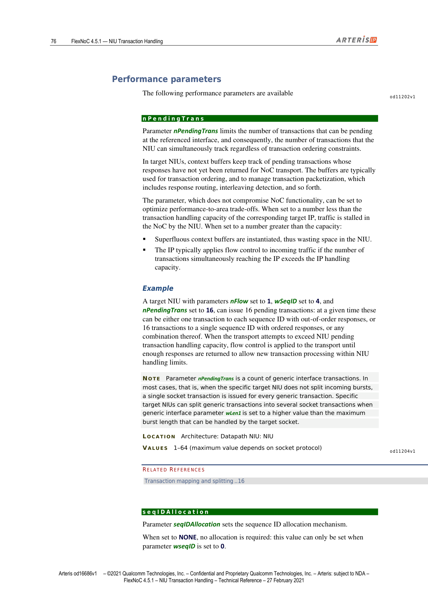
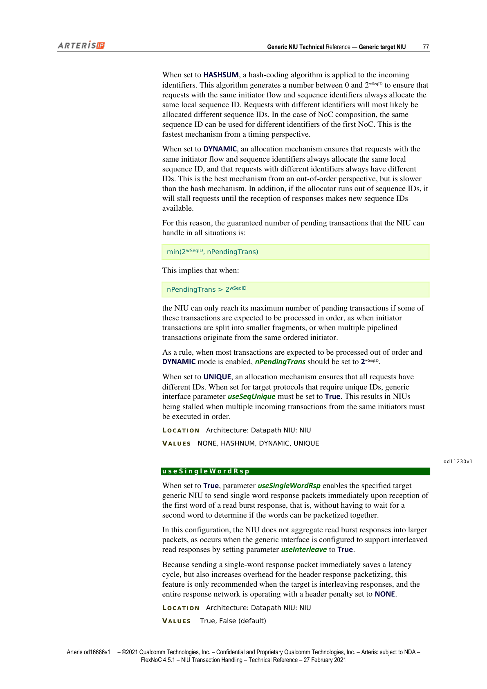
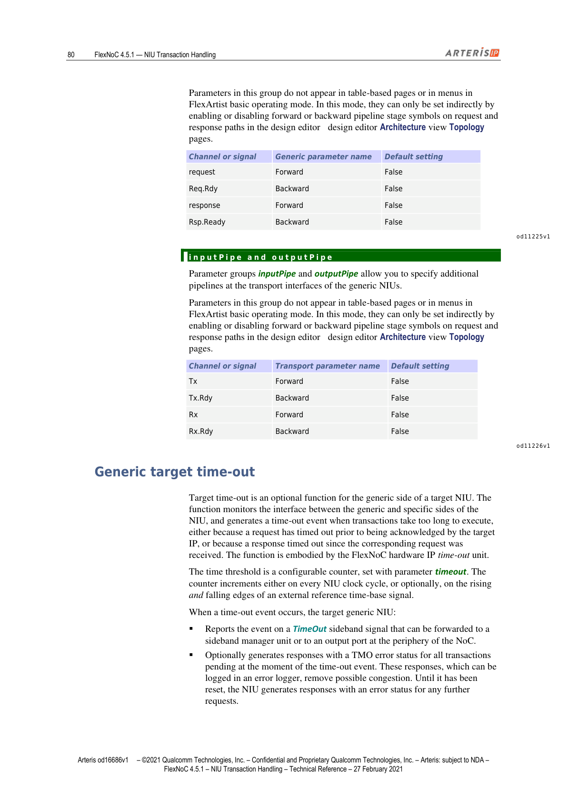
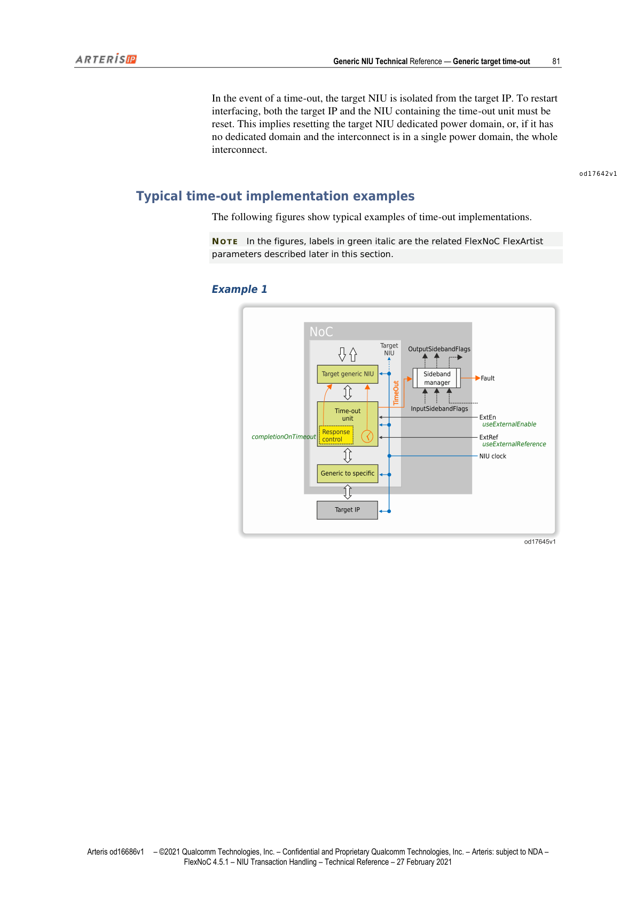
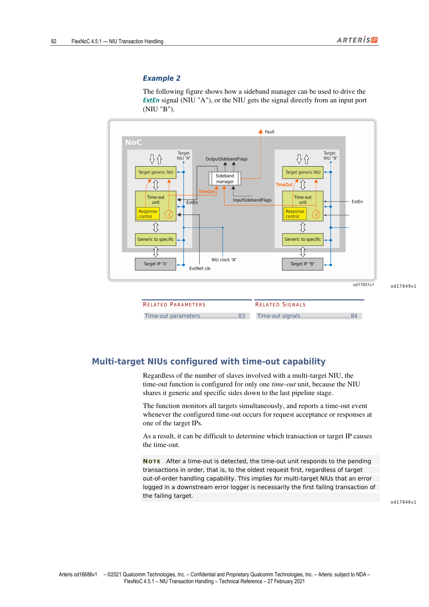
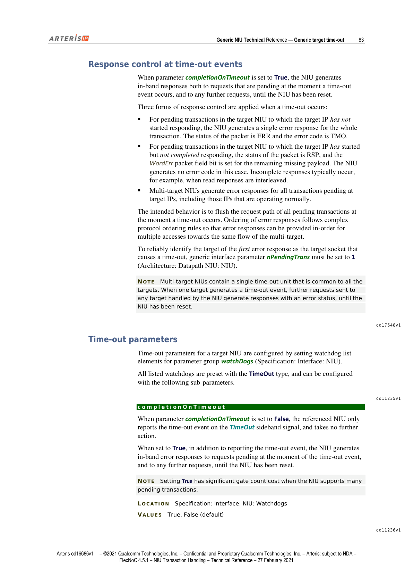

## Generic Target NIU（通用 Target NIU）

> The target generic NIU handles outgoing transactions sent through the packet transport layer to the target generic interface, and passes them to the target specific NIU for conversion to the socket-specific protocol.

通用 Target NIU（目标端通用网络接口单元）负责处理经由数据包传输层发往目标端通用接口的出站事务，并将其传递给目标端专用 NIU，以便转换为特定 socket 协议。

---

## Target NIU Request Processing（Target NIU 请求处理）

> The FlexNoC target generic NIU is responsible for converting transport request packets into FlexNoC generic interconnect transactions.

FlexNoC 通用 Target NIU 负责将传输层请求包转换为 FlexNoC 通用互联事务。

> Conversion occurs in several stages:

转换分以下多个阶段进行：

### 阶段一：绕过不匹配的请求包

> Incoming packets that do not match target flow identifiers, for example in case of target chaining, are bypassed by the NIU directly to its response output.

不匹配目标流标识符的入站包（例如目标链式连接的情况），由 NIU 直接绕过至响应输出端。

### 阶段二：报头反序列化与提取

> Packet header de-serialization and extraction.

数据包报头的反序列化（de-serialization）与提取。

### 阶段三：错误检测

> Error detection: request packets already in error or illegal requests are bypassed and their status updated.

错误检测：已处于错误状态或非法请求包被直接绕过，并更新其状态。

### 阶段四：流标识与目标地址映射

> Flow identification and target address mapping: if the target NIU supports multiple flows, the local transaction flow ID is computed. In the case of a multi-target specific NIU, the decoded flow passed to the specific NIU indicates the actual physical socket destination for the transaction. The target transaction local address is generated according to the decoded flow ID and incoming request packet address.

流标识（flow identification）与目标地址映射：若 Target NIU 支持多个流，则计算本地事务流 ID。对于多目标专用 NIU，传递给专用 NIU 的已解码流标识，指示事务的实际物理 socket 目的地。目标端事务本地地址，根据已解码流 ID 与入站请求包地址共同生成。

### 阶段五：前向/后向管道插入（预分配前）

> A request forward or backward pipe, or both, can be inserted right after this stage, by setting related parameters `reqFwdPreAlloc` and `reqBwdPreAlloc`.

可在此阶段之后插入请求前向管道、后向管道或两者兼有，通过设置参数 `reqFwdPreAlloc`（请求前向预分配管道）和 `reqBwdPreAlloc`（请求后向预分配管道）来配置。

### 阶段六：序列 ID 分配

> Sequence ID allocation: if the target generic interface is configured to support sequences by setting parameter `wSeqID` to a value greater than 0, a local sequence ID is allocated for the transaction based on the incoming request initiator flow and sequence identifiers. The new sequence ID is obtained by a method set by related parameter `seqIDAllocation`:

序列 ID（Sequence ID）分配：若通过将参数 `wSeqID`（序列 ID 宽度）设置为大于 0 的值来配置目标通用接口支持序列，则根据入站请求的发起方流 ID 和序列标识符为事务分配本地序列 ID。新序列 ID 的获取方式由参数 `seqIDAllocation` 决定：

| 取值 | 说明 |
|------|------|
| `HASHSUM` | 对入站标识符应用哈希编码算法生成编号，编号大小由 `wSeqID` 决定 |
| `DYNAMIC` | 动态分配机制，确保不同标识符的请求始终获得不同 ID |
| `UNIQUE` | 分配机制确保所有请求拥有不同 ID |

**注意**：两个具有不同流 ID 或序列 ID 的事务，响应可以乱序返回；而具有相同流 ID 和序列 ID 的事务，响应必须有序返回。

### 阶段七：排序控制

> Ordering control: resolves request ordering issues between different initiator and target types. This applies mostly when the generic NIU is connected to an AXI target, for which AXI provides no guarantees of execution order between read and writes at the same address, nor between transactions with different IDs and the same address.

排序控制（Ordering control）：解决不同发起方与目标类型之间的请求排序问题。这主要适用于通用 NIU 连接到 AXI 目标的场景——AXI 协议不保证同一地址的读写执行顺序，也不保证不同 ID 且相同地址的事务之间的顺序。


*图1：Target NIU 请求处理流程图，绿色斜体标注对应 FlexArtist 参数*

**注意**：通用 NIU 可以发出地址重叠的读写事务，前提是这些 NIU 连接到 AXI 目标，且事务来自不同发起方，或来自同一 AXI 发起方但未启用 ReorderBuffer 和 Early Write Response。当请求来自同一发起方时，通用 NIU 在请求地址碰撞时（即地址间距小于碰撞检测粒度的情况）强制执行读-写、写-读、写-写和读-读排序。默认粒度固定为 16 字节（B）。因此，即使地址实际上并不重叠，也可能强制执行排序。

### 阶段八：上下文分配

> A context is allocated for each transaction passing this stage, which will be used for response processing.

为通过此阶段的每个事务分配一个上下文（context），用于后续响应处理。

### 阶段九：Wrapping 请求重对齐

> Wrapping requests are realigned to local data word boundaries.

Wrapping（环绕型）请求被重新对齐至本地数据字边界。

**注意**：由于读取数据也需要重新对齐，NIU 必须配置为通过设置参数 `nRdWrapAligner`（读 Wrap 对齐器数量），为所有待处理的需要重对齐的 Wrapping 突发分配读取重对齐数据缓冲区。

在此阶段之后，可插入一个请求前向管道，通过设置参数 `reqFwdPostAlloc` 配置。

### 阶段十：Wrapping 写数据对齐

> Wrapping write data alignment: if the request that had to be realigned in the previous stage is a write, the write data is realigned accordingly.

Wrapping 写数据对齐：若上一阶段需要重对齐的请求是写操作，则写入数据也相应地重新对齐。

### 阶段十一：QoS 管理

> QoS management: if related parameter `nUrgencyLevel` has been set to a value greater than 0, and if the generic interface is configured with parameter `useUrgency` set to True, and parameters `usePress` or `useHurry` are set to True, the respective NIU outputs are computed from the incoming transaction urgency and request link pressure levels.

QoS（服务质量）管理：若参数 `nUrgencyLevel`（紧急级别数量）设置为大于 0 的值，且通用接口配置了 `useUrgency` 为 True，同时 `usePress` 或 `useHurry` 设置为 True，则相应 NIU 输出由入站事务紧急程度和请求链路压力级别共同计算得出。

**注意**：除非 NIU 下游存在某些仲裁阶段（即多端口专用 NIU 的情况，或目标本身是另一个互联结构），否则不建议使用此配置。

可以在通用请求信号组上插入前向或后向流水线级，通过设置参数 `genericPipes` 配置。

**相关参数速查：**

| 参数名 | 页码参考 |
|--------|---------|
| `nRdWrapAligner` | p78 |
| `reqBwdPreAlloc` | p78 |
| `reqFwdPostAlloc` | p78 |
| `reqFwdPreAlloc` | p78 |
| `seqIDAllocation` | p76 |
| `useUrgency` | p54 |

---

## Response Processing（响应处理）

> This processing mostly consists in packetization of the response status (OK, ERR or FAIL) and data from the generic interface, and includes response interleaving detection.

响应处理主要包括：将通用接口的响应状态（OK、ERR 或 FAIL）和数据封包，以及响应交错（interleaving）检测。

### Wrapping 读数据重对齐

> Wrapping read data alignment: if the incoming wrap read request has been realigned, read data is processed accordingly in a temporary storage buffer.

Wrapping 读数据重对齐：若入站 Wrap 读请求已被重对齐，则读取数据在临时存储缓冲区中相应处理（详见参数 `nRdWrapAligner`）。

### 响应交错检测

> If parameter `useSingleWordRsp` is set to True, the NIU issues a response packet per target response word. This avoids a cycle of latency in all responses, but increases the number of packets and their associated header penalty. This setting is recommended only when response serialization `headerPenalty` is set to NONE on all response routes from the target.

若参数 `useSingleWordRsp`（单字响应）设置为 True，NIU 针对每个目标响应字发出一个响应包。这避免了所有响应中的一个时钟周期延迟，但增加了数据包数量及其相关的报头开销。仅当目标所有响应路由上的响应序列化 `headerPenalty`（报头惩罚）设置为 NONE 时，才建议使用此设置。

> If parameter `useSingleWordRsp` is set to False, the NIU has storage for a response data word. If a response data word is received from the socket with its LAST signal asserted, then the NIU sends it to the response network immediately as the last word of a packet (Tail signal asserted). Otherwise, each response data word is stored and sent to the response network only when the next data word is received. If the next data word has the same ID, then it is part of the same response, and the NIU sends the stored word without the Tail signal asserted. If the next data word has a different ID, then it is part of an interleaved response, and the NIU sends the stored word with the Tail signal asserted but the Last signal de-asserted, thus indicating a complete packet that is not the completion of a transaction.

若 `useSingleWordRsp` 设置为 False，NIU 持有一个响应数据字的存储空间。若从 socket 收到某响应数据字时其 LAST 信号有效，则 NIU 立即将其作为数据包的最后一字发往响应网络（Tail 信号有效）。否则，每个响应数据字被存储，仅在接收到下一个数据字时才发往响应网络——若下一数据字 ID 相同，则为同一响应的一部分，NIU 发出存储字时不置 Tail 信号；若 ID 不同，则为交错响应的一部分，NIU 发出存储字时置 Tail 信号但不置 Last 信号，从而指示这是一个完整的数据包但非事务的完成。

### 报头构建与仲裁

> Packet header construction by context lookup: When the number and size of contexts is large, this step may be the critical path of the design, and can be re-timed with parameter `rspFwdPostCtxt`.

通过上下文查找构建数据包报头：当上下文数量和大小较多时，此步骤可能成为设计的关键路径，可通过参数 `rspFwdPostCtxt` 重新时序化。

> A response forward or backward pipe, or both, can be inserted right after this stage, see related parameters `rspFwdPreMux` and `rspBwdPreMux`.

在此阶段之后可插入响应前向或后向管道，详见参数 `rspFwdPreMux` 和 `rspBwdPreMux`。

最后还包括：与来自绕过路径的错误/未处理请求的仲裁，以及报头序列化。响应管道可在 NIU 的传输响应输出端实现，参见传输参数 Forward 和 Backward。

**相关参数速查：**

| 参数名 | 页码参考 |
|--------|---------|
| `nRdWrapAligner` | p78 |
| `rspBwdPreMux` | p79 |
| `rspFwdPreMux` | p79 |
| `rspFwdPostCxt` | p79 |

---

## Fixed Burst Conversion to Single Access（固定突发转换为单次访问）

> In general, FlexNoC interconnects fixed bursts should always be transported under their proper fixed burst type, and not be converted to incrementing bursts, since they cannot be packed in case of width conversion. They can however be converted to single-word access when they have reached their final target destination, that is, when no further width conversion is expected and the target protocol does not support fixed bursts.

通常，FlexNoC 互联中的固定突发（fixed burst）应始终以其正确的固定突发类型进行传输，而不应转换为递增突发（incrementing burst），因为在位宽转换的情况下，固定突发无法被打包。然而，当固定突发到达其最终目标目的地时（即不再需要位宽转换，且目标协议不支持固定突发），可以将其转换为单字访问。

### `convertFixedToSingle` 参数

| 参数名 | 位置 | 取值 |
|--------|------|------|
| `convertFixedToSingle` | Specification: Interface: NIU: conversion | True / False（默认） |

> When set to True, parameter `convertFixedToSingle` enables splitting and conversion of fixed burst transactions into single-word incrementing transactions with the same address for the referenced target sockets. When set to False, incoming fixed transactions are returned in error by the generic NIU.

设置为 True 时，启用将固定突发事务拆分并转换为相同地址的单字递增事务；设置为 False 时，入站固定事务被通用 NIU 以错误状态返回。

该参数仅在以下所有条件满足时可用：
- 不是调度器（scheduler）
- 不支持固定突发或流式突发
- 可从至少一个发起方 socket 接收固定事务
- 参数 `useSeqUnique` 设置为 False

---

## Generic Target NIU Exclusive Access Handling（独占访问处理）

> When the target protocol does not support exclusive access, or when the target protocol is AXI but does not support enough AXI ID bits to differentiate the sources of exclusive access without ambiguity, the target NIU can instantiate monitoring logic to handle exclusive access.

当目标协议不支持独占访问，或目标协议为 AXI 但没有足够的 AXI ID 位来无歧义地区分独占访问来源时，Target NIU 可以实例化监控逻辑来处理独占访问。


*图2：FlexArtist Architecture 视图中独占访问参数配置界面*

### `exclusiveSupport` 参数

| 参数名 | 位置 | 取值 |
|--------|------|------|
| `exclusiveSupport` | Specification: Interface: NIU: conversion | Not supported / Internal / External（默认因配置而异） |

| 取值 | 行为 |
|------|------|
| `Not supported` | 对所有入站独占访问以错误返回（除非 NIU 含调度器或 `useSoftLock` 为 False） |
| `Internal` | NIU 实例化监控器处理独占访问 |
| `External` | RDL 和 WRC 事务转换为目标协议支持的独占访问形式，支持 AXI 和 OCP 目标协议 |

**注意**：`External` 设置不适用于内存调度器（memory scheduler），因为内存控制器不支持独占访问。

### `nMonitors` 参数

| 参数名 | 位置 | 取值 |
|--------|------|------|
| `nMonitors` | Specification: Interface: NIU: conversion: exclusiveSupport | 1–16 |

> Parameter `nMonitors` sets the number of exclusive access monitors implemented in the target generic NIU, that is, the maximum number of initiators that can concurrently acquire semaphores.

`nMonitors`（独占访问监控器数量）设置 Target NIU 中实例化的独占访问监控器数量，即可并发获取信号量的最大发起方数量。仅当 `exclusiveSupport` 设置为 `Internal` 时可用。

### `userFlagsForId` 参数

| 参数名 | 位置 | 取值 |
|--------|------|------|
| `userFlagsForId` | Specification: Interface: NIU: conversion: exclusiveSupport | 标志列表 |

> Parameter `userFlagsForId` sets up a list of user flags that serve to uniquely identify the source of an exclusive access inside an exclusive monitor.

`userFlagsForId`（用于 ID 的用户标志）设置一个用户标志列表，用于在独占监控器内唯一标识独占访问的来源。用户标志可设置为唯一常量或 AXI ID 位的相关值。

### `maxId` 参数

| 参数名 | 位置 | 取值 |
|--------|------|------|
| `maxId` | Specification: Interface: NIU: conversion: exclusiveSupport | No id compression（默认）/ 1–16 |

> When set to No id compression, target NIUs use parameter `userFlagsForId` settings as exclusive transactions IDs. When set to a numerical value, the parameter sets the maximum value of the AXI IDs that can be used for exclusive accesses sent to the referenced target NIU.

设置为 `No id compression` 时，Target NIU 使用 `userFlagsForId` 参数设置作为独占事务 ID。设置为数值时，该参数设定可用于发往该 Target NIU 的独占访问的 AXI ID 最大值，即根据 AXI 协议规范，可并发获取信号量的最大发起方数量。仅当 `exclusiveSupport` 设置为 `External` 时可用。

---

## Specification & Architecture Phase Parameters（规格与架构阶段参数）

> Target generic NIU functionality is configured during the specification phase of the FlexNoC workflow. The corresponding generic interface parameters appear when you expand NIU elements in the NIU page of the design editor Specification view Internal section.

Target NIU 的功能在 FlexNoC 工作流的规格阶段（specification phase）进行配置，相关通用接口参数在设计编辑器 Specification 视图 Internal 部分的 NIU 页面中展开 NIU 元素时显示。

> Architecture phase parameters are configured in the FlexArtist design editor Architecture view by double-clicking the corresponding target symbol in the topology display.

架构阶段参数在 FlexArtist 设计编辑器 Architecture 视图中，通过双击拓扑显示中对应的目标符号来配置。

**`serialization`（序列化）**：定义传输侧请求和响应接口的序列化方式。`headerPenalty` 可自由设置，但 `nBytePerWord` 被约束为与 socket 数据宽度相同。

---

## Performance Parameters（性能参数）


*图3：Architecture Datapath NIU 页面中的性能参数配置*

### `nPendingTrans` 参数

| 参数名 | 位置 | 取值 |
|--------|------|------|
| `nPendingTrans` | Architecture: Datapath NIU: NIU | 1–64（最大值取决于 socket 协议） |

> Parameter `nPendingTrans` limits the number of transactions that can be pending at the referenced interface, and consequently, the number of transactions that the NIU can simultaneously track regardless of transaction ordering constraints.

`nPendingTrans`（最大挂起事务数）限制在引用接口上可挂起的事务数量，进而限制 NIU 可同时跟踪（不受事务排序约束影响）的事务数量。在 Target NIU 中，上下文缓冲区跟踪响应尚未返回至 NoC 传输层的挂起事务。

- 设置值**小于**目标 IP 的事务处理能力时：NoC 中的流量被 NIU 阻塞（stall）
- 设置值**大于**能力时：会实例化多余的上下文缓冲区（浪费面积），IP 通常在并发事务数超出其处理能力时通过流控机制进行限制

**示例**：nFlow=1、wSeqID=4、nPendingTrans=16 的 Target NIU，可发出 16 个挂起事务——在某一时刻，这些事务可以是每个序列 ID 各一个（乱序响应），或 16 个事务共用一个序列 ID（有序响应），或两者的任意组合。

**注意**：`nPendingTrans` 是通用接口事务的计数。大多数情况下（即专用 Target NIU 不拆分入站突发时），每个通用事务对应一个 socket 事务。当通用接口参数 `wLen1` 设置值大于目标 socket 可处理的最大突发长度时，专用 Target NIU 可能将通用事务拆分为多个 socket 事务。

### `seqIDAllocation` 参数

| 参数名 | 位置 | 取值 |
|--------|------|------|
| `seqIDAllocation` | Architecture: Datapath NIU: NIU | NONE / HASHNUM / DYNAMIC / UNIQUE |


*图4：seqIDAllocation 各取值模式说明*

| 取值 | 说明 |
|------|------|
| `NONE` | 无需分配，仅当 `wSeqID` 为 0 时可用 |
| `HASHSUM` | 哈希编码算法，生成 0 到 2^wSeqID 之间的数；相同标识符始终映射到相同本地序列 ID；时序性能最佳 |
| `DYNAMIC` | 动态分配，确保相同标识符始终分配相同 ID，不同标识符始终分配不同 ID；乱序性能最优，但比哈希方式慢；若 ID 耗尽则阻塞请求直到响应返回 |
| `UNIQUE` | 确保所有请求具有不同 ID；当目标协议要求唯一 ID 时，`useSeqUnique` 必须设为 True |

使用 `DYNAMIC` 模式时，NIU 可保证处理的挂起事务数为：

```
min(2^wSeqID, nPendingTrans)
```

当 `nPendingTrans > 2^wSeqID` 时，只有部分事务被有序处理（如发起方事务被拆分为小片段，或来自同一有序发起方的多个流水线事务）时，NIU 才能达到最大挂起事务数。通常，当大多数事务预期乱序处理且启用 DYNAMIC 模式时，应将 `nPendingTrans` 设置为 `2^wSeqID`。

### `useSingleWordRsp` 参数

| 参数名 | 位置 | 取值 |
|--------|------|------|
| `useSingleWordRsp` | Architecture: Datapath NIU: NIU | True / False（默认） |

> When set to True, parameter `useSingleWordRsp` enables the specified target generic NIU to send single word response packets immediately upon reception of the first word of a read burst response.

设置为 True 时，使指定 Target NIU 在接收到读突发响应的第一个字时立即发送单字响应包，无需等待第二个字来判断能否合包。仅推荐在目标正在交错响应且整个响应网络以 NONE 报头惩罚运行时使用。

---

## Internal Pipeline Parameters（内部管道参数）


*图5：请求路径内部管道参数配置*


*图6：响应路径管道参数配置*

### 请求路径管道参数

| 参数名 | 位置 | 取值 | 说明 |
|--------|------|------|------|
| `nRdWrapAligner` | Architecture: Datapath NIU: NIU | 1（默认）–4 | 可同时挂起的非对齐 Wrapping 突发数；超出则阻塞 |
| `reqFwdPreAlloc` | internalPipes 参数组 | True / False（默认） | 序列 ID 分配前插入前向管道；增加 1 个时钟周期请求延迟 |
| `reqBwdPreAlloc` | internalPipes 参数组 | True / False（默认） | 序列 ID 分配前插入后向管道；增加门电路，不增加延迟 |
| `reqFwdPostAlloc` | internalPipes 参数组 | True / False（默认） | 序列 ID 分配和排序控制后插入前向管道；增加 1 个时钟周期请求延迟 |

### 响应路径管道参数

| 参数名 | 位置 | 取值 | 说明 |
|--------|------|------|------|
| `rspBwdPreMux` | internalPipes 参数组 | True / False（默认） | 响应多路复用前插入后向管道；增加门电路，不增加延迟 |
| `rspFwdPreMux` | internalPipes 参数组 | True / False（默认） | 响应多路复用前插入前向管道；增加 1 个时钟周期响应延迟 |
| `rspFwdPostCxt` | internalPipes 参数组 | True / False（默认） | 上下文提取后插入前向管道；在两个有序响应之间引入 1 个空闲周期，仅在配置大量乱序事务时使用 |

**注意**：上述所有内部管道参数均可在 FlexArtist Architecture 视图 Architecture - Datapath NIU - NIU 部分直接设置（internalPipes 参数组），也可通过启用/禁用 Architecture 视图拓扑页面中的管道阶段符号间接设置。

### `genericPipes` 参数组

| 通道或信号 | 通用参数名 | 默认设置 |
|-----------|-----------|---------|
| request Forward | Forward | False |
| Req.Rdy Backward | Backward | False |
| response Forward | Forward | False |
| Rsp.Ready Backward | Backward | False |

### `inputPipe` 和 `outputPipe` 参数组

| 通道或信号 | 传输参数名 | 默认设置 |
|-----------|-----------|---------|
| Tx Forward | Forward | False |
| Tx.Rdy Backward | Backward | False |
| Rx Forward | Forward | False |
| Rx.Rdy Backward | Backward | False |


*图7：通用接口和传输接口管道参数汇总*

---

## Generic Target Time-out（通用 Target 超时机制）

> Target time-out is an optional function for the generic side of a target NIU. The function monitors the interface between the generic and specific sides of the NIU, and generates a time-out event when transactions take too long to execute, either because a request has timed out prior to being acknowledged by the target IP, or because a response timed out since the corresponding request was received.

Target 超时（Time-out）是 Target NIU 通用侧的可选功能。该功能监控 NIU 通用侧与专用侧之间的接口，当事务执行时间过长时生成超时事件——可能是因为请求在目标 IP 确认前超时，也可能是响应自对应请求被接收后超时。超时阈值由可配置计数器通过参数 `timeout` 设置，计数器在每个 NIU 时钟周期递增，或可选地在外部参考时基信号（`ExtRef`）的上升沿和下降沿递增。

**超时事件发生时，Target NIU 将：**

1. 在 `TimeOut` 旁路信号（sideband signal）上报告该事件，可转发至旁路管理单元或 NoC 外围输出端口
2. 可选地为超时事件发生时所有挂起事务生成 TMO 错误状态响应（可在错误记录器中记录，并消除可能的拥塞）；在重置之前，NIU 对任何进一步的请求均生成错误状态响应

**注意**：超时后，Target NIU 与目标 IP 隔离。要重新启动接口通信，目标 IP 和包含超时单元的 NIU 必须同时复位。这意味着复位 Target NIU 专用电源域，或者（若无专用域且互联处于单一电源域中）复位整个互联。

### 典型超时实现示例


*图8：超时实现示例1——TimeOut 信号输出与 watchdog 配置*


*图9：超时实现示例2，展示 `ExtEn` 信号的两种驱动方式*

### 多目标 NIU 的超时配置

> Regardless of the number of slaves involved with a multi-target NIU, the time-out function is configured for only one time-out unit, because the NIU shares its generic and specific sides down to the last pipeline stage.

无论多目标 NIU 涉及多少个从属设备（slave），超时功能只配置一个超时单元，因为 NIU 直到最后一个流水线阶段都共享其通用侧和专用侧。该功能同时监控所有目标，在任一目标 IP 的请求接受或响应超时时报告超时事件。

**注意**：检测到超时后，超时单元按顺序响应挂起事务（最旧请求优先），无论目标的乱序处理能力如何。这意味着对于多目标 NIU，下游错误记录器中记录的错误必然是故障目标的第一个失败事务。

---

## Response Control at Time-out Events（超时事件时的响应控制）

> When parameter `completionOnTimeout` is set to True, the NIU generates in-band responses both to requests that are pending at the moment a time-out event occurs, and to any further requests, until the NIU has been reset.

当参数 `completionOnTimeout` 设置为 True 时，NIU 对超时事件发生时挂起的请求以及之后的任何进一步请求，均生成带内响应，直到 NIU 被复位。

超时发生时，三种响应控制形式：

| 情形 | 响应行为 |
|------|---------|
| 目标 IP 尚未开始响应的挂起事务 | 生成整个事务的单个错误响应；包状态为 ERR，错误码为 TMO |
| 目标 IP 已开始但未完成响应的挂起事务 | 包状态为 RSP，剩余缺失有效载荷的 WordErr 字段置位；不生成错误码 |
| 多目标 NIU | 为所有目标 IP（包括正常运行的）的所有挂起事务生成错误响应 |

**注意**：若要可靠地将第一个错误响应的目标识别为导致超时的目标 socket，通用接口参数 `nPendingTrans` 必须设置为 1。


*图10：completionOnTimeout 参数逻辑示意*

---

## Time-out Parameters（超时参数详表）

超时参数通过为参数组 `watchDogs`（Specification: Interface: NIU）设置 watchdog 列表元素来配置。所有列出的 watchdog 均预设为 `TimeOut` 类型，可配置以下子参数：

| 参数名 | 位置 | 取值 | 说明 |
|--------|------|------|------|
| `completionOnTimeout` | Specification: Interface: NIU: Watchdogs | True / False（默认） | True：报告超时事件并生成带内错误响应；False：仅报告事件，不采取进一步行动。True 在 NIU 支持大量挂起事务时门电路成本显著 |
| `useExternalReference` | Specification: Interface: NIU: Watchdogs | True / False（默认） | True：使用 ExtRef 信号作为时钟参考，在其上升沿和下降沿递增计数器；False：计数 NIU 时钟周期 |
| `useExternalEnable` | Specification: Interface: NIU: Watchdogs | True / False（默认） | True：超时功能由 NIU 输入信号 ExtEn 启用/禁用；False：超时功能始终启用，软件不可更改 |
| `timeout` | Specification: Interface: NIU: Watchdogs | 4–4K（必须为 2 的幂次） | 检测到超时事件前的延迟（基本单位由 `useExternalReference` 决定）。设计时设置，不可运行时配置 |

**注意**：
- `TimeOut` 信号被置位的实际周期数可能与 `timeout` 中指定的基本单位数不完全相等，实际超时延迟取决于流水线阶段数和 socket 协议等配置因素
- 若 `useExternalReference` 设置为 False，`timeout` 设置限于 1K、2K、4K


*图11：Architecture 视图中超时参数配置界面*

---

## Time-out Signals（超时信号）

配置了目标超时选项后，Target NIU 具有以下附加信号：

| 信号名 | 方向 | 宽度 | 说明 |
|--------|------|------|------|
| `TimeOut` | 输出 | 1 bit | 寄存信号，高电平有效时表示检测到超时事件。可在 FlexNoC 旁路管理器中聚合（可屏蔽），也可连接到外部中断控制器。复位需复位对应 NIU 所在电源域 |
| `ExtRef` | 输入 | 1 bit | 提供计数器递增参考的参考信号（上升沿和下降沿）。必须为 50% 占空比，频率不超过 NIU 时钟频率的 25%，必须与 NIU 时钟同步；相邻两个边沿之间至少需要 2 个 NIU 时钟周期。用于超时测量和性能探针延迟直方图 bin 宽度设定。仅当 `useExternalReference` 为 True 时存在 |
| `ExtEn` | 输入 | 1 bit | 超时功能使能信号。驱动为 1 时启用超时功能；驱动为 0 时禁用（冻结事件计数器；若从属 IP 在信号为 0 后提供响应，则清除事件计数器）。可由旁路输出驱动，可在运行时通过服务网络设置 FlexNoC 旁路管理器寄存器进行配置。仅当 `useExternalEnable` 为 True 时存在 |

旁路管理器允许运行时选择性配置超时单元：
- 每个超时单元一个可编程寄存器，**或**
- 所有超时单元共用一个可编程寄存器，**或**
- 上述两者的任意组合

---

*本文为 Arteris FlexNoC 4.5.1 NIU Transaction Handling Technical Reference 第7章中英对照翻译，原文版权归 Qualcomm Technologies, Inc. / Arteris IP 所有，本译文仅供学习参考。*
