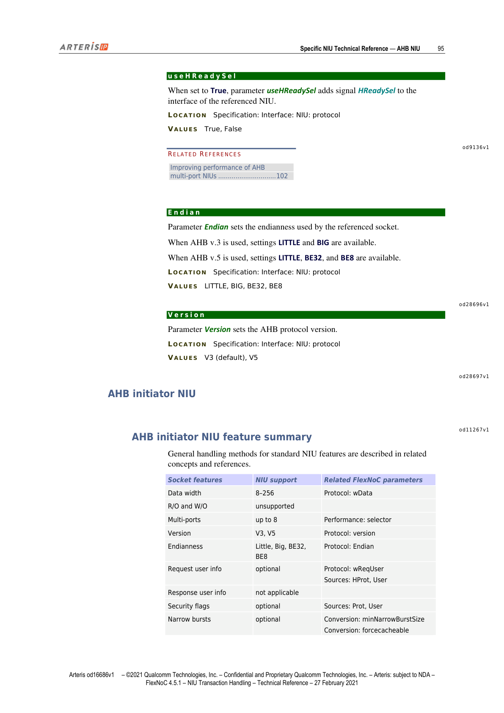
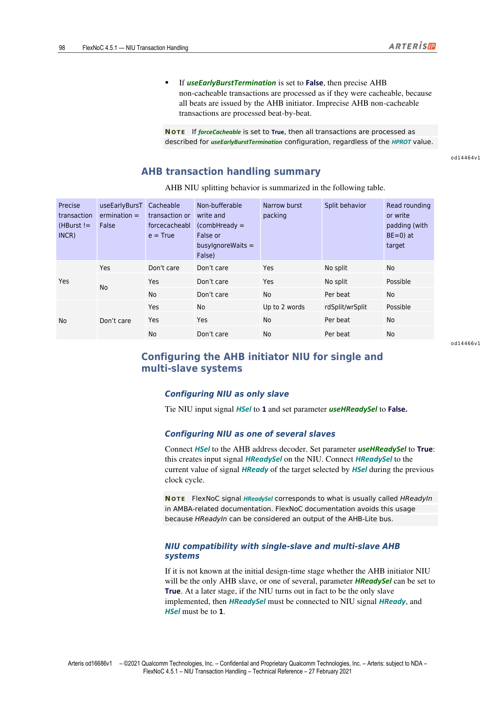
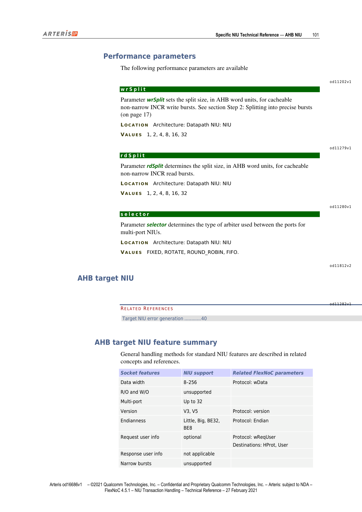
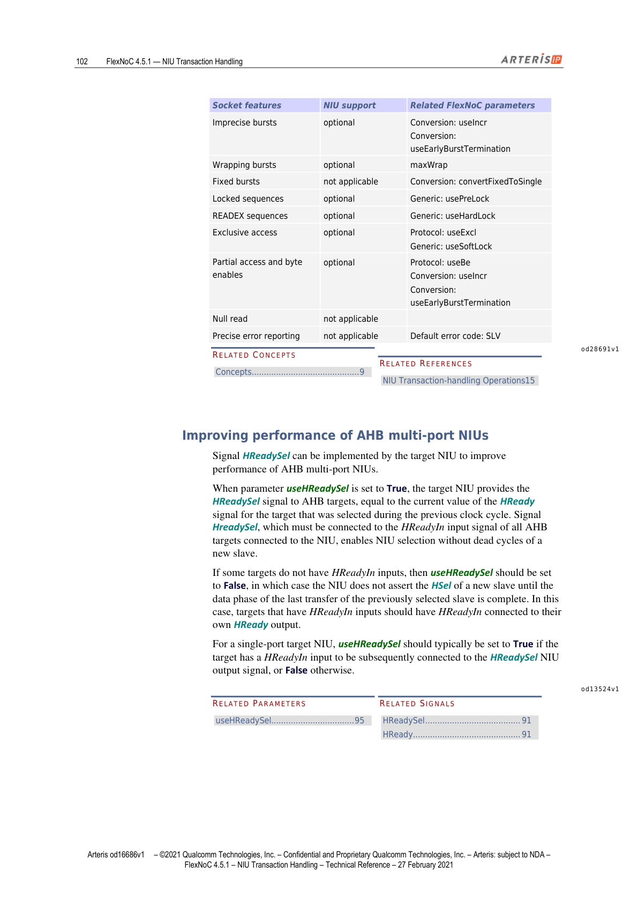
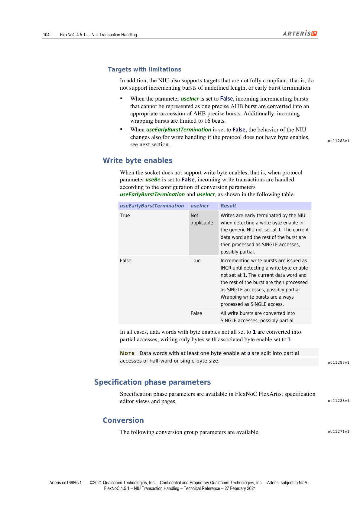

## AHB NIU 概述

> This section describes the key technical characteristics of the Arteris FlexNoC network interface unit (NIU) for the ARM® AMBA® AHB™ protocol.

本节描述 Arteris FlexNoC 针对 ARM® AMBA® AHB™（高性能总线）协议的网络接口单元（NIU）的关键技术特性。

> FlexNoC AHB NIUs only support the subset of the AHB protocol known as AHB-Lite.

FlexNoC AHB NIU 仅支持 AHB 协议的子集，即 **AHB-Lite**。

**注意**：由于 Target NIU 不支持 SPLIT 和 RETRY 响应，Initiator NIU 也不会发出这两种响应。

*图1：AHB NIU 章节首页*

---

## AHB Protocol Signals（AHB 协议信号）

> Arteris FlexNoC technology supports the following AHB protocol signals.

Arteris FlexNoC 技术支持以下 AHB 协议信号：

*图2：AHB 协议信号列表*

| 信号名 | 宽度 | 方向 | 说明 |
|--------|------|------|------|
| `HSel` | 1 bit | Input/Output | 断言时选中当前接口连接的从设备 |
| `HAddr` | `(wAddr-1):0` | Input/Output | 传输字节地址，宽度由参数 `wAddr` 设定 |
| `HWData` | `(wData-1):0` | Input/Output | 写数据，宽度由参数 `wData` 设定 |
| `HTrans` | 1:0 | Input/Output | 传输类型：IDLE、BUSY、SEQ 或 NONSEQ |
| `HWrite` | 1 bit | Input/Output | 断言时表示当前传输为写操作 |
| `HSize` | 2:0 | Input/Output | 当前传输大小，值等于 log2(每周期字节数) |
| `HBurst` | 2:0 | Input/Output | 突发类型：SINGLE / WRAP4 / WRAP8 / WRAP16 / INCR / INCR4 / INCR8 / INCR16 |
| `HProt` | `(wProt-1):0` | — | 事务附加信息：取指/数据、用户/特权访问、可缓冲写、可缓存读等；AHB v5 时额外支持可共享、分配等 |
| `HMastLock` | 1 bit | — | 锁控制：0=Normal，1=SWAP |
| `HWBe` | — | — | 写字节使能扩展信号 |
| `ReqUser` | `(wUser-1):0` | — | 用户位传输，AHB v3 socket 可选扩展 |
| `HAUser` | `(wUser-1):0` | — | 用户位传输，AHB v5 socket 可选扩展 |
| `HRData` | `(wData-1):0` | Input/Output | 读数据，宽度由参数 `wData` 设定 |
| `HReady` | — | — | 高电平表示传输完成；从设备通过驱低插入等待周期 |
| `HReadySel` | — | — | 指示上一个选中从设备的响应完成；必须连接至所有 AHB 目标的 HReadyIn 输入 |
| `HResp` | 1:0 | — | 事务状态信息，由从设备驱动；支持 OKAY 和 ERROR，不支持 RETRY 和 SPLIT |
| `HWDataInfo` | — | — | 带内写数据扩展信号（AHB v3，仅用于特殊需求） |
| `HWUser` | `(wDataInfo-1):0` | — | 写数据用户位（AHB v5） |
| `HRDataInfo` | — | — | 带内读数据扩展信号（AHB v3，仅用于特殊需求） |
| `HRUser` | — | — | 读数据用户位（AHB v5） |
| `HNonSec` | 1 bit | Input/Output | 安全位传输，AHB v5 可选扩展，由参数 `wNonSec` 决定是否存在 |
| `HMaster` | `(wMaster-1):0` | Input/Output | 主机 ID 位传输，AHB v5 可选扩展，宽度由参数 `wMaster` 决定 |
| `HExcl` | 1 bit | Input/Output | 独占访问，AHB v5 可选扩展，由参数 `useExcl` 决定是否存在 |
| `HExOkay` | 1 bit | Input/Output | 独占访问响应，AHB v5 可选扩展，由参数 `useExcl` 决定是否存在 |

---

## AHB Protocol Parameters（AHB 协议参数）

以下参数均位于 `Specification: Interface: NIU: protocol`：

| 参数名 | 取值 | 说明 |
|--------|------|------|
| `wAddr` | 10–40 | 设置 `HAddr` 信号宽度 |
| `wData` | — | 设置 `HRData` 和 `HWData` 信号位宽 |
| `wDataInfo` | 0（默认）–128 | 设置 `HWDataInfo`/`HRDataInfo` 宽度，必须等于 a×wData/8（a 为 0–7 的整数） |
| `wReqUser` | 0–256 | 设置 `ReqUser` 信号位宽 |
| `useBe` | True/False | 为 AHB socket 添加 `HWBe` 信号（APB socket 添加 `PWBe`） |
| `useV6Strb` | True/False | 仅用于 ARMv6 架构的 AHB v2.0 socket；为 True 时添加 `HBStrb` 信号（地址相位信号） |
| `useHReadySel` | True/False | 为指定 NIU 添加 `HReadySel` 信号 |
| `Endian` | LITTLE/BIG/BE32/BE8 | 字节序；AHB v3 支持 LITTLE 和 BIG，AHB v5 支持 LITTLE、BE32 和 BE8 |
| `Version` | V3（默认）/V5 | AHB 协议版本 |

*图3：AHB v5 协议参数配置项*

---

## AHB Initiator NIU（AHB 发起方 NIU）

### 功能特性汇总

> General handling methods for standard NIU features are described in related concepts and references.

| Socket 特性 | NIU 支持情况 | 相关 FlexNoC 参数 |
|------------|------------|-----------------|
| 数据宽度 | 8–256 | `Protocol: wData` |
| 只读/只写 | 不支持 | — |
| 多端口 | 最多 8 | `Performance: selector` |
| 版本 | V3, V5 | `Protocol: version` |
| 字节序 | Little/Big/BE32/BE8 | `Protocol: Endian` |
| 请求用户信息 | 可选 | `Protocol: wReqUser`；源：`HProt`、User |
| 响应用户信息 | 不适用 | — |
| 安全标志 | 可选 | 源：Prot、User |
| 窄突发 | 可选 | `Conversion: minNarrowBurstSize`；`Conversion: forcecacheable` |
| 不精确突发 | 可选 | `Conversion: useEarlyBurstTermination`；`Conversion: forcecacheable` |
| 环绕突发 | 可选 | `Generic: maxWrap`；`Generic: Wrapalign` |
| 固定突发 | 不适用 | — |
| 锁定序列 | 可选 | `Generic: usePreLock` |
| READEX 序列 | 不支持 | — |
| 独占访问 | 可选 | `Protocol: useExcl`；`Generic: useSoftLock` |
| 安全访问 | 可选 | `Protocol: wNonSec` |
| 部分访问和字节使能 | 可选 | `Protocol: useBe` |
| 空读 | 不适用 | — |
| 提前写响应 | 支持 | — |
| 精确错误报告 | 不适用 | 默认错误码：ERROR |

**注意**：为确保 AXI 兼容性，信号 `HProt` 在映射到通用接口用户或安全信号之前会被取反。

*图4：AHB Initiator NIU 功能特性完整对照表*

### 可缓冲写与提前写响应（Bufferable Writes and Early Write Response）

> The AHB initiator NIU issues early write responses for:

AHB Initiator NIU 在以下情况发出提前写响应（early write response）：

1. **可缓冲写事务的所有 beat**：使用 AHB v5 时，可缓冲可共享写（bufferable shareable writes）视为非可缓冲写处理。

   **注意**：事务可缓冲并不改变排序模型——AHB 是有序协议，NIU 在允许向不同目标发起后续事务之前，会等待当前事务的写响应返回。

2. **非可缓冲写事务的所有 beat（最后一个数据字的 beat 除外）**：最后一个 beat 在收到目标的写响应后才被响应。

   **注意**：当 `combHReady` 或 `busyIgnoreWaits` 设置为 False 时，NIU 无法在不精确突发或提前终止突发的最后一个数据 beat 期间撤销 HREADY 来暂停发起方。因此，在此类配置中：
   - 非可缓冲不精确 INCR 写突发会被拆分为单 beat 请求
   - 非可缓冲提前终止精确突发在数据真正提交到目标之前，就以 HREADY=1 完成了 AHB 接口上的处理

*图5：Initiator NIU 写响应处理流程*

### 可缓存读处理（Cacheable Read Handling）

> To improve performance of cacheable reads, the NIU processes cacheable precise AHB reads (single, 4, 8, or 16 beats) during the address phase of the first beat by immediately issuing a corresponding burst request to the target.

为提升可缓存读性能，NIU 在第一个 beat 的地址相位期间立即向目标发出相应的突发请求（适用于精确 AHB 读：SINGLE、4、8 或 16 个 beat）。此外，NIU 按参数 `rdSplit` 预取不精确递增读，窄突发除外（窄突发始终拆分为 2 个 beat 的突发）。

- 当前一个传输返回错误响应、且 AHB 发起方已发出新的可缓存读地址相位并已转发到目标时，NIU 丢弃该新读事务的响应（因为 AHB 发起方有权中止该事务）。若发起方最终未中止，NIU 重新发出该事务——即该事务会向目标发出两次。
- `useEarlyBurstTermination = True`：发起方可中止突发或在错误时中止请求传输；超额预取的数据被丢弃。
- `useEarlyBurstTermination = False`：发起方不得中止突发，不必要的预取数据被丢弃。

### 可缓存写处理（Cacheable Write Handling）

> To improve performance of cacheable writes, the NIU processes bufferable precise AHB writes, that is, single, 4, 8, or 16 beats, during the address phase of the first beat by immediately issuing a corresponding burst request to the target.

为提升可缓存写性能，NIU 在第一个 beat 的地址相位期间立即发出对应突发请求（精确写：SINGLE、4、8 或 16 个 beat）。不精确递增写按参数 `wrSplit` 拆分并填充，窄突发除外（窄突发始终拆分为 2 个 beat）。若发起方中止可缓存写突发，或突发大小不是 `wrSplit` 的倍数，则以字节使能为 0 的数据字进行填充。

### 非可缓存事务处理（Non-cacheable Transaction Handling）

> When parameter `forceCacheable` is set to False, non-cacheable transactions are handled as follows:

`forceCacheable = False` 时，非可缓存事务处理方式如下：

- `useEarlyBurstTermination = True`：发起方有权中止突发或在错误时中止请求传输。AHB 非可缓存事务逐 beat 处理，只有在前一个传输的响应已知后才向目标发出下一个单字请求。
- `useEarlyBurstTermination = False`：精确非可缓存事务按可缓存方式处理（因为所有 beat 都由发起方发出）；不精确非可缓存事务逐 beat 处理。

**注意**：若 `forceCacheable = True`，则所有事务无论 HPROT 值如何，均按 `useEarlyBurstTermination` 配置描述的方式处理。

### AHB 事务处理汇总表

*图6：AHB NIU 拆分行为决策矩阵*

| 精确事务 (HBurst≠INCR) | useEarlyBurstTermination=False | 可缓存或forceCacheable=True | 非可缓冲写且(combHReady=False 或 busyIgnoreWaits=False) | 窄突发打包 | 拆分行为 | 读补全/写填充（目标端） |
|---|---|---|---|---|---|---|
| Yes | Yes | Don't care | Don't care | Yes | 不拆分 | No |
| No | Yes | Don't care | Yes | No | 不拆分 | Possible |
| No | Don't care | No | — | Per beat | No | — |
| No | Don't care | Yes | No | Up to 2 words rdSplit/wrSplit | Possible | — |
| Yes | Yes | No | — | Per beat | No | — |
| No | Don't care | No | — | Per beat | No | — |

### 单从设备与多从设备系统配置

**仅作为唯一从设备**：将 NIU 输入信号 `HSel` 接高（1），并将参数 `useHReadySel` 设置为 False。

**作为多个从设备之一**：
1. 将 `HSel` 连接到 AHB 地址解码器
2. 将 `useHReadySel` 设置为 True（创建 `HReadySel` 输入信号）
3. 将 `HReadySel` 连接到上一个时钟周期由 `HSel` 选中的目标的 `HReady` 当前值

**注意**：FlexNoC 的 `HReadySel` 信号对应 AMBA 文档中通常称为 `HReadyIn` 的信号。

> IMPORTANT: Signal HReadySel must not be tied-off, as this can functionally hinder NIU operation.

**重要**：信号 `HReadySel` 不得接地（tie-off），否则会在功能上影响 NIU 正常工作。

*图7：AHB NIU 单/多从设备配置指南*

### 部分访问与字节使能

AHB Initiator NIU 始终支持由 `HSIZE` 指示的部分访问，还可选支持由参数 `Protocol: useBe` 激活的 `HWBe` 信号提供字节使能。

### Specification Phase 参数（发起方）

**Conversion 参数组：**

| 参数名 | 位置 | 取值 | 说明 |
|--------|------|------|------|
| `forceCacheable` | Spec: Interface: NIU: conversion | True/False（默认） | True：强制所有事务按可缓存处理（等效于 Hprot[3] 接 1）；False：使用 Hprot[3] 作为可缓存指示位 |
| `useEarlyBurstTermination` | Spec: Interface: NIU: conversion | True/False（默认） | True：NIU 处理提前终止突发及错误时中止的请求传输地址相位；不支持前一传输成功时的中止 |
| `busyIgnoreWaits` | Spec: Interface: NIU: conversion | True（默认）/False | True：发起方无需等待 HReady 高即可从 BUSY 切换到 SEQ/NONSEQ/IDLE（推荐）；False：添加协议转换器避免死锁，代价等同于一个流水线级 |
| `minNarrowBurstSize` | Spec: Interface: NIU: conversion | None（默认）/1/2/4/8/16/32/64 | None：禁用窄突发支持（减少面积），不影响单 beat 部分访问；其他值：定义窄多字突发支持的最小 HSIZE 值 |
| `urgencyMap` | Spec: Interface: NIU: conversion | — | 启用通用协议请求信号 Urgency 的可选紧急位映射；可由 AxQoS、CONST_0/CONST_1 或 ReqUser 用户位驱动 |
| `combHReady` | Spec: Interface: NIU: conversion | True/False | True：HReady 输出组合逻辑依赖 HSel、HTrans 和 HWrite 输入，对非可缓冲写突发性能更好，门电路成本更低 |

*图8：AHB Initiator NIU conversion 参数列表*

### Architecture Phase 性能参数（发起方）

| 参数名 | 位置 | 取值 | 说明 |
|--------|------|------|------|
| `wrSplit` | Architecture: Datapath NIU: NIU | 1/2/4/8/16/32 | 可缓存非窄 INCR 写突发的拆分大小（AHB 字为单位） |
| `rdSplit` | Architecture: Datapath NIU: NIU | 1/2/4/8/16/32 | 可缓存非窄 INCR 读突发的拆分大小（AHB 字为单位） |
| `selector` | Architecture: Datapath NIU: NIU | FIXED/ROTATE/ROUND_ROBIN/FIFO | 多端口 NIU 的仲裁器类型 |

*图9：AHB Initiator NIU 性能参数配置*

---

## AHB Target NIU（AHB 目标端 NIU）

### 功能特性汇总

| Socket 特性 | NIU 支持情况 | 相关 FlexNoC 参数 |
|------------|------------|-----------------|
| 数据宽度 | 8–256 | `Protocol: wData` |
| 只读/只写 | 不支持 | — |
| 多端口 | 最多 32 | — |
| 版本 | V3, V5 | `Protocol: version` |
| 字节序 | Little/Big/BE32/BE8 | `Protocol: Endian` |
| 请求用户信息 | 可选 | `Protocol: wReqUser`；目的：`HProt`、User |
| 响应用户信息 | 不适用 | — |
| 窄突发 | 不支持 | — |
| 不精确突发 | 可选 | `Conversion: useIncr`；`Conversion: useEarlyBurstTermination` |
| 环绕突发 | 可选 | `maxWrap` |
| 固定突发 | 不适用 | `Conversion: convertFixedToSingle` |
| 锁定序列 | 可选 | `Generic: usePreLock` |
| READEX 序列 | 可选 | `Generic: useHardLock` |
| 独占访问 | 可选 | `Protocol: useExcl`；`Generic: useSoftLock` |
| 部分访问和字节使能 | 可选 | `Protocol: useBe` |
| 空读 | 不适用 | — |
| 精确错误报告 | 不适用 | 默认错误码：SLV |

### 提升 AHB 多端口 NIU 性能（Improving Performance of AHB Multi-port NIUs）

> Signal HReadySel can be implemented by the target NIU to improve performance of AHB multi-port NIUs.

目标 NIU 可通过实现 `HReadySel` 信号来提升 AHB 多端口 NIU 的性能。

> When parameter `useHReadySel` is set to True, the target NIU provides the HReadySel signal to AHB targets, equal to the current value of the HReady signal for the target that was selected during the previous clock cycle.

`useHReadySel = True` 时，目标 NIU 向 AHB 目标提供 `HReadySel` 信号（等于上一个时钟周期所选目标的 `HReady` 当前值）。该信号必须连接至所有连接到 NIU 的 AHB 目标的 `HReadyIn` 输入，从而实现在无死周期的情况下选择新从设备。

若某些目标没有 `HReadyIn` 输入，则 `useHReadySel` 应设为 False——NIU 在上一个选中从设备最后一次传输的数据相位完成之前，不会断言新从设备的 `HSel`。这种情况下，有 `HReadyIn` 输入的目标应将 `HReadyIn` 连接到自身的 `HReady` 输出。

对于单端口目标 NIU：若目标有 `HReadyIn` 输入则通常设为 True，否则设为 False。

*图10：HReadySel 信号配置示意*

### 部分访问与字节使能（Target 端）

AHB Target NIU 始终支持由 `HSIZE` 指示的部分访问，还可选支持由参数 `Protocol: useBe` 激活的 `HWBe` 信号字节使能。

`Protocol: useBe = False` 时，写突发映射会被修改，以正确处理所有字节使能模式，避免向非预期位置写入数据。

### 突发映射（Burst Mapping）

#### 完全兼容目标（Fully Compliant Targets）

> When the AHB target is fully compliant, that is, supports incrementing bursts of undefined length (as indicated by `Conversion: useIncr`) and early burst termination (as indicated by `Conversion: useEarlyBurstTermination`), incoming bursts that can be represented as AHB precise bursts are issued with the corresponding HTrans encoding, and all other bursts are issued as INCR of undefined length.

完全兼容目标支持不定长递增突发（`useIncr`）和提前终止（`useEarlyBurstTermination`）时，可表示为精确突发的入站突发以对应 `HTrans` 编码发出，其余均发出为不定长 INCR。

**特殊情况**：AHB Target NIU 可在 BUSY 传输时提前终止固定突发。当目标 NIU 接收到写突发访问，数据字之间有气泡周期（产生 BUSY 传输），且字节使能模式不全为 1（至少有 1 个字节使能为 0）时，会发生此行为。例如，INCR4 突发可通过以下序列提前终止：NonSeq → Busy → Seq → Busy → Idle 或 NonSeq。

若需禁用此行为，可选：
1. 设置 `useEarlyBurstTermination = False`：强制写访问拆分为 SINGLE，NIU 不再产生 BUSY 传输
2. 在请求路径的 AHB Target NIU 前添加 Store&Forward Rate Adapter，重新打包写访问并消除气泡周期

*图11：AHB Target NIU 突发映射与字节使能处理*

#### 非完全兼容目标（Targets with Limitations）

> In addition, the NIU also supports targets that are not fully compliant.

NIU 同样支持不完全兼容目标：

- `useIncr = False`：无法表示为单个精确 AHB 突发的入站递增突发被转换为适当的精确突发序列；入站环绕突发限制为 16 个 beat
- `useEarlyBurstTermination = False`：当协议无字节使能时，写处理行为也会改变（见下节）

### 写字节使能（Write Byte Enables）

当 socket 不支持写字节使能（`Protocol: useBe = False`）时，写事务按如下规则处理：

| `useEarlyBurstTermination` | `useIncr` | 处理结果 |
|---------------------------|-----------|---------|
| True | N/A | 当检测到字节使能不全为 1 时，NIU 提前终止写操作；当前数据字及剩余突发作为 SINGLE 访问处理（可能为部分访问） |
| False | True | 递增写突发发出为 INCR 直到检测到字节使能不全为 1；当前数据字及剩余突发作为 SINGLE 访问处理。环绕写突发始终作为 SINGLE 访问处理 |
| False | False | 所有写突发均转换为 SINGLE 访问（可能为部分访问） |

**注意**：字节使能不全为 1 的数据字会被拆分为半字或单字节大小的部分访问，只写入字节使能为 1 的字节。

### Specification Phase 参数（目标端 Conversion 参数组）

| 参数名 | 位置 | 取值 | 说明 |
|--------|------|------|------|
| `useEarlyBurstTermination` | Spec: Interface: NIU: conversion | True/False（默认） | True：Target NIU 可对字节使能不全的写事务产生提前终止突发 |
| `useIncr` | Spec: Interface: NIU: conversion | True/False（默认） | True：将入站突发转换为不定长 INCR（除非可表示为精确突发）；False：转换为适当精确突发序列 |

精确 AHB 突发定义：
- SINGLE 传输
- 4、8 或 16 个完整字 beat 的递增突发
- 4、8 或 16 个完整字 beat 的环绕突发

---

*本文为 Arteris FlexNoC 4.5.1 NIU Transaction Handling Technical Reference 第8章中英对照翻译，原文版权归 Qualcomm Technologies, Inc. / Arteris IP 所有，本译文仅供学习参考。*
