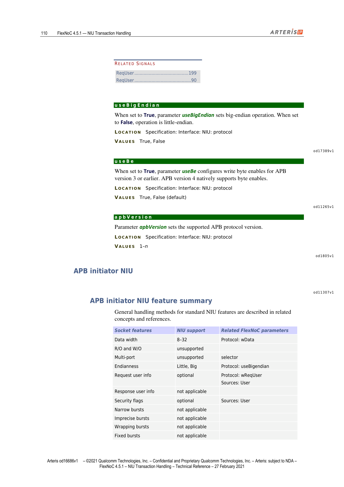
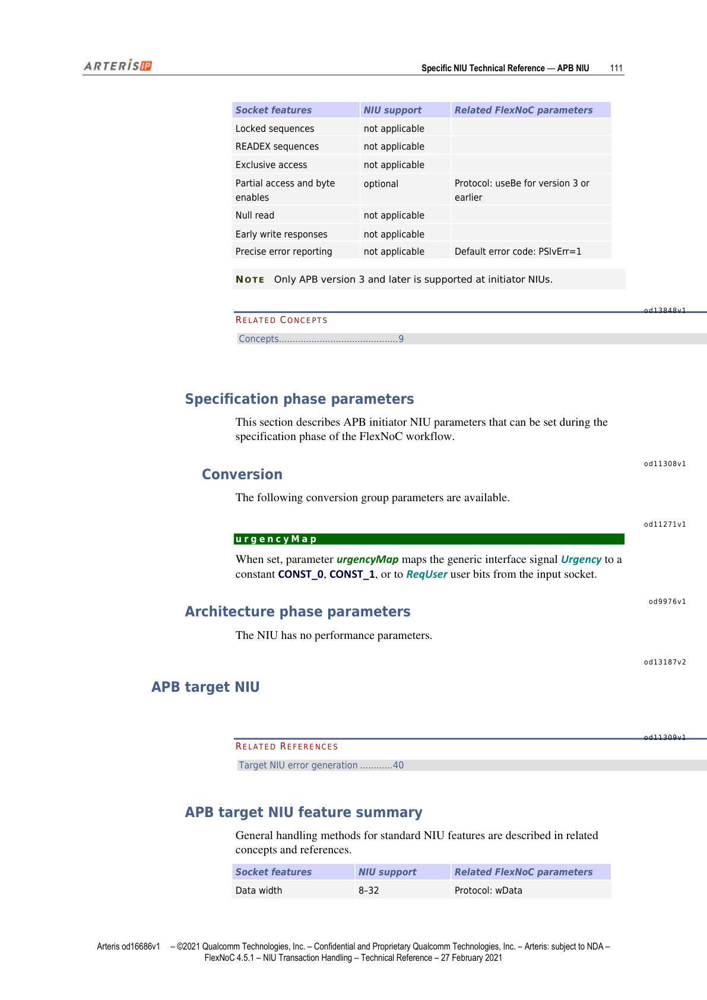
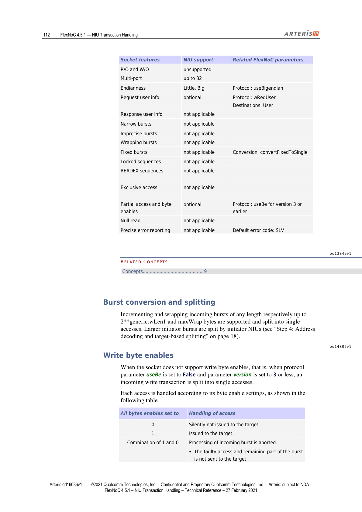

本文为 FlexNOC NIU Transaction Handling 技术参考手册第 9 章的中英双语对照翻译，覆盖 APB NIU 接口信号、协议参数以及 Initiator/Target 两类 NIU 的功能特性与配置说明。

---

## APB NIU

> This section describes the key technical characteristics of the Arteris FlexNoC network interface unit (NIU) for the ARM® AMBA® APB™ protocol.

本节描述 Arteris FlexNOC 网络接口单元（NIU）针对 ARM® AMBA® APB™ 协议的关键技术特性。

---

## APB Interface Signals（APB 接口信号）

> Arteris FlexNoC technology supports the following APB protocol signals.

Arteris FlexNOC 技术支持以下 APB 协议信号。

*图1：APB NIU 信号与结构总览（第107页）*

---

### PEnable

> Signal PEnable is asserted during the second and subsequent cycles of the current transfer.
>
> | | |
> |---|---|
> | WIDTH | 1 bit |
> | DIRECTION | Input, output |

信号 PEnable 在当前传输的第二个及后续时钟周期被置有效。

| 属性 | 值 |
|------|-----|
| 位宽 | 1 bit |
| 方向 | 输入 / 输出 |

---

### PAddr

> Signal PAddr indicates the transfer byte address. Signal width is set by parameter wAddr (Specification: Interface: NIU: protocol).
>
> | | |
> |---|---|
> | WIDTH | ((wAddr – 1):0) |
> | DIRECTION | Input, output |

信号 PAddr 指示传输的字节地址，信号位宽由参数 wAddr 设置（路径：Specification: Interface: NIU: protocol）。

| 属性 | 值 |
|------|-----|
| 位宽 | ((wAddr – 1):0) |
| 方向 | 输入 / 输出 |

---

### PWData

> Signal PWData carries write data. Signal width is set by parameter wData (Specification: Interface: NIU: protocol).
>
> | | |
> |---|---|
> | WIDTH | ((wData – 1):0) |
> | DIRECTION | Input, output |

信号 PWData 携带写数据，位宽由参数 wData 设置。

| 属性 | 值 |
|------|-----|
| 位宽 | ((wData – 1):0) |
| 方向 | 输入 / 输出 |

---

### PWrite

> When asserted, signal PWrite indicates that the current access is a write.
>
> | | |
> |---|---|
> | WIDTH | 1 bit |
> | DIRECTION | Input, output |

PWrite 有效时，表示当前访问为写操作。

| 属性 | 值 |
|------|-----|
| 位宽 | 1 bit |
| 方向 | 输入 / 输出 |

---

### ReqUser

> Signal ReqUser allows user bit transport, and is available as an optional extension to AHB v.3 sockets. Signal width is determined by related parameter wUser.
>
> | | |
> |---|---|
> | WIDTH | ((wUser – 1):0) |

信号 ReqUser 支持用户比特传输，作为 AHB v.3 socket 的可选扩展。位宽由参数 wUser 决定。

| 属性 | 值 |
|------|-----|
| 位宽 | ((wUser – 1):0) |

**相关参数**：wUser（详见参数说明第150页）

---

### PSel

> When asserted, signal PSel selects the corresponding slave, and indicates that a data transfer is required.
>
> | | |
> |---|---|
> | WIDTH | 1 bit |
> | DIRECTION | Input, output |

信号 PSel 有效时，选中对应的从设备，并指示需要进行数据传输。

| 属性 | 值 |
|------|-----|
| 位宽 | 1 bit |
| 方向 | 输入 / 输出 |

---

### PRData

> Signal PRData carries read data. Signal width is set by parameter wData (Specification: Interface: NIU: protocol).
>
> | | |
> |---|---|
> | WIDTH | ((wData – 1):0) |
> | DIRECTION | Input, output |

信号 PRData 携带读数据，位宽由参数 wData 设置。

| 属性 | 值 |
|------|-----|
| 位宽 | ((wData – 1):0) |
| 方向 | 输入 / 输出 |

---

### PReady

> When asserted, signal PReady indicates that the last cycle of the current transfer is underway. If more data must be concatenated to a transfer after the signal has been asserted, slaves de-assert the signal. The signal is only available when parameter apbVersion is set to v3 or v4.

信号 PReady 有效时，表示当前传输的最后一个时钟周期正在进行。如果有效后仍需拼接更多数据，从设备需撤销该信号。该信号仅在参数 apbVersion 设置为 v3 或 v4 时可用。

---

### PSlvErr

> Signal PSlvErr indicates that the corresponding transfer has failed. The signal is only available when parameter apbVersion is set to v3 or v4 (Specification: Interface: NIU: protocol).
>
> | | |
> |---|---|
> | WIDTH | 1 bit |
> | DIRECTION | Input, output |

信号 PSlvErr 指示对应传输失败。该信号仅在 apbVersion 为 v3 或 v4 时可用。

| 属性 | 值 |
|------|-----|
| 位宽 | 1 bit |
| 方向 | 输入 / 输出 |

---

### PWbe

> Signal PWbe contains byte enables associated with PWdata. This signal is only available when parameter useBe is set to True.
>
> WIDTH: ((wdata / 8 – 1):0)

信号 PWbe 携带与 PWdata 关联的字节使能，仅在参数 useBe 设置为 True 时可用。

| 属性 | 值 |
|------|-----|
| 位宽 | ((wdata / 8 – 1):0) |

---

### PStrb

> Signal PStrb contains byte enables associated with PWdata. This signal is only available when parameter version is set to v4. Signal width is determined by parameter wData.
>
> WIDTH: (((wdata / 8) – 1):0)

信号 PStrb 携带与 PWdata 关联的字节选通，仅在 version 参数设置为 v4 时可用，位宽由 wData 决定。

| 属性 | 值 |
|------|-----|
| 位宽 | (((wdata / 8) – 1):0) |

---

### PProt

> Signal PProt contains protection information. This signal is only available when APB parameter version is set to v4.
>
> WIDTH: (((wdata / 8) – 1):0)

信号 PProt 携带保护信息，仅在 APB version 参数设置为 v4 时可用。

| 属性 | 值 |
|------|-----|
| 位宽 | (((wdata / 8) – 1):0) |

---

## APB Protocol Parameters（APB 协议参数）

> The following protocol parameters are common to both FlexNoC APB initiator and target NIUs (Specification: Interface: NIU: protocol).

以下协议参数对 FlexNOC APB Initiator NIU 和 Target NIU 均适用（路径：Specification: Interface: NIU: protocol）。

### 参数汇总表

| 参数名 | 说明 | 取值 |
|--------|------|------|
| wAddr | PAddr 信号的位宽 | 8–36 |
| wData | 读写数据通道位宽（PRdata / HWData） | 8, 16, 32 |
| version | APB 协议版本 | V2, V3, V4 |
| wReqUser | ReqUser 信号的位宽（bits） | 0–256 |
| useBigEndian | True 为大端模式，False 为小端模式 | True, False |
| useBe | 为 APB v3 或更早版本配置写字节使能；APB v4 原生支持字节使能 | True, False（默认 False） |
| apbVersion | 设置支持的 APB 协议版本 | 1–n |

---

### wAddr

> Generic interface parameter wAddr sets the width of signal PAddr.
>
> LOCATION: Specification: Interface: NIU: protocol  
> VALUES: 8–36

通用接口参数 wAddr 设置信号 PAddr 的位宽，取值范围 8–36。

---

### wData

> Parameter wData sets the width, in bits, of the request (write) and response (read) data channels. Used for APB signals PRdata and HWData.
>
> LOCATION: Specification: Interface: NIU: protocol  
> VALUES: 8, 16, 32

参数 wData 设置请求（写）和响应（读）数据通道的位宽（bits），用于 APB 信号 PRdata 和 HWData，取值 8、16 或 32。

---

### version

> Parameter version sets the APB protocol version to be used by the referenced socket.
>
> LOCATION: Specification: Interface: NIU: protocol  
> VALUES: V2, V3, V4

参数 version 设置对应 socket 使用的 APB 协议版本，可选 V2、V3、V4。

---

### wReqUser

> Parameter wReqUser sets the width, in bits, of signal ReqUser.
>
> LOCATION: Specification: Interface: NIU: protocol  
> VALUES: 0–256

参数 wReqUser 设置信号 ReqUser 的位宽（bits），取值范围 0–256。

---

### useBigEndian

> When set to True, parameter useBigEndian sets big-endian operation. When set to False, operation is little-endian.
>
> LOCATION: Specification: Interface: NIU: protocol  
> VALUES: True, False

useBigEndian 为 True 时使用大端模式，为 False 时使用小端模式。

---

### useBe

> When set to True, parameter useBe configures write byte enables for APB version 3 or earlier. APB version 4 natively supports byte enables.
>
> LOCATION: Specification: Interface: NIU: protocol  
> VALUES: True, False (default)

useBe 为 True 时，为 APB v3 及更早版本配置写字节使能；APB v4 原生支持字节使能，无需此参数，默认值为 False。

---

### apbVersion

> Parameter apbVersion sets the supported APB protocol version.
>
> LOCATION: Specification: Interface: NIU: protocol  
> VALUES: 1–n

参数 apbVersion 设置所支持的 APB 协议版本，取值为 1 到 n。

---

## APB Initiator NIU（APB Initiator NIU）

*图2：APB Initiator NIU 特性概览表（第110页）*

### APB Initiator NIU Feature Summary（功能特性汇总）

> General handling methods for standard NIU features are described in related concepts and references.

标准 NIU 功能特性的通用处理方法见相关概念与参考章节。

| Socket 特性 | NIU 支持情况 | 相关 FlexNOC 参数 |
|-------------|-------------|------------------|
| 数据位宽 | 8–32 | Protocol: wData |
| 只读 / 只写（R/O and W/O） | 不支持 | — |
| 多端口（Multi-port）选择器 | 不支持 | — |
| 字节序（Endianness） | Little, Big | Protocol: useBigendian |
| 请求用户信息（Request user info） | 可选 | Protocol: wReqUser / Sources: User |
| 响应用户信息（Response user info） | 不适用 | — |
| 安全标志（Security flags） | 可选 | Sources: User |
| 窄突发（Narrow bursts） | 不适用 | — |
| 非精确突发（Imprecise bursts） | 不适用 | — |
| 回绕突发（Wrapping bursts） | 不适用 | — |
| 固定突发（Fixed bursts） | 不适用 | — |
| 锁定序列（Locked sequences） | 不适用 | — |
| READEX 序列 | 不适用 | — |
| 排他访问（Exclusive access） | 不适用 | — |
| 部分访问与字节使能（Partial access / byte enables） | 可选 | Protocol: useBe（v3 或更早版本） |
| 空读（Null read） | 不适用 | — |
| 提前写响应（Early write responses） | 不适用 | — |
| 精确错误上报（Precise error reporting） | 不适用，默认错误码：PSlvErr=1 | — |

**注意**：APB Initiator NIU 仅支持 APB version 3 及更高版本。

*图3：APB Initiator NIU 特性详表（续，第111页）*

---

### Specification Phase Parameters（规格阶段参数）

> This section describes APB initiator NIU parameters that can be set during the specification phase of the FlexNoC workflow.

本节描述 APB Initiator NIU 在 FlexNOC 工作流规格阶段可设置的参数。

**Conversion（转换）**

> The following conversion group parameters are available.

以下转换组参数可用。

#### urgencyMap

> When set, parameter urgencyMap maps the generic interface signal Urgency to a constant CONST_0, CONST_1, or to ReqUser user bits from the input socket.

当设置该参数时，urgencyMap 将通用接口信号 Urgency（紧急度）映射到常量 CONST_0、CONST_1，或来自输入 socket 的 ReqUser 用户比特。

---

### Architecture Phase Parameters（架构阶段参数）

> The NIU has no performance parameters.

该 NIU 无性能参数。

---

## APB Target NIU（APB Target NIU）

*图4：APB Target NIU 特性概览表（第112页）*

### APB Target NIU Feature Summary（功能特性汇总）

| Socket 特性 | NIU 支持情况 | 相关 FlexNOC 参数 |
|-------------|-------------|------------------|
| 数据位宽 | 8–32 | Protocol: wData |
| 只读 / 只写（R/O and W/O） | 不支持 | — |
| 多端口（Multi-port）选择器 | 最多 32 个 | — |
| 字节序（Endianness） | Little, Big | Protocol: useBigendian |
| 请求用户信息（Request user info） | 可选 | Protocol: wReqUser / Destinations: User |
| 响应用户信息（Response user info） | 不适用 | — |
| 窄突发（Narrow bursts） | 不适用 | — |
| 非精确突发（Imprecise bursts） | 不适用 | — |
| 回绕突发（Wrapping bursts） | 不适用 | — |
| 固定突发（Fixed bursts） | 不适用 | Conversion: convertFixedToSingle |
| 锁定序列（Locked sequences） | 不适用 | — |
| READEX 序列 | 不适用 | — |
| 排他访问（Exclusive access） | 不适用 | — |
| 部分访问与字节使能（Partial access / byte enables） | 可选 | Protocol: useBe（v3 或更早版本） |
| 空读（Null read） | 不适用 | — |
| 精确错误上报（Precise error reporting） | 不适用，默认错误码：SLV | — |

---

### Burst Conversion and Splitting（突发转换与拆分）

> Incrementing and wrapping incoming bursts of any length respectively up to 2**generic:wLen1 and maxWrap bytes are supported and split into single accesses. Larger initiator bursts are split by initiator NIUs (see "Step 4: Address decoding and target-based splitting").

支持对任意长度的递增型（incrementing）和回绕型（wrapping）传入突发进行处理，分别拆分为最多 2\*\*generic:wLen1 字节和 maxWrap 字节的单次访问。更大的 Initiator 突发由 Initiator NIU 在地址解码和基于目标的拆分阶段进行拆分（参见"Step 4: Address decoding and target-based splitting"）。

---

### Write Byte Enables（写字节使能）

> When the socket does not support write byte enables, that is, when protocol parameter useBe is set to False and parameter version is set to 3 or less, an incoming write transaction is split into single accesses. Each access is handled according to its byte enable settings, as shown in the following table.

当 socket 不支持写字节使能时（即协议参数 useBe 为 False 且 version 为 3 或更低），传入的写事务将被拆分为单次访问。每次访问根据其字节使能设置进行如下处理：

| 所有字节使能均设置为 | 访问处理方式 |
|---------------------|-------------|
| 0 | 静默丢弃，不向 target 发送 |
| 1 | 正常向 target 发出 |
| 0 和 1 的混合 | 中止对传入突发的处理：该次访问及突发剩余部分不发送至 target；向 Initiator 返回带内错误，错误码固定为 SLV |

*图5：写字节使能处理流程（第113页）*

---

### Architecture Phase Pipeline Parameters for APB Target NIU（APB Target NIU 架构阶段流水线参数）

> Parameters fullFwdPipe and fullSpeed apply to APB target NIU configuration.

参数 fullFwdPipe 和 fullSpeed 适用于 APB Target NIU 配置。

**注意**：fullFwdPipe 和 fullSpeed 中至少有一个必须设置为 True。

#### fullFwdPipe

> When set to True, parameter fullFwdPipe implements a forward pipeline stage both on the APB request and the APB response. APB socket inputs and outputs are registered. This mode costs a request latency cycle and a response latency cycle and is recommended for easy timing closure.
> When set to False, outputs and inputs are not registered.
>
> LOCATION: Architecture: Datapath NIU: NIU  
> VALUES: True (default), False

当设置为 True 时，fullFwdPipe 在 APB 请求和响应通道上都实现前向流水线级，APB socket 的输入和输出均进行寄存。此模式会各增加一个请求和响应延迟周期，但有利于时序收敛，推荐使用。设置为 False 时，输入输出不进行寄存。

| 属性 | 值 |
|------|-----|
| 路径 | Architecture: Datapath NIU: NIU |
| 取值 | True（默认），False |

#### fullSpeed

> When set to True, parameter fullSpeed implements buffering that allows the APB NIU to run at full APB throughput, that is, one data word every other cycle, and back-to-back burst support from the NIU.
> When set to False, the NIU throughput is limited to one word every three cycles, plus one dead cycle between bursts from the NIU.
>
> LOCATION: Architecture: Datapath NIU: NIU  
> VALUES: True, False (default)

当设置为 True 时，fullSpeed 实现缓冲机制，使 APB NIU 能够以满吞吐量运行，即每隔一个周期传输一个数据字，并支持 NIU 侧的背靠背（back-to-back）突发。设置为 False 时，NIU 吞吐量限制为每三个周期一个字，且 NIU 侧突发之间存在一个空闲周期。

| 属性 | 值 |
|------|-----|
| 路径 | Architecture: Datapath NIU: NIU |
| 取值 | True, False（默认） |
