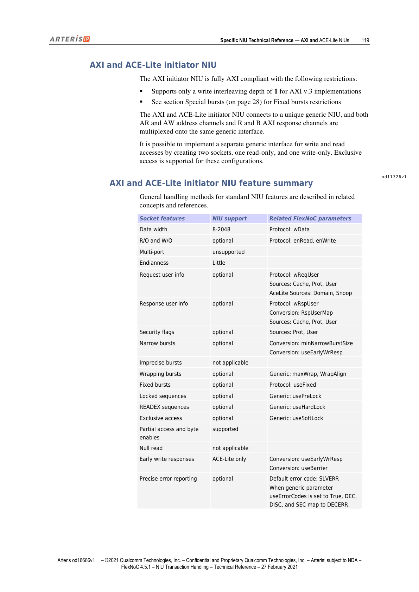
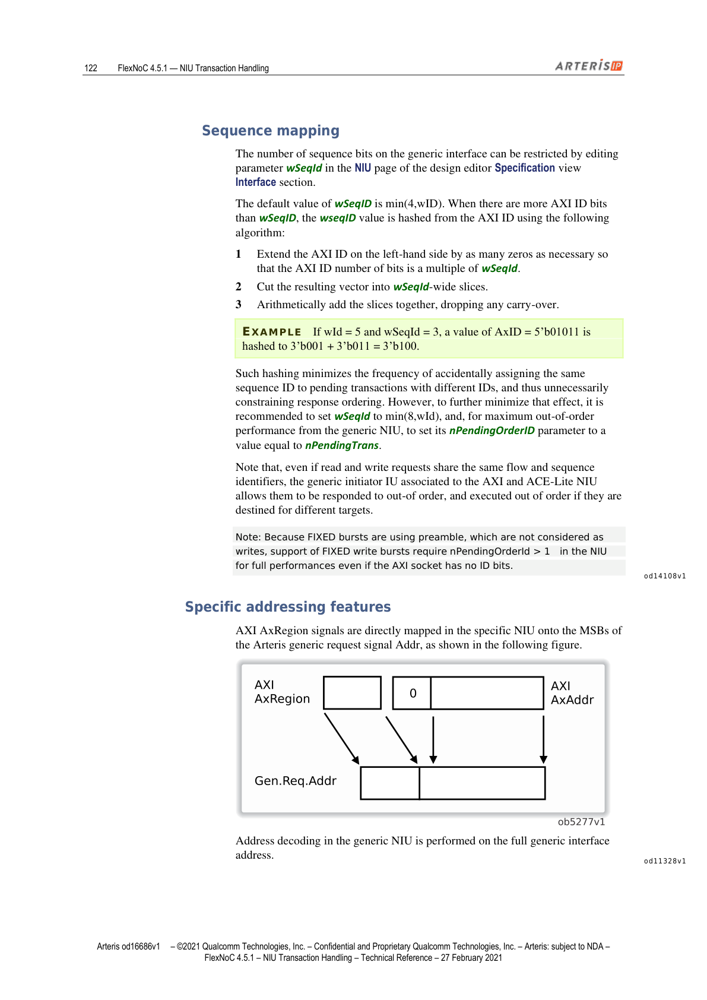
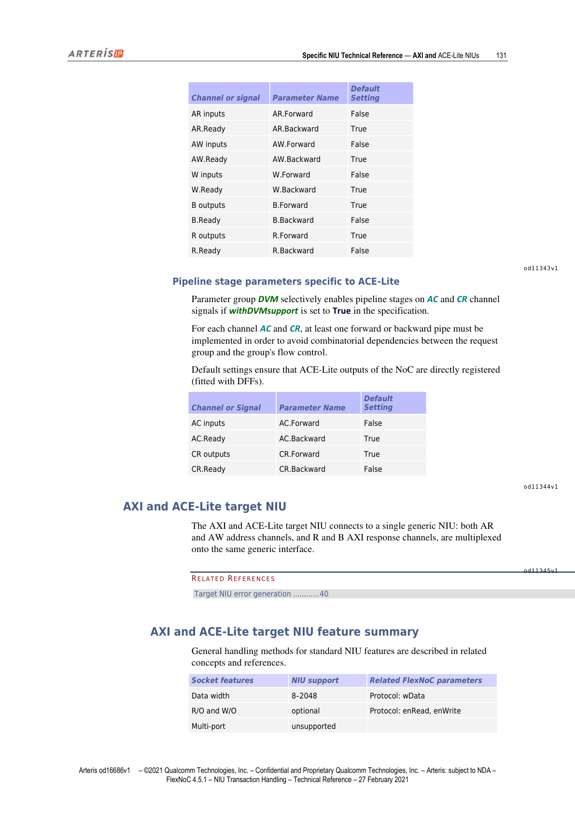
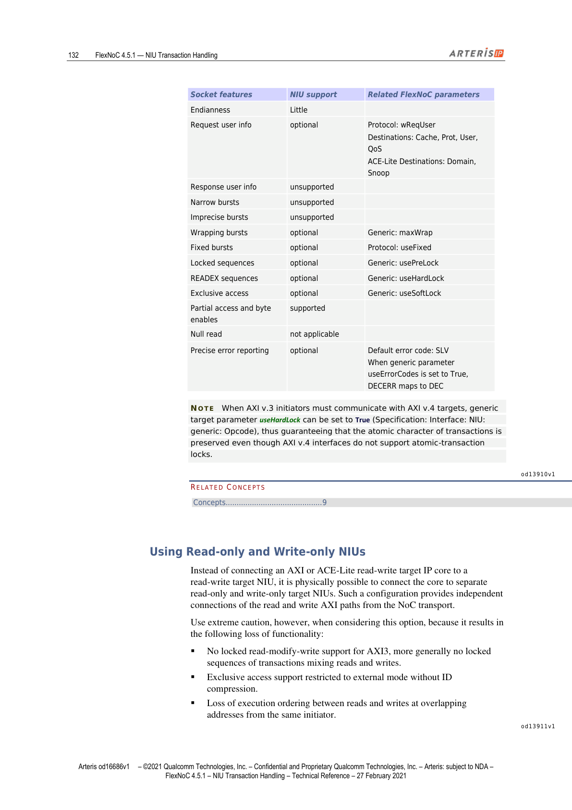
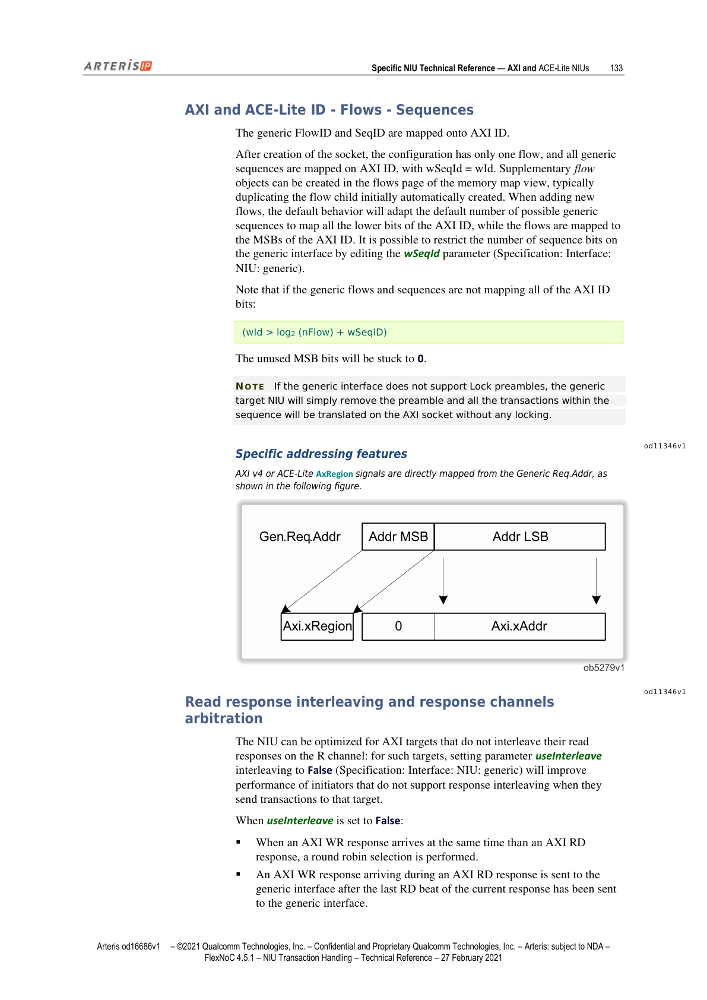
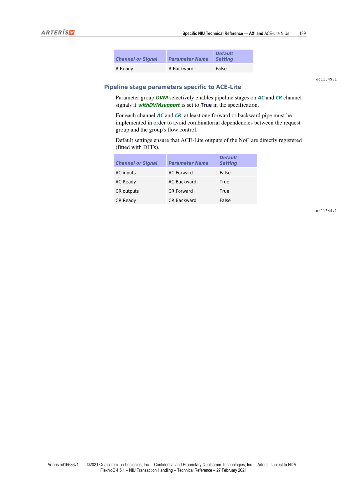

本文为 FlexNOC NIU Transaction Handling 技术参考手册第 10 章的中英双语对照翻译，覆盖 AXI 与 ACE-Lite NIU 的完整技术规范：协议参数、事务 ID 映射、ACE-Lite 特有功能（Barrier、DVM、早期写响应），以及 Initiator 与 Target NIU 各阶段配置参数。

---

## AXI and ACE-Lite NIUs（AXI 与 ACE-Lite NIU 概述）

> This section describes the key technical characteristics of the Arteris FlexNoC network interface unit (NIU) for the ARM® AMBA® AXI™ and ACE-Lite protocols.

本节描述 Arteris FlexNOC 网络接口单元（NIU）针对 ARM® AMBA® AXI™ 及 ACE-Lite 协议的关键技术特性。

---

## AXI and ACE-Lite Protocol Parameters（协议参数）

> The following protocol parameters are common to both FlexNoC AXI and ACE-Lite NIUs (Specification: Interface: NIU: protocol).

以下协议参数对 AXI NIU 与 ACE-Lite NIU 均适用（路径：Specification: Interface: NIU: protocol）。

### AXI 专属参数

#### version

> Parameter version sets the version of the AXI protocol used by the referenced socket.
>
> LOCATION: Specification: Interface: NIU: protocol  
> VALUES: V3, V4

参数 version 设置对应 socket 所用的 AXI 协议版本，可选 V3 或 V4。

---

### AXI 与 ACE-Lite 公共参数汇总

| 参数名 | 说明 | 取值 |
|--------|------|------|
| wAddr | 读写地址通道上地址信号的位宽（bits） | 12–63 |
| wData | 请求（写）/响应（读）数据通道位宽（bits）；wData=2048 时不支持 Fixed 突发和排他访问 | 8, 16, 32, 64, 128, 256, 512, 1024, 2048 |
| wId | AxID 信号的位宽（bits），默认 4（向后兼容） | 0–16（Initiator NIU），0–10（Target NIU） |
| wReqUser | ReqUser 信号位宽；>0 时 AR/AW 通道分别出现 ArUser/AwUser 信号；0 时不出现 | 0（默认）–256 |
| reqUserAlias | 用户比特映射别名列表 | List |
| wRspUser | 响应通道（R/B）用户信号位宽；0 时不出现 | 0–256 |
| wRspUserInfo | 传输层从 Target socket 到 Initiator socket 所携带的响应用户比特数；Target 侧截断或补零以适配 NoC 层，NoC 层再截断或补零以适配 Initiator 侧 | 0–256 |
| enRead | True 时启用读通道 | True（默认），False |
| enWrite | True 时启用写通道 | True（默认），False |
| useFixed | True 时启用 Fixed 突发 | True（默认），False |
| wLen | AxLEN 信号位宽；AXI v.3 固定为 4；设为 0 时接口不出现该信号 | 0–8（默认 4） |
| wRegion | AxRegion 信号位宽；AXI v.3 只能设为 0 | 0（默认）–4 |
| wLoop | AXI Loop 端口（ar\_Loop、r\_Loop、aw\_Loop、b\_Loop）信号位宽；对应 AMBA 5 AXI 规范的回声比特，ar\_Loop 原样转发至 r\_Loop，aw\_Loop 原样转发至 w\_Loop | 0（默认）–32 |
| wQos | AxQOS 信号位宽；设为 0 时不出现 | 0（默认）–4 |
| useBigEndian | True 为大端，False 为小端 | True, False |
| signalNameFormat | HDL 输出中信号名拼接格式；关键字：Ii/II（接口名大小写），cc/Cc/CC（通道名），ss/Ss/SS（信号名），可任意排列，最多各类一个，可用下划线分隔 | 用户自定义字符串 |

**注意**：wData = 2048 时，Fixed 突发和排他访问均不支持。

**注意**：由于锁定访问在 AXI v4 中已废弃，通用参数 useHardLock 和 usePreLock 被强制为 False。

---

## AXI and ACE-Lite Initiator NIU（AXI/ACE-Lite Initiator NIU）

*图1：AXI & ACE-Lite Initiator NIU 结构概览（第119页）*

> The AXI initiator NIU is fully AXI compliant with the following restrictions:
> - Supports only a write interleaving depth of 1 for AXI v.3 implementations
> - See section Special bursts for Fixed burst restrictions
>
> The AXI and ACE-Lite initiator NIU connects to a unique generic NIU, and both AR and AW address channels and R and B AXI response channels are multiplexed onto the same generic interface.
>
> It is possible to implement a separate generic interface for write and read accesses by creating two sockets, one read-only, and one write-only. Exclusive access is supported for these configurations.

AXI Initiator NIU 完全符合 AXI 规范，但有以下限制：
- AXI v.3 实现中，写交错深度仅支持 1
- Fixed 突发限制参见"Special bursts"章节

AXI 与 ACE-Lite Initiator NIU 连接到唯一的通用 NIU，AR/AW 地址通道和 R/B 响应通道均复用到同一通用接口上。也可通过创建两个 socket（一个只读、一个只写）来为读写访问分别实现独立的通用接口，此配置下支持排他访问。

### Initiator NIU Feature Summary（功能特性汇总）

| Socket 特性 | NIU 支持情况 | 相关 FlexNOC 参数 |
|-------------|-------------|------------------|
| 数据位宽 | 8–2048 | Protocol: wData |
| 只读/只写（R/O and W/O） | 可选 | Protocol: enRead, enWrite |
| 多端口（Multi-port） | 不支持 | — |
| 字节序（Endianness） | 仅小端（Little） | — |
| 请求用户信息（Request user info） | 可选 | Protocol: wReqUser; Sources: Cache, Prot, User; ACE-Lite: Domain, Snoop |
| 响应用户信息（Response user info） | 可选 | Protocol: wRspUser; Conversion: RspUserMap; Sources: Cache, Prot, User |
| 安全标志（Security flags） | 可选 | Sources: Prot, User |
| 窄突发（Narrow bursts） | 可选 | Conversion: minNarrowBurstSize, useEarlyWrResp |
| 非精确突发（Imprecise bursts） | 不适用 | — |
| 回绕突发（Wrapping bursts） | 可选 | Generic: maxWrap, WrapAlign |
| 固定突发（Fixed bursts） | 可选 | Protocol: useFixed |
| 锁定序列（Locked sequences） | 可选 | Generic: usePreLock |
| READEX 序列 | 可选 | Generic: useHardLock |
| 排他访问（Exclusive access） | 可选 | Generic: useSoftLock |
| 部分访问与字节使能（Partial access / byte enables） | 支持 | — |
| 空读（Null read） | 不适用 | — |
| 早期写响应（Early write responses） | 仅 ACE-Lite | Conversion: useEarlyWrResp, useBarrier |
| 精确错误上报（Precise error reporting） | 可选 | 默认错误码：SLVERR；useErrorCodes=True 时 DEC/DISC/SEC 映射至 DECERR |

---

### Read and Write Channel Arbitration（读写通道仲裁）

> When the protocol is configured with parameters enRead and enWrite both set to True, read and write transactions are multiplexed on the same generic interface, using round robin arbitration, before entering the generic NIU.

当 enRead 和 enWrite 均设置为 True 时，读写事务在进入通用 NIU 前，通过轮询（round robin）仲裁复用在同一通用接口上。

---

### AXI and ACE-Lite IDs — Flows — Sequences（ID、Flow 与 Sequence 映射）

> AXI IDs can be mapped to generic flows, sequences, or a combination of both.

AXI ID 可映射至通用 Flow（流）、Sequence（序列），或两者的组合。

#### Flow Mapping（Flow 映射）

> In FlexNoC FlexArtist software, newly created AXI initiator socket objects contain, by default, a single flow. All AXI transaction IDs are therefore mapped to generic sequences.
>
> Additional flow objects can be created in the NIU page of the FlexArtist design editor. Flows are subordinated to their parent NIUs. FlexNoC FlexArtist software automatically assigns a flow index number to each flow. The flow with the highest index is the socket default flow.
>
> When sockets contain several flows, the AId register bits used to extract flow numbers from the Aid fields are selected by setting parameter flowIdMap to the desired bit-string masks, for each referenced flow.

FlexArtist 软件新建的 AXI Initiator socket 默认只有一个 Flow，所有事务 ID 均映射至通用 Sequence。可在 FlexArtist 设计编辑器 NIU 页面创建额外的 Flow 对象，软件会自动为每个 Flow 分配索引号，索引最大的 Flow 为默认 Flow。当 socket 包含多个 Flow 时，通过为各 Flow 设置参数 flowIdMap 的 bit-string 掩码来提取 Aid 字段中的 Flow 编号。

**Flow 映射算法**：对每个 Flow，从索引 0 的 Flow 开始，将其 flowIdMap 掩码与传入的事务 ID 比较；若匹配则分配至该 Flow；若不匹配则测试下一个更高索引的 Flow，如此类推。若所有 Flow 均不匹配，则使用默认 Flow。

**重要提示**：Flow 索引按 Flow 名称的字母顺序分配，但 FlexArtist 表格视图并不遵循严格字母顺序，因此编辑器中的显示顺序可能与索引顺序不同。如需确认某 Flow 的索引值，可在信息面板中查看。

**Flow 映射示例**（四个 Flow，索引 0–3）：

| Flow | bit-string 掩码 |
|------|----------------|
| 0 | 0x11, 1001 |
| 1 | 1111, 0001 |
| 2 | 0000, 1011, 0101 |
| 3 | 无（默认） |

| 事务 ID | 映射至 Flow | 原因 |
|---------|------------|------|
| 0000 | 2 | 匹配 0000, 0011, 0101 |
| 0011 | 0 | 匹配 0x11, 1001 |
| 1000 | 3 | 匹配 xxxx（默认） |

**操作步骤（为 AXI/ACE-Lite Initiator 配置 Flow ID 映射）**：
1. 打开 FlexArtist 设计编辑器 Specification 视图 Interface 部分的 NIU 页面
2. 确认已为 AXI/ACE-Lite Initiator 通用 NIU 创建至少两个 Flow
3. 打开 Mappings 部分的 Connectivity 页面，按需在 Initiator NIU 与 Target NIU 交叉点处连接 Flow
4. 打开 Interface 部分 NIU 页面，展开参数组 conversion，点击 flowIdMap 列中的单元格，在快捷菜单中选择 Customize
5. 在 Customizer 对话框中，为每个 Flow 配置 bit-string 掩码

#### Sequence Mapping（Sequence 映射）

> The number of sequence bits on the generic interface can be restricted by editing parameter wSeqId. The default value of wSeqID is min(4, wID). When there are more AXI ID bits than wSeqID, the wSeqID value is hashed from the AXI ID using the following algorithm:
> 1. Extend the AXI ID on the left-hand side by zeros so that the total bits is a multiple of wSeqId.
> 2. Cut the resulting vector into wSeqId-wide slices.
> 3. Arithmetically add the slices together, dropping any carry-over.

通用接口上的 Sequence 位数可通过编辑参数 wSeqId 进行限制，默认值为 min(4, wID)。当 AXI ID 位数多于 wSeqID 时，对 AXI ID 进行如下哈希计算：
1. 在 AXI ID 左侧补零，使总位数为 wSeqId 的整数倍
2. 将结果向量按 wSeqId 宽度切片
3. 将各切片算术相加，丢弃进位

**示例**：wId=5，wSeqId=3，AxID=5'b01011 → 哈希为 3'b001 + 3'b011 = 3'b100

此哈希策略可最小化不同 ID 的待处理事务被错误分配相同 Sequence ID 的概率。建议将 wSeqId 设置为 min(8, wId)，并将通用 NIU 的 nPendingOrderID 设置为等于 nPendingTrans，以获得最佳乱序性能。

**注意**：FIXED 突发使用 preamble（前导），preamble 不被视为写操作，因此即使 AXI socket 没有 ID 比特，支持 FIXED 写突发也需要 NIU 的 nPendingOrderId > 1 才能获得完整性能。

---

### Specific Addressing Features（特殊寻址特性）

> AXI AxRegion signals are directly mapped in the specific NIU onto the MSBs of the Arteris generic request signal Addr. Address decoding in the generic NIU is performed on the full generic interface address.

*图2：AXI AxRegion 信号映射至通用地址 MSB（第122页）*

AXI AxRegion 信号在特定 NIU 中直接映射至 Arteris 通用请求信号 Addr 的 MSB，通用 NIU 中的地址解码在完整的通用接口地址上执行。

---

## ACE-Lite Specific Functions（ACE-Lite 专属功能）

> The ACE-Lite NIU has the following additional features compared to the AXI NIU for AXI protocol version 4:
> - SNOOP signals. ARSNOOP and AWSNOOP are handled as user-defined information. ARSNOOP is additionally used for DVM completions when DVM support is enabled.
> - DOMAIN support: handled as user-defined information, can be used to drive I/O coherence in cache-coherent interconnects.
> - Barrier support with optional early write responses.
> - Optional DVM support through additional AC and CR channels. Supported DVM messages: SYNC, single word command (ACADDR[0]=0), double word command (ACADDR[0]=1).
> - Cache maintenance operations are only supported with a 64-byte cache line size, and only between 2 ACE-Lite NIUs.

ACE-Lite NIU 相较于 AXI v4 NIU，具有以下附加功能：
- **SNOOP 信号**：ARSNOOP 和 AWSNOOP 作为用户自定义信息处理；启用 DVM 支持时，ARSNOOP 还用于 DVM 完成消息
- **DOMAIN 支持**：作为用户自定义信息处理，可用于驱动 Cache 一致性互连中的 I/O 一致性
- **Barrier 支持**：可选早期写响应
- **可选 DVM 支持**：通过 AC 和 CR 附加通道实现；支持的 DVM 消息类型：SYNC、单字命令（ACADDR[0]=0）、双字命令（ACADDR[0]=1）
- **Cache 维护操作**：仅支持 64 字节 Cache 行大小，且仅限两个 ACE-Lite NIU 之间

---

### ACE-Lite Barrier Support（ACE-Lite Barrier 支持）

> FlexNoC ACE-Lite NIUs support barriers when parameter useBarrier is set to True. The number of barriers that can be simultaneously pending is set by parameter nPendingBarrier.
>
> The NIUs accept new transactions while barrier completion is pending.
>
> When barriers are received, as indicated by signals ArBar and AwBar, FlexNoC ACE-Lite NIUs:
> - Respond to them only after the NIUs receive all pending responses to transactions issued before the barrier.
> - Process them in order, as synchronization barriers.
> - Do not issue them to downstream NIUs.

当参数 useBarrier 设置为 True 时，FlexNOC ACE-Lite NIU 支持 Barrier，可同时待处理的 Barrier 数量由参数 nPendingBarrier 设置。NIU 在 Barrier 完成之前仍接受新事务。

当 NIU 通过信号 ArBar 和 AwBar 检测到 Barrier 时，它将：
- 在收到该 Barrier 之前所有待处理事务的全部响应后，才响应 Barrier
- 按顺序处理 Barrier（作为同步屏障）
- 不向下游 NIU 转发 Barrier

**注意**：在等待响应期间，NIU 可能施加流控。

---

### Early Write Response Support（早期写响应支持）

> When useBarrier is set to True, FlexNoC ACE-Lite NIUs can generate early write-responses. To ensure that all previous writes with early responses have been completed and forwarded to the system, initiators must issue barriers prior to issuing writes that support early responses.
>
> To ensure that write transactions are really visible to the system when the barrier response is returned to the initiator, the NIUs set write-transaction attribute Bufferable to 0. Consequently, write transactions cannot be stored in buffers downstream of the NoC after a barrier completion is received.

当 useBarrier 设置为 True 时，FlexNOC ACE-Lite NIU 可以生成早期写响应。为确保所有带早期响应的先前写操作已完成并转发至系统，Initiator 在发起支持早期响应的写操作之前，必须先发出 Barrier。

为确保当 Barrier 响应返回给 Initiator 时写事务对系统已可见，NIU 将写事务属性 Bufferable 设置为 0，因此在 Barrier 完成后，写事务不能存储在 NoC 下游的缓冲区中。

---

### ACE-Lite DVM Support（DVM 支持）

> DVM support is enabled by setting parameter withDvmSupport to True. When enabled, NIUs act as DVM destinations and can be connected to SMMUs.
>
> The NIUs issue DVM messages and synchronization commands by sending value 0xF on channel C via signal AcSnoop. A value of 0xE carried by R channel via signal ArSnoop indicates DVM completion messages.

将参数 withDvmSupport 设置为 True 时启用 DVM 支持，此时 NIU 作为 DVM 目标，可连接至 SMMU。NIU 通过 C 通道信号 AcSnoop 发送值 0xF 来发出 DVM 消息和同步命令；R 通道信号 ArSnoop 值为 0xE 表示 DVM 完成消息。

---

### ACE-Lite Early Write Responses（ACE-Lite 早期写响应详解）

> The ACE-Lite NIU can be configured to issue early write responses to bufferable writes, by setting parameter useEarlyWrRsp to True.
> Exclusive write transactions are always considered non-bufferable and never responded to early, regardless of AWCACHE[0].
> Activating early write responses constrains parameter useBarrier to True.

将参数 useEarlyWrRsp 设置为 True 时，ACE-Lite NIU 可对可缓冲写（bufferable write）发出早期写响应。排他写事务始终被视为不可缓冲（non-bufferable），无论 AWCACHE[0] 如何，均不会早期响应。启用早期写响应会强制 useBarrier 为 True。

**注意**：若不可缓冲事务数量较多或使用了大量 ID，非可缓冲事务 ID FIFO 可能耗尽，导致 NIU 停顿（stall），从而抵消可缓冲写事务早期响应带来的性能增益。

#### ACE-Lite Execution Ordering（执行顺序）

> For bufferable writes the initiator NIU does not wait for the write response issued from the target. All bufferable and non-bufferable writes are reallocated a unique SeqID after entering the NIU, so the NIU behaves like a write-only reorder buffer.

对于可缓冲写操作，Initiator NIU 不等待 Target 发出的写响应，所有可缓冲与不可缓冲写操作在进入 NIU 后均重新分配唯一的 SeqID，NIU 行为类似写专用乱序缓冲区，所有写事务可并发发向不同 Target，即使其 AXI ID 相同。

**注意**：当 useEarlyWrRsp 设置为 True，且读写通道连接到分离的只读/只写 NIU（而非单一读写 NIU）时，不保证针对重叠地址的读写操作之间的执行顺序。

#### ACE-Lite Response Ordering（响应顺序）

> The NIU ensures that write responses are issued to the AXI IP on the B channel in correct order according to AXI IDs. The mechanism:
> - When a bufferable write enters and no buffer is allocated for that AXI ID, the write response is issued on the cycle after the last write data is accepted.
> - When a non-bufferable write enters, a buffer is allocated for the write ID. All subsequent writes with the same ID stall the NIU command channel until the NoC transport response is received.

NIU 确保 B 通道的写响应按 AXI ID 顺序正确发出：
- 可缓冲写进入且该 AXI ID 尚无缓冲分配时，在最后一个写数据被 NIU 接受后的下一个周期发出写响应
- 不可缓冲写进入时，为该写 ID 分配缓冲（nPendingNonBufId 参数决定可用 FIFO 数量），后续相同 ID 的所有写事务暂停命令通道，直到 NoC 传输响应收到，对应写响应才发出至 B 通道

---

## Specification Phase Parameters — Initiator（规格阶段参数：Initiator NIU）

### Conversion Parameters Common to AXI and ACE-Lite（公共转换参数）

| 参数名 | 说明 | 取值 |
|--------|------|------|
| rspUserMap | 将 AXI 请求信号（User bits / CacheProt bits / 常量）回环映射至响应 User bits | — |
| flowIdMap | 将 AXI/ACE-Lite Initiator NIU 的 Flow 与事务 ID 关联；用 bit-string 掩码标识各 Flow，x 表示 0 或 1 | Flow 列表与掩码 |
| urgencyMap | 将通用接口信号 Urgency 映射至 AXI User、QoS（AXI v4/ACE-Lite）bits 或常量 | — |
| minNarrowBurstSize | 设为 None 时禁用窄突发支持（减少面积）；其他值定义窄多字突发支持的最小 HSIZE；**注意**：ACE-Lite NIU 当 useEarlyWrRsp=True 时不支持多字窄突发 | None（默认），1, 2, 4, 8, 16, 32, 64 |
| splitNonModifiableNarrow | True 时将递增型不可修改（non-modifiable）窄多节拍突发（AxCACHE[1]=0 且 AxLen>0 且 AxSIZE<log2(wData)）拆分为逐节拍处理，防止 Target 侧字取整；对回绕突发无效 | True, False（默认） |
| useQosMap | True 时按 qosMap 参数重映射 Urgency/Pressure/Hurry 信号值；设为 True 时 urgencyMap 组必须为空 | True, False（默认） |
| exportMultEccErr | True 时通过旁路输出上报不可纠正 ECC 多比特错误；False 时与 NIU 其他故障聚合后送故障控制器；仅在 parityLevel≠None 且 wByteInfo=0 时有效 | True, False（默认） |
| qosMap | 将主设备 QoS 级别映射至 NoC 级别；用于主从接口支持不同 Urgency/Pressure/Hurry 级别数的场景；适用于 NSP、AXIv4、ACE NIU | QoS 转换映射列表 |

### Conversion Parameters Specific to ACE-Lite（ACE-Lite 专属转换参数）

| 参数名 | 说明 | 取值 |
|--------|------|------|
| useEarlyWrRsp | True 时启用早期发布写响应；只有 useBarrier=True 时才可设为 True；此时不支持窄突发；需同时设置 nPendingNonBufId | True, False（默认） |
| useBarrier | True 时在 NIU 接口上添加信号 AxBar，启用 Barrier 处理 | True, False |
| withDVMsupport | True 时为 ACE-Lite NIU 接口添加 AC 和 CR 通道，启用 DVM 消息传递 | True, False |
| wAddr（DVM 子参数） | withDVMsupport=True 时设置 ACAddr 信号位宽 | 32, 40, 48 |
| keepID | True 时确保 Sequence ID 与 ACE-Lite AwId 值相同；仅在 useEarlyWrRsp=True 时可用 | True（默认），False |

---

## Architecture Phase Parameters — Initiator（架构阶段参数：Initiator NIU）

### Performance Parameters for ACE-Lite（ACE-Lite 性能参数）

| 参数名 | 说明 | 取值 |
|--------|------|------|
| nPendingBarrier | 该 NIU 可同时待处理的 Barrier 最大数量；仅在 useBarrier=True 时可用 | 0–8 |
| nPendingNonBufId | AW 通道停顿前，可有非可缓冲并发写事务待处理的 AXI ID 最大数量；仅在 useEarlyWrRsp=True 时可用 | 1–16 |
| nWordNonBufFifo | 当至少有一个不可缓冲写待处理时，每个 Sequence ID 可有的最大待处理写操作数；仅在 useEarlyWrRsp=True 时可用 | 1–16 |
| nPendingDvmCmdToMMU | DVM 接口上可同时待处理的 DVM 命令（Operation 和 Sync 事务）最大数量 | 2–256 |

### Pipeline Stage Parameters — Initiator（流水线阶段参数）

> Parameter group axiPipes selectively enables pipeline stages on AXI signals. For each channel AW, AR, and W, at least one forward or backward pipe must be implemented to avoid combinatorial dependencies between the request group and the group's flow control. Default settings ensure that AXI outputs of the NoC are directly out of DFFs.

参数组 axiPipes 选择性地在 AXI 信号上启用流水线级。AW、AR、W 各通道中至少需启用一个前向或后向流水线级，以避免请求组与流控之间的组合逻辑依赖。默认设置保证 NoC 的 AXI 输出直接来自寄存器。

**AXI/ACE-Lite 公共流水线参数（Initiator）**：

| 通道/信号 | 参数名 | 默认值 |
|---------|--------|--------|
| AR 输入 | AR.Forward | False |
| AR.Ready | AR.Backward | True |
| AW 输入 | AW.Forward | False |
| AW.Ready | AW.Backward | True |
| W 输入 | W.Forward | False |
| W.Ready | W.Backward | True |
| B 输出 | B.Forward | True |
| B.Ready | B.Backward | False |
| R 输出 | R.Forward | True |
| R.Ready | R.Backward | False |

**ACE-Lite 专属流水线参数（Initiator DVM 通道）**：

| 通道/信号 | 参数名 | 默认值 |
|---------|--------|--------|
| AC 输入 | AC.Forward | False |
| AC.Ready | AC.Backward | True |
| CR 输出 | CR.Forward | True |
| CR.Ready | CR.Backward | False |

*图3：AXI Initiator NIU 流水线配置表（第131页）*

---

## AXI and ACE-Lite Target NIU（AXI/ACE-Lite Target NIU）

*图4：AXI & ACE-Lite Target NIU 结构概览（第132页）*

> The AXI and ACE-Lite target NIU connects to a single generic NIU: both AR and AW address channels, and R and B AXI response channels, are multiplexed onto the same generic interface.

AXI 与 ACE-Lite Target NIU 连接到单个通用 NIU，AR/AW 地址通道和 R/B 响应通道均复用到同一通用接口。

### Target NIU Feature Summary（功能特性汇总）

| Socket 特性 | NIU 支持情况 | 相关 FlexNOC 参数 |
|-------------|-------------|------------------|
| 数据位宽 | 8–2048 | Protocol: wData |
| 只读/只写（R/O and W/O） | 可选 | Protocol: enRead, enWrite |
| 多端口（Multi-port） | 不支持 | — |
| 字节序（Endianness） | 仅小端（Little） | — |
| 请求用户信息（Request user info） | 可选 | Protocol: wReqUser; Destinations: Cache, Prot, User, QoS; ACE-Lite: Domain, Snoop |
| 响应用户信息（Response user info） | 不支持 | — |
| 窄突发（Narrow bursts） | 不支持 | — |
| 非精确突发（Imprecise bursts） | 不支持 | — |
| 回绕突发（Wrapping bursts） | 可选 | Generic: maxWrap |
| 固定突发（Fixed bursts） | 可选 | Protocol: useFixed |
| 锁定序列（Locked sequences） | 可选 | Generic: usePreLock |
| READEX 序列 | 可选 | Generic: useHardLock |
| 排他访问（Exclusive access） | 可选 | Generic: useSoftLock |
| 部分访问与字节使能（Partial access / byte enables） | 支持 | — |
| 空读（Null read） | 不适用 | — |
| 精确错误上报（Precise error reporting） | 可选 | 默认错误码：SLV；useErrorCodes=True 时 DECERR 映射至 DEC |

**注意**：当 AXI v.3 Initiator 需要与 AXI v.4 Target 通信时，可将通用 Target 参数 useHardLock 设置为 True，以保证事务原子性，尽管 AXI v.4 接口本身不支持原子事务锁。

---

### Using Read-Only and Write-Only NIUs（使用只读/只写 NIU 的注意事项）

> Use extreme caution when considering separate read-only and write-only target NIUs. This results in the following loss of functionality:
> - No locked read-modify-write support for AXI3, more generally no locked sequences mixing reads and writes.
> - Exclusive access support restricted to external mode without ID compression.
> - Loss of execution ordering between reads and writes at overlapping addresses from the same initiator.

**警告**：使用分离的只读与只写 Target NIU 时，将失去以下功能：
- AXI3 的锁定读-修改-写不可用；更广泛地说，不支持读写混合的锁定事务序列
- 排他访问仅支持外部模式（无 ID 压缩）
- 同一 Initiator 对重叠地址发起的读写操作之间失去执行顺序保障

---

### AXI and ACE-Lite ID — Flows — Sequences（Target 侧 ID/Flow/Sequence 映射）

> The generic FlowID and SeqID are mapped onto AXI ID. After creation of the socket, the configuration has only one flow, and all generic sequences are mapped on AXI ID, with wSeqId = wId.
>
> Note: If the generic interface does not support Lock preambles, the generic target NIU will simply remove the preamble and all transactions within the sequence will be translated on the AXI socket without any locking.
>
> If (wId > log2(nFlow) + wSeqID), the unused MSB bits will be stuck to 0.

通用 FlowID 和 SeqID 映射到 AXI ID 上。Socket 创建后默认只有一个 Flow，wSeqId=wId。若增加新 Flow，默认行为将调整 Sequence 位数映射 AXI ID 低位，Flow 映射 AXI ID 高位。若 wId > log2(nFlow) + wSeqID，未使用的 MSB 将固定为 0。

---

### Specific Addressing Features（特殊寻址特性）

> AXI v4 or ACE-Lite AxRegion signals are directly mapped from the Generic Req.Addr MSBs.

*图5：AXI v4/ACE-Lite Target 侧 AxRegion 从通用地址 MSB 映射（第133页）*

---

### Read Response Interleaving and Response Channels Arbitration（读响应交错与响应通道仲裁）

> The NIU can be optimized for AXI targets that do not interleave their read responses on the R channel: setting parameter useInterleave to False will improve performance of initiators that do not support response interleaving.

对于不在 R 通道交错读响应的 AXI Target，可将参数 useInterleave 设置为 False 进行优化，以提升不支持响应交错的 Initiator 性能。

- **useInterleave = False**：WR 响应在当前 RD 响应最后一个 beat 发出后再转发至通用接口；WR 与 RD 同时到达时采用轮询选择
- **useInterleave = True**：WR 响应在 R 通道出现空闲（RValid 低）或 RID 变化时立即发出；WR 与 RD 同时到达时采用轮询选择

---

### Overlapping Transaction Execution Ordering（重叠事务执行顺序）

> The generic target NIU implements execution ordering control logic to ensure that incoming transactions from the same NoC initiator, with overlapping address ranges, are not issued concurrently to the AXI target unless the target can enforce the ordering itself.
>
> Transactions are considered overlapping if:
> - Issued by the same initiator flow
> - Destined to the same AXI or ACE-Lite target flow
> - With overlapping initiator address ranges, after rounding to 64-byte aligned chunks (64-byte resolution)

通用 Target NIU 实现执行顺序控制逻辑，确保来自同一 NoC Initiator 且地址范围重叠的事务，不会并发发向 AXI Target（除非 Target 自身能保证顺序）。

以下条件同时满足时，事务被视为"重叠"：
- 来自同一 Initiator Flow
- 指向同一 AXI/ACE-Lite Target Flow
- 地址范围重叠（以 64 字节对齐块为粒度）

**重叠读写（RD/WR）**：过滤逻辑无论 AXI ID 如何，只要有任意 Initiator 需要读写顺序保障，就对重叠的读写进行过滤。需要读写顺序的 Initiator 包括：设置了早期写响应的 AXI v.4/ACE-Lite Initiator，以及任何非 AXI v.4/ACE-Lite 的可读可写 Initiator。

**重叠读/重叠写**：仅在 Target NIU 通用接口 wSeqId > 0 时存在过滤逻辑；只过滤 SeqId 不同且至少有一个 Initiator 要求跨 Target AXI ID 的执行顺序时的情况。

---

### Specification Phase Parameters — Target（规格阶段参数：Target NIU）

| 参数名 | 说明 | 取值 |
|--------|------|------|
| execOverlapFiltering | 选择性禁用重叠事务过滤逻辑：Synthetized（默认，按规则自动推断）；RR_Disabled（禁用读-读过滤，保留读-写和写-写）；RR_WW_Disabled（同时禁用读-读和写-写过滤，保留读-写） | Synthetized（默认），RR_Disabled，RR_WW_Disabled |
| exportMultEccErr | 见 Initiator 侧同名参数说明，Target 侧含义相同 | True, False（默认） |
| withDVMsupport（ACE-Lite Target） | True 时为 ACE-Lite Target NIU 添加 AC/CR 通道，启用 DVM | True, False |
| wAddr（DVM 子参数） | withDVMsupport=True 时的 ACAddr 信号位宽 | 32, 40, 48 |

---

### Architecture Phase Parameters — Target（架构阶段参数：Target NIU）

#### nRspFifoWord

> Parameter nRspFifoWord determines the size, in AXI B channel words, of the B channel response FIFO required to absorb write responses. When set to 0, no FIFO is implemented.
>
> Setting FIFO depth to the same value as nPendingTrans avoids any performance impact caused by temporary stalling of write responses. For Axi-DRAM, nRspFifoWord default value is set to nGlobalPendingTransaction to avoid scheduler performance impact due to WR and RD response conflict.
>
> LOCATION: Architecture: Datapath NIU: NIU  
> VALUES: 0 (default)–256

参数 nRspFifoWord 设置 B 通道响应 FIFO 的深度（以 AXI B 通道字为单位），用于吸收写响应。设为 0 时不实现 FIFO。建议将 FIFO 深度设置为与 nPendingTrans 相同，以避免写响应暂时停顿带来的性能影响。对于 AXI-DRAM，默认值设为 nGlobalPendingTransaction，以避免写读响应冲突对调度器性能的影响。

#### nPendingDvmSync

> Parameter nPendingDvmSync sets the maximum number of Sync–Complete DVM transaction handshakes pending in the DVM network.
>
> LOCATION: Architecture: Datapath NIU: NIU  
> VALUES: 2–256

参数 nPendingDvmSync 设置 DVM 网络中可同时待处理的 Sync-Complete DVM 事务握手最大数量，同时也决定 NIU 内部 DVM Sync 上下文表的大小。

#### nRspRepacker（rdRspRepacker）

> Parameter group rdRspRepacker describes repacking logic for response R channel. It sets or removes a FIFO on R channel to repack read responses and remove bubble cycles between threshold consecutive words from the same burst. The repacking logic adds one cycle latency on R channel.

参数组 rdRspRepacker 描述 R 通道响应重组逻辑，通过在 R 通道设置 FIFO 将同一突发的连续响应字重新打包，消除气泡周期，从而减少传输响应网络中的读响应交错。**注意**：重组逻辑在 R 通道增加一个周期延迟。

| 子参数 | 说明 | 取值 |
|--------|------|------|
| nWord | R 通道重组器深度（无重组器时设为 None）；仅需重组功能而无 FIFO 时，可设为 threshold+1 | None（默认），1–255 |
| threshold | 重组逻辑需要聚合的 R 通道响应字数（无重组器时设为 None） | None（默认），2–256 |

### Pipeline Stage Parameters — Target（流水线阶段参数：Target NIU）

> Parameter group axiPipes selectively enables pipeline stages on the AXI signals. For each of the R and B channels, at least one of the forward or backward pipes must be activated to avoid combinatorial dependencies between the request group and its flow control.

**AXI/ACE-Lite 公共流水线参数（Target）**：

| 通道/信号 | 参数名 | 默认值 |
|---------|--------|--------|
| AR 输出 | AR.Forward | True |
| AR.Ready | AR.Backward | False |
| AW 输出 | AW.Forward | True |
| AW.Ready | AW.Backward | False |
| W 输出 | W.Forward | True |
| W.Ready | W.Backward | False |
| B 输入 | B.Forward | True |
| B.Ready | B.Backward | False |
| R 输入 | R.Forward | True |
| R.Ready | R.Backward | False |

**ACE-Lite 专属流水线参数（Target DVM 通道）**：

| 通道/信号 | 参数名 | 默认值 |
|---------|--------|--------|
| AC 输入 | AC.Forward | False |
| AC.Ready | AC.Backward | True |
| CR 输出 | CR.Forward | True |
| CR.Ready | CR.Backward | False |

*图6：AXI Target NIU 流水线配置表（第139页）*

### Burst Conversion（突发转换）

> The maximum incrementing bursts size that the NIU supports is 2**protocol:wLen beats. The maximum wrapping burst size is 16 beats. Lowering generic:wLen1 and maxWrap parameters can reduce the size of output bursts.

NIU 支持的最大递增突发大小为 2\*\*protocol:wLen 个节拍，最大回绕突发大小为 16 个节拍。降低 generic:wLen1 和 maxWrap 参数可以减小输出突发的大小。
