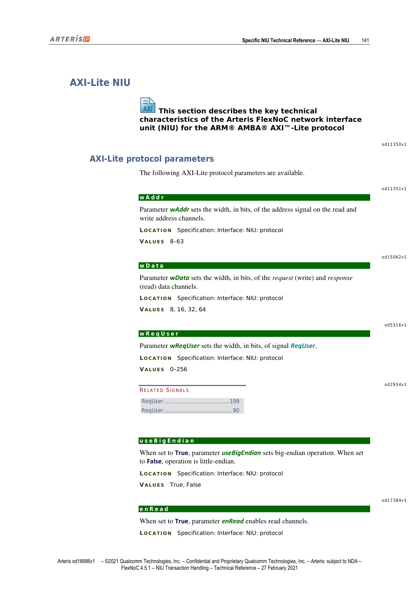
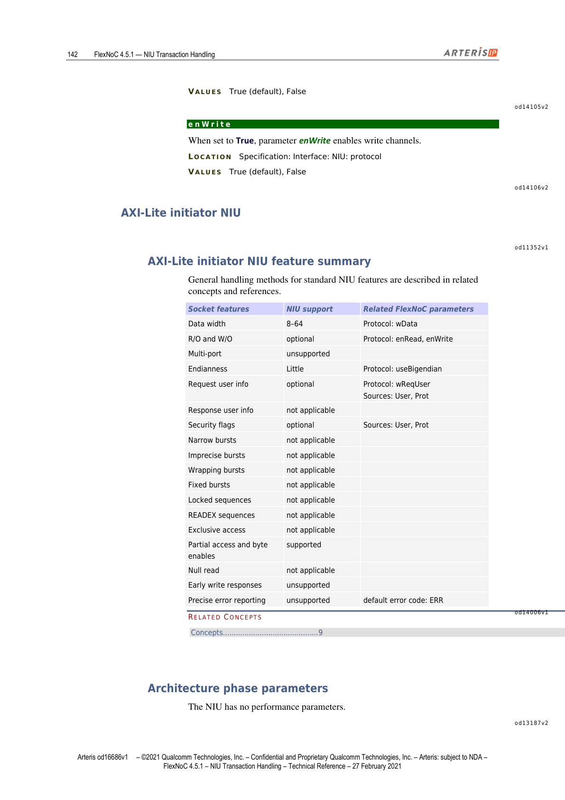
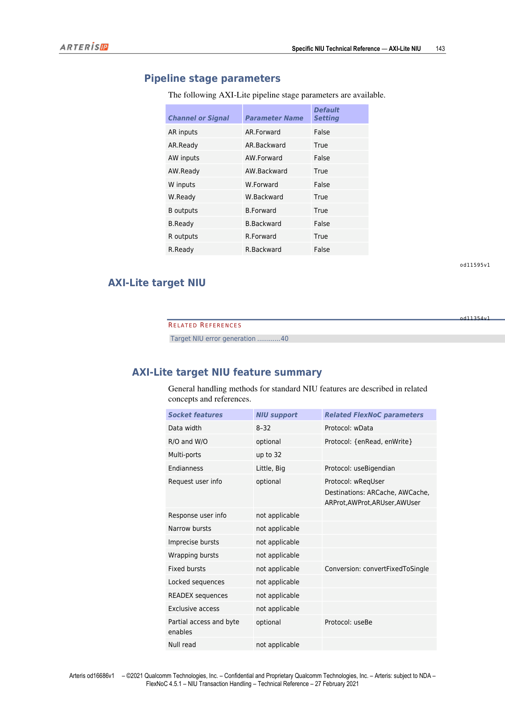
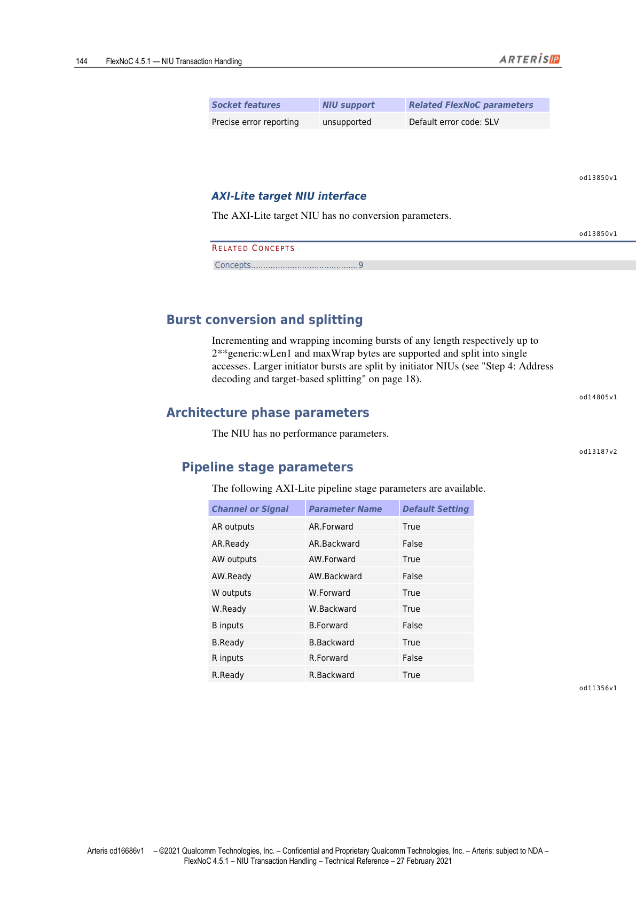

本文为 FlexNOC NIU Transaction Handling 技术参考手册第 11 章的中英双语对照翻译，覆盖 AXI-Lite NIU 协议参数、Initiator 与 Target 两类 NIU 功能特性汇总，以及流水线阶段配置参数。

---

## AXI-Lite NIU

> This section describes the key technical characteristics of the Arteris FlexNoC network interface unit (NIU) for the ARM® AMBA® AXI™-Lite protocol.

本节描述 Arteris FlexNOC 网络接口单元（NIU）针对 ARM® AMBA® AXI™-Lite 协议的关键技术特性。

*图1：AXI-Lite NIU 结构总览（第141页）*

---

## AXI-Lite Protocol Parameters（AXI-Lite 协议参数）

> The following AXI-Lite protocol parameters are available.

以下 AXI-Lite 协议参数可用。

### 协议参数汇总

| 参数名 | 说明 | 取值 |
|--------|------|------|
| wAddr | 读写地址通道上地址信号的位宽（bits） | 8–63 |
| wData | 请求（写）/响应（读）数据通道位宽（bits） | 8, 16, 32, 64 |
| wReqUser | ReqUser 信号的位宽（bits） | 0–256 |
| useBigEndian | True 为大端，False 为小端 | True, False |
| enRead | True 时启用读通道 | True（默认），False |
| enWrite | True 时启用写通道 | True（默认），False |

---

### wAddr

> Parameter wAddr sets the width, in bits, of the address signal on the read and write address channels.
>
> LOCATION: Specification: Interface: NIU: protocol  
> VALUES: 8–63

参数 wAddr 设置读写地址通道上地址信号的位宽（bits），取值范围 8–63。

---

### wData

> Parameter wData sets the width, in bits, of the request (write) and response (read) data channels.
>
> LOCATION: Specification: Interface: NIU: protocol  
> VALUES: 8, 16, 32, 64

参数 wData 设置请求（写）和响应（读）数据通道的位宽（bits），可选 8、16、32、64。

---

### wReqUser

> Parameter wReqUser sets the width, in bits, of signal ReqUser.
>
> LOCATION: Specification: Interface: NIU: protocol  
> VALUES: 0–256

参数 wReqUser 设置信号 ReqUser 的位宽（bits），取值范围 0–256。

---

### useBigEndian

> When set to True, parameter useBigEndian sets big-endian operation. When set to False, operation is little-endian.
>
> LOCATION: Specification: Interface: NIU: protocol  
> VALUES: True, False

useBigEndian 为 True 时采用大端模式，为 False 时采用小端模式。

---

### enRead

> When set to True, parameter enRead enables read channels.
>
> LOCATION: Specification: Interface: NIU: protocol  
> VALUES: True (default), False

enRead 为 True 时启用读通道，默认为 True。

---

### enWrite

> When set to True, parameter enWrite enables write channels.
>
> LOCATION: Specification: Interface: NIU: protocol  
> VALUES: True (default), False

enWrite 为 True 时启用写通道，默认为 True。

---

## AXI-Lite Initiator NIU（AXI-Lite Initiator NIU）

*图2：AXI-Lite Initiator NIU 特性概览（第142页）*

### AXI-Lite Initiator NIU Feature Summary（功能特性汇总）

> General handling methods for standard NIU features are described in related concepts and references.

标准 NIU 功能特性的通用处理方法见相关概念与参考章节。

| Socket 特性 | NIU 支持情况 | 相关 FlexNOC 参数 |
|-------------|-------------|------------------|
| 数据位宽 | 8–64 | Protocol: wData |
| 只读/只写（R/O and W/O） | 可选 | Protocol: enRead, enWrite |
| 多端口（Multi-port） | 不支持 | — |
| 字节序（Endianness） | 仅小端（Little） | Protocol: useBigendian |
| 请求用户信息（Request user info） | 可选 | Protocol: wReqUser; Sources: User, Prot |
| 响应用户信息（Response user info） | 不适用 | — |
| 安全标志（Security flags） | 可选 | Sources: User, Prot |
| 窄突发（Narrow bursts） | 不适用 | — |
| 非精确突发（Imprecise bursts） | 不适用 | — |
| 回绕突发（Wrapping bursts） | 不适用 | — |
| 固定突发（Fixed bursts） | 不适用 | — |
| 锁定序列（Locked sequences） | 不适用 | — |
| READEX 序列 | 不适用 | — |
| 排他访问（Exclusive access） | 不适用 | — |
| 部分访问与字节使能（Partial access / byte enables） | 支持 | — |
| 空读（Null read） | 不适用 | — |
| 早期写响应（Early write responses） | 不支持 | — |
| 精确错误上报（Precise error reporting） | 不支持，默认错误码：ERR | — |

---

### Architecture Phase Parameters — Initiator（架构阶段参数）

> The NIU has no performance parameters.

该 NIU 无性能参数。

---

### Pipeline Stage Parameters — Initiator（流水线阶段参数）

> The following AXI-Lite pipeline stage parameters are available.

以下 AXI-Lite 流水线阶段参数可用。

*图3：AXI-Lite Initiator NIU 流水线配置表（第143页）*

| 通道/信号 | 参数名 | 默认值 |
|---------|--------|--------|
| AR 输入 | AR.Forward | False |
| AR.Ready | AR.Backward | True |
| AW 输入 | AW.Forward | False |
| AW.Ready | AW.Backward | True |
| W 输入 | W.Forward | False |
| W.Ready | W.Backward | True |
| B 输出 | B.Forward | True |
| B.Ready | B.Backward | False |
| R 输出 | R.Forward | True |
| R.Ready | R.Backward | False |

---

## AXI-Lite Target NIU（AXI-Lite Target NIU）

*图4：AXI-Lite Target NIU 特性概览（第144页）*

### AXI-Lite Target NIU Feature Summary（功能特性汇总）

> General handling methods for standard NIU features are described in related concepts and references.

标准 NIU 功能特性的通用处理方法见相关概念与参考章节。

| Socket 特性 | NIU 支持情况 | 相关 FlexNOC 参数 |
|-------------|-------------|------------------|
| 数据位宽 | 8–32 | Protocol: wData |
| 只读/只写（R/O and W/O） | 可选 | Protocol: {enRead, enWrite} |
| 多端口（Multi-ports） | 最多 32 个 | — |
| 字节序（Endianness） | Little, Big | Protocol: useBigendian |
| 请求用户信息（Request user info） | 可选 | Protocol: wReqUser; Destinations: ARCache, AWCache, ARProt, AWProt, ARUser, AWUser |
| 响应用户信息（Response user info） | 不适用 | — |
| 窄突发（Narrow bursts） | 不适用 | — |
| 非精确突发（Imprecise bursts） | 不适用 | — |
| 回绕突发（Wrapping bursts） | 不适用 | — |
| 固定突发（Fixed bursts） | 不适用 | Conversion: convertFixedToSingle |
| 锁定序列（Locked sequences） | 不适用 | — |
| READEX 序列 | 不适用 | — |
| 排他访问（Exclusive access） | 不适用 | — |
| 部分访问与字节使能（Partial access / byte enables） | 可选 | Protocol: useBe |
| 空读（Null read） | 不适用 | — |
| 精确错误上报（Precise error reporting） | 不支持，默认错误码：SLV | — |

---

### AXI-Lite Target NIU Interface（接口说明）

> The AXI-Lite target NIU has no conversion parameters.

AXI-Lite Target NIU 无转换参数。

---

### Burst Conversion and Splitting（突发转换与拆分）

> Incrementing and wrapping incoming bursts of any length respectively up to 2**generic:wLen1 and maxWrap bytes are supported and split into single accesses. Larger initiator bursts are split by initiator NIUs (see "Step 4: Address decoding and target-based splitting").

支持对任意长度的递增型（incrementing）和回绕型（wrapping）传入突发进行处理，分别拆分为最多 2\*\*generic:wLen1 字节和 maxWrap 字节的单次访问。更大的 Initiator 突发由 Initiator NIU 在地址解码和基于目标的拆分阶段进行拆分。

---

### Architecture Phase Parameters — Target（架构阶段参数）

> The NIU has no performance parameters.

该 NIU 无性能参数。

---

### Pipeline Stage Parameters — Target（流水线阶段参数）

> The following AXI-Lite pipeline stage parameters are available.

以下 AXI-Lite Target NIU 流水线阶段参数可用。

| 通道/信号 | 参数名 | 默认值 |
|---------|--------|--------|
| AR 输出 | AR.Forward | True |
| AR.Ready | AR.Backward | False |
| AW 输出 | AW.Forward | True |
| AW.Ready | AW.Backward | False |
| W 输出 | W.Forward | True |
| W.Ready | W.Backward | True |
| B 输入 | B.Forward | False |
| B.Ready | B.Backward | True |
| R 输入 | R.Forward | False |
| R.Ready | R.Backward | True |
