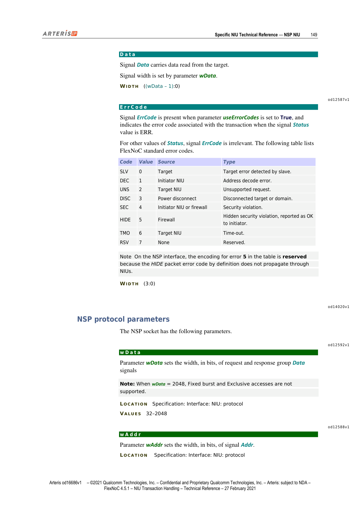
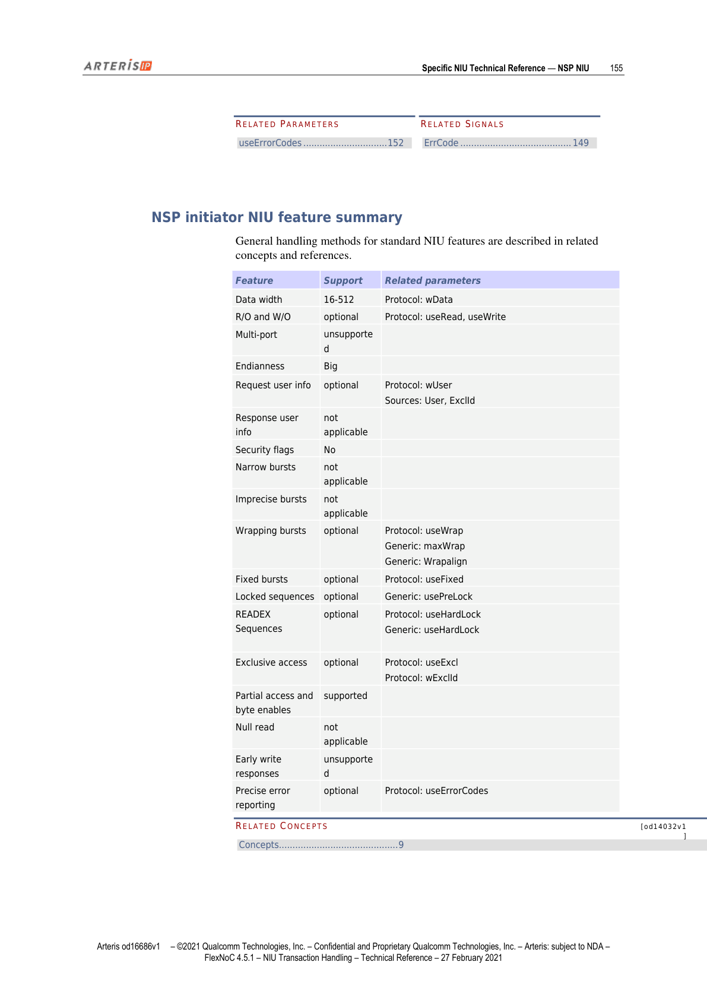
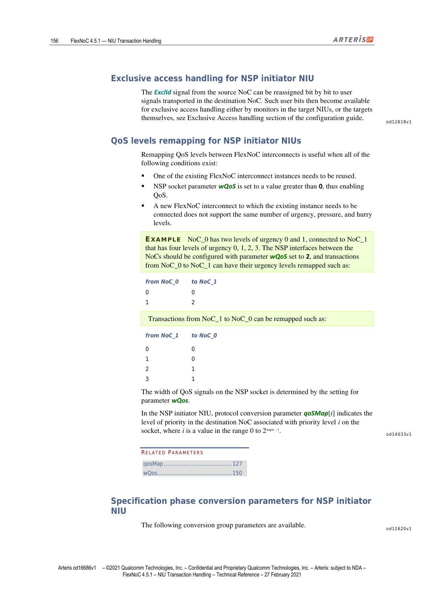
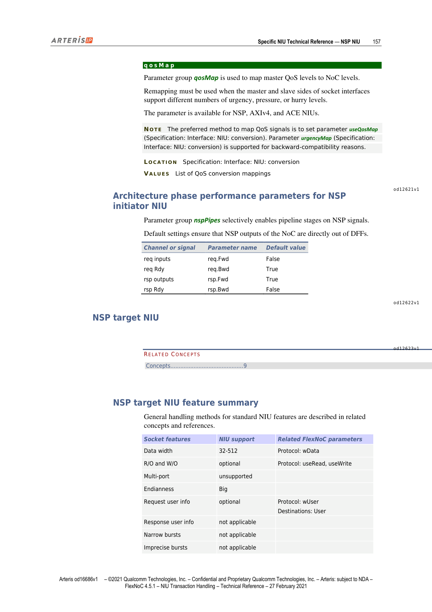
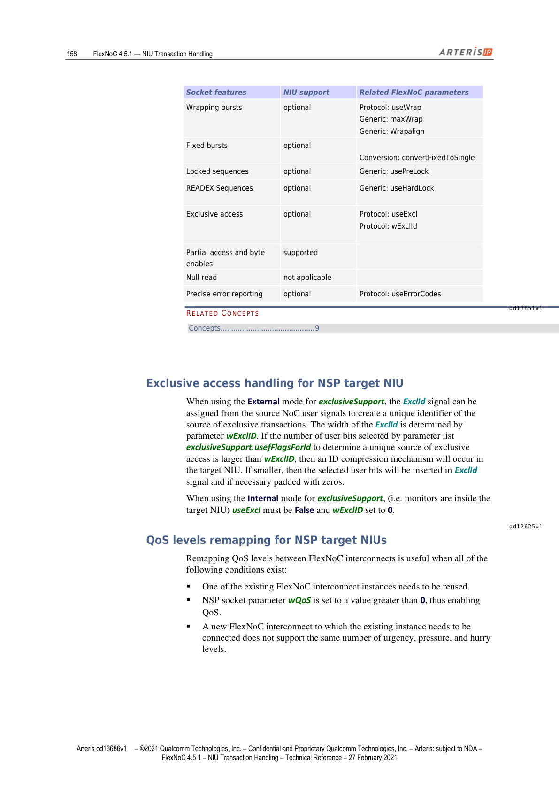
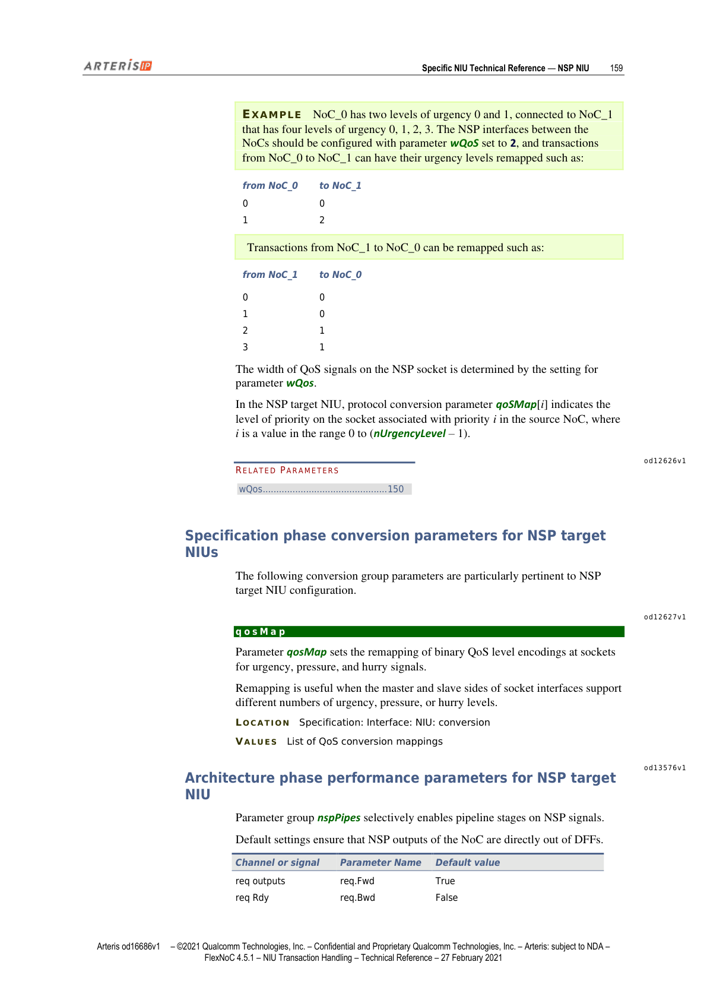

本文为 FlexNOC NIU Transaction Handling 技术参考手册第 12 章的中英双语对照翻译。NSP（NoC Socket Protocol）是 Arteris 专为多 FlexNOC 实例互联设计的事务级协议，覆盖其全部信号定义、协议参数、FlexNOC 实例间 socket 配置指南，以及 Initiator 与 Target NIU 的功能特性与架构阶段参数。

---

## NSP NIU

> This section describes the key technical characteristics of the Arteris FlexNoC network interface unit (NIU) for the Arteris NoC socket protocol (NSP).
>
> NSP is a transaction-level protocol that offers capabilities similar to advanced transaction-level protocols such as OCP™ or ARM™ AXI™, but specifically fine-tuned to optimize the interface between two NoC instances.
>
> In particular, it allows the partitioning of an interconnect into several FlexNoC instances separated by NSP sockets, while minimizing the gate count in the associated NIUs. It also supports features such as propagation of FlexNoC QoS signals such as pressure and hurry, which are not supported on other standard sockets.

本节描述 Arteris FlexNOC 网络接口单元（NIU）针对 Arteris NoC Socket Protocol（NSP）的关键技术特性。

NSP 是一种事务级协议，其能力与 OCP™ 或 ARM™ AXI™ 等先进事务级协议相当，但专门针对两个 NoC 实例之间的接口进行了优化。特别地，NSP 允许将互连划分为若干通过 NSP socket 连接的 FlexNOC 实例，同时将相关 NIU 的门控数量降到最低。此外，NSP 还支持其他标准 socket 不支持的 FlexNOC QoS 信号传播，例如 pressure（压力）和 hurry（催促）。

---

## NSP Protocol Signals（NSP 协议信号）

> FlexNoC NIUs support the following subset of NSP protocol signals, organized in request and response groups, with each group associated with a classical Vld or Rdy signal.

FlexNOC NIU 支持以下 NSP 协议信号子集，信号按请求组和响应组组织，每组均关联经典的 Vld 或 Rdy 信号。

*图1：NSP NIU 结构总览（第146页）*

---

### NSP Request Group Signals（请求组信号）

> The following signals comprise the NSP request group interface.

以下信号构成 NSP 请求组接口。

#### Vld（请求有效）

> Signal Vld indicates that a request word is present on the request group of signals.
> All request signals except Press and Hurry must remain constant while Vld is asserted until the request has been accepted by the slave with the Rdy signal.

信号 Vld 表示请求组信号上存在请求字。在 Vld 有效期间，除 Press 和 Hurry 之外的所有请求信号必须保持不变，直到从设备通过 Rdy 信号接受该请求。

#### Rdy（请求接受）

> Signal Rdy indicates that the request word has been accepted by the slave.

信号 Rdy 表示从设备已接受该请求字。

#### Last（最后一字）

> Signal Last indicates that the request word is the final one in the request.

信号 Last 表示该请求字是请求中的最后一个。

#### Opc（操作码）

> Signal Opc indicates the transaction type opcode. It has the following bit encoding:

信号 Opc 指示事务类型操作码，位编码定义如下：

| 编码值 | 操作码 | 说明 |
|--------|--------|------|
| 0 | RD | 读操作：Initiator 从 Target 以递增地址读取数据 |
| 1 | RDW | 回绕读：Initiator 从 Target 以回绕地址读取数据 |
| 2 | RDEX | 排他读（递增地址）：必须紧随相同 Addr/Len/Status 值的写操作（在锁定序列中 Lock=1），保证原子执行 |
| 3 | RDLK | 链接读：在 Target 中以递增地址分配一个监视器 |
| 4 | WR | 写操作：Initiator 以递增地址向 Target 写入数据 |
| 5 | WRW | 回绕写：Initiator 以回绕地址向 Target 写入数据 |
| 6 | WREX | 排他写（递增地址） |
| 7 | PRE | 链接序列的前导包（Preamble）：用于信号特殊操作（如进入锁定序列）或非原生突发（如 Fixed/2D 突发） |

**注意**：Preamble 包仅在关联请求包之前传播，由 Target NIU 处理并丢弃，不会出现在响应链路探针中。PRE 包的 Status 必须为 REQ，因为此类包无响应。

| 属性 | 值 |
|------|-----|
| 位宽 | 3 bits |

#### Length（长度）

> Signal Length indicates the total payload length of the request in bytes, minus 1. Signal width is set by parameter wLength.
>
> WIDTH: ((wLength – 1):0)

信号 Length 指示请求的总有效载荷长度（字节数减 1），位宽由参数 wLength 设置。

#### Addr（地址）

> Signal Addr carries the transfer byte address. Signal width is set by parameter wAddr.
>
> WIDTH: ((wAddr – 1):0)

信号 Addr 携带传输字节地址，位宽由参数 wAddr 设置。

#### FlowID（流标识符）

> Signal FlowID carries the flow identifier of the transaction. Signal width is determined by parameter nFlow.
>
> WIDTH: ((log2(nFlow) – 1):0)

信号 FlowID 携带事务的流标识符，位宽由参数 nFlow 决定。

#### SeqID（序列标识符）

> Signal SeqID carries the sequence identifier of the transaction. Signal width is set by parameter wSeqID.
>
> WIDTH: (wSeqID – 1:0)

信号 SeqID 携带事务的序列标识符，位宽由参数 wSeqID 设置。

#### TrId（事务标识符）

> Signal TrId carries a unique transaction identifier, independently of ordering. This signal exists only if parameter nFlow is set to a value greater than 1, or wSeqID is set to a value greater than 0. Signal width is equal to log2 of parameter nPendingTrans.
>
> WIDTH: ((log2(nPendingTrans) – 1):0)

信号 TrId 携带独立于排序的唯一事务标识符，仅在 nFlow > 1 或 wSeqID > 0 时存在，位宽等于参数 nPendingTrans 的 log2 值。

#### ExclID（排他事务标识符）

> Signal ExclID carries a unique identifier of the initiator of an exclusive transaction. Signal width is set by parameter wExclId.
>
> WIDTH: ((wExclId – 1):0)

信号 ExclID 携带排他事务 Initiator 的唯一标识符，位宽由参数 wExclId 设置。

#### User（用户信息）

> Signal User carries in-band qualifiers for the transaction. Signal width is set by parameter wUser.
>
> WIDTH: ((wUser – 1):0)

信号 User 携带事务的带内限定符，位宽由参数 wUser 设置。

#### Urgency（紧急度）

> Signal Urgency indicates the urgency level of the request. Width of this signal is given by parameter wQoS.
>
> WIDTH: (wQos – 1:0)

信号 Urgency 指示请求的紧急级别，位宽由参数 wQoS 决定。

#### Press（压力）

> Signal Press indicates the pressure level of the interface. Signal width is set by parameter wQoS.
>
> WIDTH: ((wQos – 1):0)

信号 Press 指示接口的压力级别，位宽由参数 wQoS 设置。

#### Hurry（催促）

> Signal Hurry indicates the hurry level that must be applied to pending transactions on the interface. Signal width is set by parameter wQoS.
>
> WIDTH: ((wQos – 1):0)

信号 Hurry 指示必须应用于接口上待处理事务的催促级别，位宽由参数 wQoS 设置。

#### Data（写数据）

> Signal Data carries data to be written to the target. Signal width is set by parameter wData.
>
> WIDTH: ((wData – 1):0)

信号 Data 携带待写入 Target 的数据，位宽由参数 wData 设置。

#### Be（字节使能）

> Signal Be carries data byte enables associated with signal Data.
>
> WIDTH: (((wData / 8) – 1):0)

信号 Be 携带与 Data 信号关联的字节使能，位宽为 (wData/8 – 1):0。

---

### NSP Response Group Signals（响应组信号）

> The following signals comprise the NSP response group interface.

以下信号构成 NSP 响应组接口。

#### Vld（响应有效）

> Signal Vld indicates that a response word is present on response group of signals. All response signals must remain constant while Vld is asserted until the request has been accepted by the master with the Rdy signal.

信号 Vld 表示响应组信号上存在响应字，在 Vld 有效期间所有响应信号必须保持不变，直到主设备通过 Rdy 信号接受该响应。

#### Rdy（响应接受）

> Signal Rdy indicates that the response word has been accepted by the master.

信号 Rdy 表示主设备已接受该响应字。

#### Last（最后一字）

> Signal Last indicates that the response word is the final one in the response.

信号 Last 表示该响应字是响应中的最后一个。

#### Cont（连续标志）

> Signal Cont indicates that the next response word will belong to the same transaction response.

信号 Cont 表示下一个响应字属于同一事务响应。

#### Status（状态码）

> Signal Status, which indicates the status of each individual word of the response to the transaction, is encoded as follows:

信号 Status 指示事务响应中每个字的状态，编码如下：

| 值 | 含义 |
|----|------|
| 0 (OK) | 非排他访问成功执行，或排他访问失败 |
| 1 (EXOK) | 排他访问成功执行 |
| 2 (ERR) | 事务完成但发生错误，或读数据无效 |
| 3 | 保留 |

| 属性 | 值 |
|------|-----|
| 位宽 | (1:0) |

#### TrId（响应事务标识符）

> Signal TrId carries a copy of the corresponding signal from the associated request. This signal exists only if parameter nFlow is set to a value greater than 1, or wSeqID is set to a value greater than 0.
>
> WIDTH: (log2(nPendingTrans) – 1:0)

信号 TrId 携带关联请求中对应信号的副本，仅在 nFlow > 1 或 wSeqID > 0 时存在。

#### Data（读数据）

> Signal Data carries data read from the target. Signal width is set by parameter wData.
>
> WIDTH: ((wData – 1):0)

信号 Data 携带从 Target 读取的数据，位宽由参数 wData 设置。

#### ErrCode（错误码）

> Signal ErrCode is present when parameter useErrorCodes is set to True, and indicates the error code associated with the transaction when the signal Status value is ERR. For other values of Status, signal ErrCode is irrelevant.

信号 ErrCode 在参数 useErrorCodes 为 True 时出现，当 Status 值为 ERR 时指示与事务关联的错误码；其他 Status 值时该信号无意义。

*图2：NSP ErrCode 标准错误码定义（第149页）*

| 错误码 | 值 | 来源 | 说明 |
|--------|-----|------|------|
| SLV | 0 | Target | 从设备检测到的 Target 错误 |
| DEC | 1 | Initiator NIU | 地址解码错误 |
| UNS | 2 | Target NIU | 不支持的请求 |
| DISC | 3 | 断电 | Target 或域已断开连接 |
| SEC | 4 | Initiator NIU 或防火墙 | 安全违规 |
| HIDE | 5 | 防火墙 | 隐蔽安全违规，对 Initiator 报告为 OK |
| TMO | 6 | Target NIU | 超时 |
| RSV | 7 | 无 | 保留 |

**注意**：在 NSP 接口上，表中编码 5（HIDE）为保留值，因为 HIDE 包错误码的定义不会通过 NIU 传播。

| 属性 | 值 |
|------|-----|
| 位宽 | (3:0) |

---

## NSP Protocol Parameters（NSP 协议参数）

> The NSP socket has the following parameters.

NSP socket 具有以下参数。

### 协议参数汇总

| 参数名 | 说明 | 取值 |
|--------|------|------|
| wData | 请求/响应组 Data 信号位宽（bits）；wData=2048 时不支持 Fixed 突发和排他访问 | 32–2048 |
| wAddr | Addr 信号位宽（bits） | 16–63 |
| wExclID | ExclId 信号位宽（bits） | 0–16 |
| wUser | User 信号位宽（bits） | 0–256 |
| wQos | >0 时为 NSP 接口增加 Hurry/Pressure/Urgency QoS 信号 | 0–3 |
| wLength | Length 信号位宽 | 4–12 |
| crossBoundary | 突发不可跨越的地址边界（2的幂次，单位：字节；典型值 1KB 或 4KB） | None, 地址边界列表 |
| useRead | True 时启用读事务 | True（默认），False |
| useWrite | True 时启用写事务 | True（默认），False |
| useWrap | True 时启用回绕突发操作 | True, False（默认） |
| useExcl | True 时启用排他访问 | True, False（默认） |
| useHardLock | True 时启用读-修改-写锁定序列 | True, False（默认） |
| useRdCondWr | True 时启用读-条件写锁定序列 | True, False（默认） |
| nFlow | 接口上的流数量 | — |
| wSeqId | 事务序列标识符位宽 | — |
| nPendingTrans | 接口上最大待处理事务数，同时设置 TrId 信号位宽 | — |
| useRspInterleaving | True 时启用接口上的读响应交错 | True, False（默认） |
| useFixed | True 时启用接口上的 Fixed 突发 | True, False（默认） |
| useErrorCodes | True 时在响应信号组中增加 ErrCode 信号 | True, False（默认） |

---

## Configuring a NSP Socket Between FlexNoC Instances（FlexNOC 实例间 NSP Socket 配置指南）

> In general, using a NSP socket between two FlexNoC instances is due to functional interconnect partitioning consideration (address map decoupling), or reuse strategy of a subsystem. The socket itself should not be a limiting factor for transactions that need to be passed between the NoC instances, so that the NSP protocol parameters should be chosen to allow the required features to be transported from one instance to another.
>
> Note that an initiator and a target socket are necessary to allow transactions to flow in both directions between the two FlexNoC instances.

通常，在两个 FlexNOC 实例之间使用 NSP socket 的原因是功能性互连分区（地址映射解耦）或子系统复用策略。socket 本身不应成为 NoC 实例间需要传递的事务的限制因素，因此 NSP 协议参数应选择能够将所需功能从一个实例传输到另一个实例的值。注意：需要一个 Initiator socket 和一个 Target socket，才能使事务在两个 FlexNOC 实例之间双向流动。

---

### NSP Socket Signals and Bursts Configuration（信号与突发配置）

> Set parameter wData according to the desired bandwidth and the clock rate of the interface and parameter wAddr according to the address range visible in the destination NoC instance from the source NoC instance.
>
> Parameter wExclId should be set only if exclusive access must be executed in the destination FlexNoC instance.
>
> Parameter wUser should be set according to the number of user bits that have to be transported to the destination FlexNoC instance.
>
> Parameter wLength should be set according to the maximum burst size desired on the interface.
>
> Parameter crossBoundary should be set according to a policy that is consistent between the two FlexNoC instances.
>
> Parameter useFixed should be set to True if Fixed transactions can be initiated by an IP core of the source instance and directed to a target of the destination FlexNoC instance.

- **wData**：根据期望带宽和接口时钟频率设置
- **wAddr**：根据从源 NoC 实例可见的目标 NoC 实例地址范围设置
- **wExclId**：仅当需要在目标 FlexNOC 实例中执行排他访问时才设置；相关 ExclId 信号可以逐位重映射到目标 NoC 携带的用户信号
- **wUser**：根据需要传输到目标 FlexNOC 实例的用户比特数设置；并非所有源实例的用户比特都需要在目标实例中使用，可以自由重映射
- **wLength**：根据接口上期望的最大突发大小设置。若 wLength 选择偏小，将迫使到达 NSP socket 的事务在源 FlexNOC 实例的 Initiator NIU 中被拆分。若目标实例中的 Target 无法处理该最大突发大小，则将在与 NSP Initiator socket 关联的 Initiator 通用 NIU 中进行拆分
- **crossBoundary**：应在两个 FlexNOC 实例之间保持一致的策略。例如，若两个实例主要包含 AMBA socket（AXI），建议设置为 4KB；若主要包含 OCP socket（无跨边界限制），应设置为 2^wAddr
- **useFixed**：若源实例的 IP 核可以发起 Fixed 事务并指向目标 FlexNOC 实例的 Target，应设置为 True

---

### NSP Socket Operations Configuration（操作配置）

> All parameters that are part of the Opcode group (useRead, useWrite, useWrap, useExcl, useHardLock, useRdCondWr) should be configured according to the operations that may be initiated by one IP core connected to the source FlexNoC instance and directed to a target of the destination FlexNoC instance.

Opcode 组的所有参数（useRead、useWrite、useWrap、useExcl、useHardLock、useRdCondWr）应根据连接到源 FlexNOC 实例的 IP 核可能发起并指向目标 FlexNOC 实例 Target 的操作来配置。

---

### NSP Socket Transactions Configuration（事务配置）

> The use of flows (parameter nFlow) can differentiate connectivity and address maps in the destination instance between transaction flows from different initiators of the source FlexNoC instance.
>
> The use of sequence (parameter wSeqID) implements out-of-order responses on the NSP socket. For maximum out-of-order capabilities, wSeqID should be set to Ceiling(log2(nPendingTrans)).
>
> In NSP, parameter nPendingTrans is a protocol parameter because it sizes the TrID signal. The initiator NSP NIUs automatically inherit this protocol parameter as their number of supported pending transactions.
>
> Parameter useRspInterleaving should be configured according to a policy that is consistent between the two FlexNoC instances.

- **nFlow**：使用流（Flow）可以区分不同源实例 Initiator 的事务流在目标实例中的连接性和地址映射。若所有 Initiator 应看到相同的地址和连接映射，设置 nFlow=1
- **wSeqID**：实现 NSP socket 上的乱序响应。为获得最大乱序能力，wSeqID 应设置为 Ceiling(log2(nPendingTrans))。nPendingTrans 是协议参数（用于 TrID 信号大小），Initiator NSP NIU 自动继承此参数作为其支持的最大待处理事务数
- **useRspInterleaving**：应在两个 FlexNOC 实例之间保持一致。若两个实例均主要包含支持读响应交错的 AXI socket，建议设置为 True，NSP socket 在处理指向目标 AXI 实例事务时不会停滞流水线

**注意**：若源 FlexNOC 实例配置为不支持读响应交错，而目标实例包含产生读响应交错的 Target，为提升性能，可在目标实例的 NSP socket 关联通用 Initiator NIU 中实例化解交错重排缓冲区。

---

### NSP Socket QoS Configuration（QoS 配置）

> Parameter wQoS should be set to a value greater than 0 if the destination FlexNoC instance arbitrates between transactions from the NSP socket with transactions from other initiator sockets, according to FlexNoC dynamic priority scheme.

若目标 FlexNOC 实例按照 FlexNOC 动态优先级方案在来自 NSP socket 的事务与来自其他 Initiator socket 的事务之间进行仲裁，则应将 wQoS 设置为大于 0 的值。设置后，urgency（紧急度）、pressure（压力）和 hurry（催促）机制在 NIU 之间的处理效果与两个 FlexNOC 实例之间存在传输请求/响应链路的效果相同（除 NIU 中的 QoS 级别重映射外）。

---

### NSP Socket Response Configuration（响应配置）

> Parameter useErrorCodes should be set to True if propagation of precise error codes is required on the socket. In that case, all error codes from the slave side will propagate untouched to the master side of the socket.
>
> NOTE: Error code HIDE, defined in packet transport, does not propagate through generic initiator NIUs, and thus never appears on an NSP socket.

若需要在 socket 上传播精确错误码，应将 useErrorCodes 设置为 True，此时从设备侧的所有错误码将原样传播到 socket 的主设备侧。

**注意**：在包传输中定义的错误码 HIDE 不会通过通用 Initiator NIU 传播，因此永远不会出现在 NSP socket 上。

---

## NSP Initiator NIU（NSP Initiator NIU）

*图3：NSP Initiator NIU 功能特性概览（第155页）*

### NSP Initiator NIU Feature Summary（功能特性汇总）

> General handling methods for standard NIU features are described in related concepts and references.

| 特性 | 支持情况 | 相关参数 |
|------|---------|---------|
| 数据位宽 | 16–512 | Protocol: wData |
| 只读/只写（R/O and W/O） | 可选 | Protocol: useRead, useWrite |
| 多端口（Multi-port） | 不支持 | — |
| 字节序（Endianness） | 仅大端（Big） | — |
| 请求用户信息（Request user info） | 可选 | Protocol: wUser; Sources: User, ExclId |
| 响应用户信息（Response user info） | 不适用 | — |
| 安全标志（Security flags） | 不支持 | — |
| 窄突发（Narrow bursts） | 不适用 | — |
| 非精确突发（Imprecise bursts） | 不适用 | — |
| 回绕突发（Wrapping bursts） | 可选 | Protocol: useWrap; Generic: maxWrap, Wrapalign |
| 固定突发（Fixed bursts） | 可选 | Protocol: useFixed |
| 锁定序列（Locked sequences） | 可选 | Generic: usePreLock |
| READEX 序列 | 可选 | Protocol: useHardLock; Generic: useHardLock |
| 排他访问（Exclusive access） | 可选 | Protocol: useExcl; Protocol: wExclId |
| 部分访问与字节使能（Partial access / byte enables） | 支持 | — |
| 空读（Null read） | 不适用 | — |
| 早期写响应（Early write responses） | 不支持 | — |
| 精确错误上报（Precise error reporting） | 可选 | Protocol: useErrorCodes |

---

### Exclusive Access Handling for NSP Initiator NIU（排他访问处理）

> The ExclId signal from the source NoC can be reassigned bit by bit to user signals transported in the destination NoC. Such user bits then become available for exclusive access handling either by monitors in the target NIUs, or the targets themselves.

来自源 NoC 的 ExclId 信号可以逐位重新分配给目标 NoC 中传输的用户信号，这些用户比特随后可用于目标 NIU 中的监视器或 Target 本身的排他访问处理。

---

### QoS Levels Remapping for NSP Initiator NIUs（QoS 级别重映射）

*图4：NSP Initiator NIU QoS 级别重映射示例（第156页）*

> Remapping QoS levels between FlexNoC interconnects is useful when all of the following conditions exist:
> - One of the existing FlexNoC interconnect instances needs to be reused.
> - NSP socket parameter wQoS is set to a value greater than 0, thus enabling QoS.
> - A new FlexNoC interconnect to which the existing instance needs to be connected does not support the same number of urgency, pressure, and hurry levels.

在以下条件全部满足时，FlexNOC 互连之间的 QoS 级别重映射非常有用：
- 现有某个 FlexNOC 互连实例需要被复用
- NSP socket 参数 wQoS 大于 0（已启用 QoS）
- 需要连接的新 FlexNOC 互连不支持相同数量的 urgency、pressure 和 hurry 级别

**示例**：NoC_0 有 2 级紧急度（0 和 1），连接到具有 4 级紧急度（0、1、2、3）的 NoC_1。NSP 接口配置 wQoS=2：

NoC_0 → NoC_1 映射：

| 来自 NoC_0 | 映射至 NoC_1 |
|-----------|------------|
| 0 | 0 |
| 1 | 2 |

NoC_1 → NoC_0 映射：

| 来自 NoC_1 | 映射至 NoC_0 |
|-----------|------------|
| 0 | 0 |
| 1 | 0 |
| 2 | 1 |
| 3 | 1 |

在 NSP Initiator NIU 中，协议转换参数 qosMap[i] 指示 socket 上优先级 i 在目标 NoC 中对应的优先级别，其中 i 的取值范围为 0 到 2^wQos – 1。

---

### Specification Phase Conversion Parameters for NSP Initiator NIU（规格阶段转换参数）

#### qosMap

> Parameter group qosMap is used to map master QoS levels to NoC levels. Remapping must be used when the master and slave sides of socket interfaces support different numbers of urgency, pressure, or hurry levels. The parameter is available for NSP, AXIv4, and ACE NIUs.
>
> NOTE: The preferred method to map QoS signals is to set parameter useQosMap. Parameter urgencyMap is supported for backward-compatibility reasons.
>
> LOCATION: Specification: Interface: NIU: conversion  
> VALUES: List of QoS conversion mappings

参数组 qosMap 用于将主设备 QoS 级别映射至 NoC 级别，在 socket 接口的主从两侧支持不同数量的 urgency/pressure/hurry 级别时使用。适用于 NSP、AXIv4 和 ACE NIU。

**注意**：推荐使用参数 useQosMap 进行 QoS 信号映射，urgencyMap 仅为向后兼容保留。

---

### Architecture Phase Pipeline Parameters for NSP Initiator NIU（架构阶段流水线参数）

> Parameter group nspPipes selectively enables pipeline stages on NSP signals. Default settings ensure that NSP outputs of the NoC are directly out of DFFs.

*图5：NSP Initiator NIU 流水线配置表（第157页）*

| 通道/信号 | 参数名 | 默认值 |
|---------|--------|--------|
| req 输入 | req.Fwd | False |
| req Rdy | req.Bwd | True |
| rsp 输出 | rsp.Fwd | True |
| rsp Rdy | rsp.Bwd | False |

---

## NSP Target NIU（NSP Target NIU）

*图6：NSP Target NIU 功能特性概览（第158页）*

### NSP Target NIU Feature Summary（功能特性汇总）

| Socket 特性 | NIU 支持情况 | 相关 FlexNOC 参数 |
|-------------|-------------|------------------|
| 数据位宽 | 32–512 | Protocol: wData |
| 只读/只写（R/O and W/O） | 可选 | Protocol: useRead, useWrite |
| 多端口（Multi-port） | 不支持 | — |
| 字节序（Endianness） | 仅大端（Big） | — |
| 请求用户信息（Request user info） | 可选 | Protocol: wUser; Destinations: User |
| 响应用户信息（Response user info） | 不适用 | — |
| 窄突发（Narrow bursts） | 不适用 | — |
| 非精确突发（Imprecise bursts） | 不适用 | — |
| 回绕突发（Wrapping bursts） | 可选 | Protocol: useWrap; Generic: maxWrap, Wrapalign |
| 固定突发（Fixed bursts） | 可选 | Conversion: convertFixedToSingle |
| 锁定序列（Locked sequences） | 可选 | Generic: usePreLock |
| READEX 序列 | 可选 | Generic: useHardLock |
| 排他访问（Exclusive access） | 可选 | Protocol: useExcl; Protocol: wExclId |
| 部分访问与字节使能（Partial access / byte enables） | 支持 | — |
| 空读（Null read） | 不适用 | — |
| 精确错误上报（Precise error reporting） | 可选 | Protocol: useErrorCodes |

---

### Exclusive Access Handling for NSP Target NIU（排他访问处理）

> When using the External mode for exclusiveSupport, the ExclId signal can be assigned from the source NoC user signals to create a unique identifier of the source of exclusive transactions.
>
> When using the Internal mode for exclusiveSupport (monitors are inside the target NIU), useExcl must be False and wExclID set to 0.

使用 External 模式时，ExclId 信号可以从源 NoC 用户信号中分配，以创建排他事务源的唯一标识符。ExclId 的位宽由参数 wExclID 决定。若通过 exclusiveSupport.useFlagsForId 参数列表选取的用户比特数大于 wExclID，则在 Target NIU 中发生 ID 压缩；若更小，则选取的用户比特插入 ExclId 信号（必要时补零）。

使用 Internal 模式时（监视器在 Target NIU 内部），useExcl 必须设置为 False，wExclID 设置为 0。

---

### QoS Levels Remapping for NSP Target NIUs（QoS 级别重映射）

*图7：NSP Target NIU QoS 级别重映射示例（第159页）*

在以下条件全部满足时需要重映射（与 Initiator 侧相同条件）。

在 NSP Target NIU 中，协议转换参数 qosMap[i] 指示与源 NoC 中优先级 i 关联的 socket 上优先级级别，其中 i 的取值范围为 0 到 (nUrgencyLevel – 1)。

---

### Specification Phase Conversion Parameters for NSP Target NIUs（规格阶段转换参数）

#### qosMap

> Parameter qosMap sets the remapping of binary QoS level encodings at sockets for urgency, pressure, and hurry signals. Remapping is useful when the master and slave sides of socket interfaces support different numbers of urgency, pressure, or hurry levels.
>
> LOCATION: Specification: Interface: NIU: conversion  
> VALUES: List of QoS conversion mappings

参数 qosMap 设置 socket 上 urgency、pressure 和 hurry 信号的二进制 QoS 级别编码重映射。在 socket 接口主从两侧支持不同数量的 urgency/pressure/hurry 级别时使用。

---

### Architecture Phase Pipeline Parameters for NSP Target NIU（架构阶段流水线参数）

> Parameter group nspPipes selectively enables pipeline stages on NSP signals. Default settings ensure that NSP outputs of the NoC are directly out of DFFs.

参数组 nspPipes 选择性地在 NSP 信号上启用流水线级，默认设置保证 NoC 的 NSP 输出直接来自寄存器。

| 通道/信号 | 参数名 | 默认值 |
|---------|--------|--------|
| req 输出 | req.Fwd | True |
| req Rdy | req.Bwd | False |
| rsp 输入 | rsp.Fwd | False |
| rsp Rdy | rsp.Bwd | True |
