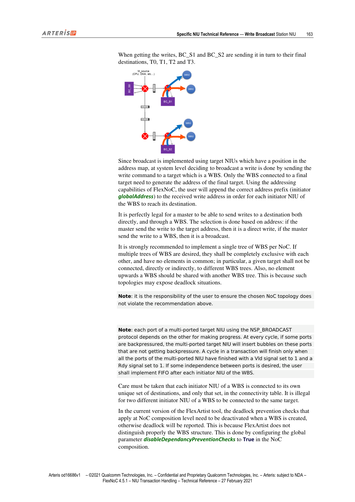
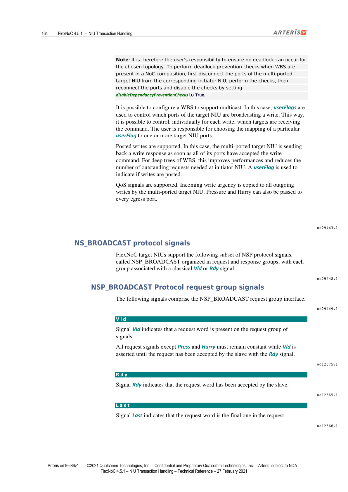

本文为 FlexNOC NIU Transaction Handling 技术参考手册第 13 章的中英双语对照翻译。Write Broadcast Station（WBS）基于 NSP_BROADCAST 协议（NSP 的严格子集），专用于在多个 Target 上同步写入相同数据。本章覆盖 WBS 架构设计、协议信号与参数、多播控制、Posted Write 机制，以及配置指南。

---

## Write Broadcast Station NIU（写广播站 NIU）

> This section describes the key technical characteristics of the Arteris FlexNoC network interface unit (NIU) for the Arteris NoC socket protocol NSP_BROADCAST.
>
> NSP_BROADCAST is a strict subset of the NSP protocol that can only be used at target NIU, to implement Write Broadcast Stations (WBS).
>
> A Write Broadcast Station contains a target NIU which has multiple interfaces, all identical, all using the NSP_BROADCAST protocol, and all issuing exactly the same transaction at the same time.

本节描述 Arteris FlexNOC 网络接口单元（NIU）针对 Arteris NoC Socket Protocol NSP_BROADCAST 的关键技术特性。

NSP_BROADCAST 是 NSP 协议的严格子集，只能用于 Target NIU，用于实现写广播站（WBS）。

写广播站包含一个具有多接口的 Target NIU，所有接口完全相同，均使用 NSP_BROADCAST 协议，并在同一时刻发出完全相同的事务。

---

### WBS Architecture（WBS 架构）

> The intended use model: each output of the multi-ported target NIU using NSP_BROADCAST protocol is connected in turn to one corresponding initiator NIU that uses the same NSP parameter set as the NSP_BROADCAST interfaces. The combination of a N-port target NIU using NSP_BROADCAST protocol, and N initiator NIU connected to it, is called the Write Broadcast Station (WBS).

使用模型如下：多端口 Target NIU（NSP_BROADCAST 协议）的每个输出分别连接到一个对应的 Initiator NIU，后者使用与 NSP_BROADCAST 接口相同的 NSP 参数集。N 端口 NSP_BROADCAST Target NIU 与连接到它的 N 个 Initiator NIU 的组合称为写广播站（WBS）。

建议使用 NoC Composition 来构建多端口 Target NIU（NSP_BROADCAST 协议）与对应 Initiator NIU 之间的连接，这样 FlexArtist 软件可以检查各 NIU 配置的一致性。

**创建 WBS 的步骤**：
1. 创建一个新的多端口 Target NIU，使用 NSP_BROADCAST 协议
2. 向多端口 Target NIU 添加所需数量的端口（最多 8 个）
3. 为每个端口创建一个对应的 Initiator NIU（使用 NSP 协议）；NSP 接口参数需手动配置为与多端口 Target NIU 匹配
4. 创建一个包含单个 NoC 的 NoC Composition 对象，声明多端口 Target NIU 与各对应 Initiator NIU 之间的连接

*图1：写广播第一阶段——写命令发送至第一级 WBS BC_S0（第163页）*

*图2：写广播第二阶段——BC_S0 同时向 BC_S1 和 BC_S2 发出两路写命令（第164页）*

---

### WBS Tree Structure（WBS 树形结构）

> After a WBS, the destination of the traffic can be a target NIU, or another multi-ported target NIU of a downstream WBS. It is then possible to organize the WBS as a tree, with no limits to the fanout size except the limits of FlexNoC itself.
>
> When building a tree of interconnected WBS, care must be taken to ensure the broadcast is done as close to the target as possible, while maintaining the required write bandwidth.

WBS 之后的流量目的地可以是 Target NIU，也可以是下游 WBS 的另一个多端口 Target NIU。因此可以将 WBS 组织成树形结构，扇出大小仅受 FlexNOC 本身限制。

构建 WBS 互连树时，应注意在保持所需写带宽的同时，尽量将广播点靠近最终 Target（即尽可能多的并行写操作）。

**强烈建议每个 NoC 只实现一棵 WBS 树**。若需要多棵 WBS 树，它们必须完全互斥，不得有任何公共元素；特别地，某个 Target 不能直接或间接连接到不同的 WBS 树，WBS 上游的任何元素也不得与另一棵 WBS 树共享。违反此规则可能导致死锁。

**注意**：确保所选 NoC 拓扑不违反上述建议是用户的责任。

---

### Port Interdependency and Bubble Insertion（端口相互依赖与气泡插入）

> Note: each port of a multi-ported target NIU using the NSP_BROADCAST protocol depends on the other for making progress. At every cycle, if some ports are backpressured, the multi-ported target NIU will insert bubbles on these ports that are not getting backpressure. A cycle in a transaction will finish only when all the ports of the multi-ported NIU have finished with a Vld signal set to 1 and a Rdy signal set to 1.
>
> If some independence between ports is desired, the user shall implement FIFO after each initiator NIU of the WBS.

**注意**：使用 NSP_BROADCAST 协议的多端口 Target NIU 的每个端口都依赖其他端口来推进。在每个时钟周期，若某些端口受到背压（backpressure），多端口 Target NIU 将在未受背压的端口上插入气泡。事务中的一个周期仅在多端口 NIU 的所有端口均以 Vld=1 且 Rdy=1 完成时才算结束。

若需要端口之间具有一定独立性，用户应在 WBS 的每个 Initiator NIU 之后实现 FIFO。

**注意**：WBS 的每个 Initiator NIU 必须在连接性表中连接到其唯一的目标集合，且仅限于该集合。同一 WBS 的两个不同 Initiator NIU 连接到同一 Target 是非法的。

---

### Deadlock Prevention（死锁预防）

> In the current version of the FlexArtist tool, the deadlock prevention checks that apply at NoC composition level need to be deactivated when a WBS is created, otherwise deadlock will be reported. This is done by configuring the global parameter disableDependancyPreventionChecks to True in the NoC composition.

在当前版本的 FlexArtist 工具中，创建 WBS 时需要停用 NoC Composition 级别的死锁预防检查，否则会报告死锁（因为 FlexArtist 无法正确识别 WBS 结构）。方法是在 NoC Composition 中将全局参数 `disableDependancyPreventionChecks` 设置为 True。

确保所选拓扑不发生死锁是用户的责任。在 NoC Composition 中存在 WBS 时进行死锁预防检查的方法：
1. 先断开多端口 Target NIU 各端口与对应 Initiator NIU 的连接
2. 执行检查
3. 重新连接端口
4. 将 `disableDependancyPreventionChecks` 设置为 True 以禁用检查

---

### Multicast and Posted Writes（多播与 Posted 写）

> It is possible to configure a WBS to support multicast. In this case, userFlags are used to control which ports of the target NIU are broadcasting a write. This way, it is possible to control, individually for each write, which targets are receiving the command.
>
> Posted writes are supported. In this case, the multi-ported target NIU is sending back a write response as soon as all of its ports have accepted the write command. For deep trees of WBS, this improves performances and reduces the number of outstanding requests needed at initiator NIU.
>
> QoS signals are supported. Incoming write urgency is copied to all outgoing writes by the multi-ported target NIU. Pressure and Hurry can also be passed to every egress port.

可以配置 WBS 支持多播（multicast）：使用 userFlag 控制哪些 Target NIU 端口参与写广播，从而逐个写命令地精确控制哪些 Target 接收命令。用户负责选择特定 userFlag 到一个或多个 Target NIU 端口的映射。

支持 Posted 写：此情况下，多端口 Target NIU 在所有端口均接受写命令后立即发回写响应。对于深层 WBS 树，这可以提升性能并减少 Initiator NIU 所需的未完成请求数量。使用一个 userFlag 指示写操作是否为 Posted。

QoS 信号受到支持：多端口 Target NIU 将传入写的 urgency（紧急度）复制到所有传出写；pressure 和 hurry 也可以传递到每个出口端口。

---

## NSP_BROADCAST Protocol Signals（NSP_BROADCAST 协议信号）

> FlexNoC target NIUs support the following subset of NSP protocol signals, called NSP_BROADCAST organized in request and response groups, with each group associated with a classical Vld or Rdy signal.

FlexNOC Target NIU 支持以下 NSP_BROADCAST 协议信号子集，按请求组和响应组组织，每组关联 Vld 或 Rdy 信号。

### Request Group Signals（请求组信号）

| 信号名 | 说明 | 位宽 |
|--------|------|------|
| Vld | 请求组信号上存在请求字；除 Press 和 Hurry 外的所有请求信号在 Vld 有效期间必须保持不变 | 1 |
| Rdy | 从设备已接受该请求字 | 1 |
| Last | 该请求字是请求中的最后一个 | 1 |
| Opc | 事务类型操作码；NSP_BROADCAST 仅支持 WR（值 4）：以递增地址写入 Target | 3 bits |
| Length | 请求总有效载荷长度（字节数减 1）；位宽由参数 wLength 设置 | (wLength–1):0 |
| Addr | 传输字节地址；位宽由参数 wAddr 设置 | (wAddr–1):0 |
| User | 事务带内限定符；位宽由参数 wUser 设置 | (wUser–1):0 |
| Urgency | 请求的紧急级别；位宽由参数 wQoS 决定 | (wQos–1):0 |
| Press | 接口的压力级别；位宽由参数 wQoS 设置 | (wQos–1):0 |
| Hurry | 必须应用于接口上待处理事务的催促级别；位宽由参数 wQoS 设置 | (wQos–1):0 |
| Data | 待写入 Target 的数据；位宽由参数 wData 设置 | (wData–1):0 |
| Be | 与 Data 信号关联的字节使能 | ((wData/8)–1):0 |

### Response Group Signals（响应组信号）

| 信号名 | 说明 | 位宽 |
|--------|------|------|
| Vld | 响应组信号上存在响应字 | 1 |
| Rdy | 主设备已接受该响应字 | 1 |
| Last | 该响应字是响应中的最后一个 | 1 |
| Cont | 下一个响应字属于同一事务响应 | 1 |
| Status | 响应状态：0=OK，1=EXOK，2=ERR，3=保留 | (1:0) |
| Data | 从 Target 读取的数据；位宽由参数 wData 设置 | (wData–1):0 |

---

## NSP_BROADCAST Protocol Parameters（NSP_BROADCAST 协议参数）

> The NSP_BROADCAST socket is implementing a strict subset of the NSP protocol, with two additional parameters to indicate which userFlag controls broadcasting on a port, and which userFlag controls write posting.

NSP_BROADCAST socket 实现 NSP 协议的严格子集，并增加两个额外参数：指定哪个 userFlag 控制某端口的广播，以及哪个 userFlag 控制写 Posting。

### 可配置 NSP 参数（与 NSP 相同含义）

| 参数名 | 说明 | 取值 |
|--------|------|------|
| wData | Data 信号位宽（bits） | 32–2048 |
| wAddr | Addr 信号位宽 | 8–63 |
| crossBoundary | 突发不可跨越的地址边界（2 的幂次，字节） | — |
| wUser | User 信号位宽 | 0–256 |
| wQoS | Hurry/Pressure/Urgency 信号位宽 | 0–3 |
| wLength | Length 信号位宽 | 4–12 |
| nPendingTrans | 广播前接口最大待处理事务数（不依赖出口端口数量） | — |

### NSP_BROADCAST 中强制固定的 NSP 参数

| 参数名 | 固定值 |
|--------|--------|
| wExclID | 强制为 0 |
| useWrite | 强制为 True |
| useRead | 强制为 False |
| useWrap | 强制为 False |
| useExcl | 强制为 False |
| useHardLock | 强制为 False |
| useRdCondWr | 强制为 False |
| nFlow | 强制为 1 |
| wSeqId | 强制为 0 |
| useRespInterleaving | 强制为 False |
| useFixed | 设置为 False |
| useErrorCodes | 设置为 False |

---

### NSP_BROADCAST Specific Parameters（NSP_BROADCAST 专属参数）

> The following parameters are present for NSP_BROADCAST and not present in a NSP interface.

以下参数仅存在于 NSP_BROADCAST，不在 NSP 接口中出现。

#### broadcastControlBit

> For each port of an NSP_BROADCAST multi-port target NIU, a parameter broadcastControlBit indicates which userFlag is controlling the broadcast operation. If the configured userFlag is set to 0 for a given write command, the write operation is not sent on this particular port. If the configured userFlag is set to 1, the write operation is sent on that port.
>
> If the value is Always Enabled, then no userFlag is controlling that port.
>
> The order of broadcastControlBit in the FlexArtist GUI follows the order of the ports declaration: the first port declared is controlled by broadcastControlBit[0], the second by broadcastControlBit[1] and so on.
>
> LOCATION: Specification: Interface: NIU: protocol  
> VALUES: 0–80, "Always Enabled" (default)

对于 NSP_BROADCAST 多端口 Target NIU 的每个端口，参数 broadcastControlBit 指示哪个 userFlag 控制广播操作：
- userFlag = 0：该写操作不在此端口上发送
- userFlag = 1：该写操作在此端口上发送

设置为 "Always Enabled" 时，没有 userFlag 控制该端口（始终广播）。

写操作合法地可以不发送到任何端口。未发送写操作的端口表现为已立即收到无错误的写响应。

FlexArtist GUI 中 broadcastControlBit 的顺序遵循端口声明顺序：第一个声明的端口由 broadcastControlBit[0] 控制，第二个由 broadcastControlBit[1] 控制，以此类推。

| 属性 | 值 |
|------|-----|
| 路径 | Specification: Interface: NIU: protocol |
| 取值 | 0–80，"Always Enabled"（默认） |

#### postedIdx

> When an NSP_BROADCAST multi-port target NIU receives a write, a parameter postedIdx indicates which userFlag is controlling if that write shall be treated as posted or not.
> - When the userFlag value is 0: the write is non-posted.
> - When the userFlag value is 1: the write is posted.
>
> Posted writes get a write response as soon as the write operation has completed on every port of the multi-ported target NIU.
> Non-posted writes will only send a response when all ports that were broadcasting have got a response, including for every write operation that occurred before the non-posted write.
>
> If the value is NA, then no userFlag is controlling posting, and all writes are non-posted.
>
> LOCATION: Specification: Interface: NIU: protocol  
> VALUES: 0–80, "NA" (default)

当 NSP_BROADCAST 多端口 Target NIU 接收到写操作时，参数 postedIdx 指示哪个 userFlag 控制该写操作是否为 Posted：
- userFlag = 0：非 Posted 写
- userFlag = 1：Posted 写

**Posted 写**：当写操作在多端口 Target NIU 的每个端口完成后，立即获得写响应。若某端口因 userFlag=0 而未参与广播，则视为立即发送了写响应。

**非 Posted 写**：仅当所有已参与广播的端口均收到响应后（包括该非 Posted 写之前的所有写操作），才发送响应。

设置为 "NA" 时，没有 userFlag 控制 Posting，所有写操作均为非 Posted。

| 属性 | 值 |
|------|-----|
| 路径 | Specification: Interface: NIU: protocol |
| 取值 | 0–80，"NA"（默认） |

---

## Configuring a NSP_BROADCAST Socket（NSP_BROADCAST Socket 配置指南）

> The use model for NSP_BROADCAST interfaces is to build Write Broadcast Stations (WBS), as explained earlier in this chapter. To that end, the user will create multi-ported target NIU using the NSP_BROADCAST protocol, configure their broadcastControlBit and postedIdx parameters, and the subset of the NSP protocol parameters supported by NSP_BROADCAST: wData, wAddr, wRespUser, wQoS, wByteInfo, wLength, nPendingTrans and crossBoundary.
>
> Then, for every port of the multi-ported target NIU using the NSP_BROADCAST protocol, the user need to create a corresponding initiator NIU using the NSP protocol. The configuration of the NSP protocol of that initiator NIU shall match exactly the configuration of the NSP_BROADCAST protocol.

NSP_BROADCAST 接口的使用模型是构建写广播站（WBS）。配置步骤如下：

1. **创建多端口 Target NIU**（NSP_BROADCAST 协议）：配置 broadcastControlBit 和 postedIdx 参数，以及 NSP_BROADCAST 支持的 NSP 参数子集：wData、wAddr、wRespUser、wQoS、wByteInfo、wLength、nPendingTrans 和 crossBoundary

2. **为每个端口创建对应的 Initiator NIU**（NSP 协议）：NSP 协议配置必须与 NSP_BROADCAST 协议配置完全一致，包括以下强制值：

| 参数名 | 强制值 |
|--------|--------|
| wExclID | 0 |
| useWrite | True |
| useRead | False |
| useWrap | False |
| useExcl | False |
| useHardLock | False |
| useRdCondWr | False |
| nFlow | 1 |
| wSeqId | 0 |
| useRespInterleaving | False |
| useFixed | False |
| useErrorCodes | False |

3. **强烈建议**：使用 NoC Composition 对象连接多端口 Target NIU（NSP_BROADCAST 协议）的接口与对应的 Initiator NIU（可在同一或不同 NoC 实例中）。这样工具可以执行一致性检查并及早向用户报告问题。
