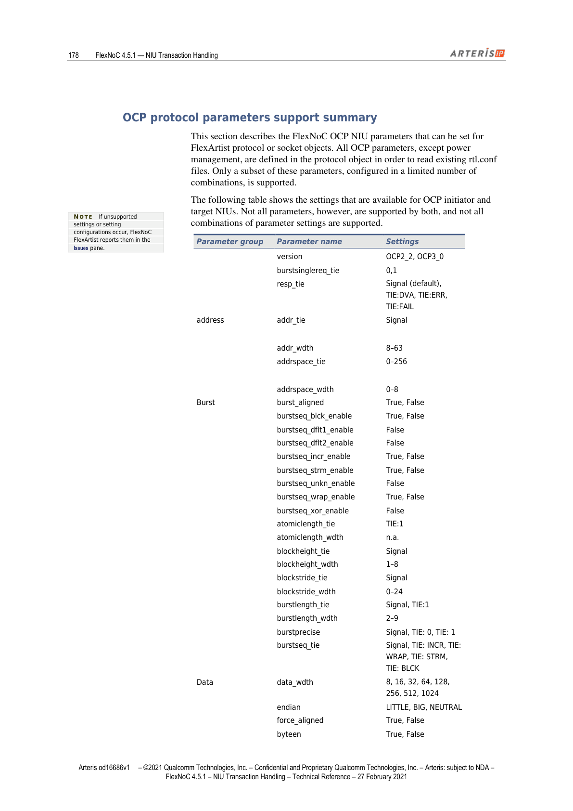
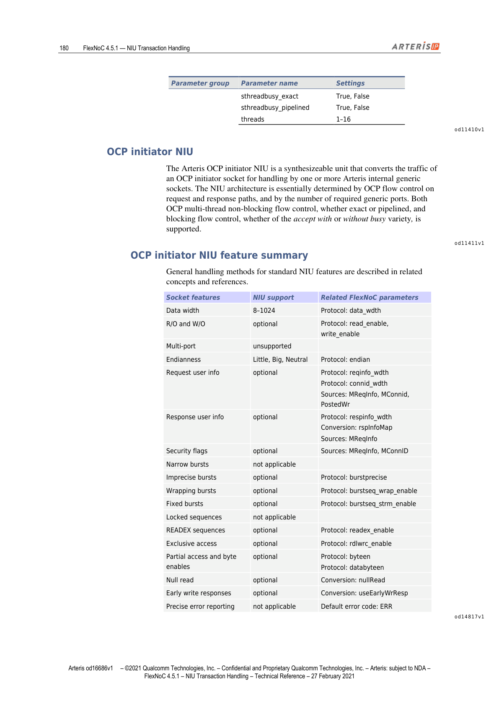
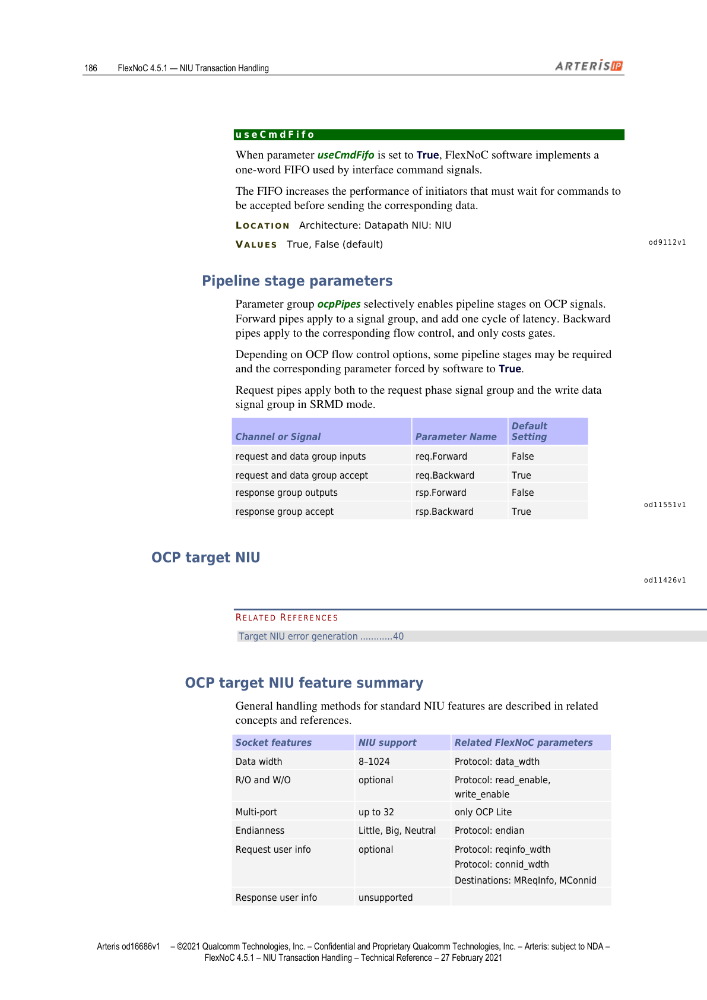
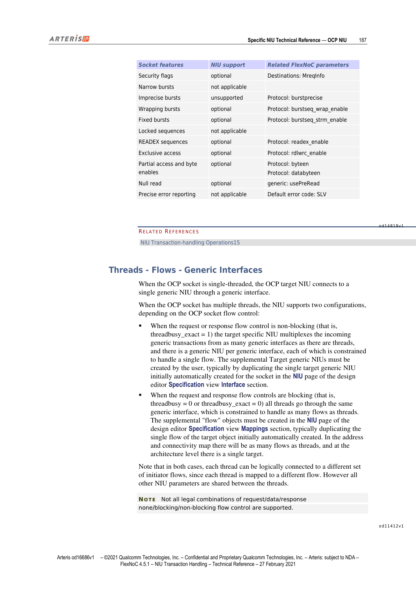
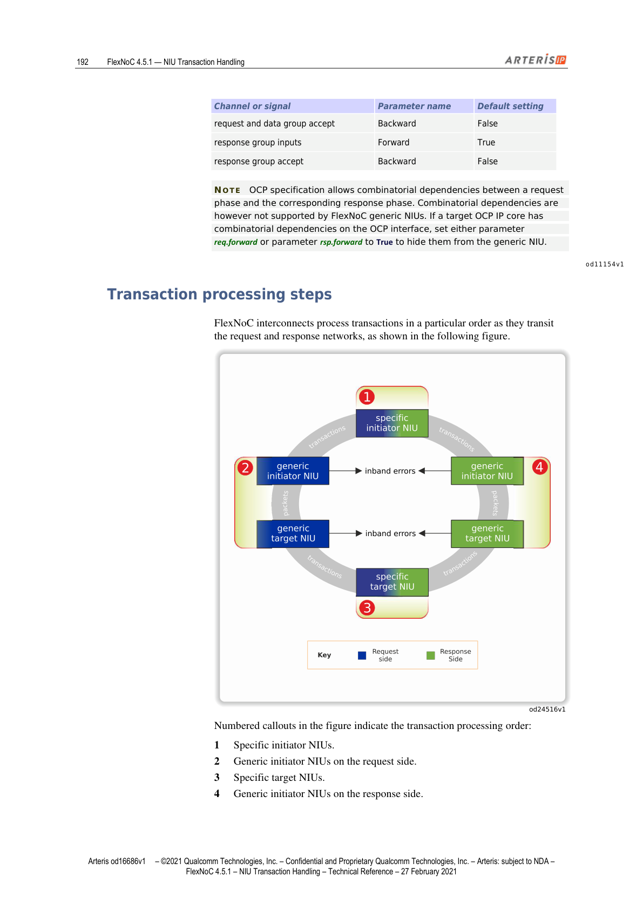

本文为 FlexNOC NIU Transaction Handling 技术参考手册第 14 章的中英双语对照翻译。覆盖 FlexNOC OCP NIU 全部技术规范：支持的 OCP 版本与信号、协议参数支持矩阵、OCP Initiator NIU 与 Target NIU 的功能特性、MRMD/SRMD 配置、Threads-Flows-Sequences 映射，以及 Posted Write、Null Read、字节使能、字节序等机制详解。

---

## OCP NIU

> This section describes the key technical characteristics of the Arteris FlexNoC network interface unit (NIU) for the OCP™ protocol.

本节描述 Arteris FlexNOC 网络接口单元（NIU）针对 OCP™ 协议的关键技术特性。

---

### OCP Version Support（OCP 版本支持）

> FlexNoC technology supports OCP versions 2.2 and 3.0, with exactly the same scope. The technology also supports OCP 2.1 to the extent that a legal OCP 2.1 parameter combination is a subset of OCP 2.2.
>
> NOTE: OCP 3.0 is backward compatible with OCP 2.2 for all OCP features that are supported when OCP 2.2 errata are taken into account.

FlexNOC 支持 OCP 2.2 和 OCP 3.0 版本，支持范围完全相同。OCP 2.1 在其合法参数组合为 OCP 2.2 子集的范围内同样受支持。

**注意**：在考虑 OCP 2.2 勘误表后，OCP 3.0 对于所有受支持的 OCP 特性均向后兼容 OCP 2.2。

---

### Importing and Exporting OCP .conf Files（导入/导出 OCP .conf 文件）

> FlexNoC supports the OCP standard for importing and exporting RTL descriptions in OCP .conf files. FlexNoC FlexArtist software imports each OCP interface defined in a .conf file as a separate protocol object whose name matches the interface name in the file.

FlexNOC 支持以 OCP .conf 文件格式导入/导出 RTL 描述。FlexArtist 软件将 .conf 文件中定义的每个 OCP 接口作为独立的协议对象导入，对象名称与文件中的接口名称匹配。

**操作步骤**（导入/导出 OCP 协议 RTL 描述）：
- 在 Creation 菜单中，选择 Import 或 Export，然后点击 OCP rtl conf
- 在 FlexArtist Edit 菜单中点击 Project Manager，在 Project 部分的导航窗格中点击 Protocol 可查看或编辑协议对象

---

## OCP Signals（OCP 协议信号）

> This section describes the subset of OCP signals supported by FlexNoC NIUs.
>
> CAUTION: The presence of a particular signal is determined by parameters set with FlexArtist software. Because parameters often have many dependencies, careful parameterization is required.

本节描述 FlexNOC NIU 支持的 OCP 信号子集。**注意**：特定信号是否出现由 FlexArtist 软件中设置的参数决定，由于参数间常有诸多依赖关系，需要仔细参数化配置。

---

### OCP Data Flow Signals — Basic Signals（基础信号）

| 信号名 | 说明 | OCP 标准参数 |
|--------|------|------------|
| Clk | 时钟信号，由时钟管理器提供，不通过 socket 传入 NIU，在 OCP 信号包中属参考信号 | — |
| EnableClk | 使能 OCP 时钟；信号和时钟均由时钟管理器提供 | enableclk |
| MAddr | 指定传输地址 | addr, addr_wdth |
| MCmd | 指示主设备请求的 OCP 传输类型 | — |
| MData | 携带写数据 | mdata, data_wdth |
| MDataValid | 指示有效的写数据 | datahandshake |
| MRespAccept | 主设备接受响应 | respaccept |
| SCmdAccept | 从设备接受请求 | cmdaccept |
| SData | 携带读数据 | sdata, data_wdth |
| SDataAccept | 从设备接受写数据 | dataaccept, datahandshake |
| SResp | 携带 OCP 传输响应 | resp |

---

### OCP Simple Extension Signals（简单扩展信号）

| 信号名 | 说明 | OCP 标准参数 |
|--------|------|------------|
| MAddrSpace | 指定地址空间 | addrspace, addr_space_wdth |
| MByteEn | 指示当前传输中 OCP 字内的有效字节（请求阶段字节使能，每个数据字节一位） | byteen |
| MDataByteEn | 携带数据握手阶段的写字节使能（每个数据字节一位）；实现条件：datahandshake=1 | mdatabyteen, datahandshake |
| MReqInfo | 携带请求的附加信息 | reqinfo, reqinfo_wdth |
| SRespInfo | 携带响应的附加信息；Target NIU 不支持该信号 | respinfo, respinfo_wdth |

---

### OCP Burst Extension Signals（突发扩展信号）

| 信号名 | 说明 | OCP 标准参数 |
|--------|------|------------|
| MBlockHeight | 指示 2D 块突发的高度 | blockheight, blockheight_wdth |
| MBlockStride | 2D 块行间地址偏移 | blockstride, blockstride_wdth |
| MBurstLength | 突发长度 | burstlength, burstlength_wdth |
| MBurstPrecise | 给定突发长度是精确的；Target OCP NIU 中不可用（突发始终精确） | burstprecise |
| MBurstSeq | 突发地址序列类型 | burstseq |
| MBurstSingleReq | 表示突发使用单请求-多数据（SRMD）协议；仅支持 tie-off，不出现在接口信号中 | burstsinglereq |
| MDataLast | 突发帧信息：突发中最后一个写数据 | datalast, datahandshake |
| MDataRowLast | 一行中最后一个写数据 | datarowlast |
| MReqLast | 突发帧信息：突发中最后一个请求 | reqlast |
| MReqRowLast | 一行中最后一个请求 | reqrowlast |
| SRespLast | 突发帧信息：突发中最后一个响应 | resplast |
| SRespRowLast | 一行中最后一个响应 | resprowlast |

---

### OCP Tag Extension Signals（Tag 扩展信号）

| 信号名 | 说明 | OCP 标准参数 |
|--------|------|------------|
| MDataTagID | 携带写数据的排序 tag | tags, datahandshake |
| MTagID | 携带请求的排序 tag | tag |
| STagID | 携带响应的排序 tag | tags, resp |

---

### OCP Thread Signals（Thread 扩展信号）

| 信号名 | 说明 | OCP 标准参数 |
|--------|------|------------|
| MConnID | 携带连接标识符 | connid, connid_wdth |
| MDataThreadID | 携带写数据线程标识符 | datahandshake, threads |
| MThreadBusy | 指示主设备线程忙 | mthreadbusy, threads |
| MThreadID | 携带请求线程标识符 | threads |
| SDataThreadBusy | 指示从设备写数据线程忙 | sdatathreadbusy, threads |
| SThreadBusy | 指示从设备请求线程忙 | sthreadbusy, threads |
| SThreadID | 携带响应线程标识符 | threads, resp |

---

### OCP Sideband Signals（旁带信号）

| 信号名 | 说明 |
|--------|------|
| MReset_n | 来自主设备的同步复位；由时钟管理器提供，非 socket 信号，属 OCP bundle 参考信号 |
| SReset_n | 来自从设备的同步复位；由时钟管理器提供，属参考信号 |

**注意**：OCP 测试信号均不受支持。

---

## OCP Protocol Parameters Support Summary（OCP 协议参数支持汇总）

> Each OCP protocol parameter has its counterpart in the parameters parameter group of FlexArtist socket or protocol objects whose parameter protocol is set to OCP.
>
> Signals whose existence, width, and tie_off values can be configured are set up using two different parameters: xxx_tie and xxx_wdth.

每个 OCP 协议参数在 FlexArtist 中都有对应的 socket 或协议对象参数组条目（protocol=OCP）。信号的存在性、位宽和 tie_off 值通过两个参数配置：`xxx_tie`（取值 SIGNAL 或 TIE:integer）和 `xxx_wdth`（当 xxx_tie=SIGNAL 时生效）。

*图1：OCP 协议参数支持矩阵（第178页）*

*图2：OCP 协议参数支持矩阵续表（第179页）*

### 核心参数速查表

| 参数组 | 参数名 | 可设置值 |
|--------|--------|---------|
| — | version | OCP2_2, OCP3_0 |
| — | burstsinglereq_tie | 0, 1 |
| — | resp_tie | Signal（默认），TIE:DVA, TIE:ERR, TIE:FAIL |
| address | addr_tie | Signal |
| address | addr_wdth | 8–63 |
| address | addrspace_tie | 0–256 |
| address | addrspace_wdth | 0–8 |
| Burst | burst_aligned | True, False |
| Burst | burstseq_blck_enable | True, False |
| Burst | burstseq_incr_enable | True, False |
| Burst | burstseq_strm_enable | True, False |
| Burst | burstseq_wrap_enable | True, False |
| Burst | blockheight_wdth | 1–8 |
| Burst | blockstride_wdth | 0–24 |
| Burst | burstlength_tie | Signal, TIE:1 |
| Burst | burstlength_wdth | 2–9 |
| Burst | burstprecise | Signal, TIE:0, TIE:1 |
| Data | data_wdth | 8, 16, 32, 64, 128, 256, 512, 1024 |
| Data | endian | LITTLE, BIG, NEUTRAL |
| Data | byteen | True, False |
| Data | dataaccept | True, False |
| Data | datalast | True, False |
| Info | connid_tie | Signal, TIE:0 |
| Info | connid_wdth | 0–32 |
| Info | reqinfo_tie | Signal, TIE:0 |
| Info | reqinfo_wdth | 0–256 |
| Info | respinfo_tie | Signal, TIE:0 |
| Info | respinfo_wdth | 0–16 |
| Opcode | read_enable | True, False |
| Opcode | write_enable | True, False |
| Opcode | readex_enable | True, False |
| Opcode | rdlwrc_enable | True, False |
| Phase | datahandshake | True, False |
| Phase | writeresp_enable | True, False |
| Phase | cmdaccept | True, False |
| Phase | respaccept | True, False |
| Tags | tags | 1–4096 |
| Tags | tag_interleave_size | 0, 1 |
| Threads | threads | 1–16 |
| Threads | mthreadbusy | True, False |
| Threads | sthreadbusy | True, False |

---

## OCP Initiator NIU（OCP Initiator NIU）

> The Arteris OCP initiator NIU is a synthesizeable unit that converts the traffic of an OCP initiator socket for handling by one or more Arteris internal generic sockets. The NIU architecture is essentially determined by OCP flow control on request and response paths, and by the number of required generic ports.

Arteris OCP Initiator NIU 是一个可综合单元，将 OCP Initiator socket 的流量转换为一个或多个 Arteris 内部通用 socket 可处理的格式。NIU 架构主要由请求/响应路径上的 OCP 流控方式，以及所需通用端口数量决定。支持 OCP 多线程非阻塞流控（exact 或 pipelined）和阻塞流控（带或不带 busy）。

*图3：OCP Initiator NIU 功能特性概览（第180页）*

### OCP Initiator NIU Feature Summary（功能特性汇总）

| Socket 特性 | NIU 支持情况 | 相关 FlexNOC 参数 |
|-------------|-------------|------------------|
| 数据位宽 | 8–1024 | Protocol: data_wdth |
| 只读/只写（R/O and W/O） | 可选 | Protocol: read_enable, write_enable |
| 多端口（Multi-port） | 不支持 | — |
| 字节序（Endianness） | Little, Big, Neutral | Protocol: endian |
| 请求用户信息（Request user info） | 可选 | Protocol: reqinfo_wdth, connid_wdth; Sources: MReqInfo, MConnid, PostedWr |
| 响应用户信息（Response user info） | 可选 | Protocol: respinfo_wdth; Conversion: rspInfoMap; Sources: MReqInfo |
| 安全标志（Security flags） | 可选 | Sources: MReqInfo, MConnID |
| 窄突发（Narrow bursts） | 不适用 | — |
| 非精确突发（Imprecise bursts） | 可选 | Protocol: burstprecise |
| 回绕突发（Wrapping bursts） | 可选 | Protocol: burstseq_wrap_enable |
| 固定突发（Fixed bursts） | 可选 | Protocol: burstseq_strm_enable |
| 锁定序列（Locked sequences） | 不适用 | — |
| READEX 序列 | 可选 | Protocol: readex_enable |
| 排他访问（Exclusive access） | 可选 | Protocol: rdlwrc_enable |
| 部分访问与字节使能 | 可选 | Protocol: byteen, databyteen |
| 空读（Null read） | 可选 | Conversion: nullRead |
| 早期写响应（Early write responses） | 可选 | Conversion: useEarlyWrResp |
| 精确错误上报 | 不适用，默认错误码：ERR | — |

---

### Threads - Flows - Generic Interfaces（线程、Flow 与通用接口）

> When the OCP socket is single-threaded, the OCP target NIU connects to a single generic NIU through a generic interface.
>
> When the OCP socket has multiple threads, the NIU supports two configurations, depending on the OCP socket flow control:
> - When the request or response flow control is non-blocking (threadbusy_exact = 1): the target specific NIU multiplexes incoming generic transactions from as many generic interfaces as there are threads, and there is a generic NIU per generic interface, each constrained to handle a single flow.
> - When request and response flow controls are blocking (threadbusy = 0 or threadbusy_exact = 0): all threads go through the same generic interface, which is constrained to handle as many flows as threads.

- **单线程 OCP socket**：OCP Target NIU 通过一个通用接口连接到单个通用 NIU
- **多线程 OCP socket（非阻塞流控，threadbusy_exact=1）**：Target 特定 NIU 将来自与线程数相同的多个通用接口的传入通用事务进行复用，每个通用接口对应一个通用 NIU，各被约束为处理单个 Flow。需要用户在 NIU 页面手动创建补充 Target 通用 NIU（通常通过复制初始自动创建的目标通用 NIU）
- **多线程 OCP socket（阻塞流控，threadbusy=0 或 threadbusy_exact=0）**：所有线程通过同一通用接口，该接口被约束为处理与线程数相同数量的 Flow；需要在 NIU 页面 Mappings 部分创建补充 Flow 对象；地址和连接映射中将有与线程数相同数量的 Flow，架构层面只有单个 Target

**注意**：两种情况下，每个线程都可以逻辑连接到不同的 Initiator Flow 集合（每个线程映射到不同的 Flow），但所有其他 NIU 参数在线程间共享。并非所有合法的请求/数据/响应的无/阻塞/非阻塞流控组合都受支持。

---

### Opcode Conversion（操作码转换）

> OCP opcodes RD, WR, WRNP, RDEX, RDL, WRC are supported.
> NOTE: RDX, RDL, WRC opcodes can only be used on single accesses. If the burst code is BLCK or STRM it will be ignored and replaced by INCR or WRAP depending on the capability of the OCP interface.

支持的 OCP 操作码：RD、WR、WRNP、RDEX、RDL、WRC。

**注意**：RDX、RDL、WRC 操作码只能用于单次访问；若突发码为 BLCK 或 STRM，将被忽略并根据 OCP 接口能力替换为 INCR 或 WRAP。

---

### Address and Address Spaces Support（地址与地址空间支持）

> MAddr signal width is defined by Protocol: addr_wdth. If Protocol: addrspace_wdth > 0 the address width of the generic interface is the sum of addrspace_wdth and addr_wdth, and the generic address is split into the two OCP signals, MAddrSpace being the MSB and MAddr being the LSBs.

MAddr 信号位宽由 Protocol: addr_wdth 定义。若 Protocol: addrspace_wdth > 0，通用接口地址位宽为 addrspace_wdth 与 addr_wdth 之和，通用地址拆分为两个 OCP 信号：MAddrSpace（高位）和 MAddr（低位）。

---

### MRMD and Imprecise Bursts Support（MRMD 与非精确突发支持）

> The NIU can be statically configured to handle SRMD OCP protocol (burstsinglereq_tie = TIE:1) or MRMD OCP protocol (burstsinglereq_tie = TIE:0). The MBurstsinglereq signal can never appear at the OCP interface.
>
> NOTE: In MRMD mode, only datahandshake = 0 is supported; in SRMD mode datahandshake = 1 is the only legal OCP setting.
>
> When protocol: burstprecise_tie is set to TIE:0, the NIU splits all incoming transactions with MBurstLength > 0 into transactions of two OCP words.

NIU 可静态配置为处理 SRMD（burstsinglereq_tie = TIE:1）或 MRMD（burstsinglereq_tie = TIE:0）协议，MBurstSinglereq 信号永远不出现在 OCP 接口上。

**注意**：MRMD 模式下只支持 datahandshake=0；SRMD 模式下 datahandshake=1 是唯一合法的 OCP 设置。

当 burstprecise_tie 设置为 TIE:0 时，NIU 将所有 MBurstLength > 0 的传入事务拆分为两字 OCP 事务（若总长度为奇数，最后一个片段为单字）。

---

### Write Responses and Posted Writes Handling（写响应与 Posted 写处理）

> The OCP initiator NIU can indicate in a User bit on the generic interface that a transaction was originally a posted write on the OCP interface.
>
> NOTE: NoC write transactions always have an internal response back to the initiator NIU, whether originally posted or not on the NIU socket.

OCP Initiator NIU 可以通过通用接口上的一个 User 比特，指示某事务在 OCP 接口上最初为 Posted 写（User bit driver 设置为 PostedWr）。

**注意**：无论 NIU socket 上最初是否为 Posted 写，NoC 写事务始终有一个内部响应返回给 Initiator NIU。

- **protocol: writeresp_enable=1 且 useEarlyWrResp=True**：OCP Initiator NIU 对 OCP Posted 写请求发出早期写响应（在从 Target NIU 收到响应之前），并丢弃后续来自 Target NIU 的响应；此配置仅适用于顺序 OCP（无线程和 tag）
- **protocol: writeresp_enable=0**：NIU 丢弃 OCP Posted 写请求的 Target 响应，并可为 Posted 写独立分配唯一 Sequence ID（MSB 置 1 表示 Posted 写，0 表示其他请求）；此分配方案允许通用 NIU 并发向多个 Target 发出 Posted 写

**性能提示**：当 useEarlyWrResp=True 时，为获得最大并发执行效率，建议将 wSeqId 通用接口值设置为 log2(nPendingTrans)+1，关联的通用 NIU 参数 nPendingOrderId 设置为等于 nPendingTrans，这允许为所有 Posted 写生成唯一 Sequence ID，并让通用 NIU 无论目标是哪个都立即发出 Posted 写。

---

### OCP Initiator Burst Processing（突发处理）

> INCR, WRAP, STRM, BLCK bursts are supported. DFLT1, DFLT2, UNK, XOR are not.
>
> INCR and WRAP bursts are directly translated into equivalent bursts on the generic interface, with the following exception: WRAP bursts of size 1 are always converted to equivalent INCR.

支持 INCR、WRAP、STRM、BLCK 突发类型，不支持 DFLT1、DFLT2、UNK、XOR。INCR 和 WRAP 突发直接转换为通用接口上的等效突发（例外：长度为 1 的 WRAP 突发始终转换为等效的 INCR）。

---

### Tags and Sequences — Response Interleaving（Tag、Sequence 与响应交错）

> OCP tags are converted into seqIDs at the generic interface. The OCP tags can be compressed into a smaller number of sequences using a hashing algorithm if wSeqId < log2(tags).
>
> NOTE: The product of the number of flows and sequences on a single generic interface cannot exceed 256.
>
> NOTE: To configure wSeqID > 0, OCP version must be set to 3.0.

OCP tag 在通用接口处转换为 seqID，若 wSeqId < log2(tags)，可通过哈希算法将 OCP tag 压缩为更少数量的 Sequence。

**注意**：单个通用接口上 Flow 数量与 Sequence 数量的乘积不可超过 256。

当 tags > 1 时，OCP Initiator 应支持单字 tag 交错；否则 wSeqID 对大多数 OCP 配置（包括突发）被约束为 0。若 wSeqId=0，tag 对乱序管理被丢弃，Initiator NIU 的行为与 tags=1 从排序和性能角度相同。

**注意**：要配置 wSeqID > 0，OCP version 必须设置为 3.0，这意味着对于地址冲突但 tag 不同的请求，只强制执行顺序，但响应可能乱序发出。

---

### Null-Read Support（空读支持）

> FlexNoC technology provides null-read support for OCP with the following choice of options:
> - Transformation of null-read requests into read requests with a given word address.
> - Handling null-read requests as a synchronization operation.
> - Issuing null-read requests on the generic interface.

FlexNOC 为 OCP 提供以下空读支持选项：
- 将空读请求转换为指定字地址的读请求
- 将空读请求作为同步操作处理
- 将空读请求原样传递到通用接口

前两种选项下，NIU 在通用接口上发送新的单字节读请求之前，会等待所有待处理事务处理完毕。

**注意**：OCP 以外的 Target socket 不支持空读操作，对应 Target 通用 NIU 会丢弃请求。

---

### Endianness Support — Initiator（字节序支持）

> The generic interface is always big-endian. OCP endian = BIG or LITTLE are supported; when LITTLE, the data bytes and associated byte enables are swapped accordingly in the NIU.

通用接口始终为大端模式。支持 OCP endian=BIG 或 LITTLE，当为 LITTLE 时，NIU 中的数据字节及关联字节使能相应地进行交换。

---

### Specification Phase Conversion Parameters — Initiator（规格阶段转换参数）

#### rspInfoMap

> When set, parameter rspInfoMap defines the source of the SRespInfo bits. These response bits can only be configured as copies of request phase bits MReqInfo or MConnID, or constants.
>
> LOCATION: Specification: Interface: NIU: conversion

rspInfoMap 定义 SRespInfo 比特的来源，只能配置为请求阶段比特（MReqInfo 或 MConnID 的副本）或常量。

#### urgencyMap

> When set, parameter urgencyMap enables an OCP socket signal to drive each urgency bit. Urgency bits can be driven by OCP bits extracted from OCP signal MReqInfo, or from constants.
>
> LOCATION: Specification: Interface: NIU: conversion

urgencyMap 允许 OCP socket 信号驱动每个紧急度比特，紧急度比特可由从 MReqInfo 提取的 OCP 比特或常量驱动。

#### useEarlyWrRsp

> Parameter useEarlyWrResp determines whether an initiator specific NIU should attempt to respond to OCP posted writes before the corresponding response has been received from the target through the generic interface.
>
> LOCATION: Specification: Interface: NIU: conversion  
> VALUES: True, False (default)

useEarlyWrResp 决定 Initiator NIU 是否在通过通用接口收到来自 Target 的对应响应之前，尝试对 OCP Posted 写进行响应，默认为 False。

#### blckInfoMap

> When set, parameter blckInfoMap indicates the source of User request information bits attached exclusively to BLCK bursts. Such BLCK info bits can be driven by OCP bits extracted from MReqInfo, or from constants.
>
> LOCATION: Specification: Interface: NIU: conversion

blckInfoMap 指示专属于 BLCK 突发的用户请求信息比特来源，可由 MReqInfo 提取的 OCP 比特或常量驱动。

#### nullRead

> - NONE (default): null reads are transformed into 1-Byte reads. The NIU waits for all pending transactions to be processed before sending a new one-byte read request.
> - SYNC: null read requests are treated as a synchronization operation, and the NIU waits for all pending transactions before sending a new one-byte read request.
> - KEEP: null reads are transmitted unchanged to targets.
>
> LOCATION: Specification: Interface: NIU: conversion  
> VALUES: NONE (default), SYNC, KEEP

- **NONE**（默认）：空读转换为 1 字节读，NIU 等待所有待处理事务完成后再发送新的单字节读请求
- **SYNC**：空读作为同步操作处理，NIU 等待所有待处理事务后再发送单字节读请求
- **KEEP**：空读原样传输至 Target

---

### Architecture Phase Parameters — Initiator（架构阶段参数）

#### useCmdFifo

> When parameter useCmdFifo is set to True, FlexNoC software implements a one-word FIFO used by interface command signals. The FIFO increases the performance of initiators that must wait for commands to be accepted before sending the corresponding data.
>
> LOCATION: Architecture: Datapath NIU: NIU  
> VALUES: True, False (default)

useCmdFifo 设置为 True 时，FlexNOC 软件为接口命令信号实现一个单字 FIFO，提升在发送对应数据前需要等待命令被接受的 Initiator 的性能，默认为 False。

### Pipeline Stage Parameters — Initiator（流水线阶段参数）

*图4：OCP Initiator NIU 流水线配置表（第186页）*

| 通道/信号 | 参数名 | 默认值 |
|---------|--------|--------|
| request 和 data 组输入 | req.Forward | False |
| request 和 data 组接受 | req.Backward | True |
| response 组输出 | rsp.Forward | False |
| response 组接受 | rsp.Backward | True |

---

## OCP Target NIU（OCP Target NIU）

*图5：OCP Target NIU 功能特性概览（第187页）*

### OCP Target NIU Feature Summary（功能特性汇总）

| Socket 特性 | NIU 支持情况 | 相关 FlexNOC 参数 |
|-------------|-------------|------------------|
| 数据位宽 | 8–1024 | Protocol: data_wdth |
| 只读/只写（R/O and W/O） | 可选 | Protocol: read_enable, write_enable |
| 多端口（Multi-port） | 最多 32（仅 OCP Lite） | — |
| 字节序（Endianness） | Little, Big, Neutral | Protocol: endian |
| 请求用户信息（Request user info） | 可选 | Protocol: reqinfo_wdth, connid_wdth; Destinations: MReqInfo, MConnid |
| 响应用户信息（Response user info） | 不支持 | — |
| 安全标志（Security flags） | 可选 | Destinations: MreqInfo |
| 窄突发（Narrow bursts） | 不适用 | — |
| 非精确突发（Imprecise bursts） | 不支持 | Protocol: burstprecise |
| 回绕突发（Wrapping bursts） | 可选 | Protocol: burstseq_wrap_enable |
| 固定突发（Fixed bursts） | 可选 | Protocol: burstseq_strm_enable |
| 锁定序列（Locked sequences） | 不适用 | — |
| READEX 序列 | 可选 | Protocol: readex_enable |
| 排他访问（Exclusive access） | 可选 | Protocol: rdlwrc_enable |
| 部分访问与字节使能 | 可选 | Protocol: byteen, databyteen |
| 空读（Null read） | 可选 | generic: usePreRead |
| 精确错误上报 | 不适用，默认错误码：SLV | — |

---

### Opcode Conversion — Target（操作码转换：Target）

> OCP opcodes RD, WR, WRNP, RDEX, RDL, WRC are supported.

支持的 OCP 操作码：RD、WR、WRNP、RDEX、RDL、WRC。

---

### Posted Writes and Write Responses — Target（Posted 写与写响应：Target）

> When the OCP is configured to support both write opcodes, the NIU maps the write request:
> - to a posted write when the value of the target NIU PostedWr request user flag is 1
> - to a non-posted write otherwise.

当 OCP 配置同时支持 Posted 和非 Posted 写时，NIU 按如下规则映射写请求：
- Target NIU PostedWr 请求用户标志值为 1 → 映射为 Posted 写
- 否则 → 映射为非 Posted 写

所选请求用户标志可由 AMBA Initiator NIU 中的可缓冲（bufferable）属性、OCP Initiator NIU 中的 PostedWR 属性，或其他 Initiator NIU 中的常量驱动。

当 writeresp_enable=False（不支持 Posted 写响应）时，NIU 在 Target 接受所有数据后为 Posted 写在通用接口处插入适当的响应；非 Posted 写的响应在 OCP 接口上出现时发出至通用接口。

---

### OCP Target Burst Processing（Target 侧突发处理）

> Incoming generic interface transactions of incrementing, wrapping, 2D and Fixed types are converted respectively to OCP bursts of type INCR, WRAP, STRM, BLCK bursts if enabled in the OCP configuration.
>
> NOTE: OCP burst types DFLT1, DFLT2, UNK, XOR are never generated.

传入的通用接口递增、回绕、2D 和 Fixed 类型事务，分别转换为 OCP INCR、WRAP、STRM、BLCK 突发（如在 OCP 配置中启用）。DFLT1、DFLT2、UNK、XOR 永远不会被生成。

**拆分规则**：
- OCP 突发长度能力小于通用接口突发能力时，或无响应流控时：所有传入突发（无论长度或类型）均拆分为单字传输
- 否则：仅将通用接口不支持的突发类型（INCR/WRAP/BLOCK/STRM 对应的 burstseq_*_enable=False）拆分为单字

**注意**：建议至少将 burstseq_incr_enable 设置为 True，或将 burstseq_tie 设置为 INCR，以确保拆分时生成 INCR 类型的突发。

---

### Response Flow Control（响应流控）

> When the OCP is configured without response flow control (respaccept = False when no threads), the NIU implements a response FIFO. In this case the incoming transactions are split to single-word, issued only if the response FIFO is not full.

当 OCP 不配置响应流控（无线程时 respaccept=False）时，NIU 实现响应 FIFO，此情况下传入事务被拆分为单字，仅在响应 FIFO 未满时发出。

---

### Tags（Tag 处理）

> When Protocol: tags > 1, OCP tags are copied from seqID at the generic interface.
>
> - tag_interleave_size = 0: the target never interleaves responses. Response interleaving is disabled on the target generic interface.
> - tag_interleave_size = 1: the target can interleave read responses at the word level.

当 tags > 1 时，OCP tag 从通用接口的 seqID 复制而来。支持两种 tag 交错选项：
- **tag_interleave_size = 0**：Target 永远不交错响应；Target 通用接口上禁用响应交错，通用 NIU 中无交错检测逻辑
- **tag_interleave_size = 1**：Target 可在字级别交错读响应；通用接口上启用响应交错，每当 Target 发出不完整响应片段时，通用 NIU 中的交错检测逻辑创建一个响应包

**注意**：即使 Target 不交错响应，由于请求拆分和乱序响应可能导致通用 socket 处的响应交错，通用接口的 useInterleave 参数可能被强制为 True。

---

### Byte Enable Support — Target（字节使能支持）

> OCP uses byte enable signals to indicate partial word requests, even during bursts:
> - MByteen: read byte enable in MRMD and SRMD modes, and write byte enable in MRMD mode.
> - MDataByteen: write byte enable signal in SRMD mode.

OCP 使用字节使能信号指示部分字请求（即使在突发中）：
- **MByteen**：MRMD 和 SRMD 模式下的读字节使能，以及 MRMD 模式下的写字节使能
- **MDataByteen**：SRMD 模式下的写字节使能

**无写字节使能信号时的处理**：
- 写请求第一个数据字的所有字节使能均为 0：NIU 报错整个突发，不发送至 OCP 接口
- 第一个数据字所有字节使能为 1，但后续字不全为 1：NIU 以"所有字节使能已置位"的方式处理突发（未置位字节写入随机数据），并向 Initiator 发送错误响应

**无读字节使能信号时的处理**：
- INCR、WRAP、BLCK 读请求被视为有读字节使能信号，无副作用
- STRM 请求若大小小于完整 OCP 字，则报错
- Null Read 前导包（preamble）被 OCP NIU 报错

---

### Architecture Phase Parameters — Target（架构阶段参数：Target）

#### nRspFifoWord

> Parameter nRspFifoWord sets the size of the FIFO, in OCP words, that is used to buffer responses. One OCP word represents one data-word transfer per cycle.
>
> To obtain full throughput at the interface, best practice is to set the parameter to: target IP latency + request and response forward pipe latency + 1
>
> LOCATION: Architecture: Datapath NIU: NIU  
> VALUES: None (default), 1–256

参数 nRspFifoWord 设置用于缓冲响应的 FIFO 大小（以 OCP 字为单位，1 OCP 字 = 每周期一个数据字传输）。为获得接口满吞吐量，建议设置为：目标 IP 延迟 + 请求与响应前向流水线延迟 + 1。

| 属性 | 值 |
|------|-----|
| 路径 | Architecture: Datapath NIU: NIU |
| 取值 | None（默认），1–256 |

### Pipeline Stage Parameters — Target（流水线阶段参数：Target）

*图6：OCP Target NIU 流水线配置表（第191页）*

| 通道/信号 | 参数名 | 默认值 |
|---------|--------|--------|
| request 和 data 组输出 | Forward | True |
| request 和 data 组接受 | Backward | False |
| response 组输入 | Forward | False |
| response 组接受 | Backward | True |

*图7：OCP NIU 参数汇总（第192页）*
